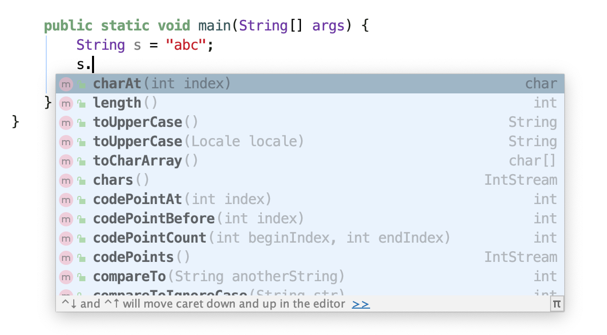

# 五.继承

- 继承 定义：基于已有的类构造新类
- 反射 定义：在程序运行期间发现更多的类以及属性的能力
- 多态 定义：一个对象变量可以指示多种实际类型的现象
- 动态绑定 定义：在运行时能够自动选择调用方法的现象

## 5.1 类、超类和子类

### 5.1.2 覆盖方法

- 规则
  - 超类和子类中的方法签名相同（方法名和参数列表），返回值类型需要保证一样或者是返回值类型的子类（协变返回类型）
- 覆盖和重载的区别
  - 覆盖是方法签名相同
  - 重载是方法名相同，参数列表必须不同，对返回类型，访问修饰符，异常声明没有任何限制 <!--可以看作一个新方法，只是方法名称特殊-->

### 5.1.6 方法调用流程

- 图解

  

### 5.1.7 阻止继承：final类和方法

- 规则
  - 类用final修饰后，无法被继承，其中的方法也自动用final修饰。域不包括
  - 方法用final修饰后，子类无法覆盖当前方法

### 5.1.8 强制类型转换

- 注意
  - 强制类型转换前，使用instanceof方法判断是否为所属类型

## 5.2  Object:所有类的超类

- 注意：只有基本类型不是对象

### 5.2.1 equals

- 特点
  - 自反性：x为任何非空引用，x.equals(x)应该返回true
  - 对称性：对于任何引用x，y，当且仅当x.equals(y)返回true，则y.equals(x)返回也为true
  - 传递性：对于任何引用x，y，z，如果x.equals(y)返回true，y.equals(z)返回true，则x.equals(z)返回也为true
  - 一致性：如果x，y引用的对象没有变化，则x.equals(y)应一直返回true
- equals和等号的区别——重点
  - 等号（==）
    - 基本数据类型（也称原始数据类型） ：byte,short,char,int,long,float,double,boolean。他们之间的比较，应用双等号（==）,比较的是他们的值。
    - 引用数据类型：当他们用（==）进行比较的时候，比较的是他们在内存中的存放地址（确切的说，是**堆内存**地址）
  - equals
    - 方法的初始默认行为是比较对象的内存地址值
    - **在一些类库当中这个方法被重写了，如String、Integer、Date，比较对象的成员变量值是否相同**
- 合理的equals重写逻辑
  1. 显示参数声明为Object <!--覆盖equals方法-->
  2. 判断是否引用同一对象 <!--相比于判断域，当前判断成本低-->
  3. 判断是否为空
  4. 判断是否属于同一类 <!--使用getClass()和instanceof-->
  5. 将比较对象转换成相应类型的变量
  6. 域的比较 <!--使用==比较基本类型域，使用equals比较对象域-->

### 5.2.3 hashCode方法

- 散列码（hash code） 定义：是由对象导出的一个整型值 <!--对象才有，因此基本数据类型需要转成包装类-->

- 注意

  - 字符串和基本数据类型的包装类创建的对象存在hashCode相同的情况，因为是由内容导出的

    <!--实现-->

    ```java
    public class TestHashCode {
        public static void main(String[] args) {
            String s1 = "a";
            String s2 = "a";
            Integer i = 10;
            Integer k = 10;
            System.out.println(s1.hashCode());
            System.out.println(s2.hashCode());
            System.out.println(s1.equals(s2));
            System.out.println(i.hashCode());
            System.out.println(k.hashCode());
            System.out.println(i.equals(k));
        }
    }/* output
    97
    97
    true
    10
    10
    true
    */
    ```

  - **如果重新定义equals方法，就必须重新定义hashCode方法，以便用户可以将对象插入到散列表中。如果重新定义，会出现equals相等，hashCode不等——面试题**

    原因：hashCode方法一般的规定：hashCode()和equals()保持一致，如果equals方法返回true，那么两个对象的hasCode()返回值必须一样。如果equals方法返回false，hashcode可以不一样，但是这样不利于哈希表的性能，一般我们也不要这样做。

       假设两个对象，重写了其equals方法，其相等条件是属性相等，就返回true。如果不重写hashcode方法，其返回的依然是两个对象的内存地址值，必然不相等。这就出现了equals方法相等，但是hashcode不相等的情况。这不符合hashcode的规则
    
    <!--equals与hashCode的定义必须一致，两个对象equals为true,就必须有相同的hashCode。反之则不成立。-->
    
    <!--如果定义的equals比较的是雇员ID，那么hashCode就需要散列ID，而不是雇员的姓名或住址-->

### 5.2.4 toString方法

- 用途：返回表示对象值的字符串

- 注意

  - toString方法常见的原因：当对象与一个字符串通过操作符+连接，编译将自动使用toString方法

    <!--实现-->

    ```java
    public class TestToString {
        String name = "asd";
    
        public static void main(String[] args) {
            TestToString testToString = new TestToString();
            System.out.println(testToString+"jkl");
        }
    }/* output
    Five.TestToString.TestToString@1218025cjkl
    */
    ```

  - 建议重写toString方法，默认调用的方法可读性较差

    <!--实现-->

    ```java
    public class TestToString {
        String name = "asd";
    
        @Override public String toString() {
            return "TestToString{" + "name='" + name + '\'' + '}';
        }
    
        public static void main(String[] args) {
            TestToString testToString = new TestToString();
            System.out.println(testToString+"jkl");
        }
    }/* output
    TestToString{name='asd'}jkl
    */
    ```

### 5.2.5 getClass方法

- 用途：返回包含对象信息的类对象

  <!--实现-->

  ```java
  public class TestToString {
      String name = "asd";
  
      public static void main(String[] args) {
          TestToString testToString = new TestToString();
          System.out.println(testToString.getClass());
      }
  }/* output
  class Five.TestToString.TestToString
  */
  ```

## 5.3 泛型数组列表

- 泛型 定义：Java 泛型的参数只可以代表类，不能代表个别对象

#### 1.ArrayList

- 定义：采用类型参数的泛型类

  <!--实现-->

  ```java
  // 使用方法
  ArrayList<Employee> staff = new ArrayList<Employee>();
  // 泛型的类型为Employee
  ```

- 规则

  - 使用add方法增加新数据。如果空间用尽，则自动创建更大的数组，并将原数据拷贝到更大的数组中
  - 使用size方法获取实际元素数量
  - 使用trimToSize将清除多余的存储空间
  - 使用get和set方法访问和设置元素

- 注意

  - 数组列表和数组大小的核心区别：数组分配100的空间是已经在内存中存在的；数组列表在仅是具备存储100的潜力，即使是完成了初始化之后
  - 使用时，指定泛型的类型。因为不指定泛型类型，存储和修改数据接受任意类型对象，因为使用的是Object

## 5.4 对象包装器和自动装箱

#### 1.自动装箱

- 装箱 定义：基本数据类型变换为基本类型的包装类

  <!--实现-->

  ```java
  // 装箱
  public class TestAutoBoxing {
      public static void main(String[] args) {
          ArrayList<Integer> list = new ArrayList<Integer>();
          list.add(5); // 等于 list.add(Integer.valueOf(5));
      }
  }/* conclusion
  1.list中的元素为Integer类型
  2.当使用.add()方法添加时，被添加的类型为基本类型int
  3.因此将自动变换为 list.add(Integer.valueOf(5))
  */
  ```

- 注意

  - **自动装箱规范要求boolean，byte，char小于等于127，介于-128至127之间的short和int被包装到固定的对象中。**

    原因是：IntegerCache.low 默认是-128；IntegerCache.high默认是127，超出范围的将创建对象存储，不然直接返回值。减少new，减轻jvm压力。

    <!--实现-->

    ```java
    public class TestAutoBoxing {
        public static void main(String[] args) {
    				// 使用包装类
            Integer a = 127;
            Integer b = 127;
            Integer c = 128;
            Integer d = 128;
            System.out.println("a == b:"+(a == b));
            System.out.println("c == d:"+(c == d));
        }
    }/* output
    a == b:true
    c == d:false
    */
    ```

  - 由于包装器类引用可以为null，因此会出现NullPointerException

  - 如果混合使用Integer和Double，Integer会拆箱，提升为double，然后装箱为Double

  - 自动拆箱和自动装箱是编译器认可的，不是虚拟机。

#### 2.自动拆箱

- 拆箱 定义：将包装类数据拆成基本类型数据

  <!--实现-->

  ```java
  public class TestAutoBoxing {
      public static void main(String[] args) {
          // 装箱
          ArrayList<Integer> list = new ArrayList<Integer>();
          list.add(5);
          // 拆箱
          int intType = list.get(0); // 等于 int intType = list.get(0).intValue();
      }
  }/* conclusion
  1.list中的元素为Integer类型
  2.当使用.get()方法获取时，获得的值类型为Integer
  3.因此将自动变换为 int intType = list.get(0).intValue();
  */
  ```

## 5.5 参数可变的方法

- 参数可变 定义：支持用可变的参数数量调用的方法

- 格式

  ```java
  // 使用 ...
  Double ... args
  ```

  <!--比如System.out.printf()方法，能够接收多个参数-->

  ```java
  // 同时接收多个参数
  System.out.printf("%d %s",n,"name");
  
  // 底层实现代码
  public PrintStream printf(String format, Object ... args) {
          return format(format, args);
      }
  /* conclusion
  1.“String format”为格式字符串，“Object ... args”为Object对象的数组，因此数量可变
  */
  ```

  <!--使用参数可变实现查找最大值-->

  ```java
  public class TestFindMax {
      static void findMax(Object ... args){
          double largest = Double.NEGATIVE_INFINITY;
          for (Object y: args
               ) {
                  Double z = (Double) y;
                  if (z > largest)
                      largest = z;
          }
          System.out.println(largest);
      }
  
      public static void main(String[] args) {
          TestFindMax.findMax(3.454,34.3);
      }
  }
  ```

## 5.6 枚举类

- 格式

  ```java
  enum EnumName{
  	MAX,MIN,DEDIUM;
  }
  ```

- 注意

  - 枚举类中是实例，因此能够创建实例中的变量，但必须使用构造方法赋值

    <!--实现-->

    ```java
    public class TestEnum {
         public enum Size{
            MAX("max",3),MIN("min",1),MEDIUM("medium",2);
            // 成员变量
            private String name;
            private int num;
            // 成员变量的构造方法
            Size(String name , int i) {
                this.name = name;
                this.num = i;
            }
        }
        public static void main(String[] args) {
            // 在同一个类中，因此可以访问私有的成员变量name
            String name = Size.MAX.name;
            System.out.println(name);
        }
    }
    ```


## 5.7 反射——重点

- 反射 定义：支持分析类的能力的程序

- 反射机制：将类中的各个部分封装成其他对象

  原理图

  

- **获取Class对象的三种方式**
  
  - Class.forName("全类名"):在第一阶段，将字节码文件加载进内存，然后获取Class对象
  
    多用于配置文件
  
  - 类名.class:在第二阶段，通过类名的class属性
  
    多用于参数的传递
  
  - 对象.getClass()：在第三阶段，通过Object的getClass方法获取
  
    多用于对象的字节码的获取
  
    <!--实现-->
  
    ```java
    public class TestReflectionClass {
        public static void main(String[] args) throws Exception {
            /*
            Class对象获取的三种方式
            1.通过Class.forclass("全类名")获取
            2.通过类名.class()获取
            3.通过对象.getClass()方法
            */
            // 1.通过Class.forclass("全类名")获取
            Class cls1 = Class.forName("Five.TestReflection.Person");
            System.out.println(cls1);
            // 2.通过类名.class()获取
            Class cls2 = Person.class;
            System.out.println(cls2);
            // 3.通过对象.getClass()方法
            Person p = new Person();
            Class cls3 = p.getClass();
            System.out.println(cls3);
            // 4.比较三个class引用所指向的是否为同一个Class对象
            System.out.println("比较三个class引用所指向的是否为同一个Class对象");
            System.out.println("cls1 == cls2:"+(cls1 == cls2));
            System.out.println("cls1 == cls2:"+(cls1 == cls3));
        }
    }/* output
    class Five.TestReflection.Person
    class Five.TestReflection.Person
    class Five.TestReflection.Person
    比较三个class引用所指向的是否为同一个Class对象
    cls1 == cls2:true
    cls1 == cls2:true
    */
    ```
  
- 注意

  - **同一个字节码文件（.class）在一次程序运行中只加载一次，所以三种获取Class对象的方式获取到的Class对象都是同一个**

- 用途
  
  - 在运行时分析类的能力
  
  - 在运行时操作对象
  
    <!--举例-->
  
    <!--运行过程中，以下出现的方法属于Class类对象中的methods对象中的内容-->
  
    
  
  - 实现通用的数组操作代码
  
  - 利用Mehtod对象，类似C++中的函数指针

### 5.7.1 Class类

#### 1.Class对象中的功能

##### 1.1获取成员变量值

<!--可以想象成，Class为一个特殊类，其中Field为成员属性，这个成员属性中存在更加具体的成员属性，并且field这个成员属性能够通过get和set方法来获取和设置值-->

- 规则

  - Field[] getFields()：获取所有的public修饰的成员变量（包括超类）
  - Field getField()：获取指定的public修饰的成员变量（包括超类）
  - Field[] getDeclaredFields()：获取所有的成员变量（即使是private修饰，暴力反射）
  - Field getDeclaredField()：获取指定的成员变量（即使是private修饰，暴力反射）

- 注意

  - **getFields和getDeclaredFields()获取时，getFields能够同时获取到超类和子类中的public变量，getDeclaredFields()只能获取到子类中的所有访问修饰类型的变量**

    <!--实现-->

    ```java
    // 超类
    public class Father {
        // 成员变量
        private String priFatherName;
        private int priFatherAge;
        public String pubFatherName;
        public int pubFatherAge;
    }
    
    // 子类
    public class Son extends Father {
        // 成员变量
        private String priSonName;
        private int priSonAge;
        public String pubSonName;
        public int pubSonAge;
    }
    ```

    ```java
    // 测试类
    package Five.TestReflection;
    
    import java.lang.reflect.Field;
    
    public class TestField {
        public static void main(String[] args) throws Exception {
            /*
            getField和getDeclaredField
             */
            // getField
            System.out.println("--测试getField");
            Field[] field1 = Son.class.getFields();
            for (Field f : field1) {
                System.out.println(f);
            }
            // getDeclaredField
            System.out.println("--测试getDeclaredField");
            Field[] field2 = Son.class.getDeclaredFields();
            for (Field f : field2) {
                System.out.println(f);
            }}}
    /* output
    --测试getField
    public java.lang.String Five.TestReflection.Son.pubSonName
    public int Five.TestReflection.Son.pubSonAge
    public java.lang.String Five.TestReflection.Father.pubFatherName
    public int Five.TestReflection.Father.pubFatherAge
    --测试getDeclaredField
    private java.lang.String Five.TestReflection.Son.priSonName
    private int Five.TestReflection.Son.priSonAge
    public java.lang.String Five.TestReflection.Son.pubSonName
    public int Five.TestReflection.Son.pubSonAge
    */
    ```

    

- Field对象方法

  - get([Object](itss://chm/java/lang/Object.html) obj)：返回的 `Field`表示字段的值，指定对象上

  - **set**([Object](itss://chm/java/lang/Object.html) obj, [Object](itss://chm/java/lang/Object.html) value)：设置域为代表的这 `Field`对象指定对象上的参数指定的新价值

  - setAccessible()：**忽略访问修饰符的安全检查，也称为暴力反射**（如果需要get或者set使用private修饰的变量，则需要使用该方法），用于调试，持久存储，相似机制。

    <!--实现-->

    ```java
    // 超类
    public class Father {
        // 成员变量
        private String priFatherName;
        private int priFatherAge;
        public String pubFatherName;
        public int pubFatherAge;
    }
    
    // 子类
    public class Son extends Father {
        // 成员变量
        private String priSonName;
        private int priSonAge;
        public String pubSonName;
        public int pubSonAge;
    }
    ```

    ```java
    // 测试类
    package Five.TestReflection;
    
    import java.lang.reflect.Field;
    
    public class TestField {
        public static void main(String[] args) throws Exception {
            /*
            get和set方法
             */
            Son son = new Son();
            // get,public
            System.out.println("--测试get方法，使用getField,作用于public修饰对象");
            Field field3 = Son.class.getField("pubSonName");
            Object value3 = field3.get(son);
            System.out.println(value3);
            // get,private
            System.out.println("--测试get方法，使用getField,作用于private修饰对象");
                // 由于getField只能作用于public修饰的成员，因此无法访问
                // Field field4 = Son.class.getField("priSonName");
                // field4.setAccessible(true);
                // Object value4 = field4.get(son);
                // System.out.println(value4);
            			 System.out.println("失败");
            // get,private
            System.out.println("--测试get方法，使用getDeclaredField,作用于private修饰对象");
            Field field5 = Son.class.getDeclaredField("priSonName");
            // 获取前需要忽略访问的安全检查
            field5.setAccessible(true);
            Object value5 = field5.get(son);
            System.out.println(value5);
            // set,public
            System.out.println("--测试set方法，使用getField,作用于public修饰对象");
            Field field6 = Son.class.getField("pubSonName");
            field6.set(son, "Toyz");
            Object value6 = field6.get(son);
            System.out.println(value6);
            // set,private
            System.out.println("--测试set方法，使用getDeclaredField,作用于private修饰对象");
            Field field7 = Son.class.getDeclaredField("priSonName");
                // 获取前需要忽略访问的安全检查
                field7.setAccessible(true);
            Object value7 = field7.get(son);
            System.out.println("修改前，priSonName:"+value7);
            field7.set(son, "QQ");
            value7 = field7.get(son);
            System.out.println("修改前，priSonName:"+value7);
    
        }
    }
    /* output
    --测试get方法，使用getField,作用于public修饰对象
    null
    --测试get方法，使用getField,作用于private修饰对象
    失败
    --测试get方法，使用getDeclaredField,作用于private修饰对象
    null
    --测试set方法，使用getField,作用于public修饰对象
    Toyz
    --测试set方法，使用getDeclaredField,作用于private修饰对象
    修改前，priSonName:null
    修改前，priSonName:QQ
    */
    ```

##### 1.2 获取构造方法

- 规则

  - getConstructor([类](itss://chm/java/lang/Class.html)<?>... parameterTypes)：获取public修饰的指定构造方法（不含超类）

  - getConstructors()：获取public修饰的所有构造方法（不含超类）

  - getDeclaredConstructor([类](itss://chm/java/lang/Class.html)<?>... parameterTypes)：获取指定构造方法（包括private修饰，暴力反射，不含超类）

  - getDeclaredConstructors()：获取所有构造方法（包括private修饰，暴力反射，不含超类）

    **获取构造方法，无法获得超类，原因是构造方法无法被继承，因此无法获取**

    <!--实现-->

    ```java
    // 超类
    public class Father {
        public Father(String priFatherName , int priFatherAge , String pubFatherName ,
            int pubFatherAge) {
            this.priFatherName = priFatherName;
            this.priFatherAge = priFatherAge;
            this.pubFatherName = pubFatherName;
            this.pubFatherAge = pubFatherAge;
        }
    
        public Father() { }
    
        private Father(String priFatherName , int priFatherAge){
            this.priFatherName = priFatherName;
            this.priFatherAge = priFatherAge;
        }
    }
    
    // 子类
    public class Son extends Father {
        public Son(String priSonName , int priSonAge , String pubSonName , int pubSonAge) {
            this.priSonName = priSonName;
            this.priSonAge = priSonAge;
            this.pubSonName = pubSonName;
            this.pubSonAge = pubSonAge;
        }
    
        public Son(){}
    
        private Son(String priSonName , int priSonAge){
            this.priSonName = priSonName;
            this.priSonAge = priSonAge;
        }
    }
    ```

    ```java
    // 测试类
    public class TestConstructor {
        public static void main(String[] args) throws Exception {
            /*
            getConstructor和getDeclaredConstructor
             */
            // getConstructor,无参构造器和有参构造器
            System.out.println("--测试getConstructor");
            Constructor constructor1 = Son.class.getConstructor();
            System.out.println("无参构造器:"+constructor1);
            Constructor constructor2 = Son.class.getConstructor(String.class,int.class,String.class,int.class);
            System.out.println("有参构造器:"+constructor2);
            // getConstructors
            System.out.println("--测试getConstructors");
            Constructor[] constructors3 = Son.class.getConstructors();
            for (Constructor c : constructors3) {
                System.out.println(c);
            }
            // getDeclaredConstructor
            System.out.println("--测试getDeclaredConstructor");
            Constructor constructor4 = Son.class.getDeclaredConstructor(String.class,int.class);
            System.out.println(constructor4);
            // getDeclaredConstructors
            System.out.println("--测试getDeclaredConstructors");
            Constructor[] constructor5 = Son.class.getDeclaredConstructors();
            for (Constructor c : constructor5){
                System.out.println(c);
            }
        }
    }
    /* output
    --测试getConstructor
    无参构造器:public Five.TestReflection.Son()
    有参构造器:public Five.TestReflection.Son(java.lang.String,int,java.lang.String,int)
    --测试getConstructors
    public Five.TestReflection.Son()
    public Five.TestReflection.Son(java.lang.String,int,java.lang.String,int)
    --测试getDeclaredConstructor
    private Five.TestReflection.Son(java.lang.String,int)
    --测试getDeclaredConstructors
    private Five.TestReflection.Son(java.lang.String,int)
    public Five.TestReflection.Son()
    public Five.TestReflection.Son(java.lang.String,int,java.lang.String,int)
    */
    ```

    

- Constructor对象方法

  - newInstance([Object](itss://chm/java/lang/Object.html)... initargs)：利用这 `Constructor`对象创建和初始化的构造函数的声明类的一个新实例构造函数，用指定的初始化参数。

    <!--实现-->

    ```java
    // 测试类
    public class TestConstructor {
        public static void main(String[] args) throws Exception {
            /*
            newInstance(Object... initargs)
             */
            // newInstance(Object... initargs)无参构造器
            System.out.println("--newInstance(Object... initargs) 无参构造器");
            Constructor constructor6 = Son.class.getConstructor();
            System.out.println(constructor6.newInstance());
            // newInstance(Object... initargs)含参构造器
            System.out.println("--newInstance(Object... initargs) 含参构造器");
            Constructor constructor7 = Son.class.getDeclaredConstructor(String.class,int.class);
            constructor7.setAccessible(true); // 忽略访问的安全检查
            System.out.println(constructor7.newInstance("Toyz",44));
        }
    }
    /* output
    --newInstance(Object... initargs) 无参构造器
    Son{priSonName='null', priSonAge=0, pubSonName='null', pubSonAge=0}
    --newInstance(Object... initargs) 含参构造器
    Son{priSonName='Toyz', priSonAge=44, pubSonName='null', pubSonAge=0}
    */
    ```

##### 1.3获取方法

- 规则

  - getMethod([String](itss://chm/java/lang/String.html) name, [类](itss://chm/java/lang/Class.html)<?>... parameterTypes)：获取public修饰的指定方法（含超类）

  - getMethods()：获取public修饰的指定方法（含超类）

  - getDeclaredMethod([String](itss://chm/java/lang/String.html) name, [类](itss://chm/java/lang/Class.html)<?>... parameterTypes)：获取指定方法（包括private修饰，暴力反射，不含超类）

  - getDeclaredMethods()：获取所有方法（包括private修饰，暴力反射，不含超类）

    <!--实现-->

    ```java
    // 超类
    public class Father {
        // 方法
        public void eat(){
            System.out.println("father eat...");
        }
        public void eat(String food){
            System.out.println("father eat..."+food);
        }
        public void edu(){
            System.out.println("father edu...");
        };
        private void run(){
            System.out.println("father run...");
        }
    }
    
    // 子类
    public class Son extends Father {
        // 方法
        public void eat(){
            System.out.println("son eat...");
        }
        public void eat(String food){
            System.out.println("son eat..."+food);
        }
        private void run(){
            System.out.println("son run...");
        }
    }
    ```

    ```java
    // 测试类
    public class TestMethod {
        public static void main(String[] args) throws Exception {
            /*
            getMethod和getDeclaredMethod
            */
            Son son = new Son();
            // getMethod,空参方法
            System.out.println("--测试getMethod,空参方法");
            Method method1 = Son.class.getMethod("eat");
            System.out.println(method1);
            // getMethods,所有方法
            System.out.println("--测试getMethods");
            Method[] method2 = Son.class.getMethods();
            for (Method m : method2) {
                System.out.println(m);
            }
            // getDeclaredMethods，所有方法
            System.out.println("--测试getDeclaredMethods");
            Method[] method3 = Son.class.getDeclaredMethods();
            for (Method m : method3) {
                System.out.println(m);
            }}}
    /* output
    --测试getMethod,空参方法
    public void Five.TestReflection.Son.eat()
    --测试getMethods
    public java.lang.String Five.TestReflection.Son.toString()
    public void Five.TestReflection.Son.eat(java.lang.String)
    public void Five.TestReflection.Son.eat()
    public void Five.TestReflection.Father.edu()
    public final native void java.lang.Object.wait(long) throws java.lang.InterruptedException
    public final void java.lang.Object.wait(long,int) throws java.lang.InterruptedException
    public final void java.lang.Object.wait() throws java.lang.InterruptedException
    public boolean java.lang.Object.equals(java.lang.Object)
    public native int java.lang.Object.hashCode()
    public final native java.lang.Class java.lang.Object.getClass()
    public final native void java.lang.Object.notify()
    public final native void java.lang.Object.notifyAll()
    --测试getDeclaredMethods
    private void Five.TestReflection.Son.run()
    public java.lang.String Five.TestReflection.Son.toString()
    public void Five.TestReflection.Son.eat(java.lang.String)
    public void Five.TestReflection.Son.eat()
    */
    ```

- Method对象方法

  - invoke([Object](itss://chm/java/lang/Object.html) obj, [Object](itss://chm/java/lang/Object.html)... args)：第一个参数为隐式参数，静态方法时为null。调用底层的方法，这 `方法`对象表示，对指定对象的指定参数。能够调用超类的方法

    <!--实现-->

    ```java
    // 测试类
    public class TestMethod {
        public static void main(String[] args) throws Exception {
            /*
            invoke
            */
            // invoke,含参子类public方法
            System.out.println("--测试invoke,含参子类public方法");
            Method method4 = Son.class.getMethod("eat",String.class);
            method4.invoke(son, "Fish");
            // invoke,含参父类public方法
            System.out.println("--测试invoke,含参父类public方法");
            Method method5 = Son.class.getMethod("edu");
            method5.invoke(son);
            // invoke,无参子类private方法
            System.out.println("--测试invoke,无参子类private方法");
            Method method6 = Son.class.getDeclaredMethod("run");
            method6.setAccessible(true);
            method6.invoke(son);
        }
    }
    /* output
    --测试invoke,含参子类public方法
    son eat...Fish
    --测试invoke,含参父类public方法
    father edu...
    --测试invoke,无参子类private方法
    son run...
    */
    ```

#### 2.Practice（反射）

- 要求：写一个“框架”在不改动代码的前提下，通过配置文件实现创建任意类的对象，执行任意方法

- 步骤

  1. 将需要创建的类和执行的方法写在配置文件中
  2. 在程序中读取配置文件
  3. 使用反射将类加载进内存
  4. 创建对象
  5. 执行方法

- 实现

  1. 创建类（配置文件需要用到的示范类）

     ```java
     package Five.TestReflection;
     public class Father {
         public Father() { }
         // 方法
         public void eat(){
             System.out.println("father eat...");
         }
     }
     ```

     

  2. 创建配置文件

     ```properties
     className=Five.TestReflection.Father
     methodName=eat
     ```

  3. 读取并执行

     ```java
     package Five.TestReflection;
     
     import java.io.InputStream;
     import java.lang.reflect.Method;
     import java.util.Properties;
     
     public class TestReflection {
         public static void main(String[] args) throws Exception {
             // 1.加载配置文件
               // 1.1创建pro对象
               Properties properties = new Properties();
               // 1.2加载配置文件，转换为集合
                 // 1.2.1获取配置文件路径
                 ClassLoader classLoader = TestReflection.class.getClassLoader();
                 InputStream is = classLoader.getResourceAsStream("pro.properties");
                 properties.load(is);
     
             // 2.获取配置文件中定义的数据
             String className = properties.getProperty("className");
             String methodName = properties.getProperty("methodName");
     
             // 3.加载类进内存
             Class cls1 = Class.forName(className);
     
             // 4.创建对象-反射
             Object object = cls1.newInstance();
     
             // 5.执行方法-反射
             Method method1 = cls1.getMethod(methodName);
             method1.invoke(object);
         }
     }
     /* output
     father eat...
     */
     ```

     


