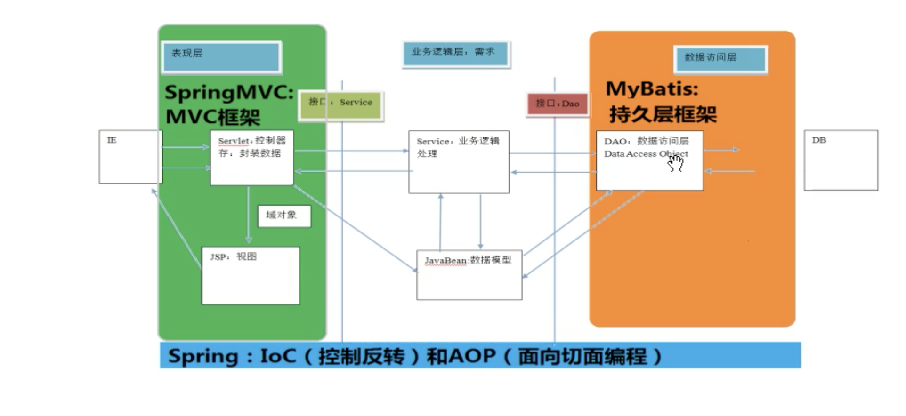
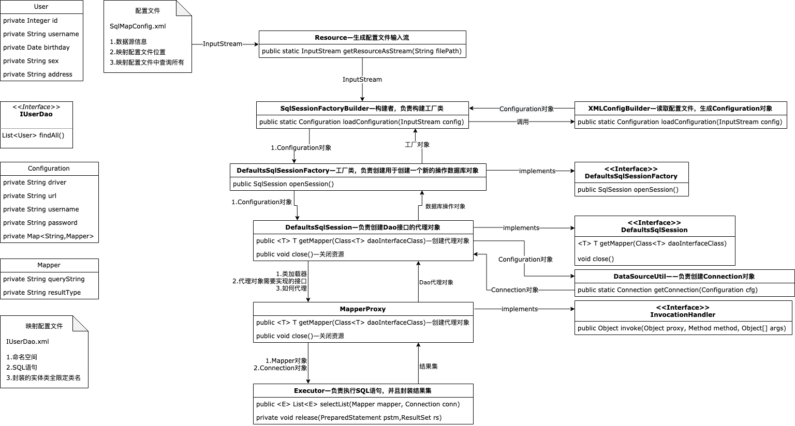

# Mybatis.basic

## 1. 基本概念

- Mybatis 定义：一种持久层框架，使用java编写
- 作用
  - 封装了jdbc细节，仅需要关注sql语句本身
  - 无需关注注册驱动、创建连接等过程
- 原理：使用ORM思想实现了结果集的封装

### ORM

- ORM（Object Relationship Mapping） 定义：对象关系映射

- 作用：将数据库中的表和实体类以及实体类的属性建立映射关系

  <!--举例-->

  ```java
  //user表中字段id、name
  
  //对应
  
  //User类中id、name属性
  ```

### 框架

- 框架 定义：软件开发的一套解决方案，不同框架解决不同问题
- 框架 优势：封装大量细节，能够极简实现功能，大大提升效率

### 三层架构

- 架构

  1. 表现层：展示数据

  2. 业务层：处理业务需求

  3. 持久层：和数据库交互

     <!--架构图-->



- 持久层解决方案

  - JDBC技术
    - Connection
    - PreparedStatement
    - ResultSet
  - Spring的jdbcTemplate：Spring对jdbc的简单封装
  - Apache的DBUtils

  <!--以上都不是框架，因为都没有明显提升效率，jdbcTemplate和DBUtils仅仅是工具类-->

## 2. 入门实现

### 环境配置

- 步骤

  1. 创建Maven工程并导入坐标

  2. 创建实体类和dao接口

  3. 创建Mybatis主配置文件：SqlMapConfig.xml

     <!--实现-->

     ```xml
     <?xml version="1.0" encoding="UTF-8"?>
     <!DOCTYPE configuration
             PUBLIC "-//mybatis.org//DTD Config 3.0//EN"
             "http://mybatis.org/dtd/mybatis-3-config.dtd">
     <configuration>
         <!-- 配置环境 -->
         <environments default="mybatis">
             <!-- 配置mysql的环境 -->
             <environment id="mybatis">
                 <!-- 配置事务的类型 -->
                 <transactionManager type="JDBC"></transactionManager>
                 <!-- 配置数据源 -->
                 <dataSource type="POOLED">
                     <property name="driver" value="com.mysql.jdbc.Driver"/>
                     <property name="url" value="jdbc:mysql://localhost:3306/Mybatis"/>
                     <property name="username" value="root"/>
                     <property name="passwork" value="Ceshi123"/>
                 </dataSource>
             </environment>
         </environments>
     
     <!--    制定映射配置文件的位置     -->
         <mappers>
             <mapper resource="random/dao/IUserDao.xml"/>
         </mappers>
     </configuration>
     ```

  4. 创建映射配置文件：IUserDao.xml

     <!--实现-->

     ```xml
     <?xml version="1.0" encoding="UTF-8" ?>
     <!DOCTYPE mapper
             PUBLIC "-//mybatis.org//DTD Mapper 3.0//EN"
             "http://mybatis.org/dtd/mybatis-3-mapper.dtd">
     <mapper namespace="random.dao.IUserDao">
         <!--配置查询所有-->
         <select id="findAll">
             select * from user
         </select>
     </mapper>
     ```

     

- 注意

  - 创建接口(IUserDao.java)和对应的mapper文件(IUserDao.xml)的文件名称需要保持一致

  - 在idea中创建目录时，需要注意目录和包是不同的

    <!--包在创建时，random.dao是两级结构；目录在创建时，random.dao是一级结构-->

  - mybatis的映射配置文件的目录需要和dao接口的包结构一致

  - mybatis的映射配置文件的mapper标签的namespace属性取值必须是dao接口的全限定类名

  - mybatis的映射配置文件的操作配置（select），id属性的取值必须是dao接口的方法名

    <!--后三条规则，确保了开发过程中不需要写dao的实现类-->

### 实现

```java
/*
@Author: Toyz
@Date: 2019/10/21
@Time: 21:46
@Purpose:
@Related:
*/
import org.apache.ibatis.io.Resources;
import org.apache.ibatis.session.SqlSession;
import org.apache.ibatis.session.SqlSessionFactory;
import org.apache.ibatis.session.SqlSessionFactoryBuilder;
import random.dao.IUserDao;
import random.domain.User;

import java.io.IOException;
import java.io.InputStream;
import java.util.List;

public class MybatisTest01 {
    public static void main(String[] args) throws IOException {
    //    1 读取配置文件
        InputStream is = Resources.getResourceAsStream("SqlMapConfig.xml");
    //    2 创建SqlSessionFactory工厂
        SqlSessionFactoryBuilder builder = new SqlSessionFactoryBuilder();
        SqlSessionFactory factory = builder.build(is);
    //    3 使用工厂创建SqlSession对象
        SqlSession session = factory.openSession();
    //    4 使用SqlSession对象创建Dao的代理对象
        IUserDao userDao = session.getMapper(IUserDao.class);
    //    5 使用代理对象执行方法
        List<User> users = userDao.findAll();
        for (User user : users) {
            System.out.println(user);
        }
    //    6 释放资源
        session.close();
        is.close();
    }
}
```

<!--解析-->

- 创建工厂时，使用了构建者模式 <!--类似施工队建工厂-->
- 创建session对象时，使用了工厂模式，降低耦合
- 创建dao对象时，使用代理模式，便于功能的增强
- 使用这么多对象的原因是：方便每一步能够有更高的扩展性，自定义程度更高

## 3. 自定义实现

### 原理



### 步骤

1. 读取配置文件

   - 使用io包中的Resource来读取配置文件，生成InputStream流

2. 创建SqlSessionFactory工厂

   - 将InputStream流传递给SqlSessionFactoryBuilder类，由类中的loadConfiguration方法将InputStream流转换成Configuration类，生成对象cfg
   - 将对象cfg传入SqlSessionFactory接口的实现类

3. 使用工厂创建SqlSession对象

   - SqlSessionFactory将cfg对象传入SqlSession接口的实现类，用于创建SqlSession对象

4. 使用SqlSession对象创建Dao的代理对象

   1. 根据dao的字节码文件创建代理对象

      ```java
      public T <T> getMapper(Class<T> daoInterfaceClass){
        /*
        * 需要传递三个参数进入方法
        * 类加载器：使用和被代理对象相同的类加载器
        * 代理对象需要实现的接口：和被代理对象实现相同的接口
        * 如何代理：它就是增强的方法，需要自己提供。此处为InvocationHandler接口，需要写一个该接口实现类，并在类中调   * 用selectList方法，而selectList方法实现看 补充说明：读取配置文件
        */
      }
      ```

      

5. 使用代理对象执行方法

6. 释放资源

### 补充

#### 读取配置文件

- 原理：使用dom4j解析XML

- 步骤

  1. 获取数据库连接信息，用于创建Connection对象

     <!--SqlMapConfig.xml中的数据库连接信息-->

     ```xml
     <dataSource type="POOLED">
                     <property name="driver" value="com.mysql.cj.jdbc.Driver"/>
                     <property name="url" value="jdbc:mysql://127.0.0.1:3306/Mybatis"/>
                     <property name="username" value="root"/>
                     <property name="password" value="Ceshi123"/>
                 </dataSource>
     ```

  2. 获取映射配置信息

     <!--SqlMapConfig.xml中的映射配置文件的位置-->

     ```xml
     <!--    指定映射配置文件的位置     -->
         <mappers>
             <mapper resource="random/dao/IUserDao.xml"/>
         </mappers>
     ```

  3. 获取映射配置信息中的SQL语句，封装的实体类全限定类名

     <!--IUserDao.xml，映射配置文件，里面有sql语句以及封装的实体类的全限定名-->

     ```xml
     <mapper namespace="random.dao.IUserDao">
         <!--配置查询所有-->
         <select id="findAll" resultType="random.domain.User">
             select * from user
         </select>
     </mapper>
     ```

- 目的：实现selectList方法 

  <!--该方法目的是创建数据库连接，运行sql语句，封装返回的数据，最后返回结果-->

  1. 根据配置文件信息，创建Connection对象——使用步骤1中的数据

     - 注册驱动
     - 获取连接

  2. 获取预处理对象PreparedStatement——使用步骤3中的sql语句

     - conn.PreparedStatement(sql);

  3. 执行查询

     - ResultSet res = preparedStatement.executeQuery();

  4. 遍历结果用于封装——使用反射来实现 获取封装的对象，对象赋值

     - 伪代码

       ```java
       List<E> list = new ArrayList<>();
       while(res.next()){
         E element = Class.forName(配置的全限定类名).newInstance();
         // 通过反射获取属性，并进行赋值
         // 将赋值完的对象加入到列表中
         list.add(element);
       }
       ```

  5. 返回list

- 前提：实现selectList方法

  - 需要连接信息

  - 需要映射信息

    - 执行的SQL语句

    - 封装结果的实体类全限定类名

    - 把以上两个内容封装成一个对象，Mapper 

       封装对象的原因：因为如果步骤三中，还有findName等方法，怎么把方法和语句，全限定类名对应起来呢？因此封装成一个对象，而sql语句和全限定类名作为属性保存

      | String                      | Mapper对象                  |
      | --------------------------- | --------------------------- |
      | random.dao.IUserDao.findAll | 1.Sql语句 2.domainClassPath |

### 实现

#### 索引

/Users/space/Documents/Growth/Package/FrameWorkJAVA/Mybatis/Mybatis.design

#### 0. 准备工作

1. 删除maven中的mybatis

2. 整理需要创建的类和接口

   ```
   class Resources
   class SqlSessionFactoryBuilder
   interface SqlSessionFactory
   interface SqlSession
   ```

#### 1. 创建类和接口

- 创建准备工作2中的类和接口

- 实现

  <!--Resources.java-->

  ```java
  import java.io.InputStream;
  
  public class Resources {
      /**
       * 根据传入的参数，获取一个字节流
       * 1 获取当前类的字节码
       * 2 字节码的类加载器
       * 3 根据类加载器读取配置
       * @param filePath
       * @return
       */
      public static InputStream getResourceAsStream(String filePath){
          return Resources.class.getClassLoader().getResourceAsStream(filePath);
      }
  }
  ```

  <!--SqlSessionFactoryBuilder.java-->

  ```java
  import java.io.InputStream;
  /*
  @Author: Toyz
  @Date: 2019/10/22
  @Time: 14:21
  @Purpose:用于创建一个SqlSessionFactory对象
  @Related:
  */
  public class SqlSessionFactoryBuilder {
      public SqlSessionFactory build(InputStream inputStream){
          return null;
      }
  }
  ```

  <!--SqlSessionFactory.java-->

  ```java
  public interface SqlSessionFactory {
      /**
       * 用于打开一个SqlSession的对象
       * @return
       */
      SqlSession openSession();
  }
  ```

  <!--SqlSession.java-->

  ```java
  /*
  @Author: Toyz
  @Date: 2019/10/22
  @Time: 14:27
  @Purpose:自定义Mybatis中和数据库交互的核心类，可以创建dao接口的代理对象
  @Related:
  */
  public interface SqlSession {
      /**
       * 根据参数创建一个代理对象
       * @param daoInterfaceClass dao接口的字节码
       * @param <T>
       * @return
       */
      <T> T getMapper(Class<T> daoInterfaceClass);
  
      /**
       * 释放资源
       */
      void close();
  }
  ```

#### 2. 创建用于读取mybatis配置文件的类

- 删除配置文件中的顶部约束

- 创建读取配置文件的类

  <!--XMLConfigBuilder.java-->

  ```java
  package random.mybatis.utils;
  
  // import random.mybatis.annotations.Select;
  import random.mybatis.cfg.Configuration;
  import random.mybatis.cfg.Mapper;
  import random.mybatis.io.Resources;
  import org.dom4j.Attribute;
  import org.dom4j.Document;
  import org.dom4j.Element;
  import org.dom4j.io.SAXReader;
  
  import java.io.IOException;
  import java.io.InputStream;
  import java.lang.reflect.Method;
  import java.lang.reflect.ParameterizedType;
  import java.lang.reflect.Type;
  import java.util.HashMap;
  import java.util.List;
  import java.util.Map;
  
  /**
   * @author 黑马程序员
   * @Company http://www.ithiema.com
   *  用于解析配置文件
   */
  public class XMLConfigBuilder {
      /**
       * 解析主配置文件，把里面的内容填充到DefaultSqlSession所需要的地方
       * 使用的技术：
       *      dom4j+xpath
       */
      public static Configuration loadConfiguration(InputStream config){
          try{
              //定义封装连接信息的配置对象（mybatis的配置对象）
              Configuration cfg = new Configuration();
  
              //1.获取SAXReader对象
              SAXReader reader = new SAXReader();
              //2.根据字节输入流获取Document对象
              Document document = reader.read(config);
              //3.获取根节点
              Element root = document.getRootElement();
              //4.使用xpath中选择指定节点的方式，获取所有property节点
              List<Element> propertyElements = root.selectNodes("//property");
              //5.遍历节点
              for(Element propertyElement : propertyElements){
                  //判断节点是连接数据库的哪部分信息
                  //取出name属性的值
                  String name = propertyElement.attributeValue("name");
                  if("driver".equals(name)){
                      //表示驱动
                      //获取property标签value属性的值
                      String driver = propertyElement.attributeValue("value");
                      cfg.setDriver(driver);
                  }
                  if("url".equals(name)){
                      //表示连接字符串
                      //获取property标签value属性的值
                      String url = propertyElement.attributeValue("value");
                      cfg.setUrl(url);
                  }
                  if("username".equals(name)){
                      //表示用户名
                      //获取property标签value属性的值
                      String username = propertyElement.attributeValue("value");
                      cfg.setUsername(username);
                  }
                  if("password".equals(name)){
                      //表示密码
                      //获取property标签value属性的值
                      String password = propertyElement.attributeValue("value");
                      cfg.setPassword(password);
                  }
              }
              //取出mappers中的所有mapper标签，判断他们使用了resource还是class属性
              List<Element> mapperElements = root.selectNodes("//mappers/mapper");
              //遍历集合
              for(Element mapperElement : mapperElements){
                  //判断mapperElement使用的是哪个属性
                  Attribute attribute = mapperElement.attribute("resource");
                  if(attribute != null){
                      System.out.println("使用的是XML");
                      //表示有resource属性，用的是XML
                      //取出属性的值
                      String mapperPath = attribute.getValue();//获取属性的值"com/itheima/dao/IUserDao.xml"
                      //把映射配置文件的内容获取出来，封装成一个map
                      Map<String, Mapper> mappers = loadMapperConfiguration(mapperPath);
                      //给configuration中的mappers赋值
                      cfg.setMappers(mappers);
                  }else{
                      // System.out.println("使用的是注解");
                      // //表示没有resource属性，用的是注解
                      // //获取class属性的值
                      // String daoClassPath = mapperElement.attributeValue("class");
                      // //根据daoClassPath获取封装的必要信息
                      // Map<String,Mapper> mappers = loadMapperAnnotation(daoClassPath);
                      // //给configuration中的mappers赋值
                      // cfg.setMappers(mappers);
                  }
              }
              //返回Configuration
              return cfg;
          }catch(Exception e){
              throw new RuntimeException(e);
          }finally{
              try {
                  config.close();
              }catch(Exception e){
                  e.printStackTrace();
              }
          }
  
      }
  
      /**
       * 根据传入的参数，解析XML，并且封装到Map中
       * @param mapperPath    映射配置文件的位置
       * @return  map中包含了获取的唯一标识（key是由dao的全限定类名和方法名组成）
       *          以及执行所需的必要信息（value是一个Mapper对象，里面存放的是执行的SQL语句和要封装的实体类全限定类名）
       */
      private static Map<String,Mapper> loadMapperConfiguration(String mapperPath)throws IOException {
          InputStream in = null;
          try{
              //定义返回值对象
              Map<String,Mapper> mappers = new HashMap<String,Mapper>();
              //1.根据路径获取字节输入流
              in = Resources.getResourceAsStream(mapperPath);
              //2.根据字节输入流获取Document对象
              SAXReader reader = new SAXReader();
              Document document = reader.read(in);
              //3.获取根节点
              Element root = document.getRootElement();
              //4.获取根节点的namespace属性取值
              String namespace = root.attributeValue("namespace");//是组成map中key的部分
              //5.获取所有的select节点
              List<Element> selectElements = root.selectNodes("//select");
              //6.遍历select节点集合
              for(Element selectElement : selectElements){
                  //取出id属性的值      组成map中key的部分
                  String id = selectElement.attributeValue("id");
                  //取出resultType属性的值  组成map中value的部分
                  String resultType = selectElement.attributeValue("resultType");
                  //取出文本内容            组成map中value的部分
                  String queryString = selectElement.getText();
                  //创建Key
                  String key = namespace+"."+id;
                  //创建Value
                  Mapper mapper = new Mapper();
                  mapper.setQueryString(queryString);
                  mapper.setResultType(resultType);
                  //把key和value存入mappers中
                  mappers.put(key,mapper);
              }
              return mappers;
          }catch(Exception e){
              throw new RuntimeException(e);
          }finally{
              in.close();
          }
      }
  
      /**
       * 根据传入的参数，得到dao中所有被select注解标注的方法。
       * 根据方法名称和类名，以及方法上注解value属性的值，组成Mapper的必要信息
       * @param daoClassPath
       * @return
  
      private static Map<String,Mapper> loadMapperAnnotation(String daoClassPath)throws Exception{
          //定义返回值对象
          Map<String,Mapper> mappers = new HashMap<String, Mapper>();
  
          //1.得到dao接口的字节码对象
          Class daoClass = Class.forName(daoClassPath);
          //2.得到dao接口中的方法数组
          Method[] methods = daoClass.getMethods();
          //3.遍历Method数组
          for(Method method : methods){
              //取出每一个方法，判断是否有select注解
              boolean isAnnotated = method.isAnnotationPresent(Select.class);
              if(isAnnotated){
                  //创建Mapper对象
                  Mapper mapper = new Mapper();
                  //取出注解的value属性值
                  Select selectAnno = method.getAnnotation(Select.class);
                  String queryString = selectAnno.value();
                  mapper.setQueryString(queryString);
                  //获取当前方法的返回值，还要求必须带有泛型信息
                  Type type = method.getGenericReturnType();//List<User>
                  //判断type是不是参数化的类型
                  if(type instanceof ParameterizedType){
                      //强转
                      ParameterizedType ptype = (ParameterizedType)type;
                      //得到参数化类型中的实际类型参数
                      Type[] types = ptype.getActualTypeArguments();
                      //取出第一个
                      Class domainClass = (Class)types[0];
                      //获取domainClass的类名
                      String resultType = domainClass.getName();
                      //给Mapper赋值
                      mapper.setResultType(resultType);
                  }
                  //组装key的信息
                  //获取方法的名称
                  String methodName = method.getName();
                  String className = method.getDeclaringClass().getName();
                  String key = className+"."+methodName;
                  //给map赋值
                  mappers.put(key,mapper);
              }
          }
          return mappers;
      }
  */
  }
  ```

- 创建mybatis配置类以及用于封装执行的sql语句以及实体类全限定类名的类——在XMLConfigBuilder.java中使用

  <!--Configuration.java-->

  ```java
  package random.mybatis.cfg;
  
  /*
  @Author: Toyz
  @Date: 2019/10/22
  @Time: 16:14
  @Purpose:自定义mybatis的配置类，存储从配置文件中读取出来的数据
  @Related:
  */
  
  
  import java.util.Map;
  
  public class Configuration {
      private String driver;
      private String url;
      private String username;
      private String password;
      private Map<String,Mapper> mappers;
  
      public Map<String, Mapper> getMappers() {
          return mappers;
      }
  
      public void setMappers(Map<String, Mapper> mappers) {
          /*
          默认赋值方法仅保存最新值，因为会覆盖，所以需要重写
           */
          // 默认方法：this.mappers = mappers;
          this.mappers.putAll(mappers);
      }
  
      public String getDriver() {
          return driver;
      }
  
      public void setDriver(String driver) {
          this.driver = driver;
      }
  
      public String getUrl() {
          return url;
      }
  
      public void setUrl(String url) {
          this.url = url;
      }
  
      public String getUsername() {
          return username;
      }
  
      public void setUsername(String username) {
          this.username = username;
      }
  
      public String getPassword() {
          return password;
      }
  
      public void setPassword(String password) {
          this.password = password;
      }
  }
  ```

  <!--Mapper-->

  ```java
  package random.mybatis.cfg;
  
  /*
  @Author: Toyz
  @Date: 2019/10/22
  @Time: 16:16
  @Purpose:用于封装执行的sql语句以及实体类全限定类名
  @Related:
  */
  public class Mapper {
      private String queryString;
      private String resultType;
  
      public String getQueryString() {
          return queryString;
      }
  
      public void setQueryString(String queryString) {
          this.queryString = queryString;
      }
  
      public String getResultType() {
          return resultType;
      }
  
      public void setResultType(String resultType) {
          this.resultType = resultType;
      }
  }
  ```

#### 3. 建立类之间的关系

- 获取Resource类传递的InputStream，并转换为Configuration对象，并将对象传入SqlSessionFactory

  <!--SqlSessionFactoryBuilder.java-->

  ```java
  package random.mybatis.sqlsession;
  
  /*
  @Author: Toyz
  @Date: 2019/10/22
  @Time: 14:21
  @Purpose:用于创建一个SqlSessionFactory对象
  @Related:
  */
  
  import random.mybatis.cfg.Configuration;
  import random.mybatis.sqlsession.defaults.DefaultsSqlSessionFactory;
  import random.mybatis.utils.XMLConfigBuilder;
  import java.io.InputStream;
  
  public class SqlSessionFactoryBuilder {
      public SqlSessionFactory build(InputStream inputStream){
          Configuration cfg = XMLConfigBuilder.loadConfiguration(inputStream);
          return new DefaultsSqlSessionFactory(cfg);
      }
  }
  ```

- 创建SqlSessionFactory接口的实现类，通过cfg创建SqlSession对象

  <!--DefaultsSqlSessionFactory.java-->

  ```java
  package random.mybatis.sqlsession.defaults;
  
  /*
  @Author: Toyz
  @Date: 2019/10/22
  @Time: 17:01
  @Purpose:SqlSessionFactory的实现类
  @Related:
  */
  
  import random.mybatis.cfg.Configuration;
  import random.mybatis.sqlsession.SqlSession;
  import random.mybatis.sqlsession.SqlSessionFactory;
  
  import java.io.InputStream;
  
  public class DefaultsSqlSessionFactory implements SqlSessionFactory {
      private Configuration cfg;
      public DefaultsSqlSessionFactory(Configuration cfg){
          this.cfg = cfg;
      }
  
      /**
       * 用于创建数据库对象的类
       * @return
       */
      public SqlSession openSession() {
          return new DefaultsSqlSession(cfg);
      }
  }
  ```

- 创建SqlSession的接口的实现类，用于创建代理对象以及释放资源

  <!--DefaultsSqlSession.java-->

  ```java
  package random.mybatis.sqlsession.defaults;
  
  /*
  @Author: Toyz
  @Date: 2019/10/22
  @Time: 17:07
  @Purpose:SqlSession接口的实现类
  @Related:
  */
  
  
  import random.mybatis.cfg.Configuration;
  import random.mybatis.sqlsession.SqlSession;
  
  public class DefaultsSqlSession implements SqlSession {
      private Configuration cfg;
  
      public DefaultsSqlSession(Configuration cfg) {
          this.cfg = cfg;
      }
  
      /**
       * 用于创建代理对象
       * @param daoInterfaceClass dao接口的字节码
       * @param <T>
       * @return
       */
      public <T> T getMapper(Class<T> daoInterfaceClass) {
          return null;
      }
  
      /**
       * 用于释放资源
       */
      public void close() {
  
      }
  }
  ```

  


