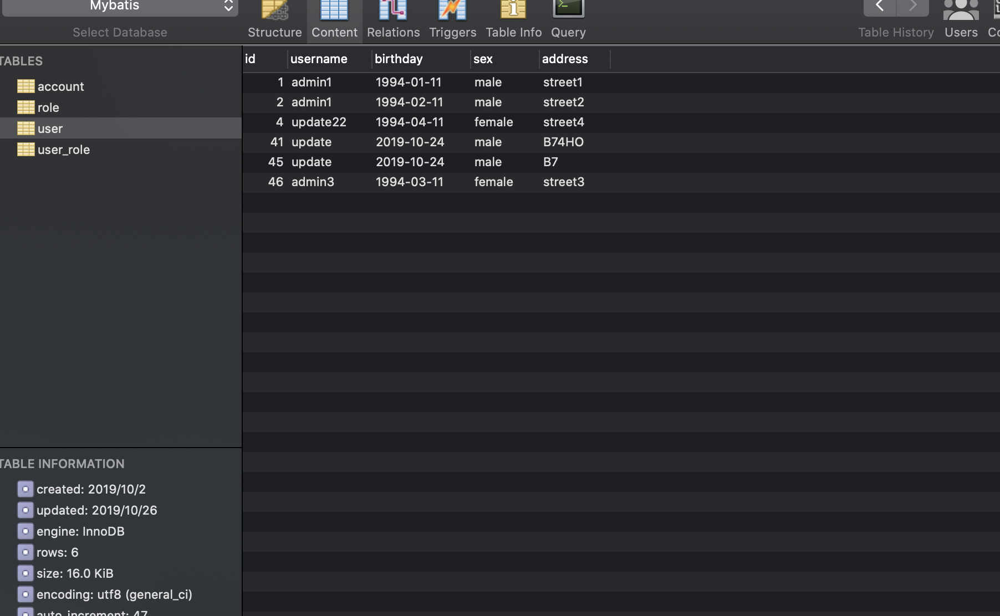
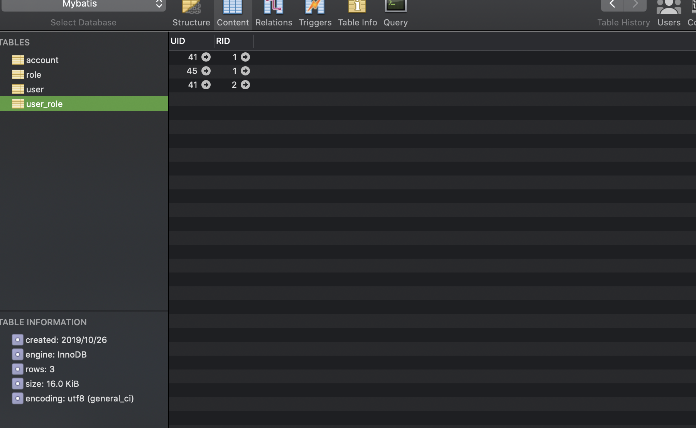
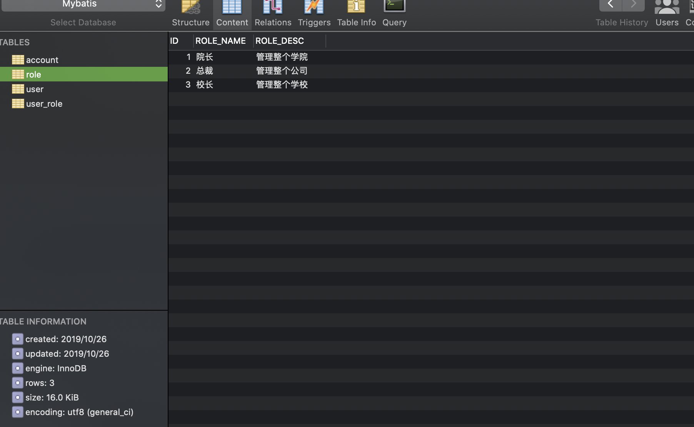

# Mybatis.basic3

## 1. Outline

1. Mybatis中的连接池以及事务控制

   <!--要求：原理了解，应用-->

   - Mybatis中连接池使用及分析
   - Mybatis中事务控制的分析

2. Mybatis基于XML配置的动态SQL语句使用

   <!--要求：应用-->

   - mapper配置中的标签

3. Mybatis中的多表操作

   <!--要求：应用-->

   - 一对多
   - 一对一
   - 多对多

## 2. 连接池

- 连接池 作用：减少获取连接所需要的时间，采用队列集合，且线程安全

### Mybatis中的连接池

- 规则
  - 配置的位置是主配置文件SqlMapConfig.xml中的dataSource属性
  - 三种配置方法
    - POOLED：采用传统的javax.sql.DataSource规范中的连接池
    - UNPOOLED：采用传统获取连接的方式，并没有使用池
    - JNDI：采用服务器提供的JNDI技术实现，来获取DataSource对象，但不是web或者maven的war工程是无法使用的。课程中采用的是tomcat，使用的连接池是dbcp

- POOLED源码

  <!--PooledDataSource.class节选-->

  ```java
  private PooledConnection popConnection(String username, String password) throws SQLException {
          boolean countedWait = false;
          PooledConnection conn = null;
          long t = System.currentTimeMillis();
          int localBadConnectionCount = 0;
  
          while(conn == null) {
              synchronized(this.state) {
                  PoolState var10000;
                  if (!this.state.idleConnections.isEmpty()) {
                      conn = (PooledConnection)this.state.idleConnections.remove(0);
                      if (log.isDebugEnabled()) {
                          log.debug("Checked out connection " + conn.getRealHashCode() + " from pool.");
                      }
                  } else if (this.state.activeConnections.size() < this.poolMaximumActiveConnections) {
                      conn = new PooledConnection(this.dataSource.getConnection(), this);
                      if (log.isDebugEnabled()) {
                          log.debug("Created connection " + conn.getRealHashCode() + ".");
                      }
                  } else {
                      PooledConnection oldestActiveConnection = (PooledConnection)this.state.activeConnections.get(0);
                      long longestCheckoutTime = oldestActiveConnection.getCheckoutTime();
  ```

  <!--解析-->

  - 过程
    1. 占用state，实现同步
    2. 查看空闲池是否有连接，有则使用，没有则下一步
    3. 查看活动池中是否有连接，如果已经满了，则获取最老（oldest）的返回

- UNPOOLED源码

  <!--UnpooledDataSource.class-->

  ```java
  private Connection doGetConnection(Properties properties) throws SQLException {
    			// 使用加载器进行初始化，见initializeDriver()
          this.initializeDriver();
    			// 创建连接对象
          Connection connection = DriverManager.getConnection(this.url, properties);
          this.configureConnection(connection);
          return connection;
      }
  ```

  <!--initializeDriver()-->

  ```java
  private synchronized void initializeDriver() throws SQLException {
          if (!registeredDrivers.containsKey(this.driver)) {
              try {
                  Class driverType;
                  if (this.driverClassLoader != null) {
                      driverType = Class.forName(this.driver, true, this.driverClassLoader);
                  } else {
                      driverType = Resources.classForName(this.driver);
                  }
  
                  Driver driverInstance = (Driver)driverType.newInstance();
                  DriverManager.registerDriver(new UnpooledDataSource.DriverProxy(driverInstance));
                  registeredDrivers.put(this.driver, driverInstance);
              } catch (Exception var3) {
                  throw new SQLException("Error setting driver on UnpooledDataSource. Cause: " + var3);
              }
          }
  
      }
  ```

- POOLED和UNPOOLED比较

  - POOLED执行日志

    ```
    Closing JDBC Connection [com.mysql.cj.jdbc.ConnectionImpl@1583741e]
    [DEBUG] 2019-10-25 18:37:13,034 method:org.apache.ibatis.datasource.pooled.PooledDataSource.pushConnection(PooledDataSource.java:381)
    Returned connection 360936478 to pool.
    ```

    <!--解析-->

    - 关闭了连接，并将连接放回连接池中

  - UNPOOLED执行日志

    ```
    [DEBUG] 2019-10-25 18:42:06,725 method:org.apache.ibatis.transaction.jdbc.JdbcTransaction.resetAutoCommit(JdbcTransaction.java:122)
    Resetting autocommit to true on JDBC Connection [com.mysql.cj.jdbc.ConnectionImpl@5ddcc487]
    [DEBUG] 2019-10-25 18:42:06,726 method:org.apache.ibatis.transaction.jdbc.JdbcTransaction.close(JdbcTransaction.java:90)
    Closing JDBC Connection [com.mysql.cj.jdbc.ConnectionImpl@5ddcc487]
    ```

    <!--解析-->

    - 直接关闭了连接，没有连接池

### 索引

- /Users/space/Documents/Growth/Package/FrameWorkJAVA/Mybatis/Mybatis.basic3

## 3. 事务——default

- 事务 定义：
- 事务分类
  - 提交，commit
  - 回滚，rollback

## 4. 动态Sql语句

### IF语句

- 作用：作为查询时的条件判断

- 步骤

  1. 持久层接口中添加方法名称

     ```java
     // find user by condition
         List<User> findByCondition(User user);
     ```

  2. 映射配置文件中添加Sql语句

     ```xml
     <!--find by condition-->
         <select id="findByCondition" parameterType="user" resultType="user">
             select * from user where 1=1
             <if test="username != null">
                 and username = #{username};
             </if>
         </select>
     ```

  3. 测试类中进行测试

     ```java
     /**
     * 根据用户属性的情况查询
     */
     @Test
     public void testFindByCondition(){
       User user = new User();
       user.setUsername("admin1");
       users = iUserDao.findByCondition(user);
       for (User user1 : users) {
         System.out.println(user1);
       }
     }
     ```

### Where语句

- 作用：简化判断语句，省略IF语句中的“1=1”判断

- 实现

  <!--IUserDao.xml-->

  ```xml
   <!--find by condition-->
      <select id="findByCondition" parameterType="user" resultType="user">
          select * from user
          <where>
              <if test="username != null">
                  and username = #{username};
              </if>
              <if test="sex != null">
                  and sex = #{sex};
              </if>
          </where>
      </select>
  ```

### Foreach语句

- 作用：实现遍历属性的数组

- 步骤

  1. 实体类的包装类对象

     <!--QueryVo.java-->

     ```java
     import java.util.List;
     
     public class QueryVo {
         private User user;
         private List<Integer> ids;
     
         public User getUser() {
             return user;
         }
     
         public void setUser(User user) {
             this.user = user;
         }
     
         public List<Integer> getList() {
             return ids;
         }
     
         public void setList(List<Integer> list) {
             this.ids = list;
         }
     }
     ```

  2. 持久层接口添加方法

     <!--IUserDao.java-->

     ```java
     // find user in Ids
         List<User> findUserInIds(QueryVo queryVo);
     ```

  3. 映射配置文件添加sql语句

     <!--IUserDao.xml-->

     ```xml
     <!--简化重复的sql语句-->
     <sql id="defaultUser">
             select * from user
         </sql>
     <!--find user in Ids-->
     <select id="findUserInIds" parameterType="QueryVo" resultType="user">
       <include refid="defaultUser"></include>
       <where>
         <foreach collection="ids" open=" and id in (" close=")" item="uid" separator=",">
           #{uid}
         </foreach>
       </where>
     </select>
     ```

     <!--解析-->

     - foreach中的属性
       - item表示集合中每一个元素进行迭代时的别名
       - open表示该语句以什么开始
       - separator表示在每次进行迭代之间以什么符号作为分隔符
       - close表示以什么结束
       - index指定一个名字，用于表示在迭代过程中，每次迭代到的位置
       - collection属性，该属性是必须指定的，但是在不同情况下，该属性的值是不一样的，主要有一下3种情况：
         - 如果传入的是单参数且参数类型是一个List的时候，collection属性值为list
         - 如果传入的是单参数且参数类型是一个array数组的时候，collection的属性值为array
         - 如果传入的参数是多个的时候，我们就需要把它们封装成一个Map或者Object

  4. 测试类添加测试代码

### 索引

- /Users/space/Documents/Growth/Package/FrameWorkJAVA/Mybatis/Mybatis.basic3

## 5.多表操作

- 表之间的关系

  - 一对多：一个用户有多个订单
  - 多对一：多个订单属于一个用户
  - 多对多：一个老师有多个学生，一个学生有多个老师
  - 一对一：一个人只有一个身份证，一个身份证对应一个人

- Mybatis中表关系

  - 将多对一作为一对一

    原因：拿出一个订单，只属于一个用户

### 一对一查询

- 步骤

  1. 数据库中新建从表

  2. 新建从表的类以及持久层接口

     <!--IAccountDao.java-->

     ```java
     import random.domain.Account;
     
     import java.util.List;
     
     public interface IAccountDao {
         // find all accounts
         List<Account> findAll();
         // 查找所有账户，同时包含用户名和地址
         List<Account> findAllAccount();
     }
     ```

  3. 在从表实体中创建主表的实体作为属性

     ```java
     public class Account {
         private int id;
         private int uid;
         private double money;
     
         // 在从表实体中添加主表实体的对象
         private User user;
     
         public User getUser() {
             return user;
         }
     
         public void setUser(User user) {
             this.user = user;
         }
     
         public int getId() {
             return id;
         }
     
         public void setId(int id) {
             this.id = id;
         }
     
         public int getUid() {
             return uid;
         }
     
         public void setUid(int uid) {
             this.uid = uid;
         }
     
         public double getMoney() {
             return money;
         }
     
         public void setMoney(double money) {
             this.money = money;
         }
     
         @Override public String toString() {
             return "Account{" + "id=" + id + ", uid=" + uid + ", money=" + money + '}';
         }
     }
     ```

  4. 新建映射配置文件，添加查询方法以及建立一对一关系映射

     ```xml
     <?xml version="1.0" encoding="UTF-8" ?>
     <!DOCTYPE mapper
             PUBLIC "-//mybatis.org//DTD Mapper 3.0//EN"
             "http://mybatis.org/dtd/mybatis-3-mapper.dtd">
     <mapper namespace="random.dao.IAccountDao">
     
         <!--定义封装account和user的resultMap-->
         <resultMap id="accountUserMap" type="account">
             <id property="id" column="aid"/>
             <result property="uid" column="uid"/>
             <result property="money" column="money"/>
             <!--一对一的关系映射，配置封装user的内容-->
             <association property="user" column="uid">
                 <id property="id" column="id"/>
                 <result property="username" column="username"/>
                 <result property="birthday" column="birthday"/>
                 <result property="sex" column="sex"/>
                 <result property="address" column="address"/>
             </association>
         </resultMap>
     
         <!--find all the users-->
         <select id="findAll" resultType="account">
             select * from account;
         </select>
     
         <!--查找所有账户，同时包含用户名和地址-->
         <select id="findAllAccount" resultMap="accountUserMap" >
             select a.*,u.username,u.address from account a,user u where u.id=a.uid;
         </select>
     </mapper>
     ```

     <!--解析-->

     - 需要定义封装account和user，并且使用association标签建立一对一的关系映射——重点
     - 添加查找所有用户的语句

- 索引：/Users/space/Documents/Growth/Package/FrameWorkJAVA/Mybatis/Mybatis.basic4

### 一对多查询

- 步骤

  1. 主表为user，从表为account，一个用户有多个账号

  2. 主表类中将从表类的对象作为属性

     <!--User.java-->

     ```java
     import java.util.Date;
     import java.util.List;
     
     public class User {
         private Integer id;
         private String username;
         private Date birthday;
         private String sex;
         private String address;
     
         // 从表添加主表的实体对象作为属性
         private List<Account> accounts;
     
         public List<Account> getAccounts() {
             return accounts;
         }
     
         public void setAccounts(List<Account> accounts) {
             this.accounts = accounts;
         }
     
         public Integer getId() {
             return id;
         }
     
         public void setId(Integer id) {
             this.id = id;
         }
     
         public String getUsername() {
             return username;
         }
     
         public void setUsername(String username) {
             this.username = username;
         }
     
         public Date getBirthday() {
             return birthday;
         }
     
         public void setBirthday(Date birthday) {
             this.birthday = birthday;
         }
     
         public String getSex() {
             return sex;
         }
     
         public void setSex(String sex) {
             this.sex = sex;
         }
     
         public String getAddress() {
             return address;
         }
     
         public void setAddress(String address) {
             this.address = address;
         }
     
         @Override public String toString() {
             return "User{" + "id=" + id + ", username='" + username + '\'' + ", birthday=" + birthday
                 + ", sex='" + sex + '\'' + ", address='" + address + '\'' + ", accounts=" + accounts
                 + '}';
         }
     }
     
     ```

  3. 修改持久层类接口

     <!--IUserDao.java-->

     ```java
     import random.domain.User;
     
     import java.util.List;
     
     public interface IUserDao {
         // 一对多查询，一个用户有哪些账号
         List<User> findAllAccount();
     }
     ```

  4. 新建映射配置文件，编写sql

     ```xml
     <?xml version="1.0" encoding="UTF-8" ?>
     <!DOCTYPE mapper
             PUBLIC "-//mybatis.org//DTD Mapper 3.0//EN"
             "http://mybatis.org/dtd/mybatis-3-mapper.dtd">
     <mapper namespace="random.dao.IUserDao">
     
         <!--一对多对应的表-->
         <resultMap id="userAccountMap" type="user">
             <id property="id" column="id"/>
             <result column="username" property="username" />
             <result column="sex" property="sex" />
             <result column="birthday" property="birthday" />
             <result column="address" property="address" />
             <collection property="accounts" ofType="account">
                 <id property="id" column="aid"/>
                 <result column="uid" property="uid"/>
                 <result column="money" property="money"/>
             </collection>
         </resultMap>
     
         <!--一对多查询，一个用户有哪些账号-->
         <select id="findAllAccount" resultMap="userAccountMap">
             select * from user u left outer join account a on u.id=a.uid;
         </select>
     </mapper>
     
     ```

     <!--解析-->

     - 使用collection配置，property属性为从表类对象在主表中的引用名称（这个名称和User.java中新建的List<Account>类的引用名称相同）；ofType为List中的类型——重点

  5. 编写测试类

     <!--TestUser.java-->

     ```java
     /*
     @Author: Toyz
     @Date: 2019/10/26
     @Time: 20:35
     @Purpose:一对多的查询，一个用户有多个账号
     */
     import org.apache.ibatis.io.Resources;
     import org.apache.ibatis.session.SqlSession;
     import org.apache.ibatis.session.SqlSessionFactory;
     import org.apache.ibatis.session.SqlSessionFactoryBuilder;
     import org.junit.After;
     import org.junit.Before;
     import org.junit.Test;
     import random.dao.IUserDao;
     import random.domain.User;
     
     import java.io.InputStream;
     import java.util.List;
     
     public class TestUser {
         private InputStream inputStream;
         private SqlSession session;
         private IUserDao iUserDao;
         private List<User> users;
     
         /**
          * before the test method
          */
         @Before
         public void init() throws Exception {
             // read configuration file
             inputStream = Resources.getResourceAsStream("SqlMapConfig.xml");
             // create factory builder
             SqlSessionFactoryBuilder builder = new SqlSessionFactoryBuilder();
             // create factory
             SqlSessionFactory factory = builder.build(inputStream);
             // create session
             session = factory.openSession();
             // create proxy objective
             iUserDao = session.getMapper(IUserDao.class);
         }
     
         /**
          * after the test method
          */
         @After
         public void destory() throws Exception {
             // submit the transactionManager
             session.commit();
             // release source
             session.close();
             inputStream.close();
         }
     
         /**
          * 查找用户下的所有账号
          */
         @Test
         public void findAllAccount(){
             users = iUserDao.findAllAccount();
             for (User user : users) {
                 System.out.println(user);
             }
         }
     }
     ```

- 索引：/Users/space/Documents/Growth/Package/FrameWorkJAVA/Mybatis/Mybatis.basic4

### 多对多查询

- 步骤

  1. 建立两张表：用户表和角色表

     需要使用中间表，包含两个表的主键，在中间表中是外键

     <!--比如学号是学生表的主键，成绩表中主键是学号和课程号属性组，因此成绩表中的学号是外键-->

  2. 建立两个实体类：用户类和角色类，各自包含对方的集合引用

  3. 建立两个配置文件

  4. 实现配置：查询用户，同时得到角色信息；查询角色，同时得到用户信息

- 实现：查询所有角色，同时获得角色的所赋予的用户

  1. 建立两张表：用户表和角色表

     

     

     

  2. 建立两个实体类

     <!--Role.java-->

     ```java
     package random.domain;
     
     /*
     @Author: Toyz
     @Date: 2019/10/26
     @Time: 21:28
     @Purpose:
     */
     
     
     import java.io.Serializable;
     import java.util.List;
     
     public class Role implements Serializable {
         private Integer roleId;
         private String roleName;
         private String roleDesc;
     
         // 多对多关系映射
         private List<User> users;
     
         public List<User> getUsers() {
             return users;
         }
     
         public void setUsers(List<User> users) {
             this.users = users;
         }
     
         public Integer getRoleId() {
             return roleId;
         }
     
         public void setRoleId(Integer roleId) {
             this.roleId = roleId;
         }
     
         public String getRoleName() {
             return roleName;
         }
     
         public void setRoleName(String roleName) {
             this.roleName = roleName;
         }
     
         public String getRoleDesc() {
             return roleDesc;
         }
     
         public void setRoleDesc(String roleDesc) {
             this.roleDesc = roleDesc;
         }
     
         @Override public String toString() {
             return "Role{" + "roleId=" + roleId + ", roleName='" + roleName + '\'' + ", roleDesc='"
                 + roleDesc + '\'' + ", users=" + users + '}';
         }
     }
     ```

     <!--User.java-->

     ```java
     package random.domain;
     
     /*
     @Author: Toyz
     @Date: 2019/10/25
     @Time: 18:17
     @Purpose:
     */
     
     
     import java.io.Serializable;
     import java.util.Date;
     import java.util.List;
     
     public class User implements Serializable {
         private Integer id;
         private String username;
         private Date birthday;
         private String sex;
         private String address;
     
         // 多对多的映射关系
         private List<Role> roles;
     
         public List<Role> getRoles() {
             return roles;
         }
     
         public void setRoles(List<Role> roles) {
             this.roles = roles;
         }
     
         public Integer getId() {
             return id;
         }
     
         public void setId(Integer id) {
             this.id = id;
         }
     
         public String getUsername() {
             return username;
         }
     
         public void setUsername(String username) {
             this.username = username;
         }
     
         public Date getBirthday() {
             return birthday;
         }
     
         public void setBirthday(Date birthday) {
             this.birthday = birthday;
         }
     
         public String getSex() {
             return sex;
         }
     
         public void setSex(String sex) {
             this.sex = sex;
         }
     
         public String getAddress() {
             return address;
         }
     
         public void setAddress(String address) {
             this.address = address;
         }
     
         @Override public String toString() {
             return "User{" + "id=" + id + ", username='" + username + '\'' + ", birthday=" + birthday
                 + ", sex='" + sex + '\'' + ", address='" + address + '\'' + ", roles=" + roles + '}';
         }
     }
     ```

  3. 建立两个持久层接口

     <!--IRoleDao.java-->

     ```java
     package random.dao;
     
     /*
     @Author: Toyz
     @Date: 2019/10/26
     @Time: 21:30
     @Purpose:
     */
     
     
     import random.domain.Role;
     
     import java.util.List;
     
     public interface IRoleDao {
         /**
          * 查询所有
          * @return
          */
         List<Role> findAll();
     }
     
     ```

  4. 映射配置文件

     <!--IRoleDao.xml-->

     ```xml
     <?xml version="1.0" encoding="UTF-8" ?>
     <!DOCTYPE mapper
             PUBLIC "-//mybatis.org//DTD Mapper 3.0//EN"
             "http://mybatis.org/dtd/mybatis-3-mapper.dtd">
     <mapper namespace="random.dao.IRoleDao">
         
         <!--名称映射表-->
         <resultMap id="roleMap" type="role">
             <id property="roleId" column="id"/>
             <result column="role_name" property="roleName"/>
             <result column="role_desc" property="roleDesc"/>
             <collection property="users" ofType="user">
                 <id property="id" column="id"/>
                 <result column="username" property="username"/>
                 <result column="sex" property="sex"/>
                 <result column="birthday" property="birthday"/>
                 <result column="address" property="address"/>
             </collection>
         </resultMap>
         <!--查询所有-->
         <select id="findAll" resultMap="roleMap">
             select u.*,r.id as rid,r.role_name,r.role_desc from role r
              left outer join user_role ur on r.id = ur.rid
              left outer join user u on u.id = ur.uid;
         </select>
     
     </mapper>
     ```

     <!--解析-->

     - 关键内容为sql语句——重点

- 索引：/Users/space/Documents/Growth/Package/FrameWorkJAVA/Mybatis/Mybatis.basic5


