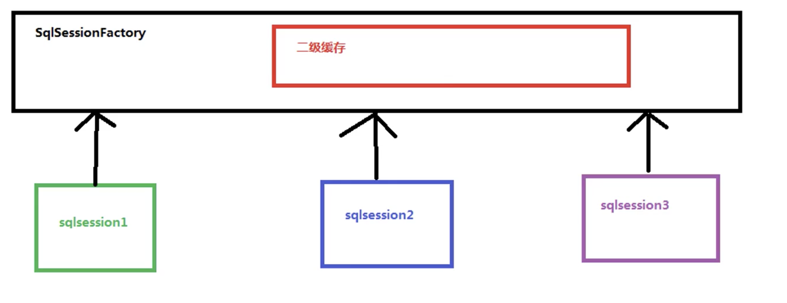

# Mybatis.basic4

## 1. Outline

1. Mybatis中的延迟加载
2. Mybaits中的缓存
3. Mybatis中的注解开发

## 2. 延迟加载

- 场景

  一对多的情况下，一个用户对应100个账号，如果此时查询用户会同时得到100个账号信息，导致内存浪费，因此考虑使用延迟加载

- 延迟加载（懒加载） 定义：在真正使用数据时才查询

- 立即加载 定义：只要调用方法，立刻进行查询

- 规则

  - 一对多，多对多：一般采用懒加载
  - 多对一，一对一：一般采用立即加载

- 方法

  - 使用lazyLoadingEnabled和aggressiveLazyLoading属性实现

    | 设置名                | 描述                                                         | 有效值        | 默认值                                       |
    | --------------------- | ------------------------------------------------------------ | ------------- | -------------------------------------------- |
    | lazyLoadingEnabled    | 延迟加载的全局开关。当开启时，所有关联对象都会延迟加载。 特定关联关系中可通过设置 `fetchType` 属性来覆盖该项的开关状态。 | true \| false | false                                        |
    | aggressiveLazyLoading | 当开启时，任何方法的调用都会加载该对象的所有属性。 否则，每个属性会按需加载（参考 `lazyLoadTriggerMethods`)。 | true \| false | false （在 3.4.1 及之前的版本默认值为 true） |

- 实现

  - 配置文件添加延迟配置

    <!--SqlMapConfig.xml-->

    ```xml
    <?xml version="1.0" encoding="UTF-8"?>
    <!DOCTYPE configuration
            PUBLIC "-//mybatis.org//DTD Config 3.0//EN"
            "http://mybatis.org/dtd/mybatis-3-config.dtd">
    <configuration>
        <!--配置延迟加载-->
        <settings>
            <setting name="lazyLoadingEnabled" value="true"/>
            <setting name="aggressiveLazyLoading" value="false"/>
        </settings>
    
        <!--使用package属性设置别名-->
        <typeAliases>
            <package name="random.domain"/>
        </typeAliases>
    
        <environments default="mybatis">
            <environment id="mybatis">
                <transactionManager type="JDBC"></transactionManager>
    
                <!--配置连接池-->
                <dataSource type="POOLED">
                    <property name="driver" value="com.mysql.cj.jdbc.Driver"/>
                    <property name="url" value="jdbc:mysql://127.0.0.1:3306/Mybatis"/>
                    <property name="username" value="root"/>
                    <property name="password" value="Ceshi123"/>
                </dataSource>
            </environment>
        </environments>
        
        <mappers>
            <package name="random.dao"/>
        </mappers>
    </configuration>
    ```

    <!--解析-->

    - 仅添加了延迟加载配置

  - 映射配置文件添加一对一查询

    <!--IAccountDao.xml-->

    ```xml
    <?xml version="1.0" encoding="UTF-8" ?>
    <!DOCTYPE mapper
            PUBLIC "-//mybatis.org//DTD Mapper 3.0//EN"
            "http://mybatis.org/dtd/mybatis-3-mapper.dtd">
    <mapper namespace="random.dao.IAccountDao">
    
        <!--定义封装account和user的resultMap-->
        <resultMap id="accountUserMap" type="account">
            <id property="id" column="id"/>
            <result property="uid" column="uid"/>
            <result property="money" column="money"/>
            <!--一对一的关系映射-->
            <association property="user" column="uid" javaType="user" select="random.dao.IUserDao.findById"></association>
        </resultMap>
    
        <!--查询所有-->
        <select id="findAll" resultMap="accountUserMap">
            select * from account;
        </select>
    </mapper>
    ```

    <!--解析-->

    - 一对一映射关系，使用association实现

  - 实现延迟加载的输出结果

    <!--日志-->

    ```shell
    [DEBUG] 2019-10-27 11:01:56,464 method:org.apache.ibatis.logging.jdbc.BaseJdbcLogger.debug(BaseJdbcLogger.java:143)
    ==>  Preparing: select * from account; 
    [DEBUG] 2019-10-27 11:01:56,530 method:org.apache.ibatis.logging.jdbc.BaseJdbcLogger.debug(BaseJdbcLogger.java:143)
    ==> Parameters: 
    [DEBUG] 2019-10-27 11:01:56,617 method:org.apache.ibatis.logging.jdbc.BaseJdbcLogger.debug(BaseJdbcLogger.java:143)
    <==      Total: 3
    ----------------------
    [DEBUG] 2019-10-27 11:01:56,620 method:org.apache.ibatis.logging.jdbc.BaseJdbcLogger.debug(BaseJdbcLogger.java:143)
    ==>  Preparing: select * from user where id = ?; 
    [DEBUG] 2019-10-27 11:01:56,620 method:org.apache.ibatis.logging.jdbc.BaseJdbcLogger.debug(BaseJdbcLogger.java:143)
    ==> Parameters: 45(Integer)
    [DEBUG] 2019-10-27 11:01:56,624 method:org.apache.ibatis.logging.jdbc.BaseJdbcLogger.debug(BaseJdbcLogger.java:143)
    <==      Total: 1
    Account{id=1, uid=45, money=1000.0}
    User{id=45, username='update', birthday=Thu Oct 24 00:00:00 BST 2019, sex='male', address='B7'}
    ----------------------
    [DEBUG] 2019-10-27 11:01:56,651 method:org.apache.ibatis.logging.jdbc.BaseJdbcLogger.debug(BaseJdbcLogger.java:143)
    ==>  Preparing: select * from user where id = ?; 
    [DEBUG] 2019-10-27 11:01:56,652 method:org.apache.ibatis.logging.jdbc.BaseJdbcLogger.debug(BaseJdbcLogger.java:143)
    ==> Parameters: 46(Integer)
    [DEBUG] 2019-10-27 11:01:56,654 method:org.apache.ibatis.logging.jdbc.BaseJdbcLogger.debug(BaseJdbcLogger.java:143)
    <==      Total: 1
    Account{id=2, uid=46, money=1000.0}
    User{id=46, username='admin3', birthday=Fri Mar 11 00:00:00 GMT 1994, sex='female', address='street3'}
    ----------------------
    Account{id=3, uid=46, money=2000.0}
    User{id=46, username='admin3', birthday=Fri Mar 11 00:00:00 GMT 1994, sex='female', address='street3'}
    ```

    <!--解析-->

    - 因为实现了延迟加载，因此只有在使用getUser()时才进行加载user的查询结果

  - 未实现延迟加载的输出结果

    <!--日志-->

    ```shell
    [DEBUG] 2019-10-27 10:52:32,131 method:org.apache.ibatis.logging.jdbc.BaseJdbcLogger.debug(BaseJdbcLogger.java:143)
    ==>  Preparing: select * from account; 
    [DEBUG] 2019-10-27 10:52:32,201 method:org.apache.ibatis.logging.jdbc.BaseJdbcLogger.debug(BaseJdbcLogger.java:143)
    ==> Parameters: 
    [DEBUG] 2019-10-27 10:52:32,247 method:org.apache.ibatis.logging.jdbc.BaseJdbcLogger.debug(BaseJdbcLogger.java:143)
    ====>  Preparing: select * from user where id = ?; 
    [DEBUG] 2019-10-27 10:52:32,248 method:org.apache.ibatis.logging.jdbc.BaseJdbcLogger.debug(BaseJdbcLogger.java:143)
    ====> Parameters: 45(Integer)
    [DEBUG] 2019-10-27 10:52:32,254 method:org.apache.ibatis.logging.jdbc.BaseJdbcLogger.debug(BaseJdbcLogger.java:143)
    <====      Total: 1
    [DEBUG] 2019-10-27 10:52:32,258 method:org.apache.ibatis.logging.jdbc.BaseJdbcLogger.debug(BaseJdbcLogger.java:143)
    ====>  Preparing: select * from user where id = ?; 
    [DEBUG] 2019-10-27 10:52:32,259 method:org.apache.ibatis.logging.jdbc.BaseJdbcLogger.debug(BaseJdbcLogger.java:143)
    ====> Parameters: 46(Integer)
    [DEBUG] 2019-10-27 10:52:32,261 method:org.apache.ibatis.logging.jdbc.BaseJdbcLogger.debug(BaseJdbcLogger.java:143)
    <====      Total: 1
    [DEBUG] 2019-10-27 10:52:32,263 method:org.apache.ibatis.logging.jdbc.BaseJdbcLogger.debug(BaseJdbcLogger.java:143)
    <==      Total: 3
    ----------------------
    Account{id=1, uid=45, money=1000.0}
    User{id=45, username='update', birthday=Thu Oct 24 00:00:00 BST 2019, sex='male', address='B7'}
    ----------------------
    Account{id=2, uid=46, money=1000.0}
    User{id=46, username='admin3', birthday=Fri Mar 11 00:00:00 GMT 1994, sex='female', address='street3'}
    ----------------------
    Account{id=3, uid=46, money=2000.0}
    User{id=46, username='admin3', birthday=Fri Mar 11 00:00:00 GMT 1994, sex='female', address='street3'}
    ```

    <!--解析-->

    - 因为没有实现延迟加载，因此“====>  Preparing: select * from user where id = ?;”语句是紧跟查询所有之后的

- 索引：/Users/space/Documents/Growth/Package/FrameWorkJAVA/Mybatis/Mybatis.basic6

## 3. 缓存

- 缓存 定义：存储于内存中的临时数据
- 作用：减少和数据库交互次数，提高执行效率
- 规则
  - 适用缓存的数据包括：经常查询且不经常改变；数据的正确与否对结果影响不大的数据 <!--比如商品的库存可以使用缓存，但是股价不适合使用缓存-->

### 一级缓存

- 一级缓存 定义：SqlSession范围内的缓存
- 规则
  - 调用修改，添加，删除，commit和close等方法后，都会自动清空一级缓存
  - 可以使用session.clearCache();清除缓存

- 实现

  - 默认使用一级缓存

    <!--TestAccount.java-->

    ```java
    @Test
    public void testFindById(){
      // 查找user
      user = iUserDao.findById(46);
      System.out.println(user);
      // 再次查找user
      User user2 = iUserDao.findById(46);
      System.out.println(user2);
      // 比较user
      System.out.println(user == user2);
    }
    ```

    <!--日志-->

    ```shell
    [DEBUG] 2019-10-27 11:31:33,814 method:org.apache.ibatis.transaction.jdbc.JdbcTransaction.openConnection(JdbcTransaction.java:136)
    Opening JDBC Connection
    [DEBUG] 2019-10-27 11:31:34,802 method:org.apache.ibatis.datasource.pooled.PooledDataSource.popConnection(PooledDataSource.java:424)
    Created connection 1424698224.
    [DEBUG] 2019-10-27 11:31:34,803 method:org.apache.ibatis.transaction.jdbc.JdbcTransaction.setDesiredAutoCommit(JdbcTransaction.java:100)
    Setting autocommit to false on JDBC Connection [com.mysql.cj.jdbc.ConnectionImpl@54eb2b70]
    [DEBUG] 2019-10-27 11:31:34,810 method:org.apache.ibatis.logging.jdbc.BaseJdbcLogger.debug(BaseJdbcLogger.java:143)
    ==>  Preparing: select * from user where id = ?; 
    [DEBUG] 2019-10-27 11:31:34,895 method:org.apache.ibatis.logging.jdbc.BaseJdbcLogger.debug(BaseJdbcLogger.java:143)
    ==> Parameters: 46(Integer)
    [DEBUG] 2019-10-27 11:31:35,024 method:org.apache.ibatis.logging.jdbc.BaseJdbcLogger.debug(BaseJdbcLogger.java:143)
    <==      Total: 1
    random.domain.User@2a62b5bc
    random.domain.User@2a62b5bc
    true
    ```

    <!--解析-->

    - 仅有一句查询语句“Preparing: select * from user where id = ?; ”，因为使用了SqlSession缓存

    

  - 清空缓存的输出

    <!--TestAccount.java-->

    ```java
    @Test
    public void testFindById(){
      // 查找user
      user = iUserDao.findById(46);
      System.out.println(user);
      // 清空缓存
      session.clearCache();
      // 再次查找user
      User user2 = iUserDao.findById(46);
      System.out.println(user2);
      // 比较user
      System.out.println(user == user2);
    }
    ```

    <!--日志-->

    ```shell
    [DEBUG] 2019-10-27 11:34:47,648 method:org.apache.ibatis.transaction.jdbc.JdbcTransaction.openConnection(JdbcTransaction.java:136)
    Opening JDBC Connection
    [DEBUG] 2019-10-27 11:34:48,473 method:org.apache.ibatis.datasource.pooled.PooledDataSource.popConnection(PooledDataSource.java:424)
    Created connection 1424698224.
    [DEBUG] 2019-10-27 11:34:48,474 method:org.apache.ibatis.transaction.jdbc.JdbcTransaction.setDesiredAutoCommit(JdbcTransaction.java:100)
    Setting autocommit to false on JDBC Connection [com.mysql.cj.jdbc.ConnectionImpl@54eb2b70]
    [DEBUG] 2019-10-27 11:34:48,479 method:org.apache.ibatis.logging.jdbc.BaseJdbcLogger.debug(BaseJdbcLogger.java:143)
    ==>  Preparing: select * from user where id = ?; 
    [DEBUG] 2019-10-27 11:34:48,556 method:org.apache.ibatis.logging.jdbc.BaseJdbcLogger.debug(BaseJdbcLogger.java:143)
    ==> Parameters: 46(Integer)
    [DEBUG] 2019-10-27 11:34:48,637 method:org.apache.ibatis.logging.jdbc.BaseJdbcLogger.debug(BaseJdbcLogger.java:143)
    <==      Total: 1
    random.domain.User@2a62b5bc
    [DEBUG] 2019-10-27 11:34:48,640 method:org.apache.ibatis.logging.jdbc.BaseJdbcLogger.debug(BaseJdbcLogger.java:143)
    ==>  Preparing: select * from user where id = ?; 
    [DEBUG] 2019-10-27 11:34:48,641 method:org.apache.ibatis.logging.jdbc.BaseJdbcLogger.debug(BaseJdbcLogger.java:143)
    ==> Parameters: 46(Integer)
    [DEBUG] 2019-10-27 11:34:48,643 method:org.apache.ibatis.logging.jdbc.BaseJdbcLogger.debug(BaseJdbcLogger.java:143)
    <==      Total: 1
    random.domain.User@53fd0d10
    false
    ```

    <!--解析-->

    - 清空缓存后，使用了两次查询语句

### 二级缓存

- 二级缓存 定义：Mybatis中的SqlSessionFactory对象的缓存，又同一个SqlSessionFactory对象创建的SqlSession对象共享同一个缓存

  <!--原理图-->

  

- 步骤

  1. 让Mybatis框架支持二级缓存（SqlMapConfig.xml中）

     <!--SqlMapConfig.xml-->

     ```xml
     <!--设置二级缓存-->
     <settings>
       <setting name="cacheEnabled" value="true"/>
     </settings>
     ```

  2. 让当前映射配置文件支持二级缓存（IUserDao.xml中）

     <!--IUserDao.xml-->

     ```xml
     <!--开启user支持二级缓存-->
         <cache/>
     ```

  3. 让当前的操作支持二级缓存（select标签中配置）

     <!--IUserDao.xml-->

     ```xml
     <!--根据id查询用户-->
         <select id="findById" resultType="user" parameterType="Integer" useCache="true">
             select * from user where id = #{id};
         </select>
     ```

  4. 修改测试类

     ```java
     public class TestSecondLevelCache {
         private InputStream inputStream;
         private SqlSessionFactory factory;
     
         /**
          * before the test method
          */
         @Before public void init() throws Exception {
             // read configuration file
             inputStream = Resources.getResourceAsStream("SqlMapConfig.xml");
             factory = new SqlSessionFactoryBuilder().build(inputStream);
         }
     
         /**
          * after the test method
          */
         @After public void destory() throws Exception {
             inputStream.close();
         }
     
         /**
          * 测试一级缓存
          */
         @Test public void testFindById() {
             // 使用同一个SqlSessionFactory对象创建第一个SqlSession对象
             SqlSession session1 = factory.openSession();
             IUserDao iUserDao1 = session1.getMapper(IUserDao.class);
             User user1 = iUserDao1.findById(46);
             System.out.println(user1);
             session1.close();
             // 再次使用同一个SqlSessionFactory对象创建第二个SqlSession对象
             SqlSession session2 = factory.openSession();
             IUserDao iUserDao2 = session2.getMapper(IUserDao.class);
             User user2 = iUserDao2.findById(46);
             System.out.println(user2);
             session2.close();
             // 比较user
             System.out.println(user1 == user2);
         }
     }
     ```

     

  5. 输出结果

     - 使用二级缓存

       <!--日志-->

       ```shell
       Opening JDBC Connection
       
       Created connection 2694936.
       
       Setting autocommit to false on JDBC Connection 
       ==>  Preparing: select * from user where id = ? 
       
       ==> Parameters: 46(Integer)
       
       <==      Total: 1
       random.domain.User@3a0baae5
       
       Resetting autocommit to true on JDBC Connection 
       Closing JDBC Connection [com.mysql.cj.jdbc.ConnectionImpl@291f18]
       
       Returned connection 2694936 to pool.
       
       Cache Hit Ratio [random.dao.IUserDao]: 0.5
       random.domain.User@2c1156a7
       false
       ```

       <!--解析-->

       - 与未使用二级缓存比较，第二次查询未使用查询语句
       - 结果为false的原因是：缓存的内容是数据，而不是对象，因此第二次查询结果会重新赋值一个对象，导致比较结果为false

     - 未使用二级缓存

       <!--日志-->

       ```shell
       Opening JDBC Connection
       
       Created connection 1424698224.
       
       Setting autocommit to false on JDBC Connection 
       
       ==>  Preparing: select * from user where id = ?; 
       
       ==> Parameters: 46(Integer)
       
       random.domain.User@2a62b5bc
       
       Opening JDBC Connection
       
       Created connection 1398241764.
       
       Setting autocommit to false on JDBC Connection 
       
       ==>  Preparing: select * from user where id = ?; 
       
       ==> Parameters: 46(Integer)
       
       random.domain.User@4ce1d6d0
       false
       ```

       <!--解析-->

       - 未使用缓存，因此出现两次查询语句

- 索引：/Users/space/Documents/Growth/Package/FrameWorkJAVA/Mybatis/Mybatis.basic7

## 4.注解开发

- 规则
  - 如果使用注解开发，则不能存在映射配置文件的开发方法 <!--比如使用注解开发，同时在正确路径下存在映射配置文件，就会报错-->

### CRUD

- 步骤

  1. 创建类和持久层接口，并在持久层接口中使用注解

     <!--User.java-->

     ```java
     package random.domain;
     
     /*
     @Author: Toyz
     @Date: 2019/10/27
     @Time: 13:22
     @Purpose:类
     */
     
     
     import java.io.Serializable;
     import java.util.Date;
     
     public class User implements Serializable {
         private Integer id;
         private String username;
         private Date birthday;
         private String sex;
         private String address;
     
         public Integer getId() {
             return id;
         }
     
         public void setId(Integer id) {
             this.id = id;
         }
     
         public String getUsername() {
             return username;
         }
     
         public void setUsername(String username) {
             this.username = username;
         }
     
         public Date getBirthday() {
             return birthday;
         }
     
         public void setBirthday(Date birthday) {
             this.birthday = birthday;
         }
     
         public String getSex() {
             return sex;
         }
     
         public void setSex(String sex) {
             this.sex = sex;
         }
     
         public String getAddress() {
             return address;
         }
     
         public void setAddress(String address) {
             this.address = address;
         }
     
         @Override public String toString() {
             return "User{" + "id=" + id + ", username='" + username + '\'' + ", birthday=" + birthday
                 + ", sex='" + sex + '\'' + ", address='" + address + '\'' + '}';
         }
     }
     
     ```

     <!--持久层接口-->

     ```java
     package random.dao;
     
     /*
     @Author: Toyz
     @Date: 2019/10/27
     @Time: 13:21
     @Purpose:在mybatis中，有四个方法
     @Select,@Insert,@Update,@Delete
     */
     
     
     import org.apache.ibatis.annotations.Delete;
     import org.apache.ibatis.annotations.Insert;
     import org.apache.ibatis.annotations.Select;
     import org.apache.ibatis.annotations.Update;
     import random.domain.User;
     
     import java.util.List;
     
     public interface IUserDao {
         // 查找所有
         @Select(value = "select * from user")
         List<User> findAll();
     
         // 根据ID查询用户
         @Select(value = "select * from user where id=#{id}")
         User findById(Integer id);
     
         // 根据用户名模糊查询
         @Select(value = "select * from user where username like #{username}")
         List<User> findByName(String username);
     
         // 添加用户
         @Insert(value = "insert into user(username,sex,birthday,address) value(#{username},#{sex},#{birthday},#{address}) ")
         void saveUser(User user);
     
         // 更新用户
         @Update(value = "update user set username=#{username},sex=#{sex},birthday=#{birthday},address=#{address} where id=#{id}")
         void updateUser(User user);
     
         // 删除用户
         @Delete(value = "delete from user where id=#{id}")
         void deleteUser(Integer id);
     
         // 统计总用户数量
         @Select(value = "select count(*) from user")
         Integer findTotalCount();
     }
     ```

     <!--解析-->

     - 当前就是注解开发的实现

     - 和映射配置文件比较

       ```xml
       <mapper namespace="com.itheima.dao.IUserDao">
           <!-- 查询所有 -->
           <select id="findAll" resultType="user">
               select * from user
           </select>
       ```

       1. 映射配置文件中的namespace和select中的id构成了全限定类名和方法名；对应注解开发中的包名，类名和方法名称
       2. 映射配置文件中的sql语句；对应注解中的sql语句
       3. 映射配置文件中的resultType；对应注解开发中的List<User>中的User

  2. 创建配置文件

     ```xml
     <?xml version="1.0" encoding="UTF-8"?>
     <!DOCTYPE configuration
             PUBLIC "-//mybatis.org//DTD Config 3.0//EN"
             "http://mybatis.org/dtd/mybatis-3-config.dtd">
     <configuration>
         <!--设置别名-->
         <typeAliases>
             <package name="random.domain"/>
         </typeAliases>
     
         <!--配置环境-->
         <environments default="mybatis">
             <environment id="mybatis">
                 <transactionManager type="JDBC"></transactionManager>
                 <!--配置连接池-->
                 <dataSource type="POOLED">
                     <property name="driver" value="com.mysql.cj.jdbc.Driver"/>
                     <property name="url" value="jdbc:mysql://127.0.0.1:3306/Mybatis"/>
                     <property name="username" value="root"/>
                     <property name="password" value="Ceshi123"/>
                 </dataSource>
             </environment>
         </environments>
         
         <!--配置映射文件-->
         <mappers>
             <package name="random.dao"/>
         </mappers>
     </configuration>
     ```

  3. 编写测试类

     ```java
     /*
     @Author: Toyz
     @Date: 2019/10/27
     @Time: 13:30
     @Purpose:
     */
     
     
     import org.apache.ibatis.io.Resources;
     import org.apache.ibatis.session.SqlSession;
     import org.apache.ibatis.session.SqlSessionFactory;
     import org.apache.ibatis.session.SqlSessionFactoryBuilder;
     import org.junit.After;
     import org.junit.Before;
     import org.junit.Test;
     import random.dao.IUserDao;
     import random.domain.User;
     
     import java.io.InputStream;
     import java.util.List;
     
     public class AnnotationCRUD {
         private InputStream inputStream;
         private SqlSessionFactoryBuilder factoryBuilder;
         private SqlSessionFactory factory;
         private SqlSession session;
         private IUserDao iUserDao;
         private List<User> users;
         private User user;
     
         /**
          * before the test method
          */
         @Before public void init() throws Exception {
             inputStream = Resources.getResourceAsStream("SqlMapConfig.xml");
             factoryBuilder = new SqlSessionFactoryBuilder();
             factory = factoryBuilder.build(inputStream);
             session = factory.openSession();
             iUserDao = session.getMapper(IUserDao.class);
         }
     
         /**
          * after the test method
          */
         @After
         public void destory() throws Exception {
             session.commit();
             session.close();
             inputStream.close();
         }
     
         /**
          * 查询所有
          */
         @Test
         public void findAll(){
             users = iUserDao.findAll();
             for (User user : users) {
                 System.out.println(user);
             }
         }
     
         /**
          * 根据ID查找单个用户
          */
         @Test
         public void findById(){
             user = iUserDao.findById(2);
             System.out.println(user);
         }
     
         /**
          * 根据用户名模糊查询
          */
         @Test
         public void findByName(){
             // 能够防止sql注入攻击
             users = iUserDao.findByName("%update%");
             for (User user1 : users) {
                 System.out.println(user1);
             }
         }
     
     
         /**
          * 添加
          */
         @Test
         public void saveUser(){
             user = new User();
             user.setUsername("addMethod");
             iUserDao.saveUser(user);
         }
     
         /**
          * 更新
          */
         @Test
         public void updateUser(){
             user = new User();
             user.setId(46);
             user.setUsername("updateMethod");
             iUserDao.updateUser(user);
         }
     
         /**
          * 删除
          */
         @Test
         public void deleteUser(){
             iUserDao.deleteUser(1);
         }
     
         /**
          * 统计总用户数量
          */
         @Test
         public void findTotalCount(){
             Integer count = iUserDao.findTotalCount();
             System.out.println(count);
         }
     }
     
     ```

- 索引：/Users/space/Documents/Growth/Package/FrameWorkJAVA/Mybatis/Mybatis.basic8

### 别名

- 方法：在持久层接口的方法中，使用Results注解

- 实现

  <!--IUserDao.java-->

  ```java
   // 查找所有
   @Select(value = "select * from user")
   @Results(id = "userMap", value = {
   		@Result(id = true, property = "userId",column = "id"),
   		@Result(property = "userName",column = "username")
   })
   List<User> findAll();
  
  // 根据ID查询用户
  @Select(value = "select * from user where id=#{id}")
  @ResultMap("userMap")
  User findById(Integer id);
  ```

  <!--解析-->

  - Results的id字段方便在其他方法中注解别名，用于其他方法的ResultMap注解
  - Result中的id字段，需要设置为true表示是否为id字段
  - Result中的property和column字段分别代表java类中属性名和数据库中属性名

### 多对一

- 步骤

  1. 新建关联类和持久层接口，并添加注解

     <!--Account.java-->

     ```java
     package random.domain;
     
     /*
     @Author: Toyz
     @Date: 2019/10/27
     @Time: 14:41
     @Purpose:
     */
     
     
     public class Account {
         private Integer id;
         private Integer uid;
         private double money;
         private User user;
     
         public User getUser() {
             return user;
         }
     
         public void setUser(User user) {
             this.user = user;
         }
     
         public Integer getId() {
             return id;
         }
     
         public void setId(Integer id) {
             this.id = id;
         }
     
         public Integer getUid() {
             return uid;
         }
     
         public void setUid(Integer uid) {
             this.uid = uid;
         }
     
         public double getMoney() {
             return money;
         }
     
         public void setMoney(double money) {
             this.money = money;
         }
     
         @Override public String toString() {
             return "Account{" + "id=" + id + ", uid=" + uid + ", money=" + money + '}';
         }
     }
     ```

     <!--IAccountDao.java-->

     ```java
     public interface IAccountDao {
         // 查找所有账户
         @Select(value = "select * from account")
         List<Account> findAll();
     
         // 查找账户对应的用户
         @Select(value = "select * from account")
         @Results(id = "accountMap", value={
             @Result(id = true,property = "id", column = "id"),
             @Result(property = "uid",column = "uid"),
             @Result(property = "money",column = "money"),
             @Result(property = "user",column = "uid",one = @One(select = "random.dao.IUserDao.findById",fetchType = FetchType.EAGER))
         })
         List<Account> findAccountUser();
     }
     ```

     <!--解析-->

     - 重点在于Result注解
     - Result的property为user；column为uid（表示使用uid去user表中查询）；one属性表示关联的查询sql语句，一对多则使用many属性；fetchType表示懒加载、立即加载和默认方法的设置

  2. 主表类中增加从表类作为属性

  3. 编写测试类

     ```java
     @Test
         public void findAccountUser(){
             accounts = iAccountDao.findAccountUser();
             for (Account account1 : accounts) {
                 System.out.println(account1);
                 System.out.println(account1.getUser());
             }
         }
     ```

### 缓存

- 二级缓存 步骤 <!--一级缓存默认开启-->

  - 配置文件中开启二级缓存

    ```xml
     <settings>
            <setting name="cacheEnabled" value="true"/>
        </settings>
    ```

  - 持久层接口中添加注解

    ```java
    @CacheNamespace(blocking = true)
    public interface IUserDao {}
    ```