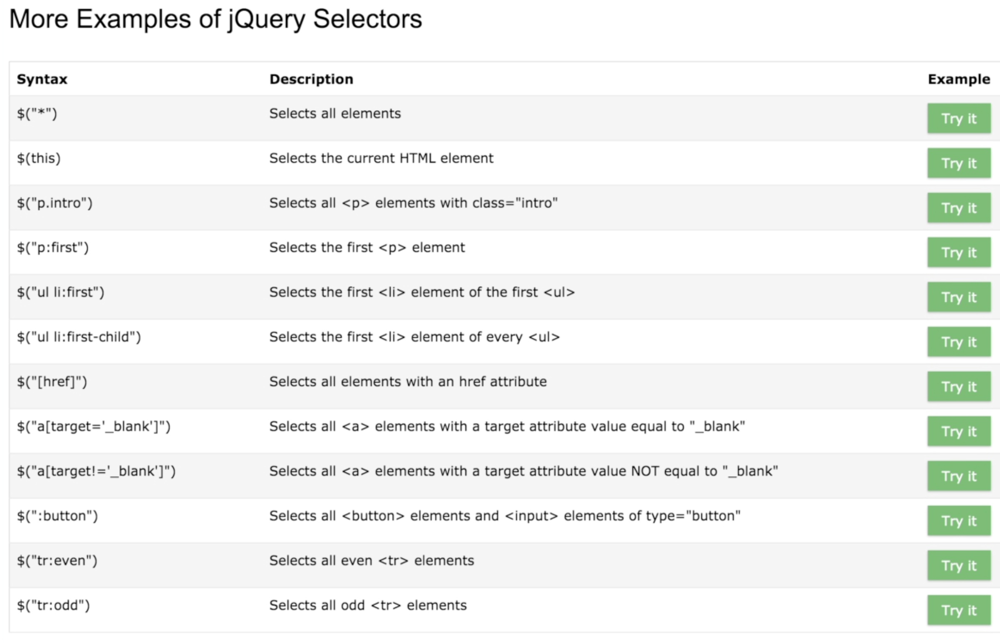
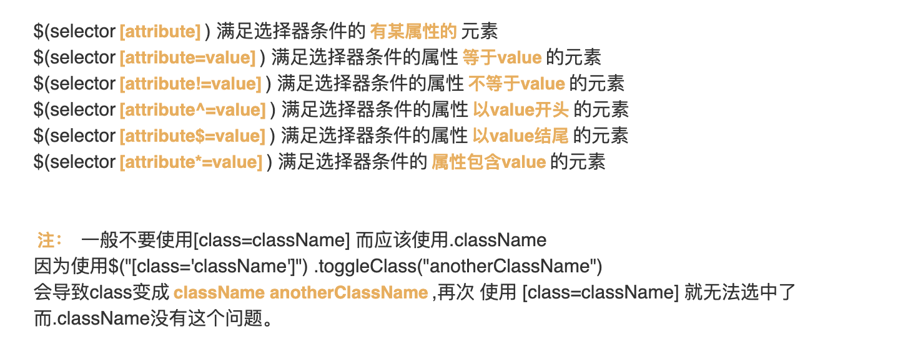
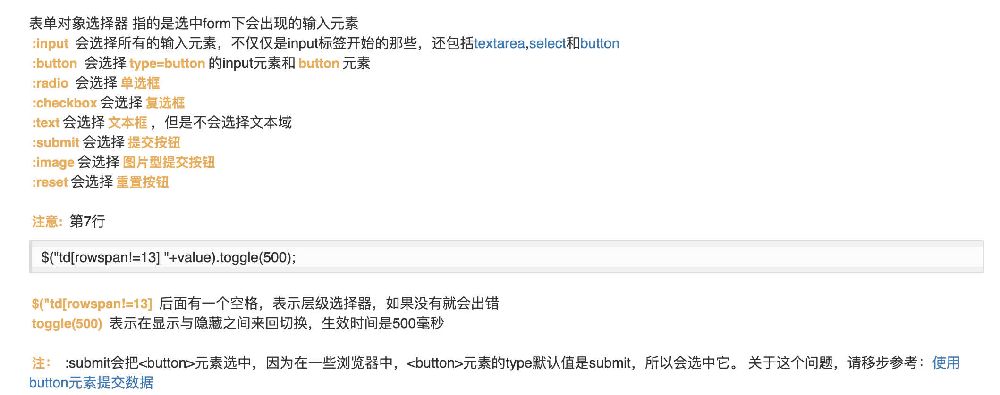
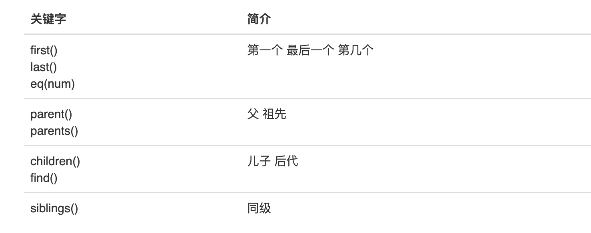
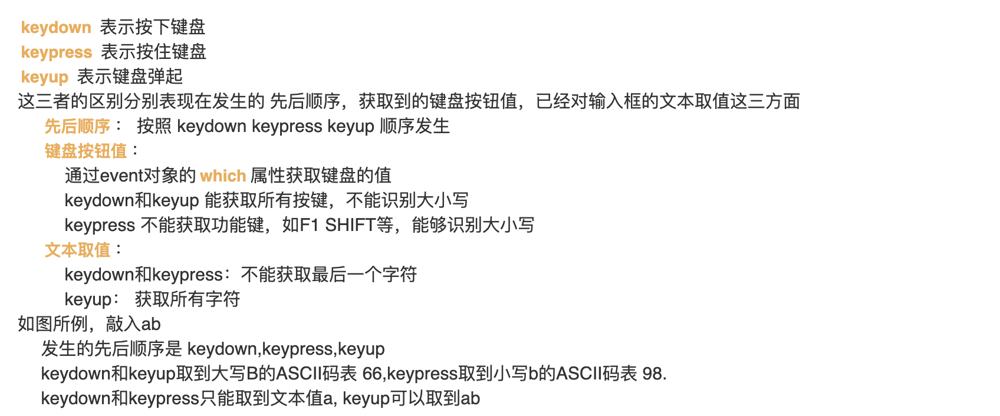
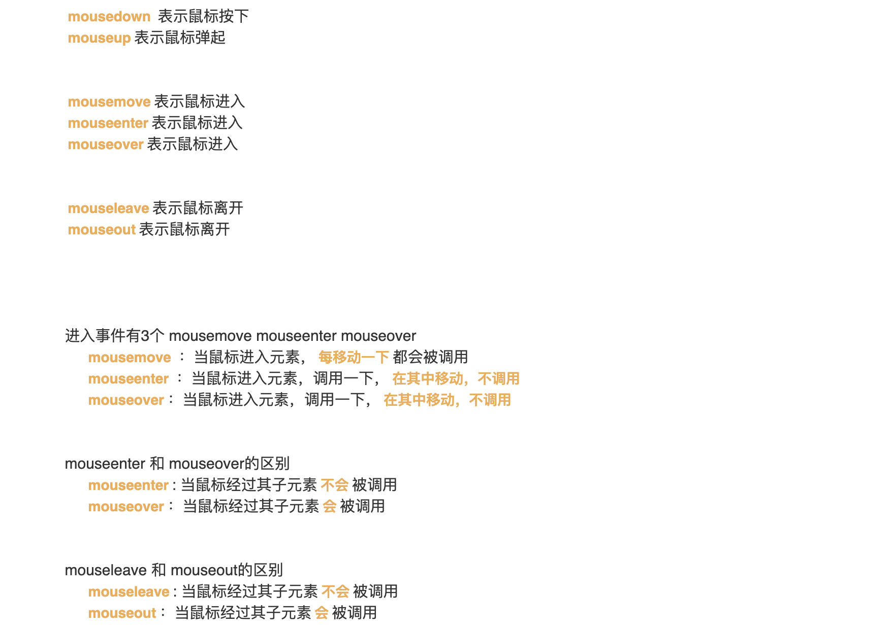
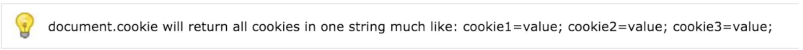

# JQuery

- Rules

  - JQuery是一种JavaScript的框架、封装

  - 通过JQuery可以方便的操作html元素

  - 使用需要导入第三方的包

  - 基本格式：两种都可以，第二种是对第一种进行简化。目的都是防止在文档加载完之前运行jQuery代码。

    ```javascript
  // 方式一
    $(document).ready(function(){
  
      // jQuery methods go here...
    
    });
    // 方式二
    $(function(){
    
      // jQuery methods go here...
    
    });
    ```
  
  - 使用监听器见实现1
  
    ```html
    <!DOCTYPE html>
    <html>
    <head>
    	<title>Hello</title>
    	<script src="jquery.min.js"></script>
    	<script type="text/javascript">
    		$(function(){
    			// 点击隐藏后监听器
    			$('#hid').click(function(){
    				$('#d').hide();
    			});
    			// 点击显示后监听器
    			$('#show').click(function(){
    				$('#d').show();
    			});
    		});
    	</script>
    </head>
    <body>
    	<button id="hid">隐藏div</button>
    	<button id="show">显示div</button>
    	<div id="d">这是一个div</div>
    </body>
    </html>
    ```

## 常用方法

- Methods

  - val()，取值方法
  - html()，获取元素内容，有子元素，则显示标签
  - text()，获取元素内容，不包含子元素标签

- Implementation 

  ```html
  <!DOCTYPE html>
  <html>
  <head>
  <script src="https://ajax.googleapis.com/ajax/libs/jquery/3.4.1/jquery.min.js"></script>
  <script>
  $(document).ready(function(){
    $("#btn1").click(function(){
      alert("Text: " + $("#test").text());
    });
    $("#btn2").click(function(){
      alert("HTML: " + $("#test").html());
    });
  });
  </script>
  </head>
  <body>
  
  <p id="test">This is some <b>bold</b> text in a paragraph.</p>
  
  <button id="btn1">Show Text</button>
  <button id="btn2">Show HTML</button>
  
  </body>
  </html>
  ```

  ```shell
  # Analyse
  1.id="btn1"点击之后，显示"Text: This is some bold text in a paragraph."
  2.id="btn2"点击之后，显示"HTML: This is some <b>bold</b> text in a paragraph."
  ```

## CSS

- Methods
  - addClass()
    - css中新建一个样式
    - 在script中使用addClass方法将新建的样式添加到相应的元素中
  - removeClass()
  - css({property:value,property:value}),css(property,value)
    - 在script中使用css方法对相应的元素编辑样式，能够同时赋值多个样式
  
- Implementation

  ```html
  <!DOCTYPE html>
  <html>
  <head>
  	<script src="jquery.min.js"></script>
  	<title>CSS</title>
  	<script type="text/javascript">
  		// addClass和removeClass方法
  		$(function(){
  			//添加背景
  			$('#add').click(function(){
  				$('#c1').addClass('pink');
  			});
  			// 删除背景
  			$('#remove').click(function(){
  				$('#c1').removeClass("pink");
  			});
  		});
  		$(function(){
  			$('#addMulti').click(function(){
  				$('#c2').css({'background-color':'blue','color':'white'});
  			});
  		});
  	</script>
  	<style type="text/css">
  		.pink{
  			background-color: pink;
  		}	
  	</style>
  </head>
  <body>
  	<h2>通过addClass和removeClass方法添加和移除</h2>
  	<div id="c1">Hello CSS</div>
  	<button id="add">添加背景</button>
  	<button id="remove">移除背景</button>
  	<h2>通过css(property,value)方法添加多种样式</h2>
  	<div id="c2">Hello CSS 2</div>
  	<button id="addMulti">添加多种样式</button>
  </body>
  </html>
  ```

- Package/FrontEnd/JQuery/CSS.html

## 选择器和筛选器

- Methods

  - $("tagName")，标签名称

  - $("#id")，元素id

  - $(".className")，元素类名称

    

  - $("selector1 selector2")，层级

  - $("selector:first")，第一个满足条件的；last，最后一个满足条件的；odd，奇数元素；even，偶数元素；hidden，隐藏的；visible，可见的
  
  - 属性
  
    
  
  - 表单对象、表单对象属性
  
    

  - 当前元素，$(this)
  
  - 筛选器是通过了选择器后的元素，在进一步进行筛选
  
    

- Implementation

  <!--使用选择器实现斑马线表格-->

  ```html
  <!-- 实现斑马线 -->
  <!DOCTYPE html>
  <html>
  <head>
  	<script src="jquery.min.js"></script>
  	<title>Selector_Crosswalk</title>
  	<script type="text/javascript">
  		$(function(){
  			$("table").css('border-collapse','collapse');
  			$("td").css({'width':'200px','text-align':'center','border-bottom':'1px solid lightgrey'});
  			$("tr:odd").css('background-color','#F8F8F8');
  		});
  	</script>
  </head>
  <body>
  	<table>
  		<tr>
  			<td>id</td>
  			<td>名称</td>
  			<td>血量</td>
  			<td>伤害</td>
  		</tr>
  		<tr>
  			<td>1</td>
  			<td>VN</td>
  			<td>242</td>
  			<td>2938</td>
  		</tr>
  		<tr>
  			<td>2</td>
  			<td>EZ</td>
  			<td>2342</td>
  			<td>28</td>
  		</tr>
  		<tr>
  			<td>3</td>
  			<td>NIM</td>
  			<td>2234</td>
  			<td>2030</td>
  		</tr>
  		<tr>
  			<td>4</td>
  			<td>JINX</td>
  			<td>200</td>
  			<td>120</td>
  		</tr>
  	</table>
  </body>
  </html>
  ```

- Package/FrontEnd/JQuery/Selector.html

## 属性

- Methods

  - 获取属性和修改属性：.attr('属性名')；.attr('属性名','值')

    ```javascript
    $("button").click(function(){
      alert($("#w3s").attr("href"));
    });
    ```

  - 删除属性：removeAttr

  - attr和prop区别

    - attr能够获取自定义属性，prop不能
    - attr只能获取初始值，无论是否变化
    - prop能够获取最新值，返回true和false
    - prop适合用于表单

## 效果

- Methods
  - show,hide,toggle	显示 隐藏 切换	
  - slideUp,slideDown,slideToggle	向上滑动 向下滑动 滑动切换	
  - fadeIn,fadeOut,fadeToggle,fadeTo	淡入 淡出 淡入淡出切换 指定淡入程度	
  - animate	自定义动画效果

- Implementation

  ```html
  <!DOCTYPE html>
  <html>
  <head>
  	<title>Motion</title>
  	<script src="jquery.min.js"></script>
  	<script type="text/javascript">
  		$(function(){
  			// 延时切换
  			$('#b1').click(function(){
  				$('#d1').toggle(1000);
  			});
  			// 延时滑动切换
  			$('#b2').click(function(){
  				$('#d2').slideToggle(1000);
  			});
  			// 延时淡入淡出
  			$('#b3').click(function(){
  				$('#d3').fadeToggle(1000);
  			});
  			//淡入淡出比例展示
  			$('#b4').click(function(){
  				$('#d20per').fadeTo('slow',0.2);
  				$('#d50per').fadeTo('slow',0.5);
  				$('#d80per').fadeTo('slow',0.8);
  			});
  			//自定义动画
  			$('#b5').click(function(){
  				$('#d4').animate({left:'100px'},2000);
  				$('#d4').animate({left:'0px',top:'100',width:'1000px'},2000,function(){
  					alert("动画演示结束");
  				});
  			});
  		});
  	</script>
  </head>
  <body>
  	<h2>延时切换</h2>
  	<button id="b1">延时切换</button>
  	<br>
  	<br>
  	<div id="d1" style="width: 300px;height: 200px;background-color: lightblue;">这是一个div</div>
  	
  	<h2>延时滑动切换</h2>
  	<button id="b2">延时滑动切换</button>
  	<br>
  	<br>
  	<div id="d2" style="width: 300px;height: 200px;background-color: lightblue;">这是一个div</div>
  
  	<h2>淡入淡出</h2>
  	<button id="b3">延时淡入淡出</button>
  	<button id="b4">淡出比例展示</button>
  	<br>
  	<br>
  	<div id="d3" style="width: 300px;height: 200px;background-color: lightblue;">这是一个div</div>
  	<br>
  	<div id="d20per" style="width: 100px;height: 100px;background-color: lightblue; display: inline-block;">这是一个20%div</div>	
  	<div id="d50per" style="width: 100px;height: 100px;background-color: lightblue; display: inline-block;">这是一个50%div</div>
  	<div id="d80per" style="width: 100px;height: 100px;background-color: lightblue; display: inline-block;">这是一个80%div</div>
  
  	<h2>自定义动画</h2>
  	<button id="b5">开始变化</button>
  	<br>
  	<br>
  	<div id="d4" style="width: 100px;height: 100px;background-color: lightblue;position: relative;">这是一个会变化的div</div>
  </body>
  </html>
  ```

- Package/FrontEnd/JQuery/Motion.html

## 事件

- Methods
  - 按钮单击双击
  
  - 键盘三态
  
  - 鼠标七态-实现
  
  - 焦点
    - focus()：获得焦点
    
    - blur()：失去焦点
    
      ```html
      <!DOCTYPE html>
      <html>
      <head>
      <script src="https://ajax.googleapis.com/ajax/libs/jquery/3.4.1/jquery.min.js"></script>
      <script>
      $(document).ready(function(){
        $("input").focus(function(){
          $(this).css("background-color", "yellow");
        });
        $("input").blur(function(){
          $(this).css("background-color", "green");
        });
      });
      </script>
      </head>
      <body>
      
      Name: <input type="text" name="fullname"><br>
      Email: <input type="text" name="email">
      
      </body>
      </html>
      ```
    
  - 改变: change()，输入框中内容改变，需要失去焦点
  
  - 提交: form标签中内容提交后，执行事件
  
  - 绑定事件
  
    - 所有事件的处理，都能用on()绑定
  
    - 可以同时将多个事件绑定到一个元素上
  
      ```javascript
      $("p").on({
        mouseenter: function(){
          $(this).css("background-color", "lightgray");
        },
        mouseleave: function(){
          $(this).css("background-color", "lightblue");
        },
        click: function(){
          $(this).css("background-color", "yellow");
        }
      });
      ```
  
  - 触发事件: 不需要点击触发


- Implementation 

  ```html
  <!DOCTYPE html>
  <html>
  <head>
  	<script src="jquery.min.js"></script>
  	<title>Event</title>
  	<script type="text/javascript">
  		$(function(){
  			$('#b1').click(function(){
  				$('#message1').html('单击');
  			});
  			$('#b1').dblclick(function(){
  				$('#message1').html('双击');
  			});
  		});
  
  		// 鼠标事件
  		$(function(){
  			$('#b2').mousedown(function(){
  				$(this).html('鼠标按下');
  			});
  			$('#b2').mouseup(function(){
  				$(this).html('鼠标弹起');
  			});
  			var moveNum = 0;
  			var enterNum = 0;
  			var overNum = 0;
  			var leaveNum = 0;
  			var outNum = 0;
  
  			var enterNum1 = 0;
  			var overNum1 = 0;
  
  			var leaveNum1 = 0;
  			var outNum1 = 0;
  			$('#move').mousemove(function(){
  				$('#move span.number').html(++moveNum);
  			});
  			$('#enter').mouseenter(function(){
  				$('#enter span.number').html(++enterNum);
  			});
  			$('#over').mouseover(function(){
  				$('#over span.number').html(++overNum);
  			})
  			$('#leave').mouseleave(function(){
  				$('#leave span.number').html(++leaveNum);
  			})
  			$('#out').mouseout(function(){
  				$('#out span.number').html(++outNum);
  			})
  
  	
  		$('#enter1').mouseenter(function(){
  				$('#enter1 span.number').html(++enterNum1);
  			});
  		$('#over1').mouseover(function(){
  				$('#over1 span.number').html(++overNum1);
  			});
  
  		$('#leave1').mouseleave(function(){
  				$('#leave1 span.number').html(++leaveNum1);
  			});
  		$('#out1').mouseout(function(){
  				$('#out1 span.number').html(++outNum1);
  			});
  		})
  
  		// 焦点事件
  		// $(function(){
  		// 	$('input').focus(function(){
  		// 		$(this).val('获取了焦点');
  		// 	});
  		// 	$('input').blur(function(){
  		// 		$(this).val('失去了焦点');
  		// 	});
  		// });
  
  		//改变事件
  		$(function(){
  			$('#change').change(function(){
  				var changeContent = $(this).val();
  				$('#nothing').html(changeContent);
  			});
  		});
  
  		//提交
  		$(function(){
  			$('#form').submit(function(){
  				alert('提交账号密码');
  			});
  		});
  
  		//绑定事件
  		$(function(){
  			$('#b3').on('click',function(){
  				$('#message').html('单击按钮');
  			});
  			$('#b3').on('dblclick',function(){
  				$('#message').html('双击按钮');
  			});
  		});
  	</script>
  	
  	<!-- 鼠标事件样式 -->
  	<style type="text/css">
  		div{
  			background-color: pink;
  			margin: 20px;
  			padding: 5px;
  		}
  		.mouseParent{
  			height: 60px;
  		}
  		.mouseSub{
  			background-color: green;
  			margin: 5px;
  		}
  		table{
  			width: 100%;
  			border: 1px solid lightgrey;
  			border-collapse: collapse;
  		}
  		td{
  			border: 1px solid lightgrey;
  			padding: 5px;
  		}
  	</style>
  </head>
  <body>
  	<h2>点击事件</h2>
  	<h3>单击和双击</h3>
  	<div id="message1">单击或双击</div>
  	<button id="b1">Click</button>
  
  	<!-- 鼠标事件 -->
  	<h2>鼠标事件</h2>
  	<table>
  		<tr>
  			<td>事件</td>
  			<td>效果演示</td>
  		</tr>
  		<tr>
  			<td>
  				<p>mousedown</p>
  				<p>mouseup</p>
  			</td>
  			<td>
  				<button id="b2">鼠标按下弹起测试</button>
  			</td>
  		</tr>
  		<tr>
  			<td>
  				<p>mousemove</p>
  				<p>mouseenter</p>
  				<p>mouseover</p>
  				<p>mouseleave</p>
  				<p>mouseout</p>
  			</td>
  			<td>
  				<div id="move">mousemove 当鼠标进入元素，每移动一下都会被调用 次数<span class="number">0</span></div>
  				<div id="enter">mouseenter 当鼠标进入元素，调用一下，在其中移动不调用 次数<span class="number">0</span></div>
  				<div id="over">mousemover 当鼠标进入元素，调用一下，在其中移动调用 次数<span class="number">0</span></div>
  				<div id="leave">mouseleave 当鼠标离开，调用一下 次数<span class="number">0</span></div>
  				<div id="out">mouseout 当鼠标离开，调用一下 次数<span class="number">0</span></div>
  			</td>
  		</tr>
  		<tr>
  			<td>
  				<p>mouseenter</p>
  				<p>mouseover</p>
  			</td>
  			<td>
  				<div id= "enter1" class="mouseParent">mouseenter 经过其子元素不会被调用 次数<span class="number">0</span>
  					<div class="mouseSub">子元素</div>
  				</div>
  				<div id="over1" class="mouseParent">mousemover 经过其子元素会被调用 次数<span class="number">0</span>
  					<div class="mouseSub">子元素</div>
  				</div>
  			</td>
  		</tr>
  		<tr>
  			<td>
  				<p>mouseleave</p>
  				<p>mouseout</p>
  			</td>
  			<td>
  				<div id="leave1" class="mouseParent">mouseleave 经过其子元素不会被调用 次数<span class="number">0</span>
  					<div class="mouseSub">子元素</div>
  				</div>
  				<div id="out1" class="mouseParent">mouseout 经过其子元素会被调用 次数<span class="number">0</span>
  					<div class="mouseSub">子元素</div>
  				</div>
  			</td>
  		</tr>
  	</table>
  
  	<!-- 焦点 -->
  	<h2>焦点事件</h2>
  	<input type="text" name="nothing">
  	<input type="text" name="nothing">
  
  	<!-- 改变 -->
  	<h2>改变事件</h2>
  	<input type="text" name="nothing" id="change">
  	<div id="nothing"></div>
  
  	<!-- 表单提交 -->
  	<h2>表单提交</h2>
  	<form id="form" action="http://how2j.cn/study/login.jsp">
  	<input type="text" name="name">
  	<input type="password" name="password">
  	<input type="submit" value="提交">
  	</form>
  
  	<!-- 绑定事件 -->
  	<h2>绑定事件</h2>
  	<button id="b3">单击或双击</button>
  	<span id="message"></span>
  </body>
  </html>
  ```

- Package/FrontEnd/JQuery/Event.html

## AJAX

- Methods
  - 使用AJAX请求: $.ajax({ url:page, { 'name' : value } , success:function(result){ }  })
  - 使用GET请求: $.get( page , { 'name' : value } , function(result){} )

- 使用POST请求: $.post( page , { 'name' : value } , function(result){} )
  
- 使用load请求: serialize() ，格式化form下的输入数据，能够将整个form中的数据连成字符串
  

- Implementation 

  ```html
  <!DOCTYPE html>
  <html>
  <head>
  	<script src="jquery.min.js"></script>
  	<title>AJAX</title>
  	<script type="text/javascript">
  		// 提交AJAX请求
  		$(function(){
  			$('#name1').keyup(function(){
  				var page = 'http://how2j.cn/study/checkName.jsp';
  				var value = $(this).val();
  				$.ajax({
  					url:page,
  					data:{"name":value},
  					success:function(result){
  						$('#checkResult').html(result);
  					}
  				});
  			});
  		});
  
  		// 使用get提交请求
  		$(function(){
  			$('#nameGet').keyup(function(){
  				var page = 'http://how2j.cn/study/checkName.jsp';
  				var value = $(this).val();
  				$.get(
  					page,
  					{'name':value},
  					function(result){
  						$('#checkResultGet').html(result)
  					}
  				);
  			});
  		});
  
  		// 使用post提交请求
  		$(function(){
  			$('#namePost').keyup(function(){
  				var page = 'http://how2j.cn/study/checkName.jsp';
  				var value = $(this).val();
  				$.post(
  					page,
  					{'name':value},
  					function(result){
  						$('#checkResultPost').html(result);
  					}
  				)
  			})
  		});
  	</script>
  </head>
  <body>
  	<!-- 提交AJAX请求 -->
  	<h2>提交AJAX请求</h2>
  	<input type="text" id="name1">
  	<div id="checkResult"></div>
  
  	<!-- 使用get提交请求 -->
  	<h2>使用get提交请求</h2>
  	<input type="text" id="nameGet">
  	<div id="checkResultGet"></div>
  
  	<!-- 使用post提交请求 -->
  	<h2>使用post提交请求</h2>
  	<input type="text" id="namePost">
  	<div id="checkResultPost"></div>
  </body>
  </html>
  ```

- Package/FrontEnd/JQuery/AJAX.html

- Rules

  - post和get区别
    - get是表单的默认方法
    - get提交数据会在浏览器中显示，post不会
    - get无法提交二进制数据，post可以

## 数组

- Methods

  - 遍历数组: $.each
  - 去除重复: $.unique
  - 判断数据是否在数组中: $.inArray

- Implementation 

  ```html
  <!DOCTYPE html>
  <html>
  <head>
  	<script src="jquery.min.js"></script>
  	<title>Array</title>
  	<script type="text/javascript">
  		// 遍历数组
  		document.write('<h2>遍历数组</h2>');
  		var a = new Array(1,2,3);
  		$.each(a , function(i,n){
  			document.write('元素['+i+']:'+n+'<br>');
  		});
  		document.close();
  		
  		// 去除重复
  		document.write('<h2>去除重复</h2>');
  		var b = new Array(1,2,9,9,6,4,5,5);
  		document.write('<h4>去重前</h4>');
  		$.each(b , function(i,n){
  			document.write('元素['+i+']:'+n+'<br>');
  		});
  		document.write('<h4>去重前</h4>');
  		b.sort();
  		$.unique(b);
  		$.each(b , function(i,n){
  			document.write('元素['+i+']:'+n+'<br>');
  		});
  
  		// 判断是否存在
  		document.write('<h2>判断是否存在</h2>');
  		var c = new Array(1,2,9,9,6,4,5,5);
  		document.write('数字3所在位置为：',$.inArray(3,c)+'<br>');
  		document.write('数字9所在位置为：'+$.inArray(9,c));
  
  	</script>
  </head>
  <body>
  
  </body>
  </html>
  ```

- Package/FrontEnd/JQuery/Array.html

## 字符串

- Methods

  - 去除前后空白，$.trim()

- Implementation 

  ```html
  <script src="https://how2j.cn/study/jquery.min.js"> </script>
  <script>
  
    document.write($.trim(" Hello JQuery   "));
    document.close();
     
  </script>
  ```

## JSON

- Methods

  - 将字符串转换为JSON对象，$.parseJSON()

    http://how2j.cn/k/jquery/jquery-json/534.html](http://how2j.cn/k/jquery/jquery-json/534.html)

## 对象转换

- Methods

  - 通过get(0)或者[0]把JQuery对象转为DOM对象

  - 通过$() 把DOM对象转为JQuery对象

    [http://how2j.cn/k/jquery/jquery-jquery-dom/529.html#nowhere](http://how2j.cn/k/jquery/jquery-jquery-dom/529.html#nowhere)

## Cookies

- Definition: Data which stored in small text file on my computer. When a brower request a web page from a server, the cookies will be add to the request.

- Methods

  - 创建

    ```javascript
    document.cookie = "Username=John Toy";
    ```

  - 添加过期日期

    ```javascript
    document.cookie = "Username=John Toy; expires=Tus 18 Dec 2013 12:00:00 UTC";
    ```

  - 编辑cookie的路径，如果缺省则默认当前页面

    ```javascript
    document.cookie = "Username=John Toy; expires=Tus 18 Dec 2013 12:00:00 UTC; path=/";
    ```

  - 读取当前页面的cookie

    ```javascript
    var c = document.cookie;
    ```

    

  - 重新添加会覆盖原来的cookie

  - 删除就是将"expires"属性设置成过去的时间