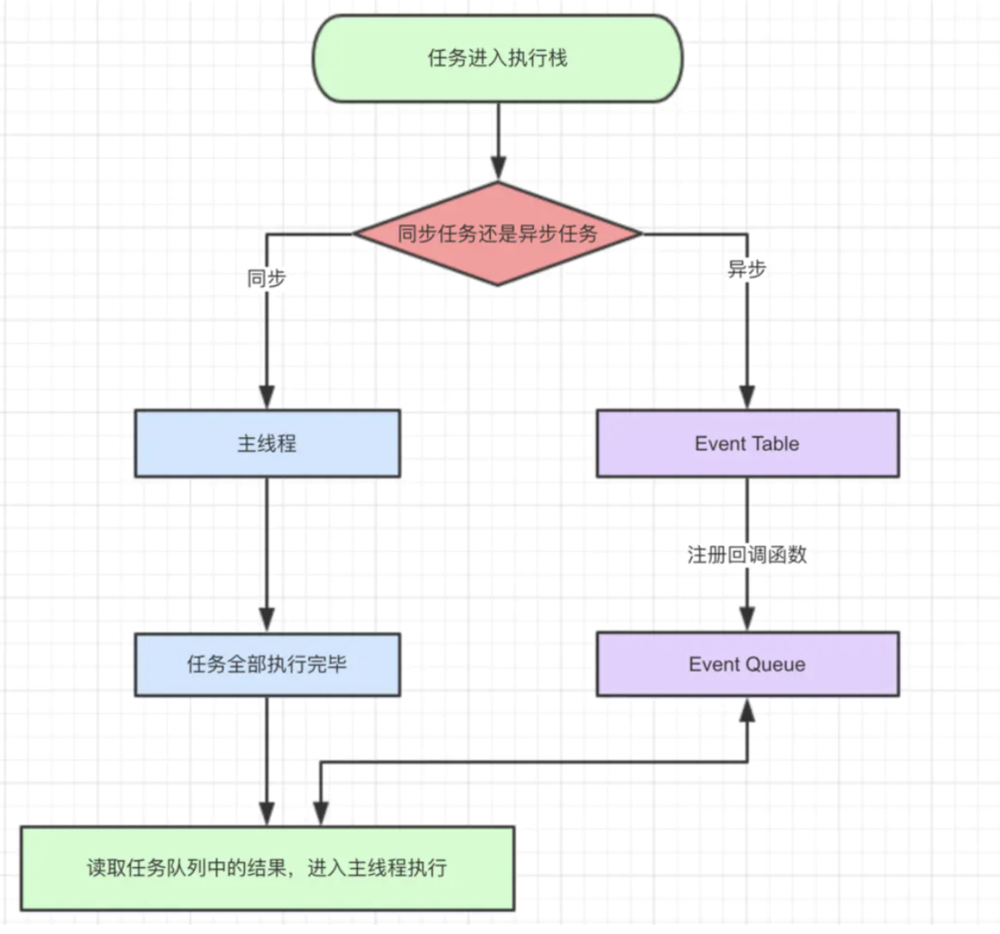
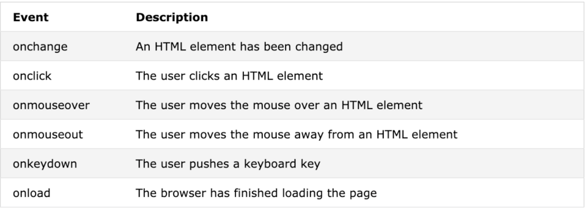
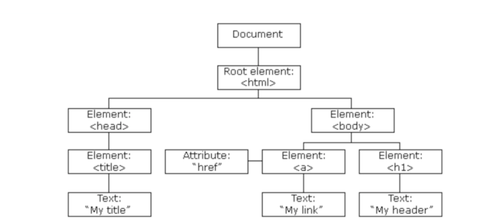
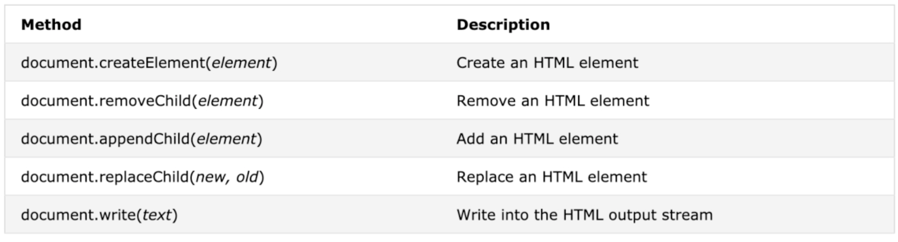

# JavaScript

- Rules
  - 区分大小写
  
  - 声明之后需要有分号（semicolon）隔开
  
  - 单线程
  
  - 执行过程中如果存在错误，后续代码不会执行
  
    ```html
    <!DOCTYPE html>
    <html>
    <body>
      <h1>My Callback example</h1>
      <script>
        function myFunction() { 
          ix=ix*2;
        	setTimeout(myFuction2, 3000);
       		alert(ix); 
        }
        function myFunction2() { 
          ix=ix=1234;
        }
        var ix=1; 
        setTimeout(myFunction, 3000);
      </script>
      </body> 
    </html>
    ```
  
    ```shell
    # Analyse
    1.因为"setTimeout(myFuction2, 3000);"中的函数名称错误，所以不会执行，后面的"alert(ix);"也不会执行。
    ```
  
    
  
- Implementation——Important

  <!--单线程，实现模拟多线程-->

  ```html
  <!DOCTYPE html>
  <html>
  	<head>
  		<meta charset="utf-8">
  		<title></title>
  	</head>
  	<body>
  		<!-- case 1 -->
  		<script>
  			setTimeout(()=> {console.log("1")},3000)
  			console.log("2")
  		</script>
  		<!-- case 2 -->
  		<script>
  			setTimeout(alertTest1,10000)
  			setTimeout(alertTest2,1000)
  			
  			function alertTest1(){
  				alert("10")
  			}
  			
  			function alertTest2(){
  				alert("1")
  			}
  		</script>
  	</body>
  </html>
  
  ```

  ```
  # Output
  2
  1
  
  1
  # after 9 seconds
  10
  ```

  - Principle

    

    - case 1解析

      ```shell
      1. 运行"setTimeout(()=> {console.log("1")},3000)"，"console.log("1")"进入Event Table并注册，计时开始。
      2. 运行"console.log("2")"，输出2
      3. 计时3秒后，函数加入Event Queue
      4. 主线程执行完毕，开始执行Event Queue中的任务
      ```

    - case 2解析

      ```shell
      1.运行"setTimeout(alertTest1,10000)"，"alertTest1"进入Event Table并注册，计时开始。
      2.运行"setTimeout(alertTest2,1000)"，"alertTest2"进入Event Table并注册，计时开始。
      3.主线程一直为空，因此一直等待Event Queue中是否有任务。
      4.1秒后，"alertTest2"进入Event Queue，主线程获取到并执行。
      4.10秒后，"alertTest1"进入Event Queue，主线程获取到并执行。
      ```

## 基础方法

1. 调试方法
   - alert()，运行到的以上代码没问题
   - 运行后，通过浏览器控制台查看错误
   - 通过console.log()日志输出

2. 变量类型
   - Undefined,Boolean,Number,String
   - Var,动态类型，会根据赋值自行选择类型
   - Typeof,变量类型判断

| Type      | String returned by typeof |
| --------- | ------------------------- |
| Number    | "number"                  |
| String    | "string"                  |
| Boolean   | "boolean"                 |
| Object    | "object"                  |
| Function  | "function"                |
| Undefined | "undefined"               |
| Null      | "object"                  |

3. 函数

   - 格式为function为关键字，print为函数名称，()内为参数列表，{}内部为方法

   - Implementation

     ```
     // 输出函数
     function print(message){
     	document.write(message);
     }
     // 计算函数
     function calc(x,y){
     	return x+y;
     }
     print(calc(10,20));
     ```

4. 作用域
   - 参数作用域仅仅在函数内部
   - 全局变量定义在函数前面，所有函数都可以访问

5. 逻辑运算符
  
- 绝对等于和绝对不等于，===和!===会进行值和类型的判断
  
6. Array

   - Rules

     - 支持存储不同类型的数据
- 支持arrya中放array
     - 索引的起始值为零
- 添加
  
  - 末尾：数组名.push()
       - 头部：数组名.unshift()
  - 两个方法的返回值都是数组中元素数量
     - 删除
       - 末尾：数组名.pop()
       - 头部：数组名.shift()
       - 任意位置添加或删除：数组名.splice(2,0,"a","b")：2是代表索引；0代表移除元素数量；a和b代表添加的元素


### 常用方法

- 操作页面内element：innerHTML

  <!--Writing into an HTML element, using innerHTML-->

- 操作页面内output：document.write()

- 页面内警告框：window.alert()

  - 能够在页面加载时，显示提示，并附带ok键

    ```html
    <body onload = "alert('Hello')";>
    </body>
    ```

- 页面内输入框：prompt()

- 打开指定页面：open()

  ```html
  <button onclick = "window.open('www.google.com')"> Go to Google</button>
  ```

- 浏览器的控制台：console.log()

### 事件（Events）

- Types
  - onclick
  - onmouseover
  - onsubmit: makes something happen when the user submits a form
  
    

## DOM

- Definition: Document Object Model. Because HTML is a hierarchical document.

  <!--All the tags are children of HTML-->

  

- Methods

  - 访问页面元素常用元素的id字段

  - innerHTML用来获取或者是替代元素内容

    ```html
    < p id="demo"></p>
    < script>
    	document.getElementById("demo").innerHTML = "Hello World!"; 
    </script>
    ```

  - 访问页面元素的其他方法

    - 使用tagName：document.getElementsByTagName(*name*)

      - 如果有多个相同的tagName，得到的是数组

        ```html
        <body>
        	<ul id="mylist">
            <li>one</li>
            <li>two</li>
        		<li>three</li>
         </ul>
          <script>
            var listItems = document. getElementsByTagName( 'li');
            for ( var i = 0 ; i < listItems.length; i++) { alert( listItems[ i].innerHTML);
            } ;
          </script>
        </body>
        ```

        

    - 使用class name：document.getElementsByClassName(*name*)

  - 点击元素后调用方法

    ```javascript
    document.getElementById(id).onclick = function(){code}
    ```

  - 设置元素的属性

    ```javascript
    document.getElementById("link1").setAttribute("href","http://www.sheffield.ac.uk");
    ```

  - 设置元素的样式

    ```javascript
    document.getElementById("p2").style.color = "blue";
    ```

  - 可以将点击事件和设置结合

    ```html
    < button type="button" onclick="document.body.style.backgroundColor = 'red'" >Click Me!</button>
    ```

  - 添加和删除页面元素

    
    
  - 判断点击元素
  
    ```javascript
    function closeMenu(event){
    	if(event.target == cover){
    		document.getElementById("cover").style.display = "none";
    	}
    	if(event.target == closeWindow){
    		document.getElementById("cover").style.display = "none";
    	}
    }
    ```
  
    ```python
    # Analyse
    如果一个按钮的"onclick"事件是"closeMenu(event)"，通过"event.target"来判断触发这个方法的元素的id是否为相应的值
    ```
  
  - 页面加载完成后运行方法
  
    ```html
    <!-- 一般加在body的属性中 -->
    <body onload="askDetails()"></body>
    ```

### HTML5和Javascript

- 区别

  - H5开头需要声明"<!DOCTYPE html>"
  - H5是新的标准，添加了比如智能表单等功能。

- Implementation

  <!--H5和JavaScript分别实现一个日期限制的功能-->

  ```html
  <!-- 仅仅使用HTML5实现限制日期 -->
  <input type="date" id="birthH5" min="1900-01-01" max="2011-12-31" />
  ```

  ```javascript
  // 使用JavaScript
  function validateName(){
  	var bitrh = document.getElementById("birth").value;
  	// birthday
  	var minYear = "1900";
  	var maxYear = "2011";
  	if (bitrh < minYear || bitrh > maxYear){
  		document.getElementById("yearError").innerHTML = "Please enter validate year";
  		document.getElementById("yearError").style.display = "inline";
  		return false;
  	}else{
  		document.getElementById("yearError").style.display = "none";
  	}
  	return true;
  }
  ```

### InterestCalculate——Practice

- 预期

  利息计算器

- 实现

  1.使用index写前端页面

  ```html
  <!DOCTYPE html>
  <html>
  <head>
  	<title>利息计算器</title>
  	<link rel="stylesheet" type="text/css" href="file:///Users/toyz/Package/FrontEnd/JavaScript/PracticeInterestCalculate/style.css"/>
  	<script type="text/javascript" src="calc.js"></script>
  </head>
  <body>
  	<div>
  		<table>
  			<!-- 输入模块 -->
  			<tr>
  				<td class="item">起始资金</td>
  				<td class="date">
  					<input type="text" class="input" id="beginMoney"> ¥
  				</td>
  			</tr>
  				<tr>
  				<td class="item">每年收益</td>
  				<td class="date">
  					<input type="text" class="input" id="interest"> %
  				</td>
  			</tr>
  			</tr>
  				<tr>
  				<td class="item">复利年数</td>
  				<td class="date">
  					<input type="text" class="input" id="years"> 年
  				</td>
  			</tr>
  			</tr>
  				<tr>
  				<td class="item">每年追加资金</td>
  				<td class="date">
  					<input type="text" class="input" id="addMoney"> ¥
  				</td>
  			</tr>
  
  			<!-- 提交模块 -->
  			<tr>
  				<td colspan="2" class="item">
  					<input type="button" value="计算" onclick="get()" style="width: 50%;margin: 5px;">
  				</td>
  			</tr>
  
  			<!-- 结果模块 -->
  			</tr>
  				<tr>
  				<td class="item">本金和</td>
  				<td class="date">
  					<input type="text" class="input" id="benjin"> ¥
  				</td>
  			</tr>
  			</tr>
  				<tr>
  				<td class="item">利息和</td>
  				<td class="date">
  					<input type="text" class="input" id="lixi"> ¥
  				</td>
  			</tr>
  			</tr>
  				<tr>
  				<td class="item">本息和</td>
  				<td class="date">
  					<input type="text" class="input" id="benxi"> ¥
  				</td>
  			</tr>
  		</table>
  	</div>
  
  </body>
  </html>
  ```

  2.使用css写前端样式

  ```css
  table{
  	border: 1px solid #DFDEDF;
  	width: 25%;
  	border-collapse: collapse;
  	font-size: 13px;
  }
  td{
  	border: 1px solid #DFDEDF;
  }
  .item{
  	text-align: center;
  	width: 160px;
  }
  .date{
  	padding: 5px 10px;
  	width: 400px;
  }
  .input{
  	width: 80%;
  	border-radius: 1px;
  }
  ```

  3.使用js写点击事件

  ```javascript
  function get(){
  	// 获取输入框中的值
  	var beginMoney = parseInt(document.getElementById('beginMoney').value);
  	var interest = parseFloat(document.getElementById('interest').value);
  	var years = parseInt(document.getElementById('years').value);
  	var addMoney = parseInt(document.getElementById('addMoney').value);
  	//新建需要赋值的变量
  	var benjin = beginMoney ;
  	var fuli = (interest/100);
  	//计算本金和
  	for (var i = 1; i < parseInt(years); i++) {
  		benjin = parseInt(benjin) + parseInt(addMoney) ;
  	}
  	// 计算本息和
  	var benxi = beginMoney*Math.pow((1+fuli),years);
  	for (var i = years - 1; i >= 1; i--) {
  		benxi += addMoney*Math.pow((1+fuli),i);
  	}
  	var lixi = benxi - benjin;
  	//赋值
  	document.getElementById('benjin').value = benjin;
  	document.getElementById('lixi').value = lixi;
  	document.getElementById('benxi').value = benxi;
  }
  ```

- 索引

  Package/FrontEnd/JavaScript/PracticeInterestCalculate

## 对象

略

## BOM（浏览器对象模型）

1.Windows

- 获取文档显示区域的宽度和高度，window.innerWidth
- 获取外部窗体的宽度和高度，window.outerWidth
- 打开一个新窗口，window.open("/")
- 见实现1

2.Navigator

- 浏览器等信息
- 见实现2

3.Screen

- 分辨率等
- 见实现3

4.History

- 返回上一页面
- 返回上上一页面
- 见实现4

5.Location

- 刷新页面
- 返回首页
- 见实现5

6.Pop

- 警告框
- 确认框
- 输入框
- 见实现6

7.计时器

- 函数setInterval(函数名, 重复执行的时间间隔毫秒数 )，重复执行
- 可以设计页面计时器
- 见实现7

**实现**

1.window方法

```html
<!DOCTYPE html>
<html>
<head>
	<title>Windows方法</title>
	<script type="text/javascript">
		// 文档内部高度和宽度
		document.write("-----文档内部高度和宽度-----");
		document.write("<br>");
		document.write("文档内部高度："+window.innerHeight);
		document.write("<br>");
		document.write("文档内部宽度："+window.innerWidth);
		document.write("<br>");	
		
		// 浏览器外部高度和宽度
		document.write("-----浏览器高度和宽度-----");
		document.write("<br>");
		document.write("浏览器高度："+window.outerHeight);
		document.write("<br>");
		document.write("浏览器宽度："+window.outerWidth);
		document.write("<br>");

		// 新建窗口
		document.write("-----新建窗口-----");
		document.write("<br>");
		function newWindow(){
			myWindow = window.open("/");
		}
	</script>
</head>
<body>
	<!-- 新建窗口按钮 -->
	<button onclick="newWindow()" style="width: 100px;height: 40px;font-size: 16px;background-color: black;color: white;border-radius: 5px;" >新建窗口</button>
</body>
</html>
```

2.Navigator

```html
<!DOCTYPE html>
<html>
<head>
	<title>Navigator方法</title>
	<script type="text/javascript">
		document.write("<p>浏览器产品名称：");
		document.write(navigator.appName + "</p>");
		 
		document.write("<p>浏览器版本号：");
		document.write(navigator.appVersion + "</p>");
		 
		document.write("<p>浏览器内部代码：");
		document.write(navigator.appCodeName + "</p>");
		 
		document.write("<p>操作系统：");
		document.write(navigator.platform + "</p>");
		 
		document.write("<p>是否启用Cookies：");
		document.write(navigator.cookieEnabled + "</p>");
		 
		document.write("<p>浏览器的用户代理报头：");
		document.write(navigator.userAgent + "</p>");
</script>
</head>
<body>

</body>
</html>
```

3.Screen

```html
<html>
<body>
	<script type="text/javascript">
		document.write("用户的屏幕分辨率: ")
		document.write(screen.width + "*" + screen.height)
		document.write("<br />")
		document.write("可用区域大小: ")
		document.write(screen.availWidth + "*" + screen.availHeight)
		document.write("<br />")
	</script>
</body>
</html>
```

4.History

```html
<!DOCTYPE html>
<html>
<head>
	<title>History</title>
	<script type="text/javascript">
		function goBack(){
			history.back();
		}
		function goBackTwice(){
			history.go(-2);
		}
	</script>
</head>
<body>
	<button onclick="goBack()">返回</button>
	<button onclick="goBackTwice()">返回两次</button>
</body>
</html>
```

5.Location

```html
<!DOCTYPE html>
<html>
<head>
	<title>Location</title>
	<script type="text/javascript">
		//基本信息
		document.write("<h2>-----基本信息-----</h2>");
	    function p(s){
		document.write(s);
		document.write("<br>");
		} 
		p("协议 location.protocol:"+location.protocol);
		p("主机名 location.hostname:"+location.hostname);
		p("端口号 (默认是80，没有即表示80端口)location.port:"+location.port);
		 
		p("主机加端口号 location.host: "+location.host);
		p("访问的路径  location.pathname: "+location.pathname);
		 
		p("锚点 location.hash: "+location.hash);
		p("参数列表 location.search: "+location.search);

		// 刷新页面
		document.write("<h2>-----刷新页面-----</h2>");
		var d = new Date();
		document.write(d.getHours());
	    document.write(":");
	    document.write(d.getMinutes());
	    document.write(":");
	    document.write(d.getSeconds());
	    document.write(":");
	    document.write(d.getMilliseconds());
	    document.write("<br>");
	    function refresh(){
	    	location.reload();
	    }

	    //跳转到首页
	    function jump(){
	    	location = '/';
	    }
	</script>
</head>
<body>
	<!-- 刷新页面 -->
	<button onclick="refresh()">刷新页面</button>
	<br>
	<!-- 跳转到首页 -->
	<h2>-----跳转首页-----</h2>
	<button onclick="jump()">跳转首页</button>
</body>
</html>
```

6.Pop

```html
<!DOCTYPE html>
<html>
<head>
	<title>Pop</title>
	<script type="text/javascript">
		//警告框
		function register(){
			alert("注册成功");
		}

		//确认框
		function dele(){
			var d = confirm("是否要删除");
			// alert(typeof d + "" + d)
		}
		function input(){
			var d = prompt("请输入用户名");
			alert("您输入的用户名为"+d)
		}
	</script>
</head>
<body>
	<h2>-----警告框-----</h2>
	<button onclick="register()">注册</button>

	<h2>-----确认框-----</h2>
	<button onclick="dele()">删除</button>

	<h2>-----输入框-----</h2>
	<button onclick="input()">输入</button>
</body>
</html>
```

7.计时器

```html
<!DOCTYPE html>
<html>
<head>
	<title>Timing</title>
	<script type="text/javascript">
		function printTime(){
			var d = new Date();
			var h = d.getHours();
			var m = d.getMinutes();
			var s = d.getSeconds();
			document.getElementById('time').innerHTML = h+":"+m+":"+s
		}
		var t = setInterval(printTime,1000);
	</script>
</head>
<body>
	<div id="time"></div>
</body>
</html>
```

## Callback——Important

- Definition: A function that is called only when the action is performed and finished.

- Application: Asynchronous action

- Implementation

  ```html
  <!DOCTYPE html>
  <html>
  	<head>
  		<meta charset="utf-8">
  		<title></title>
  	</head>
  	<body>
  		<h1>Callback</h1>
  		<script>
  			myVariable = 0;
  			alert(myVariable);
  			function myFunction(){
  				alert(myVariable);
  			}
  		</script>
  		<button id="myFunction" onclick="myFunction(myVariable = 100)">Press me</button>
  	</body>
  </html>
  ```

  ```
  # Analyse
  1. The callback function is called only when the button is pressed.
  2. The page will alert 0 then alert 100.
  ```

## Timing events

- Methods
  - setTimeout (function, milliseconds): Executes a function, after waiting a specified number of milliseconds.
  - setInterval (function, milliseconds): Same as setTimeout(), but repeats the execution of the function continuously.

### setTimeout()

- Implementation 

  <!--Use setTimeout to execute function and stop it-->

  ```html
  <!DOCTYPE html>
  <html>
  	<head>
  		<meta charset="utf-8">
  		<title>setTimeout</title>
  	</head>
  	<body>
  		<h1>Press a button, wait 3 seconds, and page will alert hello</h1>
  		<script>
  			function sayHello(){
  				alert("hello");
  			}
  		</script>
  		<button id="setTime" onclick="say = setTimeout(sayHello,3000)">Hello</button>
  		<button id="stopTime" onclick="clearTimeout(say)">Stop it</button>
  	</body>
  </html>
  ```

### setInterval ()

- Implementation

  <!--Update time every second and stop it-->

  ```html
  <!DOCTYPE html>
  <html>
  	<head>
  		<meta charset="utf-8">
  		<title>setTimeout</title>
  	</head>
  	<body>
  		<h1>Update time</h1>
  		<button id="stopTimer" onclick="clearInterval(myVar)">Stop Timer</button>
  		<label id="demo"></label>
  		<script>
  			var myVar = setInterval(myTimer, 1000);
  			function myTimer(){
  				var d = new Date();
  				document.getElementById("demo").innerHTML = d.toLocaleTimeString();
  			}
  		</script>
  	</body>
  </html>
  ```

## 对象

- Implementation

  <!--创建对象-->

  ```javascript
  var person = {
    firstName:"John",
    lastName:"Doe",
    age:50,
    eyeColor:"blue"
  };
  ```

  <!--创建对象的方法-->

  ```html
  <!DOCTYPE html>
  <html>
  	<head>
  		<meta charset="utf-8">
  		<title></title>
  	</head>
  	<body>
  		<script>
  			var Person = {
  				name: "Toyz",
  				getName : function()
  				{
  					return this.name;
  				}
  			};
  			name = Person.getName();
  			alert(name);
  		</script>
  	</body>
  </html>
  ```

  ```shell
  # Analyse
  1.注意，在方法中使用属性，需要使用"this"关键词。
  ```

## This

- Rules

  - 在方法中，this 表示该方法所属的对象。

    ```javascript
    var Person = {
    				name: "Toyz",
    				getName : function()
    				{
    					return this.name;
    				}
    			};
    ```

  - 如果单独使用，this 表示全局对象。

  - 在函数中，this 表示全局对象。

    ```javascript
    function myFunction() {
      return this
    }
    ```

    ```shell
    # Analyse
    1.返回值是"[object Window]"
    2.window 对象是浏览器 DOM 中所有对象的父对象，父对象也是对象，因此 window 对象的祖宗也是 Object。
    ```

  - 在函数中，在严格模式下，this 是未定义的(undefined)。

    ```javascript
    "use strict";
    var x = this;
    ```

  - 在事件中，this 表示接收事件的元素。

    ```html
    <!DOCTYPE html>
    <html>
      <head>
      	<meta charset="utf-8">
      </head>
      <body>
        <button onclick="this.style.display='none'">点我后我就消失了</button>
      </body>
    </html>
    ```

  - 类似 call() 和 apply() 方法可以将 this 引用到任何对象。


