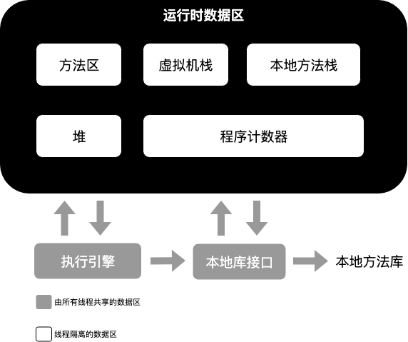

# 二.Java内存区域与内存溢出异常

## 2.2运行时数据区域

- 图解

  

### 2.2.1 程序计数器

- 程序计数器 作用：当前线程所执行的字节码的行号指示器，通过指示器来选取下一条需要执行的字节码指令

- 特点

  - Java多线程，因此每个线程都需要独立的程序计数器，因此该区域为“线程私有”的内存 <!--属于线程隔离的数据区-->

  - 如果线程执行java方法，则指向正在执行的字节码指令地址；如果执行Native方法，则计数器为空

    > 补充：Native方法
    >
    > native是非java代码编写的，比如C,C++, 它们无法在java编译时生成字节码，即JVM获取不到native实现，只能通过系统指令去调用native方法。因为不是Java虚拟机实现，所以不存在计数器的值

### 2.2.2 Java虚拟机栈

- 

