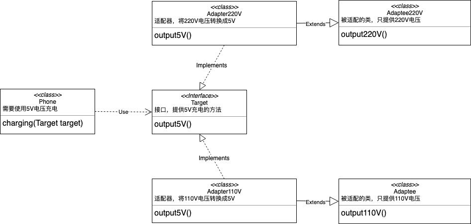

# Ex-设计模式

## 1.模版方法设计模式

- 定义：定义功能时，存在不确定部分，则将不确定部分暴露，并由该类的子类完成

- 实现：实现方法，统计程序的运行时间。

  ```java
  // 子类继承当前类，复写runcode方法，runcode方法中复写需要执行的方法，就能统计出runcode运行时间。
  abstract void getTime{
    //	final实现禁止修改
    public final void getTime(){
      //	记录开始时间
      long start = System.currentTimeMillis();
      //	程序运行部分，也就是不确定的部分
      runcode();
      //	记录结束时间
      long end = System.currentTimeMillis();
      //	输出运行时间
      System.out.println("运行时间为："+(end-start));
    }
    //	不确定部分需要暴露出去，因为不确定所以是抽象方法
    public abstract void runcode();
  }
  ```

## 2.策略设计模式

- 定义：一个能够根据传递的参数对象的不同而具有不同行为的方法。
- 策略：传入的参数对象

## 3.适配器设计模式

- 定义：通过适配器类将接受接口，并返回需要的接口
- 分类：类的适配器、对象的适配器

## 4.类的适配器

- 目的：将接口从具体实现中解耦，使得接口可以应用于多种不同的具体表现 <!--比如客户需要定制功能，继承现有功能，然后再通过接口补充功能，来实现客户需要的功能-->

- 原理：如果有220V和110V电源两个（被适配对象），手机需要充电（需要实现的功能），这时候需要充电器（适配器），手机的充电方法传入参数为接口对象，原因是实现该接口的类都能作为参数传入（多态的运用）

  

- 实现

  <!--被适配对象-->

  ```java
  public class Adaptee220V {
      int output220V(){
          return 220;}}
  
  public class Adaptee110V {
      int output110V(){
          return 110;}}
  ```

  <!--适配器-->

  ```java
  public class Adapter220V extends Adaptee220V implements Target {
      @Override public int output5V() {
          int v = super.output220V();
          // 将电压进行转换的具体实现
          int dst = v / 44;
          return dst;
      }
  }
  
  public class Adapter110V extends Adaptee110V implements Target {
      @Override public int output5V() {
          int v = super.output110V();
          int dst = v / 22;
          return dst;
      }
  }
  ```

  <!--接口-->

  ```java
  public interface Target {
      int output5V();
  }
  ```

  <!--使用类-->

  ```java
  public class Phone {
      // 充电方法，充电需要用到供电方法
      void charging(Target target){
          int v = target.output5V();
          System.out.println("使用成功，方法为"+target.getClass().getSimpleName()+",电压为："+v);
      }
  }
  ```

  <!--测试类-->

  ```java
  public class TestAdapter {
      public static void main(String[] args) {
          new Phone().charging(new Adapter220V());
          new Phone().charging(new Adapter110V());
      }
  }
  ```

### 4.1 完全解耦推导——重点

1. 小明有一块主板，一个网卡，想让显卡使用必须插到主板上然后使用，实现如下

   ```java
   // 网卡类
   class Netcard {
       void open(){
           System.out.println("Netcard open");
       }
       void close(){
           System.out.println("Netcard close");
       }
   }
   
   // 主板类
   public class Mainboard {
     	// 运行主板的方法
       void run(){
           System.out.println("Mainboard run");
       }
     	// 运行网卡的方法
       void useNetcard(Netcard netcard){
           netcard.open();
           netcard.close();
       }
   
       public static void main(String[] args) {
           Mainboard mainboard = new Mainboard();
           // 运行主板
           mainboard.run();
           // 运行网卡
           mainboard.useNetcard(new Netcard());
       }
   }/* output
   Mainboard run
   Netcard open
   Netcard close
   */
   ```

2. 问题来了，如果现在小明还有一张声卡，要用的话，怎么办，笨办法的实现如下

   ```java
   // 网卡类
   class Netcard {
       void open(){
           System.out.println("Netcard open");
       }
       void close(){
           System.out.println("Netcard close");
       }
   }
   
   // 新增声卡类
   public class Soundcard {
       void open(){
           System.out.println("Soundcard open");
       }
       void close(){
           System.out.println("Soundcard close");
       }
   }
   
   
   // 主板类
   public class Mainboard {
     	// 运行主板的方法
       void run(){
           System.out.println("Mainboard run");
       }
     	// 运行网卡的方法
       void useNetcard(Netcard netcard){
           netcard.open();
           netcard.close();
       }
       // 新增运行声卡的方法
       void useSoundcard(Soundcard soundcard){
           soundcard.open();
           soundcard.close();
       }
   
       public static void main(String[] args) {
           Mainboard mainboard = new Mainboard();
           // 运行主板
           mainboard.run();
           // 运行网卡
           mainboard.useNetcard(new Netcard());
   
           // 新增运行声卡
           mainboard.useSoundcard(new Soundcard());
       }
   }/* output
   Mainboard run
   Netcard open
   Netcard close
   Soundcard open
   Soundcard close
   */
   ```

3. 如果小明又要增加显卡，那每次增加都需要修改主板类和运行方法，岂不是累死。小明一想，能不能让声卡、显卡、网卡使用统一的PCI协议，只要这些卡都支持这个协议就能使用，实现如下

   ```java
   // 新增PCI接口协议
   interface PCI {
       void open();
       void close();
   }
   
   // 网卡类
   class Netcard implements PCI{
       public void open(){
           System.out.println("Netcard open");
       }
       public void close(){
           System.out.println("Netcard close");
       }
   }
   
   // 声卡类
   public class Soundcard implements PCI{
       public void open(){
           System.out.println("Soundcard open");
       }
       public void close(){
           System.out.println("Soundcard close");
       }
   }
   
   // 主板类
   public class Mainboard {
       // 运行主板的方法
       void run(){
           System.out.println("Mainboard run");
       }
       // 运行方法
       void use(PCI pci){
           pci.open();
           pci.close();
       }
   
       public static void main(String[] args) {
           Mainboard mainboard = new Mainboard();
           // 运行主板
           mainboard.run();
           // 运行
           mainboard.use(new Soundcard());
           mainboard.use(new Netcard());
       }
   }
   ```

4. 从此之后，如果需要在主板上增加显卡、CPU等等，只要支持PCI协议，就直接能够使用。

   不需要修改接口和主板类中的方法。这就实现了完全解耦


