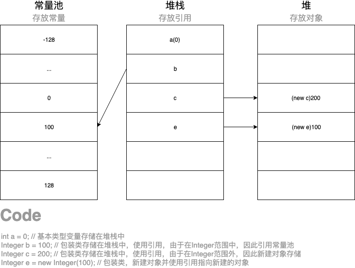

# 一.数据类型

## 1. 基本数据类型

### 1.1 基本概念

- 《基本数据类型表》

| 序号 | 数据类型        | 位数 | 默认值 | 取值范围       | 举例说明          |
| ---- | --------------- | ---- | ------ | -------------- | ----------------- |
| 1    | byte(位)        | 8    | 0      | -2^7 - 2^7-1   | byte b = 10;      |
| 2    | short(短整数)   | 16   | 0      | -2^15 - 2^15-1 | short s = 10;     |
| 3    | int(整数)       | 32   | 0      | -2^31 - 2^31-1 | int i = 10;       |
| 4    | long(长整数)    | 64   | 0      | -2^63 - 2^63-1 | long l = 10l;     |
| 5    | float(单精度)   | 32   | 0.0    | -2^31 - 2^31-1 | float f = 10.0f;  |
| 6    | double(双精度)  | 64   | 0.0    | -2^63 - 2^63-1 | double d = 10.0d; |
| 7    | char(字符)      | 16   | 空     | 0 - 2^16-1     | char c = 'c';     |
| 8    | boolean(布尔值) | 8    | false  | true、false    | boolean b = true; |

<!--解析-->

1. 在运行前数据超过取值范围，将提示错误“不兼容类型”

2. 在运行时超出取值范围，将从下限开始向上增加，超过后继续从下限向上增加，不停循环

   <!--实现-->

   ```java
   // 当超过取值范围时，从下限开始向上增加
   byte s = 127;
           System.out.println(s);
           s++;
           System.out.println(s);
   
   /* output
   127
   -128
   */
   ```

   ```java
   // 超过下限后增加继续超过上限后，重新从下限开始向上增加
   byte s = 127;
           System.out.println(s);
           // 超过上限后，加到0
           for (int j = 0 ; j <= 128 ; j++){
               s++;
           }
           System.out.println(s);
           s = 127;
           // 超过上限后加到再次上限
           for (int j = 0 ; j <= 256; j++){
               s++;
           }
           System.out.println(s);
   
   /* output
   127
   0
   -128
   */
   ```
   
3. 因为所有数据类型在所有机器中的大小都是相同的，内存管理的细节都交给Java Virtual Machine（JVM）处理，因此没有sizeof方法

### 1.2 原码反码补码

- 规则

  - 带符号的数据二进制表示的形式最高位代表符号类型，0代表正数，1代表负数
  - 反码是原码取反 <!--1变为0，0变为1-->
  - 补码是反码加1

- 实现：正整数127的三码，负整数-127的三码

  - 127：完整原码是：0111 1111

  |      | 符号位 | 数值位   |
  | ---- | ------ | -------- |
  | 原码 | 0      | 111 1111 |
  | 反码 | 0      | 111 1111 |
  | 补码 | 0      | 111 1111 |

  - -127：完整原码是：1111 1111

  |      | 符号位 | 数值位   |
  | ---- | ------ | -------- |
  | 原码 | 1      | 111 1111 |
  | 反码 | 1      | 000 0000 |
  | 补码 | 1      | 000 0001 |

### 1.3 浮点类型

- 分类：float，double

- 注意

  - 溢出和出错时，有三个特殊的浮点数据：正无穷大，负无穷大，NaN（不是一个数字）

    <!--如某数除以零，则为正无穷大；零除以零则为NaN-->
    
  - float赋值时需要在数字后面加上“f”

### 1.4 自动装箱和自动拆箱

#### 1.4.1 包装类

- 基本类型与包装类的区别
  - 声明方式：基本类型不使用new关键字；包装类型使用new关键字在堆中分配存储空间
  - 存储方式及位置：基本类型将变量存储在堆栈中；包装类将对象放在堆中，通过引用使用

> 面试题：short s1 = 1 ; s1 = s1 + 1 是否有错？ short s1 = 1; s1 += 1 是否有错
>
> 答案：
>
> 第一个会报错。原因是，s1 + 1的1是int类型的（32位），因此"s1 + 1"的结果是int类型的，如果赋值给short（16位），就属于强制转换，所以会报错。
>
> 第二个不会报错。原因是+=会自动进行强制转换，反编译的结果为s1 = (short) ( s1 + 1 );因此不会报错

#### 1.4.2 自动装箱

- 装箱 定义：自动将基本数据类型转换成包装类，使用Integer.valueOf()方法，超过范围(-128至+128)则新建对象存储

- 原理

  ```java
  public static Integer valueOf(int i) {
  	return  i >= 128 || i < -128 ? new Integer(i) : SMALL_VALUES[i + 128];
  }
  ```

  <!--实现-->

  ```java
  // 装箱
  public class TestAutoBoxing {
      public static void main(String[] args) {
          ArrayList<Integer> list = new ArrayList<Integer>();
          list.add(5); // 等于 list.add(Integer.valueOf(5));
      }
  }/* conclusion
  1.list中的元素为Integer类型
  2.当使用.add()方法添加时，被添加的类型为基本类型int
  3.因此将自动变换为 list.add(Integer.valueOf(5))
  */
  ```

- 规则

  - 自动装箱规范要求boolean，byte，char小于等于127，介于-128至127之间的short和int被包装到固定的对象中

    原因：IntegerCache.low 默认是-128；IntegerCache.high默认是127，超出范围的将创建对象存储，不然直接返回值。减少new，减轻jvm压力。

    ```java
    public class TestAutoBoxing {
        public static void main(String[] args) {
    				// 使用包装类
            Integer a = 127;
            Integer b = 127;
            Integer c = 128;
            Integer d = 128;
            System.out.println("a == b:"+(a == b));
            System.out.println("c == d:"+(c == d));
        }
    }/* output
    a == b:true
    c == d:false
    */
    ```

  - 由于包装器类引用可以为null，因此会出现NullPointerException

  - 如果混合使用Integer和Double，Integer会拆箱，提升为double，然后装箱为Double

  - 自动拆箱和自动装箱是编译器认可的，不是虚拟机。

#### 1.4.3 自动拆箱

- 拆箱 定义：将包装类数据拆成基本类型数据

  <!--实现-->

  ```java
  public class TestAutoBoxing {
      public static void main(String[] args) {
          // 装箱
          ArrayList<Integer> list = new ArrayList<Integer>();
          list.add(5);
          // 拆箱
          int intType = list.get(0); // 等于 int intType = list.get(0).intValue();
      }
  }/* conclusion
  1.list中的元素为Integer类型
  2.当使用.get()方法获取时，获得的值类型为Integer
  3.因此将自动变换为 int intType = list.get(0).intValue();
  */
  ```

- 存储位置

  

- 实现

```java
public class Main {
    public static void main(String[] args) {
    // 自动装箱
    Integer total = 99;

    // 自动拆箱
    int totalprim = total;
    }
}
```

### 1.5 高精度数字

- BIgInteger：任意精度的整数
- BigDecimal：任何精度的定点数 <!--可以用于精确的货币计算-->

## 2. 引用类型

### 2. 1基本概念

- 分类
  - 符号引用
  - 直接引用
- 符号引用 定义：符号引用以一组符号来描述所引用的目标，符号可以是任意形式的字面量，只要使用时能无歧义的定位到目标即可。符号与虚拟机实现的内存布局无关，引用目标并不一定加载到内存中（方法区）   <!--比如类和接口的全局限定名，字段的名称和描述符，方法的名称和描述符-->
- 直接引用 定义：引用的内容(类, 对象, 变量或者方法等)的地址 <!--比如对象具体的地址-->
- 转换规则
  - 部分符号引用是在类加载阶段转换为直接引用，称为静态解析
  - 部分符号引用是在每次运行期转换为直接引用，称为动态链接，体现了多态

### 2.2 描述符

- 描述符 定义：描述符描述字段/变量，描述字段的数据类型、方法的参数列表（包括数量、类型、顺序）与返回值

- 规则

  - 基本数据类型和void无返回值都用一个大写字母表示，L-对象类型

    ```java
    // 基本数据类型
    B - byte
    C - char
    I - int
    F - float
    D - double
    J - long
    S - short
    Z - boolean
    V - void
    //对象类型
    Ljava/lang/String
    ```

  - 描述符描述数组类型，使用前置的"["加上数据类型表示，比如"int[]"则使用"[I"表示

  - 描述符描述方法，先参数列表后返回值的顺序

    ```java
    // 原方法
    String getName(int id,String name)
    // 描述符描述方法
    (I,Ljava/lang/String)Ljava/lang/String;
    ```

## 3. 变量

- 规则
  - 必须以字母开头，并由字母或者数字构成的序列

## 4. 字符串

### 4.1 不可变字符串

- 定义：String类没有提供修改字符串的方法

  <!--比如无法将greeting最后两个字符修改为p和！-->

- 原理：修改字符串（连接），是将字符串的值重新赋值到新的字符串，也就是新建String对象

  <!--验证-->

  ```java
  public class TestString {
      public static void main(String[] args) {
          String s1 = "abc";
          String s2 = "efg";
          System.out.println("s1:"+s1);
          System.out.println("s1的地址为："+s1.hashCode());
          System.out.println("s2:"+s2);
          System.out.println("s2的地址为："+s2.hashCode());
          s1 = s1 + s2;
          System.out.println("new s1:"+s1);
          System.out.println("new s1的地址为："+s1.hashCode());
      }
  }
  /* output
  s1:abc
  s1的地址为：96354
  s2:efg
  s2的地址为：100326
  new s1:abcefg
  new s1的地址为：-1424384956
  */
  
  /* conclusion
  将s1重新赋值后，s1所在地址已经变更，说明是新的字符串对象了
  */
  ```

### 4.2 字符串比较——重点

- equals和等号的区别——面试题
  - 等号（==）
    - 基本数据类型（也称原始数据类型） ：byte,short,char,int,long,float,double,boolean。他们之间的比较，应用双等号（==）,比较的是他们的值。
    - 引用数据类型：当他们用（==）进行比较的时候，比较的是他们在内存中的存放地址（确切的说，是**堆内存**地址）
    
  - equals
  
    - 方法的初始默认行为是比较对象的内存地址值
    - 在一些类库当中这个方法被重写了，如String、Integer、Date，比较对象的成员变量值是否相同
  
    > default:equals方法重写后，需要重写hash方法

### 4.3 构建字符串

- 方法：使用StringBuilder构建字符串

- 优势：避免每次字符串连接时，需要新建String对象的情况

- 格式

  ```java
  StringBuilder sb = new StringBuilder();
  sb.append("abc");
  ```

  <!--验证-->

  ```java
  public class TestStringBuilder {
      public static void main(String[] args) {
          StringBuilder sb = new StringBuilder();
          sb.append("abc");
          print("sb:"+sb);
          print("sb地址:"+sb.hashCode());
          print("------新增后------");
          sb.append("degf");
          print("sb:"+sb);
          print("sb地址:"+sb.hashCode());
      }
  }
  /* output
  sb:abc
  sb地址:135721597
  ------新增后------
  sb:abcdegf
  sb地址:135721597
  */
  
  /* conclusion
  地址未改变，说明是原对象
  */
  ```

- 比较（StringBuilder和StringBuffer）——面试题

  - StringBuffer是一个旧类

  - StringBuilder 相较于 StringBuffer 有速度优势

  - StringBuffer是线程安全和同步的而StringBuilder则不是线程安全和非同步，java中线程同步了也就满足安全性

    原因：StringBuffer中的方法有synchronized关键字修饰（即当有一个线程在对内存进行操作时，其他线程都不可以对这个内存地址进行操作，直到该线程完成操作， 其他线程才能对该内存地址进行操作）
    
    <!--源码-->
    
    ```java
    @Override
        public synchronized StringBuffer append(Object obj) {
            toStringCache = null;
            super.append(String.valueOf(obj));
            return this;
        }
    ```
    
    <!--解析-->
    
    1. toStringCache说明：
    
       ```
       A cache of the last value returned by toString. Cleared whenever the StringBuffer is modified.
       
       1.翻译：值是最后一次返回的toString缓存值，如果StringBuffer被修改则值清空
       
       2.StringBuffer类中的修改方法都会将toStringCache设置为null，在toString中判断toStringCache是否为null，为null说明已经被修改，否则将返回最新值
       ```

## 5. 大数值

- 规则
  - BigInteger,BigDecimal可以处理包含任意长度数字序列的数值
  - BigInteger处理整数
  - BigDecimal处理浮点数
  - 使用.valueOf()将普通数值转换为大数值
  - 使用add，multiply，divide等方法计算（无法使用+和*）

## 6. 数组

- 数组 定义：相同类型的、用一个标识符名称封装到一起的一个对象序列或者是基本类型数据序列

- 初始化的值

  - 数字数组：0
  - boolean数组：false
  - 对象数组：null

- 格式

  - 基础数组

    ```java
    // 定义
    int[] i;
    
    // 固定成员
    i.length;
    
    // 数组大小
    	// 初始化时定义
    	int[] a = new int[10];
    	// 由随机数决定
    	Random rand = new Random(57);
    	int[] b = new int[rand.nextInt(20)];
    
    // 初始化
    	// 方法一
    	a[i] = rand.nextInt(20);
    	// 方法二
    	Integer[] a = {
        new Integer(1),
        new Integer(2),
        3,
      };
    	// 方法三
    	Integer[] b = new Integer[]{
        new Integer(1),
        new Integer(2),
        3,
      }
    ```

  - 匿名数组

    ```
    new int[] {2,3,4,2}
    ```

- 注意点

  - java中允许数组长度为0

  - 创建类的对象引用数组，并不会调用类的构造方法，原因是仅实例化了数组，并没有实例化类

    <!--实现-->

    ```java
    public class Book {
        Book(String s){
            print("Initial");
            print(s);
        }
    
        public static void main(String[] args) {
            Book[] books = new Book[10];
        }
    }/* output
    为空，因为并未实例化类，仅仅实例化了数组
    */
    ```

### 6.1 数组拷贝

- 方法

  - 方法一：将两个变量的引用指向同一个数组

  - 方法二：使用Arrays类中的copyOf方法

    <!--实现-->

    ```java
    int[] k = {1,2,3}
    int[] i = Arrays.copyOf(k,k.length);
    // 也可以增加数组长度,多余元素赋值为0
    int[] i = Arrays.copyOf(k,k.length*2);
    ```

    <!--源码-->

    ```java
    public static int[] copyOf(int[] original, int newLength) {
            int[] copy = new int[newLength];
            System.arraycopy(original, 0, copy, 0,
                             Math.min(original.length, newLength));
            return copy;
        }
    ```

    <!--解析-->

    1. System.arraycopy是本地方法，非Java编写

### 6.2 不规则数组

- 注意点
  - 多维数组被称为数组的数组

### 6.3 枚举类型

- enum关键字：声明一种整型常量的集合 <!--一个星期有七天，则可定义为枚举类型-->

- 格式

  ```java
  public enum MoneyValue{
          ONE, FIVE, TEN, TWENTY, FIFTY, HUNDRED;
      }
  ```

  <!--解析-->

  - 一个名为MoneyValue的枚举类型，其中有六个具名值，都是常量
  - 通过.ordinal()方法输出声明顺序
  - 通过.value()方法，以数组形式返回枚举类型的所有成员

- 规则

  - 内部数据无法使用纯数字，如果需要保存一列数字，用数组

  - 枚举类中是实例，因此能够创建实例中的变量，但必须使用构造方法赋值

    <!--实现-->

    ```java
    public class TestEnum {
         public enum Size{
            MAX("max",3),MIN("min",1),MEDIUM("medium",2);
            // 成员变量
            private String name;
            private int num;
            // 成员变量的构造方法
            Size(String name , int i) {
                this.name = name;
                this.num = i;
            }
        }
        public static void main(String[] args) {
            // 在同一个类中，因此可以访问私有的成员变量name
            String name = Size.MAX.name;
            System.out.println(name);
        }
    }
    ```

    <!--解析-->

    1. 可以将枚举项看成新的类，var看成类中的成员变量，需要重写构造方法

  - 枚举和数组的区别

    - 数组是相同类型的多个数据项组成的集合；枚举是新类型，允许用常量来表示特定的数据片断

    - 在未加入枚举之前，常量集合创建方式；加入后的创建方式，枚举更加简单安全，当一个`Java`类第一次被真正使用到的时候静态资源被初始化、`Java`类的加载和初始化过程都是线程安全的

      ```java
      // 常量集合
      public class Test {
        public static final int A = 1;
        public static final int B = 2;
        public static final int C = 3;
        public static final int D = 4;
        public static final int E = 5;
      }
      ```

      ```java
      public class Test {
        public enum Grade{
          A,B,C,D,E;
        };
      }
      ```

  - 应用

    enum和switch搭配使用

    ```java
    package TwentyTwo;
    
    public class Money {
        public enum MoneyValue{
            ONE, FIVE, TEN, TWENTY, FIFTY, HUNDRED;
        }
    
        public static void main(String[] args) {
            for (MoneyValue mv: MoneyValue.values()
                 ) {
                switch (mv){
                    case ONE:
                        System.out.println("This is smallest");
                        System.out.println(mv.ordinal());
                        break;
                    case FIVE:
                        System.out.println("This is second");
                        break;
                    case TEN:
                        System.out.println("This is third");
                        break;
                    case TWENTY:
                        System.out.println("This is forth");
                        break;
                    case FIFTY:
                        System.out.println("This is fifth");
                        break;
                    case HUNDRED:
                        System.out.println("This is largest");
                        break;
                }
            }
        }
    }
    ```