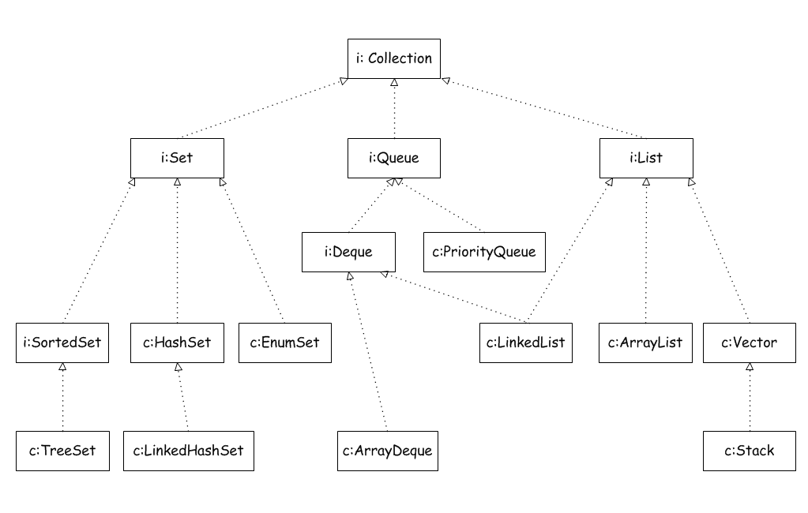

# 七.集合框架

## 1. Java集合框架

### 1.1 将集合的接口与实现分离

- 特点：java集合类库将接口与实现分离

- 集合分类

  - Set代表无序、不可重复的集合
  - List代表有序、重复的集合
  - Map则代表具有映射关系的集合
  - Queue体系集合，代表一种队列集合实现
  - Stack代表先进后出的集合

- 各类的特点

  - Array通常比Link list更高效；Link list容量是动态的，Array容量是固定的；
  
  

### 1.2 Collection接口

- 简介：集合类的基本接口是Collection接口

- 方法

  ```java
  public interface Collection<E>{
    // Basic Operations
    int size();
    boolean isEmpty();
    boolean contains(Object element);
    boolean add(E element); // 添加元素
    boolean remove(Object element); //形参和add方法不一样。比如remove方法在hashmap中，是传入key值，而key值不一定是E类型的，可能是任意类型的，所以此处使用Object对象。
    Iterator<E> iterator(); // 返回实现Iterator接口的对象，可使用该对象遍历集合中的元素
    
    // Bulk Operations
    boolean containsAll(Collection<?> c);
    boolean addAll(Collection<? extends E> c);
    boolean removeAll(Collection<?> c);
    boolean retainAll(Collection<?> c);
    void clean(); //Optional
    
    // Array Operations
    Object[] toArray();
    <E> E[] toArray(E a[]);
  }
  ```

- 接口继承树

  <!--Map接口没有继承自Collection接口，因为Map表示的是关联式容器而不是集合-->

  

### 1.3 迭代器

- 特点

  - 所有Collection类(List、Set、Deque)们都可以使用的迭代器
  - 支持三种操作：hasNext()、next()、remove()
  - 存在失效的情况。<!--如果数组重新分配空间，则之前生成的迭代器将失效-->

- 方法

  ```java
  public interface Iterator<E>{
    E next(); // 逐个访问元素
    boolean hasNext(); // 判断是否下一个元素是否存在
    void remove(); // 删除刚刚next的元素
    default void forEachRemaining(Consumer< ? super E> action);
  }
  ```

- 用途：提供遍历容器中元素的方法

  <!--实现：使用迭代器和for-each遍历输出，for-each底层实现为迭代器-->

  ```java
  public class TestIterator {
      public static void main(String[] args) {
          List<String> list = new ArrayList<>();
          list.add("A");
          list.add("B");
          list.add("C");
          // 迭代器实现遍历
          Iterator<String> iterator = list.iterator();
          while (iterator.hasNext()){
              System.out.println(iterator.next());
          }
          // for-each实现遍历
          for (String s : list) {
              System.out.println(s);
          }
      }
  }
  ```

- 注意

  - Java迭代器位于两个元素之间，调用next时，越过下个元素，并返回刚刚越过的元素

    

  - next方法和remove方法互相依赖。使用remove前需要先调用next，因此无法连续调用remove方法删除两个相邻的元素。原因如上
  
  - 使用for-each方法，底层调用的是迭代器。并且无法修改值。
  
    ```java
    List<String> list = new ArrayList<>();
    list.add("a");
    list.add("b");
    list.add("c");
    // 尝试修改list中的值
    for (String s : list) {
      s = "y";
    }
    // 使用set修改值
    list.set(2, "y");
    // 输出修改之后的list
    for (String s : list) {
      System.out.println(s);
    }
    ```
  
    ```shell
    # output
    a
    b
    y
    ```
  
    ```shell
    # Analyse
    1.使用for-each遍历修改之后，并没有修改值。
    2.需要使用set方法来修改值。
    ```
  
    

### 1.5 集合框架中的接口

- **集合基本接口：Collection和Map** <!--因此HashMap属于集合-->

## 2. 具体的集合

- 集合类型表

  | 集合类型        | 描述                                       |
  | --------------- | ------------------------------------------ |
  | ArrayList       | 支持动态增长和缩减的索引序列               |
  | LinkedList      | 支持在任意位置高效插入和删除操作的有序序列 |
  | ArrayDeque      | 使用循环数组实现的双端队列                 |
  | HashSet         | 没有重复元素的无序集合                     |
  | TreeSet         | 有序集                                     |
  | EnumSet         | 包含枚举类型值的集                         |
  | LinkedHashSet   | 支持记住元素插入次序的集                   |
  | PriorityQueue   | 支持高效删除最小元素的集合                 |
  | HashMap         | 存储键/值关联的数据结构                    |
  | TreeMap         | 键值有序排列的映射表                       |
  | EnumMap         | 键值属于枚举类型的映射表                   |
  | LinkedHashMap   | 支持记住键/值项添加次序的映射表            |
  | WeakHashMap     | 其值无用后支持被垃圾回收器回收的映射表     |
  | IdentityHashMap | 用== 而不是equals比较键值的映射表          |

### 2.0 栈

- 特点

  - 后进先出，元素只能从顶部加入，从顶部离开

- 方法

  - push(T object)：在栈顶部压入元素
  - pop()：返回栈顶部的元素
  - size()：返回栈的大小

- Implementation 

  ```java
  public class Stack {
      public static void main(String[] args) {
          java.util.Stack<String> stack = new java.util.Stack<>();
          stack.push("First");
          stack.push("Second");
          stack.push("Third");
          System.out.println("The order of add : First,Second,Third");
          System.out.println("The first pop:" + stack.pop());
          System.out.println("The second pop:" + stack.pop());
          System.out.println("The third pop:" + stack.pop());
      }
  }
  ```

  ```shell
  # output
  The order of add : First,Second,Third
  The first pop:Third
  The second pop:Second
  The third pop:First
  ```

### 2.1 List

- 特点

  - 可包含重复项
  - 也可称为sequences

- 方法

  ```java
  public interface List<T> extends Collection<T> { 
    T get(int index);
    T set(int index, T element);
    void add(int index, T element);
    T remove(int index);
    boolean addAll(int index, Collection <? extends T> c);
    // Search
  	int indexOf(Object o); 
  	int lastIndexOf(Object o);
    // Iterator
    ListIterator<T> listIterator(); 
  	ListIterator<T> listIterator(int indexb);
    List<T> subList(int from, int to); 
  }
  ```

- implementations

  - ArrayList
  - LinkedList
  - Vector

#### 1.LinkedList

- 特点

  - 适合在列表中间增加或删除元素

  - 同时实现了List接口和Deque接口

  - 非线程安全，不同步

     <!--如果需要实现同步，通过Collections.synchronizedList()方法对其进行包装-->

- 复杂度

  - get() 获取第几个元素，依次遍历，复杂度O(n)
  - add(E) 添加到末尾，复杂度O(1)
  - add(index, E) 添加第几个元素后，需要先查找到第几个元素，直接指针指向操作，复杂度O(n)
  - remove（）删除元素，直接指针指向操作，复杂度O(1)

- 结构：双向链表

  - 每个结点存放着数据以及上一结点和下一结点的引用

  - 结构图

    

  - 实现原理

    <!--源码-->

    ```java
    // 结点的Node内部类
    private static class Node<E> {
        E item;
        Node<E> next;
        Node<E> prev;
        Node(Node<E> prev, E element, Node<E> next) {
            this.item = element;
            this.next = next;
            this.prev = prev;
        }
    }
    ```

    <!--解析-->

    1. 链表的节点使用Node内部类实现
    2. 当前节点的前后节点会在当前节点中的内部类中进行赋值，来实现双向链表。实在是精妙之极，令人赞叹

- 方法

  - add()

  - add(int i , E element)：特定位置添加元素

    <!--源码-->

    1.add方法

    ```java
    public void add(int index, E element) {
            checkPositionIndex(index);
    
            if (index == size)
                linkLast(element);
            else
                linkBefore(element, node(index));
        }
    ```

    2.linkLast——调用的方法

    ```java
    // 把新节点加入到末尾的方法
    void linkLast(E e) {
            final Node<E> l = last;
            final Node<E> newNode = new Node<>(l, e, null); // node构造方法：Node(Node<E> prev, E element, Node<E> next)
            last = newNode;
            if (l == null)
                first = newNode; //如果前一节点为空，则新节点为首个节点
            else
                l.next = newNode; //如果前节点不为空，则前一节点的next值为新节点的引用
            size++;
            modCount++;
        }
    ```

    3.linkBefore——调用的方法

    ```java
    void linkBefore(E e, Node<E> succ) {
            // assert succ != null;
            final Node<E> pred = succ.prev; //获取被添加位置的节点的“前一个节点的引用”，赋值给添加的元素中node类的前一个结点引用的属性
            final Node<E> newNode = new Node<>(pred, e, succ); // 新节点构造
            succ.prev = newNode; // 被添加后，后一个元素的前一个节点引用属性修改为添加的元素的引用
            if (pred == null)
                first = newNode;
            else
                pred.next = newNode;// 被添加后，前一个元素的后一个节点引用属性修改为添加的元素的引用
            size++;
            modCount++;
        }
    ```

    4.node(index)——调用的方法作为传参

    ```java
    Node<E> node(int index) {
            // assert isElementIndex(index);
            if (index < (size >> 1)) {
                Node<E> x = first;
                for (int i = 0; i < index; i++)
                    x = x.next;
                return x;
            } else {
                Node<E> x = last;
                for (int i = size - 1; i > index; i--)
                    x = x.prev;
                return x;
            }
        }
    ```

    <!--解析-->

    1. node(int index)函数，因为链表双向的，可以从开始往后找，也可以从结尾往前找，具体朝那个方向找取决于条件index < (size >> 1)，也即是index是靠近前端还是后端。

       <!--比如10个元素，在第2个元素位置插入元素，则将从前往后找，找到第二个元素并传值到linkBefore方法中-->

  - remove(int index)：删除指定位置元素

  - remove(Object o)：删除指定元素（通过equals方法判断）

    <!--源码-->

    ```java
    public boolean remove(Object o) {
            if (o == null) { // 如果为空，则将后面的元素向前移动
                for (Node<E> x = first; x != null; x = x.next) { 
                    if (x.item == null) {
                        unlink(x);
                        return true;
                    }
                }
            } else {
                for (Node<E> x = first; x != null; x = x.next) {
                    if (o.equals(x.item)) {
                        unlink(x);
                        return true;
                    }
                }
            }
            return false;
        }
    
    ```

    <!--解析-->

    1. 通过equals方法找到需要删除的元素

  - get(int index)：获得指定元素

    <!--源码-->

    ```java
    public E get(int index) {
            checkElementIndex(index);
            return node(index).item;
        }
    
    ```

  - set(int i , E element)：特定位置新元素替代旧元素

    <!--源码-->

    ```java
    public E set(int index, E element) {
            checkElementIndex(index);
            Node<E> x = node(index);
            E oldVal = x.item; // 将原对象中的值赋值给oldVal变量
            x.item = element;
            return oldVal;
        }
    
    ```

    <!--解析-->

    1. 将新node对象指向原引用指向的对象，再修改值才能生效
    2. 问题：为什么要返回oldVal，为什么不返回true或者false default

#### 2.ListIterator

- 特点

  - 只有List类能够使用

- 相比于Iterator增加了部分功能

- 迭代器定位以及add/remove方法

  - **add方法只依赖迭代器的位置；remove,set方法依赖迭代器的状态**

    原因是：迭代器指向的是元素之间的位置

     <!--要使用remove方法需要存在被越过的数，也就是需要先使用next或者previous方法-->

  - 原理图

  

#### 3.ArrayList

- 特点

  - 适合在尾端插入和删除元素
  - 适合通过index访问元素
  - 实现了List接口
  - 非线程安全
  - 顺序容器（元素存放的顺序与放进去的顺序一致），因为底层是数组
  - 容量不足，容器会自动增大底层数组的大小
  - 允许元素为null

- 时间复杂度

  - get() 获取第几个元素，依次遍历，复杂度O(1)
  - add(E) 添加到末尾，复杂度O(1)
  - add(index, E) 添加元素，在第几个元素后面插入，后面的元素需要向后移动，复杂度O(n）
  - remove（）删除元素，后面的元素需要逐个移动，复杂度O（n）
  - 因此一般不进行在中间的添加和删除操作

- 方法

  - set( )：对指定位置赋值

    <!--源码-->

    ```java
    public E set(int index, E element) {
            Objects.checkIndex(index, size); // 下标越界检查
            E oldValue = elementData(index); // 获取原位置的值
            elementData[index] = element; // 将数组中指定位置的值更新成新值
            return oldValue; // 返回旧值
        }
    
    ```

    <!--解析-->
    
    底层实现是数组，同时无法对在数组外的位置赋值

  - get( )：获取指定位置的元素

    <!--源码-->

    ```java
      public E get(int index) {
              Objects.checkIndex(index, size); // 越界检查
              return elementData(index);
          }
    ```

  - add( )：向指定位置添加元素

    <!--源码-->

    ```java
    // 增加的方法
    public void add(int index, E element) {
            rangeCheckForAdd(index); // 是否超过数组大小
            modCount++; // 记录结构性改变的次数
            final int s;
            Object[] elementData;
            if ((s = size) == (elementData = this.elementData).length)
                elementData = grow();
            System.arraycopy(elementData, index,
                             elementData, index + 1,
                             s - index);
            elementData[index] = element;
            size = s + 1;
        }
    
    ```

    ```java
    // 执行add方法前，执行的grow，先增加容量，确保能放入当前添加元素
    private Object[] grow() {
            return grow(size + 1);
        }
    // 执行add方法前，调用newCapacity方法，如果空间不足则扩容
    private int newCapacity(int minCapacity) {
            // overflow-conscious code
            int oldCapacity = elementData.length;
            int newCapacity = oldCapacity + (oldCapacity >> 1); // 原来的1.5倍
            if (newCapacity - minCapacity <= 0) {
                if (elementData == DEFAULTCAPACITY_EMPTY_ELEMENTDATA)
                    return Math.max(DEFAULT_CAPACITY, minCapacity);
                if (minCapacity < 0) // overflow
                    throw new OutOfMemoryError();
                return minCapacity;
            }
            return (newCapacity - MAX_ARRAY_SIZE <= 0)
                ? newCapacity
                : hugeCapacity(minCapacity);
        }
    
    ```

    <!--解析-->

    1. **modCount的作用是保证安全。ArrayList中的add、remove等方法中，会修改modCount的值，而迭代器是单独线程，运行过程中会检查modCount是否被修改，如果迭代器使用过程中，有其他线程进行了remove、add等操作（也就是修改了modCount值），则将抛出异常ConcurrentModificationException，这就是fail-fast策略。**

       **如下，是迭代器的remove源码，在迭代器使用过程中会检查"modCount != expectedModCount"，这时如果其他线程进行了结构性修改，则会报错。——重点**

       ```java
       public void remove() {
                   if (current == null)
                       throw new IllegalStateException();
                   if (modCount != expectedModCount) // 检查是否在迭代器使用过程中，有其他线程进行结构性修改
                       throw new ConcurrentModificationException();
                   Object k = current.key;
                   current = null;
                   HashMap.this.removeEntryForKey(k);
                   expectedModCount = modCount;
               }
       
       ```

       <!--错误演示-->

       ```java
       List<String> list = new ArrayList<>();
               list.add("A");
               list.add("B");
               list.add("C");
               list.add("D");
       
               for (String s : list) {
                   if (s.equals("B"))
                       list.remove(s); // 在迭代器运行过程中，进行结构性修改后，报错
               }
       /* output
       Exception in thread "main" java.util.ConcurrentModificationException
       */
       
       ```

       <!--正确演示-->

       ```java
       List<String> list = new ArrayList<>();
               list.add("A");
               list.add("B");
               list.add("C");
               list.add("D");
               Iterator<String> iterator = list.iterator();
               while (iterator.hasNext()){
                   if (iterator.next().equals("B")){
                       iterator.remove();
                   }
               }
               for (String s : list) {
                   System.out.println(s);
               }
       /* output
       A
       C
       D
       */
       
       ```

    2. newCapacity执行后，会将原数组复制到新数组，然后再执行add方法

  - remove( )：删除元素

    <!--源码-->

    ```java
    // 删除的方法
    public E remove(int index) {
            Objects.checkIndex(index, size);
            final Object[] es = elementData;
    
            @SuppressWarnings("unchecked") E oldValue = (E) es[index];
            fastRemove(es, index);
    
            return oldValue;
        }
    // 被删除调用的方法，真正执行删除操作的方法
    private void fastRemove(Object[] es, int i) {
            modCount++;
            final int newSize;
            if ((newSize = size - 1) > i)
                System.arraycopy(es, i + 1, es, i, newSize - i);
            es[size = newSize] = null;
        }
    
    ```

    <!--解析-->

    1. fastRemove方法中，因为被删除元素后的元素都向前移动一个位置，因此最后的元素需要赋值为null，让GC进行回收处理
    
  - 遍历

    ```java
    // 方法一：使用索引
    System.out.println("方法一：使用索引");
    for (int i = 0 ; i < list.size() ; i++) {
      System.out.println(list.get(i));
    }
    // 方法二：使用迭代器
    System.out.println("方法二：使用迭代器");
    ListIterator<String> iterator = list.listIterator();
    while (iterator.hasNext()){
      System.out.println(iterator.next());
    }
    // 方法三：隐式使用迭代器
    System.out.println("方法三：隐式使用迭代器");
    for (String s : list) {
      System.out.println(s);
    }
    ```

#### 4.ArrayList与Vector区别

- Vector是线程安全的集合类，ArrayList并不是线程安全的类。Vector类对集合的元素操作时都加了synchronized，所以方法都是同步的，保证线程安全。
- Vector与ArrayList本质上都是一个Object[] 数组，ArrayList提供了size属性，Vector提供了elementCount属性，他们的作用是记录集合内有效元素的个数。与我们平常调用的arrayList.size()和vector.size()一样返回的集合内有效元素的个数。
- Vector与ArrayList的扩容并不一样，Vector默认扩容是增长一倍的容量，Arraylist是增长50%的容量。
- Vector与ArrayList的remove,add(index,obj)方法都会导致内部数组进行数据拷贝的操作，这样在大数据量时，可能会影响效率。
- Vector与ArrayList的add(obj)方法，如果新增的有效元素个数超过数组本身的长度，都会导致数组进行扩容。

### 2.3 散列集

- 散列码 定义：散列表为每个对象计算的一个整数，是由对象的实例域产生的

  <!--比如String的hashCode方法产生散列码-->

- 散列表（也称哈希表） 定义：由链表数组实现。每个列表称为桶

- 规则

  - 查找特定对象方法：计算散列码，散列码与桶的总数取余，结果为对象所在桶的索引

    <!--散列码为777，桶有70个，余数为7，因此对象应该保存在7号桶中-->

  - 插入对象方法：如果桶为空，则直接加入；如果桶已满（也称为散列冲突），需要用新对象与桶中所有对象进行比较，查看是否存在。在Java SE8中，桶满时会从链表变为平衡二叉树。

  - 散列表过满解决方法：再散列。通过设置装填因子（如果设置为0.7，如果表中超过70%位置已经被使用，则将执行再散列）

  > 散列冲突如何解决——面试题
  >
  > **1、直接定址法**：取关键字或关键字的某个线性函数值为散列地址。即 Hash(k) = k 或 hash(k) = ak+b，其中 a b为常数（这种散列函数叫做自身函数）
  >
  > **2、数字分析法**：假设关键字是以*r*为基的数，并且哈希表中可能出现的关键字都是事先知道的，则可取关键字的若干数位组成哈希地址。比如有一组value1=112233，value2=112633，value3=119033，针对这样的数我们分析数中间两个数比较波动，其他数不变。那么我们取key的值就可以是key1=22,key2=26,key3=90。
  >
  > **3、平方中取法**：取关键字平方后的中间几位为哈希地址。通常在选定哈希函数时不一定能知道关键字的全部情况，取其中的哪几位也不一定合适，而一个数平方后的中间几位数和数的每一位都相关，由此使随机分布的关键字得到的哈希地址也是随机的。取的位数由表长决定。
  >
  > **4、折叠法**：将关键字分割成位数相同的几部分（最后一部分的位数可以不同），然后取这几部分的叠加和（舍去进位）作为哈希地址。举个例子，比如value=135790，要求key是2位数的散列值。那么我们将value变为13+57+90=160，然后去掉高位“1”,此时key=60，这就是他们的哈希关系，这样做的目的就是key与每一位value都相关，来做到“散列地址”尽可能分散的目地。
  >
  > **5、随机数法**
  >
  > **6、除留余数法：**取关键字被某个不大于散列表表长m的数p除后所得的余数为散列地址，即hash(k) = k mod p, p <= m。不仅可以对关键字直接取模，也可在折叠法、平方取中法等运算之后取模。对p的选择很重要，一般取素数或m，若p选择不好，容易产生冲突。

#### 1.HashSet

- HashSet里面有一个HashMap（适配器模式）

### 2.4 树集

- 特点：类似散列集，但有序

  原因：排序通过树结构实现（红黑树）——default

  <!--任意顺序插入，遍历时，每个值会按照排序后的顺序输出，实现如下-->

  ```java
  public class TestTreeSet {
      public static void main(String[] args) {
          SortedSet<String> sortedSet = new TreeSet<String>();
          sortedSet.add("c");
          sortedSet.add("b");
          sortedSet.add("am");
          for (String s : sortedSet) {
              System.out.println(s);
          }
      }
  }/* output
  am
  b
  c
  */
  
  ```

- 注意

  - 使用树集，必须能够比较元素。必须实现Comparable接口，或者构造集时提供一个Comparator

    <!--实现：根据Item对象的id值进行排序-->

    ```java
    // Item对象
    public class Item implements Comparable{
        private String name;
        private int id;
    
        Item(String name , int id) {
            this.name = name;
            this.id = id;
        }
    
        @Override public String toString() {
            return "Item{" + "name='" + name + '\'' + ", id=" + id + '}';
        }
    		// 因为需要实现Comparable接口，因此需要重写compareTo方法
        @Override public int compareTo(Object o) {
            Item item = (Item)o;
            return (this.id - item.id) ;
        }
        }
    
    ```

    ```java
    // 测试类
    public class TestTreeSetSorted {
        public static void main(String[] args) {
            SortedSet<Item> parts = new TreeSet<>();
            parts.add(new Item("Toy", 123));
            parts.add(new Item("Adam", 321));
            parts.add(new Item("Fake", 63));
            System.out.println(parts);
        }
    }
    
    ```

  - 树集的排序是全序，保证任意元素可比性

- 树集和散列集的取舍

  - 判断是否需要排序：如果需要排序可以选择树集，但是需要考虑排序的难度；不需要排序，则使用散列集，节约排序的开销

### 2.5 队列与双端队列

- 规则
  - 支持在头部和尾部同时添加或删除元素
  - 不支持在队列中间添加元素

#### 1.ArrayDeque

- 特点

  - 双端队列，可以作为栈使用，也能作为队列使用

  - 底层为数组实现，并且为循环数组（以实现同时在头部和尾部插入元素）

    <!--源码-->

    ```java
     // 构造方法
     public ArrayDeque() {
            elements = new Object[16 + 1];
        }
    
    ```

  - 非线程安全

  - 不能插入null值

- 方法

  - add( )：添加元素

    <!--源码-->

    1.add方法

    ```java
    public boolean add(E e) {
            addLast(e);
            return true;
        }
    
    ```

    2.addLast方法——调用的方法

    ```java
    public void addLast(E e) {
            if (e == null) // 不允许放入null
                throw new NullPointerException();
            final Object[] es = elements;
            es[tail] = e; // 赋值
            if (head == (tail = inc(tail, es.length)))
                grow(1); // 扩容
        }
    
    ```

  - pollFirst()：删除并返回队首的元素

    <!--源码-->

    1.pollFirst

    ```java
     public E pollFirst() {
            final Object[] es;
            final int h;
            E e = elementAt(es = elements, h = head);  // 获取到头部的元素
            if (e != null) {
                es[h] = null;  // 让GC工作
                head = inc(h, es.length);
            }
            return e;
        }
    
    ```

    2.elementAt——调用的方法

    ```java
    static final <E> E elementAt(Object[] es, int i) {
            return (E) es[i];
        }
    
    ```

  - peekFirst( )：返回队首的元素

    <!--源码-->

    1.peekFirst

    ```java
    public E peekFirst() {
            return elementAt(elements, head);
        }
    
    ```

    2.elementAt——调用的方法

    ```java
    static final <E> E elementAt(Object[] es, int i) {
            return (E) es[i];
        }
    
    ```

### 2.6 优先级队列

- 结构：堆。能够自我调节的二叉树 ——default

- 规则

  - 支持任意顺序插入，按照排序的顺序检索，但并未对所有元素排序 

    <!--调用remove方法，总会获得队列中最小的元素-->

#### 1.PriorityQueue ——

### 2.7 Map类集合

#### 1.TreeMap以及红黑树——default 数据结构

#### 2.HashMap

- 特点

  - 使用冲突链表方式
  - 元素顺序不保证
  - 允许放入null元素
  - 不同步

- 结构

  HashMap使用链表法避免哈希冲突（相同hash值），当链表长度大于TREEIFY_THRESHOLD（默认为8）时，将链表转换为红黑树，当然小于UNTREEIFY_THRESHOLD（默认为6）时，又会转回链表以达到性能均衡

  <!--结构图-->

  

- 构造方法

  > 详解：https://tech.meituan.com/2016/06/24/java-hashmap.html

  1. 无参构造器

     <!--源码-->

     ```java
     public HashMap() {
             this.loadFactor = DEFAULT_LOAD_FACTOR; // all other fields defaulted
       }
     
     ```

     <!--解析-->

     1. 构造器中对装填因子进行初始化赋值

  2. 有参构造器1

     <!--源码-->

     ```java
     public HashMap(int initialCapacity) {
             this(initialCapacity, DEFAULT_LOAD_FACTOR);
       }
     
     ```

     <!--解析-->

     1. 对初识容量和装填因子进行赋值，调用了另一个构造器

  3. 有参构造器2

     <!--源码-->

     1.构造器

     ```java
     public HashMap(int initialCapacity, float loadFactor) {
             if (initialCapacity < 0)
                 throw new IllegalArgumentException("Illegal initial capacity: " +
                                                    initialCapacity);
             if (initialCapacity > MAXIMUM_CAPACITY)
                 initialCapacity = MAXIMUM_CAPACITY;
             if (loadFactor <= 0 || Float.isNaN(loadFactor))
                 throw new IllegalArgumentException("Illegal load factor: " +
                                                    loadFactor);
             this.loadFactor = loadFactor;
             this.threshold = tableSizeFor(initialCapacity);
       }
     
     ```

     2.tableSizeFor——构造器调用的方法

     ```java
     static final int tableSizeFor(int cap) {
             int n = -1 >>> Integer.numberOfLeadingZeros(cap - 1);
             return (n < 0) ? 1 : (n >= MAXIMUM_CAPACITY) ? MAXIMUM_CAPACITY : n + 1;
       		// 如果n小于零，则返回1；如果n大于设定的最大容量，则返回最大容量，否则返回n+1的大小
       }
     
     ```

     3.numberOfLeadingZeros——tableSizeFor调用的方法

     ```java
     public static int numberOfLeadingZeros(int i) {
             // HD, Count leading 0's
             if (i <= 0)
                 return i == 0 ? 32 : 0;
             int n = 31;
             if (i >= 1 << 16) { n -= 16; i >>>= 16; }
             if (i >= 1 <<  8) { n -=  8; i >>>=  8; }
             if (i >= 1 <<  4) { n -=  4; i >>>=  4; }
             if (i >= 1 <<  2) { n -=  2; i >>>=  2; }
             return n - (i >>> 1);
       }
     
     ```

     <!--解析-->

     1. 构造器中流程为：首先判断设定的初始容量是否小于零，然后判断是否大于设定的最大容量值，再判断装填因子是否合法。最后给装填因子赋值，如果容量等于threshold，则对容器进行扩容

     2. 扩容时，调用Integer的 numberOfLeadingZeros方法，返回一个比给定整数大且最接近的2的幂次方整数

        <!--比如传的参数为10，则返回16，因为2的4次方是大于10且最接近10的一个2的幂次方整数-->

        <!--运算过程如下-->

        

        

  4. 有参构造器3

     <!--源码-->

     0.成员变量

     ```java
     /**
          * The table, initialized on first use, and resized as
          * necessary. When allocated, length is always a power of two.
          * (We also tolerate length zero in some operations to allow
          * bootstrapping mechanics that are currently not needed.)
          */
         //实际存储key，value的数组，只不过key，value被封装成Node了
         transient Node<K,V>[] table;
     
         /**
          * The number of key-value mappings contained in this map.
          */
         transient int size;
     
         /**
          * The number of times this HashMap has been structurally modified
          * Structural modifications are those that change the number of mappings in
          * the HashMap or otherwise modify its internal structure (e.g.,
          * rehash).  This field is used to make iterators on Collection-views of
          * the HashMap fail-fast.  (See ConcurrentModificationException).
          */
     	 // 记录结构性修改次数
         transient int modCount;
     
         /**
          * The next size value at which to resize (capacity * load factor).
          *
          * @serial
          */
         // (The javadoc description is true upon serialization.
         // Additionally, if the table array has not been allocated, this
         // field holds the initial array capacity, or zero signifying
         // DEFAULT_INITIAL_CAPACITY.)
         //因为 tableSizeFor(int) 返回值给了threshold
         int threshold;
     
         /**
          * The load factor for the hash table.
          *
          * @serial
          */
       final float loadFactor;
     
     ```

     1.构造器

     ```java
     public HashMap(Map<? extends K, ? extends V> m) {
             this.loadFactor = DEFAULT_LOAD_FACTOR;
             putMapEntries(m, false);
       }
     
     ```

     2.putMapEntries——构造器调用

     ```java
     final void putMapEntries(Map<? extends K, ? extends V> m, boolean evict) {
             int s = m.size(); // 获取集合的大小
             if (s > 0) { // s大于零，说明m不为空，则将map中的元素放入HashMap实例中
                 if (table == null) { // pre-size 判断table是否初始化
                     // 根据集合m的大小，确定HashMap初始化大小
                     float ft = ((float)s / loadFactor) + 1.0F;
                     int t = ((ft < (float)MAXIMUM_CAPACITY) ?
                              (int)ft : MAXIMUM_CAPACITY);
                     if (t > threshold)
                         // 把需要创建的HashMap大小存储在threshold中
                         threshold = tableSizeFor(t);
                 }
                 // 如果m的size大于threshold，则需要进行扩容
                 else if (s > threshold)
                     resize();
                 // 遍历m，并把<K,V>插入到HashMap实例中
                 for (Map.Entry<? extends K, ? extends V> e : m.entrySet()) {
                     K key = e.getKey();
                     V value = e.getValue();
                     // 调用putVal方法进行插入
                     putVal(hash(key), key, value, false, evict);
                 }
             }
       }
     
     ```

     3.resize——putVal调用

     ```java
     final Node<K,V>[] resize() {
             // 保存当前table
             Node<K,V>[] oldTab = table;
             // 保存当前table的容量
             int oldCap = (oldTab == null) ? 0 : oldTab.length;
             // 保存当前阈值
             int oldThr = threshold;
             // 初始化新的table容量和阈值 
             int newCap, newThr = 0;
             /*
             1. resize（）函数在size　> threshold时被调用。oldCap大于 0 代表原来的 table 表非空，
                oldCap 为原表的大小，oldThr（threshold） 为 oldCap × load_factor
             */
             if (oldCap > 0) {
                 // 若旧table容量已超过最大容量，更新阈值为Integer.MAX_VALUE（最大整形值），这样以后就不会自动扩容了。
                 if (oldCap >= MAXIMUM_CAPACITY) {
                     threshold = Integer.MAX_VALUE;
                     return oldTab;
                 }
                  // 容量翻倍，使用左移，效率更高
                 else if ((newCap = oldCap << 1) < MAXIMUM_CAPACITY &&
                          oldCap >= DEFAULT_INITIAL_CAPACITY)
                     // 阈值翻倍
                     newThr = oldThr << 1; // double threshold
             }
             /*
             2. resize（）函数在table为空被调用。oldCap 小于等于 0 且 oldThr 大于0，代表用户创建了一个 HashMap，但是使用的构造函数为      
                HashMap(int initialCapacity, float loadFactor) 或 HashMap(int initialCapacity)
                或 HashMap(Map<? extends K, ? extends V> m)，导致 oldTab 为 null，oldCap 为0， oldThr 为用户指定的 HashMap的初始容量。
         　　*/
             else if (oldThr > 0) // initial capacity was placed in threshold
                 //当table没初始化时，threshold持有初始容量。还记得threshold = tableSizeFor(t)么;
                 newCap = oldThr;
             /*
             3. resize（）函数在table为空被调用。oldCap 小于等于 0 且 oldThr 等于0，用户调用 HashMap()构造函数创建的　HashMap，所有值均采用默认值，oldTab（Table）表为空，oldCap为0，oldThr等于0，
             */
             else {               // zero initial threshold signifies using defaults
                 newCap = DEFAULT_INITIAL_CAPACITY;
                 newThr = (int)(DEFAULT_LOAD_FACTOR * DEFAULT_INITIAL_CAPACITY);
             }
             // 新阈值为0
             if (newThr == 0) {
                 float ft = (float)newCap * loadFactor;
                 newThr = (newCap < MAXIMUM_CAPACITY && ft < (float)MAXIMUM_CAPACITY ?
                           (int)ft : Integer.MAX_VALUE);
             }
             threshold = newThr;
             @SuppressWarnings({"rawtypes","unchecked"})
             // 初始化table
             Node<K,V>[] newTab = (Node<K,V>[])new Node[newCap];
             table = newTab;
             if (oldTab != null) {
                 // 把 oldTab 中的节点　reHash 到　newTab 中去
                 for (int j = 0; j < oldCap; ++j) {
                     Node<K,V> e;
                     if ((e = oldTab[j]) != null) {
                         oldTab[j] = null;
                         // 若节点是单个节点，直接在 newTab　中进行重定位
                         if (e.next == null)
                             newTab[e.hash & (newCap - 1)] = e;
                         // 若节点是　TreeNode 节点，要进行 红黑树的 rehash　操作
                         else if (e instanceof TreeNode)
                             ((TreeNode<K,V>)e).split(this, newTab, j, oldCap);
                         // 若是链表，进行链表的 rehash　操作
                         else { // preserve order
                             Node<K,V> loHead = null, loTail = null;
                             Node<K,V> hiHead = null, hiTail = null;
                             Node<K,V> next;
                             // 将同一桶中的元素根据(e.hash & oldCap)是否为0进行分割（代码后有图解，可以回过头再来看），分成两个不同的链表，完成rehash
                             do {
                                 next = e.next;
                                 // 根据算法　e.hash & oldCap 判断节点位置rehash　后是否发生改变
                               //最高位==0，这是索引不变的链表。
                                 if ((e.hash & oldCap) == 0) { 
                                if (loTail == null)
                                         loHead = e;
                                  else
                                         loTail.next = e;
                                     loTail = e;
                                 }
                                 //最高位==1 （这是索引发生改变的链表）
                                 else {  
                                     if (hiTail == null)
                                         hiHead = e;
                                     else
                                         hiTail.next = e;
                                   hiTail = e;
                                 }
                        } while ((e = next) != null);
                             if (loTail != null) {  // 原bucket位置的尾指针不为空(即还有node)  
                              loTail.next = null; // 链表最后得有个null
                                 newTab[j] = loHead; // 链表头指针放在新桶的相同下标(j)处
                             }
                             if (hiTail != null) {
                                 hiTail.next = null;
                                 // rehash　后节点新的位置一定为原来基础上加上　oldCap，具体解释看下图
                                 newTab[j + oldCap] = hiHead;
                             }
                         }
                     }
                 }
             }
             return newTab;
         }
     }
     
     ```

     4.hash(key)——putVal调用

     ```java
     static final int hash(Object key) {
             int h;
             return (key == null) ? 0 : (h = key.hashCode()) ^ (h >>> 16);
         }
     /*
     key 的 hash值的计算是通过hashCode()的高16位异或低16位实现的：(h = k.hashCode()) ^ (h >>> 16)
     主要是从速度、功效、质量来考虑的，这么做可以在数组table的length比较小的时候
     也能保证考虑到高低Bit都参与到Hash的计算中，同时不会有太大的开销。掺杂的元素多了，那么生成的hash值的随机性会增大。
     */   
     
     ```

     5.putVal——putMapEntries调用

     ```java
     //实现put和相关方法。
         final V putVal(int hash, K key, V value, boolean onlyIfAbsent,
                        boolean evict) {
             Node<K,V>[] tab; Node<K,V> p; int n, i;
             //如果table为空或者长度为0，则resize()
             if ((tab = table) == null || (n = tab.length) == 0)
                 n = (tab = resize()).length;
             //确定插入table的位置，算法是(n - 1) & hash，在n为2的幂时，相当于取模操作。
             ////找到key值对应的槽并且是第一个，直接加入
           if ((p = tab[i = (n - 1) & hash]) == null)
                 tab[i] = newNode(hash, key, value, null);
          //在table的i位置发生碰撞，有两种情况，1、key值是一样的，替换value值，
             //2、key值不一样的有两种处理方式：2.1、存储在i位置的链表；2.2、存储在红黑树中
             else {
                 Node<K,V> e; K k;
                 //第一个node的hash值即为要加入元素的hash
                 if (p.hash == hash &&
                     ((k = p.key) == key || (key != null && key.equals(k))))
                     e = p;
                 //2.2
                 else if (p instanceof TreeNode)
                     e = ((TreeNode<K,V>)p).putTreeVal(this, tab, hash, key, value);
                 //2.1
                 else {
                     //不是TreeNode,即为链表,遍历链表
                     for (int binCount = 0; ; ++binCount) {
                     ///链表的尾端也没有找到key值相同的节点，则生成一个新的Node,
                     //并且判断链表的节点个数是不是到达转换成红黑树的上界达到，则转换成红黑树。
                         if ((e = p.next) == null) {
                              // 创建链表节点并插入尾部
                             p.next = newNode(hash, key, value, null);
                             ////超过了链表的设置长度8就转换成红黑树
                             if (binCount >= TREEIFY_THRESHOLD - 1) // -1 for 1st
                                 treeifyBin(tab, hash);
                             break;
                         }
                         if (e.hash == hash &&
                             ((k = e.key) == key || (key != null && key.equals(k))))
                             break;
                         p = e;
                     }
                 }
                 //如果e不为空就替换旧的oldValue值
                 if (e != null) { // existing mapping for key
                     V oldValue = e.value;
                     if (!onlyIfAbsent || oldValue == null)
                         e.value = value;
                     afterNodeAccess(e);
                     return oldValue;
                 }
             }
             ++modCount;
             if (++size > threshold)
                 resize();
             afterNodeInsertion(evict);
             return null;
         }
     
     ```

## 3. 映射

- 映射（map） 定义：存放键/值对的一种数据结构

### 3.1 基本映射操作

- 规则

  - 键必须唯一
  - 添加：put( ),必须提供键
  - 检索：get( ),必须使用一个键
  - 替换：put( )，同时会返回被替换的值
  - 删除：remove( )
  - 元素数量统计：size( )

  <!--实现-->

  ```java
  // 方法实现
  public class TestHashMap {
      public static void main(String[] args) {
          // 创建散列映射
          Map<String,Employee> staff = new HashMap<>();
  
          // 添加元素
          staff.put("00-01", new Employee("Toyz1"));
          staff.put("00-04", new Employee("Toyz4"));
          staff.put("00-02", new Employee("Toyz2"));
          staff.put("00-03", new Employee("Toyz3"));
  
          // 输出所有元素
          System.out.println("----输出所有元素");
          System.out.println(staff.toString());
  
          // 删除
          System.out.println("----删除");
          staff.remove("00-01");
          System.out.println(staff.toString());
  
          // 替换
          System.out.println("----替换");
          System.out.println(staff.put("00-02", new Employee("new Toyz")));
          System.out.println(staff.toString());
  
          // 查询
          System.out.println("----查询");
          System.out.println(staff.get("00-02"));
          System.out.println(staff.get("00-12"));
          
          // 遍历输出并统计数量
          System.out.println("----遍历输出并统计数量");
          for (String n : staff.keySet()) {
              System.out.println(n+":"+staff.get(n));
          }
          System.out.println("元素数量为："+staff.size());
      }
  }/* output
  ----输出所有元素
  {00-01=Employee{name='Toyz1'}, 00-02=Employee{name='Toyz2'}, 00-03=Employee{name='Toyz3'}, 00-04=Employee{name='Toyz4'}}
  ----删除
  {00-02=Employee{name='Toyz2'}, 00-03=Employee{name='Toyz3'}, 00-04=Employee{name='Toyz4'}}
  ----替换
  Employee{name='Toyz2'}
  {00-02=Employee{name='new Toyz'}, 00-03=Employee{name='Toyz3'}, 00-04=Employee{name='Toyz4'}}
  ----查询
  Employee{name='new Toyz'}
  null
  ----遍历输出并统计数量
  00-02:Employee{name='new Toyz'}
  00-03:Employee{name='Toyz3'}
  00-04:Employee{name='Toyz4'}
  元素数量为：3
  */
  
  ```

```
// 对象类——unimportant
  public class Employee {
      private String name;
  
      Employee(String name) {
          this.name = name;
      }
  
      @Override public String toString() {
          return "Employee{" + "name='" + name + '\'' + '}';
      }
  }
```

### 3.2 更新映射项

- 场景

  统计某个单词C出现频次，更新映射项时，正常情况是根据键取得原值并修改后放回。但是如果键是首次出现，使用get方法获取时，会出现null现象

- 解决方法：

  1. 使用getOrDefault方法
  2. 使用merge方法：如果键原先不存在，则把C和1关联，否则使用sum将原值和1求和

  <!--实现-->

  ```java
  // 场景
  public class TestMerge {
      public static void main(String[] args) {
          Map<String,Integer> map = new HashMap<>();
          map.put("C", map.get("C")+1);
          System.out.println(map.get("C"));
      }
  }/* output
  java.lang.NullPointerException
  */
  
  ```

  ```java
  // 解决方法
  public class TestMerge {
      public static void main(String[] args) {
          Map<String,Integer> map = new HashMap<>();
          // 解决方法1
          map.put("C", map.getOrDefault("C", 0)+1);
          // 解决方法2
          map.put("C", map.merge("C", 1, Integer::sum));
          System.out.println(map.get("C"));
      }
  }
  
  ```

##### 补充：双冒号的使用

- 格式：类名::方法名

- 功能：支持将值传入类名中的方法

  <!--实现-->

  ```java
  public class TestDouble {
      private static void printChar(Character characterc){
          System.out.println(characterc);
      }
      public static void main(String[] args) {
          List<Character> list = Arrays.asList('a','b','c');
          // 双冒号用法
          list.forEach(TestDouble::printChar);
          // 普通方法实现
          for (Character c : list) {
              TestDouble.printChar(c);
          }
      }
  }/* output
  a
  b
  c
  a
  b
  c
  */
  
  /* conclusion
  1.使用双冒号能够替换普通方法
  */
  
  ```

### 3.3 映射视图

- 类型

  1. 键集
  2. 值集合
  3. 键/值对集

- 格式

  ```java
  // 1.键集
  Set<K> keySet();
  // 2.值集合
  Collection<V> values();
  // 3.键/值对集
  Set<Map,Entry<K,V>> entrySet();
  
  ```

  <!--实现：遍历输出三种集-->

  ```java
  public class TestHashMap {
      public static void main(String[] args) {
          // 创建散列映射
          Map<String,Employee> staff = new HashMap<>();
  
          // 添加元素
          staff.put("00-01", new Employee("Toyz1"));
          staff.put("00-02", new Employee("Toyz2"));
          staff.put("00-03", new Employee("Toyz3"));
          staff.put("00-04", new Employee("Toyz4"));
          // 遍历输出
          System.out.println("----遍历输出");
          // 键集视图
          System.out.println("----键集");
          for (String n : staff.keySet()) {
              System.out.println(n);
          }
  
          // 值集合视图
          System.out.println("----值集合");
          for (Employee e : staff.values()) {
              System.out.println(e);
          }
  
          // 键值对集视图
          System.out.println("----键值对集");
          for (Map.Entry<String, Employee> staff1: staff.entrySet()) {
              System.out.println(staff1.getKey());
              System.out.println(staff1.getValue());
          }
      }
  }
  /* output
  ----遍历输出
  ----键集
  00-02
  00-03
  00-04
  ----值集合
  Employee{name='new Toyz'}
  Employee{name='Toyz3'}
  Employee{name='Toyz4'}
  ----键值对集
  00-02
  Employee{name='new Toyz'}
  00-03
  Employee{name='Toyz3'}
  00-04
  Employee{name='Toyz4'}
  */
  
  ```

### 3.4 弱散列映射

- 场景：如果一个值所对应的键不再使用，由于映射对象是活动的，所以其中的所有桶都是活动的，垃圾回收器就无法对其回收

- 解决方法

  - 使用WeakHashMap类

- 原理

  Key继承WeakReference，表示是弱引用，当垃圾回收且不再引用时，就会被回收

  <!--实现-->

  ```java
  public class TestWeakHashMap {
      public static void main(String[] args) {
          String s1 = new String("1");
          String s2 = new String("2");
          // 初始化WeakHashMap
          WeakHashMap<String,Person> weakHashMap = new WeakHashMap<>();
          weakHashMap.put(s1, new Person("A"));
          weakHashMap.put(s2, new Person("B"));
          for (Map.Entry<String,Person>  person: weakHashMap.entrySet()) {
              System.out.println(person);
          }
          // 清除键
          s2 = null;
          // 调用垃圾回收器
          System.gc();
  
          for (Map.Entry<String,Person>  person: weakHashMap.entrySet()) {
              System.out.println(person);
          }
      }
  }/* output
  1=Person{name='A'}
  2=Person{name='B'}
  1=Person{name='A'}
  */
  /* conclusion
  1.PersonB已经被回收
  
  ```

### 3.5 链接散列集与映射

- LinkedHashSet和LinkedHashMap类支持记住插入元素项的顺序

  <!--实现-->

  ```java
  public class TestLinkedHashSet {
      public static void main(String[] args) {
          /*
          链接散列映射
           */
          // 初始化链接散列映射
          Map<String, Person> person = new LinkedHashMap<>();
          person.put("00-01", new Person("One"));
          person.put("00-03", new Person("Three"));
          person.put("00-02", new Person("Two"));
  
          //输出
          for (String s : person.keySet()) {
              System.out.println(s);
          }
  
          /*
          链接散列集
           */
          Set<Person> personSet = new LinkedHashSet<>();
          personSet.add(new Person("Four"));
          personSet.add(new Person("Six"));
          personSet.add(new Person("Five"));
  
          //输出
          for (Person p : personSet) {
              System.out.println(p);
          }
      }
  }
  /* output
  00-01
  00-03
  00-02
  Person{name='Four'}
  Person{name='Six'}
  Person{name='Five'}
  */
  
  ```

### 3.6 枚举集与映射

### 3.7 标识散列映射

- 类IdentityHashMap有特殊用途
- 注意
  - 当前类的键的散列值不是使用hashCode函数计算，而是通过System.IdentityHashCode计算（根据对象的内存地址来计算）
  - 两个对象比较时，需要用==，而不是equals
- 用途：实现对象遍历算法（对象串行化）时，用来跟踪每个对象的遍历状况

## 4. 视图与包装器

- 视图 定义：一个具有限制的集合对象，可能只可以读、无法改变大小、只支持删除不支持插入

- 注意

  - 返回的对象不是集合对象，而是视图对象，带有访问底层数组的set和get方法，但改变数组大小的所有方法（如迭代器中的add和remove方法）都是不允许的

    <!--实现-->

    peoples就是视图对象

    ```java
    public class TestViews {
        public static void main(String[] args) {
            Person[] people = new Person[10];
            List<Person> peoples = Arrays.asList(people);
            peoples.set(2, new Person("toyz"));
            System.out.println(peoples.get(2));
        }
    }
    
    ```

  - Collection类包含的很多方法，返回值都是集合。不要和Collection接口混淆

### 4.2 子范围

- 规则

  - 支持为集合建立子范围视图。

    - 通过元素范围来划定：第一个索引包含在内，第二个索引不包含

      <!--实现：列表staff，取出第10个至19个元素-->

      ```java
      List groups = staff.subList(10,20);
      
      ```

    - 通过排序顺序来划定

      <!--实现：返回大于等于from，小于to的元素子集-->

      ```java
      SortedMap<E> subMap(K from, K to)
      
      ```

### 4.3 不可修改的视图

- 原理：Collection部分方法，用于产生集合的不可修改视图，这些视图对现有集合增加了运行时检查，如果修改会抛出异常

- 方法

  Collection.unmodifiableCollection：返回的是集合

  Collection.unmodifiableList

  Collection.unmodifiableSet

  Collection.unmodifiableSortedSet

  Collection.unmodifiableNavigableSet

  Collection.unmodifiableMap

  Collection.unmodifiableSortedMap

  Collection.unmodifiableNavifableMap

- 格式

  ```java
  // 获得一个集合的不可修改视图
  List<String> staffList =  Collections.unmodifiableList(staff);
  
  ```

  <!--实现：验证不可修改-->

  ```java
  public class TestUnmodifiableViews {
      public static void main(String[] args) {
          List<String> staff = new LinkedList<>();
          staff.add("A");
          staff.add("B");
          List<String> staffList =  Collections.unmodifiableList(staff);
          staffList.set(1, "DD");
      }
  }
  /* output：抛出异常
  Exception in thread "main" java.lang.UnsupportedOperationException
  */
  
  ```

### 4.4 同步视图

- 同步视图能够保证线程安全 <!--如果一个线程在添加元素，另一个线程正在再散列，会造成线程不安全-->

- 格式

  ```java
  Map<String,Employee> map = Collection.synchronizedMap(new HashMap<String,Employee>())
  
  ```

### 4.5 受查视图

- 场景：错误类型的元素混入泛型集合的问题，在add时无法发现，只有在get时，将结果转化为String时才会报错

- 解决方法：使用受查视图，能够监测到问题

- 格式

  ```java
  List<String> safeString = Collections.checkedList(String,String.class)
  
  ```

## 5. 算法

详情见《算法图解》

> 一提到算法大家想到的可能是c语言中各式各样的排序，查找，二分等算法。但是在java集合类库中，并不需要这么麻烦。我们在Collections这个类中实现了几乎所有的简单算法，为了让程序员不会因为每次要实用算法时，都要自己编写一遍而感到苦恼。Collections这个类在上面也多次出现过了，这个类全部都是静态方法，而且它也确实只是在做一些包装性质的工作


