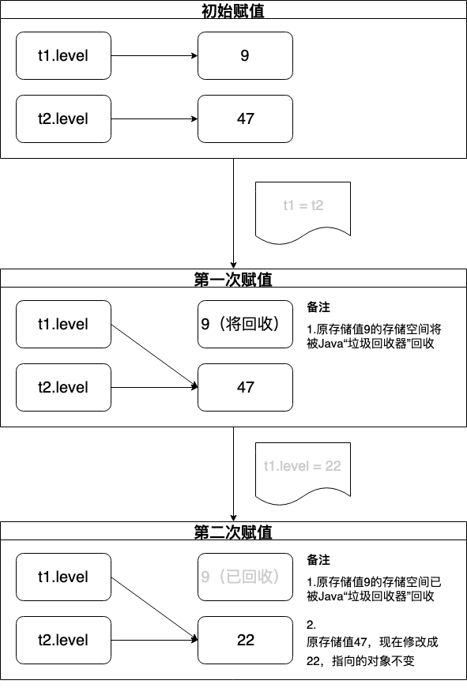

# 二.基本语法

## 1. 基本运算

- 副作用——defaulte 如何验证
  - 运算符改变操作数本身的值 <!--比如++、--这类操作符------>

### 1.1 赋值

- 规则：使用操作符"="

- 赋值分类

  - 基本类型赋值：直接将内容复制到另一个地方

  - 对象类型赋值：将“引用”从一个地方复制到另一个地方（**一个对象对应多个引用，一个引用可能有0或1个对象**），类似指针，由于原来的指针指向新的对象，原来的对象将被垃圾回收器清理，具体可见以下实现

    ```java
    class Tank{
      int level;
    }
    public class Assignment{
      public static void main(String[] args){
        // 赋值前
        Tank t1 = new Tank();
        Tank t2 = new Tank();
        t1.level = 9;
        t2.level = 47;
        print(t1+","+t2);
        // 第一次赋值
        t1 = t2; 
        print(t1+","+t2);
        // 第二次赋值
        t1.level = 22;
        print(t1+","+t2);
      }
    }
    /*
    output:
    9,47
    47,47
    22,22
    */
    ```

- 别名现象解析

  - 代码片段（见赋值分类的对象类型赋值）

  - 原理分析

    - 第一次赋值是将t2的指向修改为与t1一致，同时指向同一个对象，因为t1和t2都是引用

    - 第二次赋值是将t1和t2指向的同一个对象中的level值修改了

      

### 1.2 算术操作符

- 种类

  - 加号+、减号-、除号/、乘号*，取模%
  - 整数除法会直接去掉结果的小数位，不会四舍五入

- 规则

  - 当参与/运算的两个数都为整数时，表示整数除法；否则，表示为浮点数除法

    <!--比如“15/2 = 7”；“15.0/2 = 7.5”-->

- Random方法

  - Random为生成伪随机数的类，使用nextInt()/nextFloat()方法获取随机数

  - 产生随机小写字母的方法：Random.nextInt(26)+'a'

  - 如果种子参数相同，则生成的随机数也相同，见下方

    ```java
    package com.four;
    import java.util.Random;
    public class TestRandom {
        public static void main(String[] args) {
    				// 种子数相同      
            Random random1 = new Random(10);
            Random random2 = new Random(10);
            int i = random1.nextInt();
            int j = random2.nextInt();
            System.out.println("i="+i);
            System.out.println("j="+j);
        }
    }
    /* output:
    i=-1157793070
    j=-1157793070
    */
    ```

### 1.3  一元加、减操作符

- 一元减号：转变数据的符号，或修改数据类型

- 一元加号：将数据类型修改为int类型

   <!--比如原类型为char，添加加号输出后，结果是对应的ASCII码的值-->

  ```java
  package com.four;
  public class TestAdd {
      public static void main(String[] args) {
          int i = 1;
          char j = 'c';
          short k = 5;
          System.out.println(i);
          System.out.println(j);
          System.out.println(k);
          System.out.println("添加加号");
          System.out.println(+i);
          System.out.println(+j);
          System.out.println(+k);
          System.out.println("添加减号");
          System.out.println(-i);
          System.out.println(-j);
          System.out.println(-k);
      }
  }
  /* output
  1
  c
  5
  添加加号
  1
  99
  5
  添加减号
  -1
  -99
  -5
  */
  // /Users/toyz/Package/Note/Thinking in Java/Practice/Operators/src/com/four/TestAdd.java
  ```

### 1.4 自动递增和递减

- 种类

  - 前缀递增、前缀递减：先执行运算，后生成值

  - 后缀递增、后缀递减：先生成值，后执行运算

    <!--测试代码如下-->

    ```java
    package com.four;
    import static util.Print.*;
    public class TestIncreasing {
        public static void main(String[] args) {
            int i = 1;
            int j = i;
            print("i = "+i);
            // 前缀递增
            j = ++i;
            print("前缀递增后");
            print("i = "+i);
            print("j = "+j);
            i = 1;
            j = i;
            // 前缀递减
            j = --i;
            print("前缀递减后");
            print("i = "+i);
            print("j = "+j);
            i = 1;
            j = i;
            // 后缀递增
            j = i++;
            print("后缀递增后");
            print("i = "+i);
            print("j = "+j);
            i = 1;
            j = i;
            // 后缀递减
            j = i--;
            print("后缀递减后");
            print("i = "+i);
            print("j = "+j);
            i = 1;
            j = i;
        }
    }
    /* output
    i = 1
    前缀递增后
    i = 2
    j = 2
    前缀递减后
    i = 0
    j = 0
    后缀递增后
    i = 2
    j = 1
    后缀递减后
    i = 0
    j = 1
    */
    // /Users/toyz/Package/Note/Thinking in Java/Practice/Operators/src/com/four/TestIncreasing.java
    ```

### 1.5 关系操作符

- 种类

  - 大于、小于、大于等于、小于等于、等于(==)、不等于(!=)
  - 等于和不等于适用所有基本数据类型，其他比较符不使用boolean类型

- equals和等号的区别——面试题

  - 等号（==）

    - 基本数据类型（也称原始数据类型） ：byte,short,char,int,long,float,double,boolean。他们之间的比较，应用双等号（==）,比较的是他们的值。
    - 引用数据类型：当他们用（==）进行比较的时候，比较的是他们在内存中的存放地址（确切的说，是**堆内存**地址）
- equals
  
  - 方法的初始默认行为是比较对象的内存地址值
    - 在一些类库当中这个方法被重写了，如String、Integer、Date，比较对象的成员变量值是否相等
  
- equals方法重写后，需要重写hashCode方法——面试题

  原因：以比较对象的成员变量值是否相等为目的而重写equals方法后，为保证符合规则“2个对象equals，那么 hashCode一定相同规则”

   <!--比如：Test类对象有2个字段，num和data，这2个字段代表了对象的状态，他们也用在equals方法中作为评判的依据。那么， 在hashCode方法中，这2个字段也要参与hash值的运算，作为hash运算的中间参数-->

### 1.6 逻辑操作符

- 种类

  - 与（&&）、或（||）、非（!）
  - 以上三种只能应用于布尔值
  - 在String值的地方使用布尔值，布尔值会自动转换成适当的文本

- 注意

  - &和&&之间的异同——面试题

    - 相同

      1. 都是逻辑与的运算符，运算符两边的表达式结果都为true时，整个运算结果才为true

    - 不同

      1. &&具有短路功能，当能够确定一个表达式的值，就不计算余下的部分

          <!--(i<2)&&(j<2)&&(k<2)中，如果i<2为false，则将不会继续运算后面的表达式，直接返回false-->

      2. &可以用作位运算符

#### 1.6.1短路

- 定义：当能够确定一个表达式的值，就不计算余下的部分

- 演示过程：当判断到(j<2)时为false时，程序不会执行后续判断，直接输出false

  ```java
  import static util.Print.*;
  public class ShortCircuit {
      public static void main(String[] args) {
          int i = 1;
          int j = 2;
          int k = 3;
          print("res:"+((i<2)&&(j<2)&&(k<2)));
      }
  }	
  ```

### 1.7 直接常量

- 作用：使得编译器准确知道需要生成的数据类型

  <!--如果将3.4定义为double类型，增加D能够准确定义，而不会产生是否为Float的歧义-->

- 规则

  - 直接常量的后缀字符标注了类型

    ```
    L代表long
    F代表Float
    D代表Double
    十六进制数字：以前缀0x，后面跟随0～9或小写的a～f来表示
    八进制数字：以前缀0，后面跟随0～7数字来表示
    ```

- 实现：定义直接常量

  ```java
  public class MyTest1 {
      public static void main(String[] args) {
          MyTest1 myTest1 = new MyTest1();
          double i1 = 3.4D;
          Object obj1 = i1;
          if (obj1 instanceof Integer){
              System.out.println("Integer");
          }
          if (obj1 instanceof Double){
              System.out.println("Double");
          }
      }
  }
  /* output
  Double
  */
  ```

  > 程序设计时使用e代表“10的幂次”，但是在科学和工程领域，e代表自然对数的基数

### 1.8 指数计数法

> 程序设计时使用e代表“10的幂次”，但是在科学和工程领域，e代表自然对数的基数

### 1.9 按位操作符

- 运算方式

  - &、|、^、~
  - 与、或、异或、取反
  - **异或：相同则为零，不同则为1 <!--比如两个开关控制一个灯，1为开，0为关。当两个开关都为关，则关，两个开关都为开则关，两个开关一个开则为开-->**

- 运算规则

  1. &:  1&1=1 , 1&0=0 , 0&1=0 , 0&0=0
  2. |: 1|1=1 , 1|0=1 , 0|1=1 , 0|0=0
  3. ^: 1^1=0 , 1^0=1 , 0^1=1 , 0^0=1
  4. ~: ~1=0 , ~0=1

- 进制运算

  1. **二进制转为十六进制：小数点左边向左开始，右边向右开始，各取4位，不足的向左（向右）补零**
     1. 二进制：010101 —— 十六进制：15
     2. 第一步：二进制分为：01，0101
     3. 第二步：补全：0001，0101
     4. 第三步：0001为1，0101为5（计算的时候要把顺序倒过来，0101看成1010计算）

- 使用二进制表示负数

  1. 获得原码:00101111

  2. 获得反码:11010000

  3. 获得补码(反码加一，表示原码负数):11010001

     <!--原码末尾为零，反码加一需要向前进位-->

### 1.10 移位操作符

- 左移操作符（<<）:操作数向左移动，低位补零

- 右移操作符（>>）：操作数向右移动，当符号为正，高位补零；当符号为负，高位补1

- 无符号右移操作符（>>>）：无论正负，都在高位插入零

  <!--byte和short类型使用位移运算时，会先转换成int类-->

### 1.11 三元操作符

- if-else操作符，形式为boolean-eep ? value1 : value2

  当结果为true时，就计算value1；当结果为false，就计算value2

- 使用时需要注意可读性

### 1.12 字符串操作符+和+=

- 实现：需要考虑计算的优先级

```java
package com.thirteen;

import static util.Print.*;

public class PrintString {
    public static void main(String[] args) {
        int x = 0 , y = 1 , z = 2;
        String s = "x,y,z";
        System.out.println(s+x+y+z);
        System.out.println(s+(x+y+z));
        System.out.println(x+y+z+s);
        System.out.println(x+""+s);
        System.out.println(""+x);
        System.out.println(x+y+z);
    }
}/* output
x,y,z012
x,y,z3
3x,y,z
0x,y,z
0
3
*/
```

### 1.13 类型转换操作符

- 窄化转换：将能容纳更多信息的数据类型转化成无法容纳这么多信息的数据类型，存在风险
- 扩展转换：新类型能够容纳更多信息，安全，不会造成任何信息的丢失
- 规则
  - Java允许将任何基本数据类型转换成别的基本数据类型，但布尔类型不允许任何转换
  - “类”数据类型不允许类型转换，除非使用特殊方法
  - 强制类型转换时，使用instanceof方法判断是否为所属类型

#### 1.13.1 截尾和舍入

- 截尾

  1. float和double转换成整型

     <!--实现：即使四舍五入应该为3，但是截尾不考虑四舍五入-->

     ```java
     public class MyTest3 {
         public static void main(String[] args) {
             // 截尾
             double d1 = 2.63;
             Object dToI1 = (int) d1;
             System.out.println(dToI1);
         }
     }
     /* output
     2
     */
     ```

- 舍入

  1. 使用java.lang.Math中的round()方法

     <!--实现：将实现四舍五入-->

     ```java
     public class MyTest3 {
         public static void main(String[] args) {
             // 舍入
             double d2 = 2.75;
             Object dToI2 = Math.round(d2);
             System.out.println(dToI2);
         }
     }
     /* output
     3
     */
     ```

#### 1.13.2 提升

- 规则

  - 表达式中的最大数据类型决定了表达式最终结果的数据类型

    <!--实现：当double和float相乘，结果为double类型-->

    ```java
    public class MyTest4 {
        public static void main(String[] args) {
            double d = 3.434;
            float f = 23.1f;
            Object obj = d * f;
            if (obj instanceof Float){
                System.out.println("Float");
            }
            if (obj instanceof Double){
                System.out.println("Double");
            }
        }
    }
    /* output
    Double
    */
    ```

## 2. 基本语句

### 2.1 true and false

- 规则
  - 所有条件语句都利用条件表达式的真假来决定执行路径

### 2.2 if-else

- 结构

  ```java
  if(Boolean expression)
  	statement
  else if(Boolean expression)
  	statement
  else
  	statement
  ```

### 2.3 迭代

- 结构

  ```java
  while(Boolean expression)
  	statement
  ```

- 规则

  - 在循环刚开始时会计算一次，下一次迭代开始前会再计算一次，直到得到“假”的结果

  ### 4.3.1 do-while

- 结构

  ```java
  do
  	statement
  while(Boolean expression)
  ```

- 规则

  1. 先执行statement，然后进行判断，如果为true则再次执行do，并进入循环
  2. 相比于while，区别是do-while循环至少会执行一次statement
  3. while使用率高于do-while

### 2.4 for

- 结构

  ```java
  label: for(initialization;Boolean expression;step)
  	statement
  ```

- 规则

  - initialization;Boolean expression;step都可以为空

  - initialization仅首次生效

  - for循环中定义的内容仅在for循环中有效（如int i = 0）

  - **迭代先执行Boolean expression，true后执行statement，再执行step，此为一个循环；**

  - **break是终止当前所在循环，continue是终止本次循环，重新进行下一次循环**

  - 循环中的label标签，使得在循环嵌套中，break和continue退出到指定的循环

    <!--实现：使用循环嵌套和label标签实现输出100以内的素数-->
  
    ```java
    package four;
    import static util.StaticPrint.*;
    public class PrimeNumber {
        public static void main(String[] args) {
            outer:for (int i = 1 ; i < 100 ; i++ ){
                inter:for (int j = 2 ; j < i ; j++ ){
                    if ( i%j == 0){
                      	// 退出到指定的循环
                        continue outer; }
                    }
                print(i+"");
            }
        }
    }
    ```

#### 2.4.1 逗号操作符

- 结构

  ```java
  for(int i = 1, j = 2 ; ;)
  	statement
  ```

- 规则

  - 仅在for循环的initialization中支持定义多个变量
  - 变量的类型需要保持一致

### 2.5 Foreach语法

- 结构

  ```java
  for(type param : params)
  	statement
  ```

- 规则

  - 定义了type类型的变量param，然后将每一个params中的元素赋值给param

    <!--实现-->

    ```java
    package five;
    import static util.StaticPrintnb.*;
    public class TestForeach {
        public static void main(String[] args) {
            for (char c:"You konw what I mean".toCharArray()
                 ) {
                printnb(c+"");
            }
        }
    }
    ```

### 2.6 Reuturn

- 作用

  1. 指定返回值

  2. 导致当前方法退出，并返回值；如果是多重循环，能够直接退出整个循环

     <!--实现：直接退出三层循环-->

     ```java
     package seven;
     
     public class TestReturn {
         public static void main(String[] args) {
             for(;;){
                 for (;;){
                     for (int i = 0 ; i < 100 ; i++ ){
                         System.out.println(i);
                         return;
                     }
                 }
             }
         }
     }
     ```

- 规则

  - 如果一个方法声明它将返回void之外的内容，必须确保每个代码路径都有返回值

  

### 2.7 break and continue

#### 2.7.1 Break

- 规则
  - 强行退出循环，不执行循环中剩余的语句
  - **不执行递增表达式，因此需要手动++**
- GOTO用法
  - **使用 break label，能够从任意循环终止指定的循环**

#### 2.7.2 Continue

- 规则

  - 停止执行当前迭代，退出到循环起始点
  - **不执行递增表达式，因此需要手动++**

- GOTO用法

  - **使用 continue label，能够跳跃到任意循环的起始点**

    <!--实现-->

  ```java
  package four;
  import static util.StaticPrint.*;
  public class PrimeNumber {
      public static void main(String[] args) {
          outer:for (int i = 1 ; i < 100 ; i++ ){
              inter:for (int j = 2 ; j < i ; j++ ){
                  if ( i%j == 0){
                    	// 退出到指定的循环
                      continue outer; }
                  }
              print(i+"");
          }
      }
  }
  ```

### 2.8 Switch

- 简介

  switch为选择语句

- 结构

  ```java
  switch(integral-selector){
    case integral-value1:statement;break;
    case integral-value2:statement;break;
    case integral-value3:statement;break;
    case integral-value4:statement;break;
    default:statement;
  }
  ```

- 规则

  > switch能否作用在byte、long、short、string上——面试题
  >
  > 答案：byte，short可以（因为可以转换成int类型），但是long，String不可以

  - integral-selector和integral-value的值只能为整数表达式或者是枚举常量

    整数表达式可以为int基本类型或者是Integer包装类，由于byte，short，char都能转换为int，因此这些类型以及包装类可以。

  - 匹配成功后，如果没有break会继续执行，直到遇到break或者default，因此后续所有值都会输出

  - case 语句块中没有 break 语句时，JVM 并不会顺序输出每一个 case 对应的返回值，而是继续匹配，匹配不成功则返回默认 case

    <!--实现-->

  ```java
  public class RunSwitch {
      public static void main(String[] args) {
          int i = 2;
          switch (i){
              case 0:
                  System.out.println(0);
              case 1:
                  System.out.println(1);
              case 2:
                  System.out.println(2);
              case 3:
                  System.out.println(3);
          }
      }
  }
  /* output
  2
  3
  */
  ```

### 2.9 Practice

#### 吸血鬼算法

- 题目

  吸血鬼数字是指位数为偶数的数字，可以由一堆数字想乘而得到。而这对数字各包含乘积的一半位数的数字，其中从最初的数字中选取的数字可以任意排序。以两个0结尾的数字是不允许的，例如，下列的数字都是“吸血鬼”数字：

  1260=21*60

  1827=21*87

  2187=27*81

  写出一个程序，找出4位数的所有吸血鬼数字

- 思路

  - 个人思路
    1. 使用两位数的循环相乘得出四位数
    2. 将两个两位数和四位数分别拆成单个字符，保存在List中
    3. 使用List的equals方法判断是否相等
  - 官方思路
    1. 遍历所有四位数
    2. 将四位数拆分并分别组合成两个两位数，一共有12种搭配方式
    3. 每一种搭配方式都判断
  - 优势
    1. 个人思路能够减少近一半的遍历次数，约3000次

- 实现

  - 个人思路

    ```java
    package ten;
    
    import java.util.*;
    
    public class VampireNumberImp {
        static int VampireJudgeImp(){
            List<Integer> VampireArray = new ArrayList<Integer>();
            List<Character> ikList = new ArrayList<Character>();
            List<Character> sumList = new ArrayList<Character>();
            int point = 0;
            for (int i = 11 ; i < 100 ; i++ ){
                for (int k = i ; k < 100 ; k++){
    
                    int sum = i * k;
                    // 判断是否为四位数,判断是否为两个零结尾
                    if ( sum < 1000 || sum > 9999 || sum % 100 == 0 || VampireArray.contains(sum)){
                        continue;
                    }
                    point++;
                    // 判断是否为吸血鬼数字
                        // 将数字添加进list
                        ikList.add((char) (i / 10));
                        ikList.add((char) (i % 10));
                        ikList.add((char) (k / 10));
                        ikList.add((char) (k % 10));
                        sumList.add((char) (sum / 1000));
                        sumList.add((char) (sum % 1000 / 100));
                        sumList.add((char) (sum % 1000 % 100 / 10));
                        sumList.add((char) (sum % 10));
                        // 数字排序
                        Collections.sort(ikList);
                        Collections.sort(sumList);
                        // 判断是否为吸血鬼数字
                        if (ikList.equals(sumList)){
                            VampireArray.add(sum);
                            System.out.println(sum);
                        }
                    ikList.clear();
                    sumList.clear();
                }
            }
            return point;
        }
        public static void main(String[] args) {
            long startTime=System.currentTimeMillis();
            int point = VampireJudgeImp();
            // 测试代码执行时间
            long endTime=System.currentTimeMillis();
            System.out.println("程序运行时间： "+(endTime - startTime)+"ms");
            System.out.println("程序运行次数： "+point+"次");
        }
    }/* output
    1395
    1260
    1827
    2187
    1530
    1435
    6880
    程序运行时间： 19ms
    程序运行次数： 3210次
    */
    ```

  - 官方思路

    ```java
    package ten;
    
    public class VampireNumberOfficial {
        static int a(int i) {
            return i/1000;
        }
        static int b(int i) {
            return (i%1000)/100;
        }
        static int c(int i) {
            return ((i%1000)%100)/10;
        }
        static int d(int i) {
            return ((i%1000)%100)%10;
        }
        static int com(int i, int j) {
            return (i * 10) + j;
        }
        static void productTest (int i, int m, int n) {
            if(m * n == i) System.out.println(i + " = " + m + " * " + n);
        }
        public static void main(String[] args) {
            long startTime=System.currentTimeMillis();
            for(int i = 1001; i < 9999; i++) {
                productTest(i, com(a(i), b(i)), com(c(i), d(i)));
                productTest(i, com(a(i), b(i)), com(d(i), c(i)));
                productTest(i, com(a(i), c(i)), com(b(i), d(i)));
                productTest(i, com(a(i), c(i)), com(d(i), b(i)));
                productTest(i, com(a(i), d(i)), com(b(i), c(i)));
                productTest(i, com(a(i), d(i)), com(c(i), b(i)));
                productTest(i, com(b(i), a(i)), com(c(i), d(i)));
                productTest(i, com(b(i), a(i)), com(d(i), c(i)));
                productTest(i, com(b(i), c(i)), com(d(i), a(i)));
                productTest(i, com(b(i), d(i)), com(c(i), a(i)));
                productTest(i, com(c(i), a(i)), com(d(i), b(i)));
                productTest(i, com(c(i), b(i)), com(d(i), a(i)));
            }
            long endTime=System.currentTimeMillis();
            System.out.println("程序运行时间： "+(endTime - startTime)+"ms");
          }
    }/*output 
    1260 = 21 * 60
    1395 = 15 * 93
    1435 = 41 * 35
    1530 = 51 * 30
    1827 = 87 * 21
    2187 = 27 * 81
    6880 = 86 * 80
    6880 = 80 * 86
    程序运行时间： 54ms
    */
    ```