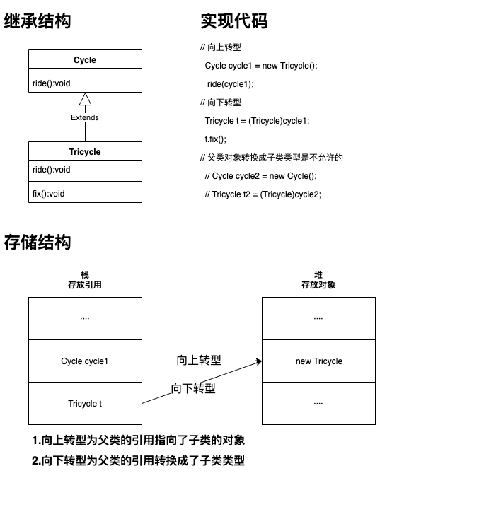

# 五.多态

## 1.基本概念

- 多态 定义：事物存在的多种形态

  <!--存在基类和与基类通讯的方法，即使新增多个导出类，导出类各种变化，与基类通讯的方法在接受导出类时依旧正常运行-->

- 特点

  - **自始至终都是子类对象发生转换**
  - 消除类型之间的耦合关系
  - 提高扩展性 <!--方法接收父类引用的参数，方法能够接收子类-->

- 实现

  - 父类的引用指向子类对象

  - 父类的引用可以接收子类对象

    ```java
    //	父类
    class Father{};
    //	子类
    class Son{};
    //	父类的引用指向子类的对象
    Father f = new Son();
    ```

- 前提

  - 类与类的有关系，要不继承（extends），要不实现（implements）。
  - 存在覆盖 <!--比如都有的方法，则能够覆盖-->

- 规则

  - 静态方法是和类关联，而不是和单个对象，因此静态方法无法表现出多态
  - Java中的所有方法都是通过动态绑定来实现多态，因此编写只与基类交互的方法，导出类都可以运行
  - 协变返回类型是子类覆盖父类方法，保证方法名相同，返回值可以是父类的子类，可以使得返回值更加具体

- 弊端

  - 只能使用父类的引用访问父类的成员

- 推导

  1. 假如有动物，猫和狗，他们都要吃东西，但是吃的东西不一样，所以建立父类抽象类：动物，同时建立抽象方法：吃东西

     ```java
     //	父类，且为抽象类
     abstract class Animal{
       abstract void eat();
     } 
     
     //	狗
     class Dog extends Animal{
       void eat(){
         System.out.println("骨头");
       }
     }
     //	猫
     class Cat extends Animal{
       void eat(){
         System.out.println("鱼");
       }
     }
     // 测试类
     class duotai{
       public static void main(String[] args){
         Dog d = new Dog();
         d.eat();
         Cat c = new Cat();
         c.eat();
         //	问题a：如果增加一只猫的对象，还需要再用新对象调用Cat共有的方法，因此考虑将方法抽取出来
         Cat c1 = new Cat();
         c1.eat();
       }
     }
     ```

  2. 问题1：如上，如果增加一只猫的对象，还需要再用新对象调用Cat共有的方法，因此考虑将方法抽取出来

     ```java
     //	父类，且为抽象类
     abstract class Animal{
       abstract void eat();
     } 
     
     //	狗
     class Dog extends Animal{
       void eat(){
         System.out.println("骨头");
       }
     }
     //	猫
     class Cat extends Animal{
       void eat(){
         System.out.println("鱼");
       }
     }
     //	猪
     class Pig extends Animal{
       void eat(){
         System.out.println("饲料");
       }
     }
     
     // 测试类
     class duotai{
       //	解决方法a：提取出来的方法
       public static void function(Dog d){
         d.eat();
       }
       public static void function(Cat c){
         c.eat();
       }
       // 问题b：如果增加一个新类型的动物：猪。那需要重新写测试类中的function方法
       public static void function(Pig p){
         p.eat();
       }
       
       public static void main(String[] args){
         //Dog d = new Dog();
         //function(d);
         //Cat c = new Cat();
         //function(c);
        	  // 这时候增加一只猫，直接调用function的方法，还能最终省略为37行的形式
         //Cat c1 = new Cat();
         //function(c1);
         function(new Dog());
         function(new Cat());
         function(new Cat());
         
       }
     }
     ```

  3. 问题b：如果增加一个新类型的动物：猪。那需要重新写测试类中的function方法

     ```java
     //	父类，且为抽象类
     abstract class Animal{
       abstract void eat();
     } 
     
     //	狗
     class Dog extends Animal{
       void eat(){
         System.out.println("骨头");
       }
     }
     //	猫
     class Cat extends Animal{
       void eat(){
         System.out.println("鱼");
       }
     }
     //	猪
     class Pig extends Animal{
       void eat(){
         System.out.println("饲料");
       }
     }
     
     // 测试类
     class duotai{
       //	解决方法b：将function方法接收的参数类型换成这些子类的父类，再增加动物类，就不需要新增function方法了。体现多态增加扩展性的特点
       public static void function(Animal a){
         a.eat();
       // 问题b：如果增加一个新类型的动物：猪。那需要重新写测试类中的function方法
       //public static void function(Pig p){
       //  p.eat();
       //}
       
       public static void main(String[] args){
         function(new Dog());
         function(new Cat());
         function(new Cat());
       }
     }
     ```

  4. 以上就是多态的推导，问题c：能不能进一步降低耦合

     ```java
     //	父类，且为抽象类
     abstract class Animal{
       abstract void eat();
     } 
     
     //	狗
     class Dog extends Animal{
       void eat(){
         System.out.println("骨头");
       }
     }
     //	猫
     class Cat extends Animal{
       void eat(){
         System.out.println("鱼");
       }
     }
     //	猪
     class Pig extends Animal{
       void eat(){
         System.out.println("饲料");
       }
     }
     // 解决方法c：将原来在clas duotai中的function方法单独提取出来成为另一个类中的方法
     class DoAnimal{
       public void function(Animal a){
         a.eat();
     }
     
     // 测试类
     class duotai{
       //	因为这个方法单独成为了另一个类的方法，所以删除
       //	public static void function(Animal a){
       	//  a.eat();
       public static void main(String[] args){
         DoAnimal da = new DoAnimal();
         da.function(new Dog());
         da.function(new Cat());
         da.function(new Cat());
       }
     }
     ```

## 2. 转型

### 2.1 基本概念

- 向上转型定义：将父类引用指向子类对象

- 向下转型定义：强制将父类引用转换成子类类型

- 格式

  ```java
  // 基类
  class Father{}
  
  // 导出类
  class Son extends Father{}
  
  // 向上转型
  // 基类类型 变量名 = new 导出类类型
  class Test{
    public static void main(String[] args){
      Father father = new Son();
      father.smell(); //调用的是son的smell方法
    }
  }
  
  // 向下转型
  // 导出类类型 变量名 = （导出类类型）基类变量名
  class Test{
    public static void main(String[] args){
      Father fatherToSon = new Father();
      Son son = (Son)fatherToSon;
      son.laugh(); //如果laugh是son中新增的方法，则当前方法调用报错：ClassCastException
    }
  }
  ```

- 作用

  - 向上转型：如果一个方法接收基类对象，那这个方法也能接收基类的导出类的对象——重点

    <!--举例：基类是哺乳动物，导出类是猴子和大熊猫，另一个不相关的类是农民。农民给动物喂食，只需要给哺乳动物传递信息，即可喂到猴子和大熊猫-->

  - 向下转型：能够使用导出类特有的方法

- 规则

  - 不能将父类的对象转换成子类类型

    <!--比如基类是哺乳动物，导出类是猴子和大熊猫。父类对象是哺乳动物时，向下转型无法确定是猴子还是熊猫，所以转换成子类类型就会出错-->
    
  - Java中，所有转型都会得到检查，如果异常会返回ClassCastException

  - 向上转型，则导出类中扩展的方法将无法使用

    原因：将父类引用指向子类对象，在编译阶段，编译器会在寻找父类引用中寻找子类的扩展方法，但是无法找到扩展方法，因此无法使用

- 实现：向上转型、向下转型、测试父类队形转换成子类类型

  <!--代码-->

  ```java
  // 基类
  public class Cycle {
      protected String name;
      public Cycle() {
          this.name = "Cycle";
      }
  }
  ```

  ```java
  // 导出类
    public class Tricycle extends Cycle{
    public Tricycle() {
        this.name = "Tricycle";
      }
      //	导出类特有方法
      public fix(){};
    }
  ```

  ```java
   public class Test {
        static void ride(Cycle cycle){
          System.out.println(cycle.name);
        }
    public static void main(String[] args) {
      //	向上转型
      Cycle cycle1 = new Tricycle();
      ride(cycle1);
      
      //	向下转型
      Tricycle t = (Tricycle)cycle1;
      t.fix();
      
      //	父类对象转换成子类类型是不允许的
      //	Cycle cycle2 = new Cycle();
      //	Tricycle t2 = (Tricycle)cycle2;
    }
        }
  /* output
  Tricycle
  */
  ```

  <!--原理-->

  

## 3. 成员特点

### 3.1 基本概念

- 绑定 定义：方法调用(对象.方法名)和方法主体(方法的实现)之间关联

- 分类

  - 前期绑定：在程序运行前绑定。包括：final，static，private，构造方法，成员变量（包括静态及非静态） 详情见 <u>三.字节码</u>

  - 后期绑定（动态绑定）：在运行时绑定。除了前期绑定之外的其他方法属于后期绑定，运行时能判断对象的类型进行绑定。

### 3.2 成员函数

  - 在编译期间，参阅引用型变量（左边Father father）所属的类中是否有调用的方法。有则编译通过。

  - 在运行期间，参阅对象型变量（右边new Father()）所属的类中是否有调用的方法

  - 原因：非静态方法为后期绑定，子类对象中存在this.method1,super.method1，运行时使用this.method1 

  - 实现

    ```java
    //	超类
    class Father {
      void method1(){
        System.out.println("father method1");
      }
      void method2(){
        System.out.println("father method2");
      }
    }
    //	子类
    class Son extends Father {
      void method1(){
        System.out.println("son method1");
      }
      void method3(){
        System.out.println("son method3");
      }
    }
    //	测试类
    class TestPoly {
      public static void main(String[] args) {
        Father father = new Son();
        father.method1();
        father.method2();
        //	编译失败，因为编译过程中不生成对象，查找Father中的method3方法，无法找到
        //	father.method3();
      }
    }
    /* output
    son method1
    father method2
    */
    ```

### 3.3 成员变量

  - 无论编译还是运行，参阅引用型变量所属的类（左边）

  - 原因：变量为前期绑定，名称为super.num和this.num，当调用father.num时，调用的是super.num，因为已经前期绑定了

  - 实现

    ```java
    //	基类
    class Father {
        int num = 5;
    }
    //	导出类
    class Son extends Father {
        int num = 8;
    }
    //	测试类
    class TestPoly {
        public static void main(String[] args) {
            Father father = new Son();
            Father father1 = new Father();
          
            System.out.println(father.num);
            System.out.println(father1.num);
        }
    }
    /* output
    5
    5
    */
    ```

### 3.4 静态成员函数

  - 无论编译还是运行，参阅引用型变量所属的类（左边）

  - 实现

    ```java
    //	基类
    class Father {
        static void method4(){
            System.out.println("father method4");
        }
    }
    //	导出类
    class Son extends Father {
        static void method4(){
            System.out.println("son method4");
        };
    }
    //	测试类
    class TestPoly {
        public static void main(String[] args) {
            Father father = new Son();
            Father father1 = new Father();
            //  静态成员函数
            father.method4();
            father1.method4();
        }
    }
    /* output
    father method4
    father method4
    */
    ```


### 3.5 构造器

- 问题：在基类的构造器内部调用导出类中重写基类的动态方法，如果该动态方法操纵某个成员，则会出现该成员还未初始化就被调用的情况

- 原因：**在任何事物之前，会将分配给对象的存储空间初始化为二进制的零**。这就是实现中，输出结果“Cat run i:0”为零的原因。

- 实现

  <!--基类-->

  ```java
  // base class
  class Animal {
      void run(){
          print("Ani Run");
      }
      // 构造函数
      Animal() {
          print("Ani Con before run()");
          // 多态，因此会调用导出类中的run方法
          run();
          print("Ani Con after run()");
      }
  }
  ```

  <!--导出类-->

  ```java
  class Cat extends Animal{
      private int i = 1;
  
      Cat(int r) {
          this.i = r;
          print("Cat Con i:"+i);
      }
      @Override
      void run(){
          print("Cat run i:"+i);
      }
  }
  
  ```

  <!--测试类-->

  ```java
  public class TestAC {
      public static void main(String[] args) {
          new Cat(5);
      }
  }/* output
  Ani Con before run()
  Cat run i:0
  Ani Con after run()
  Cat Con i:5
  */
  ```

  <!--解析-->

  - 流程：
    1. 新建Cat对象，存在父类，因此优先初始化父类
    2. 调用父类构造器，输出“Ani Con before run()”
    3. 调用run方法，因为重写方法是动态行为，因此运行时会查找对象的实际类型，如果找到则调用实际类型中的方法；同时Cat类并未初始化，已完成连接，因此i变量被赋予的是默认值0；因此输出“Cat run i:0”
    4. 然后输出“Ani Con after run()”
    5. 最后调用Cat的构造器进行加载，此时Cat类初始化已经进行，所以i的值为5


