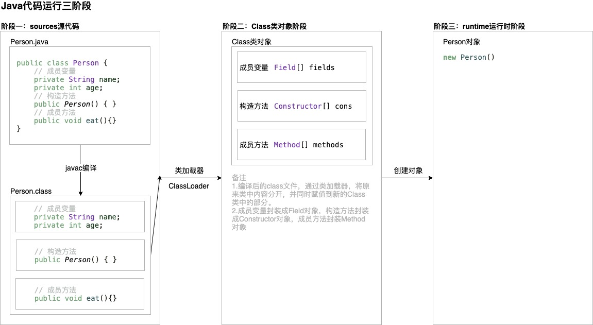

# 四.复用类

## 1. 复用

- 分类
  - 组合：在新的类中生成现有类的对象
  - 继承：按照现有类的类型创造新类，采用现有类的形式并添加新代码

## 2. 组合

- 组合 定义：在类中创建现有类的对象

- 初始化引用的方式

  1. 定义对象时初始化。能够在构造器调用前初始化

  2. 在类的构造器中

  3. 需要使用时才初始化（也称为惰性初始化）。可减少负担

  4. 使用实例初始化

     <!--实现-->

```java
public class ReferenceInitialization {
    private Reference1 reference4;
    // 1.在定义对象时初始化引用
    private Reference1 reference1 = new Reference1("1.在定义对象时初始化引用") ;

    ReferenceInitialization(){
        // 2.在类的构造器中初始化引用
        Reference1 reference2 = new Reference1("2.在类的构造器中初始化引用");
    }

    // 4.使用实例初始化
    {
        reference4 = new Reference1("4.使用实例初始化");
    }

    public static void main(String[] args) {
        ReferenceInitialization referenceInitialization = new ReferenceInitialization();
        // 3.需要使用对象时，才初始化引用
        Reference1 reference3 = new Reference1("3.需要使用对象时，才初始化引用");
    }
}
```

```java
public class Reference1 {
    protected Reference1(String s){
        System.out.println(s);
    }
}
```

## 3. 继承

> 创建类时，总是在继承。因为创建的类基本是隐式继承Object类

### 3.1 基本概念

- 继承 定义：基于已有的类构造新类

- 作用

  - 提高代码复用性
  - 让类与类产生关系，是实现多态的基础

- 规则

  - 基类的所有数据成员为private类型，所有方法为public或者protected类型，这是推荐使用的规则

  - 继承自超类的子类，能够访问超类中的数据成员和方法（非private类型）

  - 子类中调用超类方法，使用 super.方法名 关键字 

  - 子类中能够直接添加新方法

  - 类不能多继承，但支持多层继承

    原因是：子类多继承后，如果存在名称相同的方法，无法确定执行

### 3.2 向上转型

- 向上转型 定义：使用父类引用指向子类对象or子类对象赋值给父类引用 <u>详细查看 五.多态</u>

  <!--实现-->

  ```java
  // 父类
  public class Amphibian {}
  ```

  ```java
  // 子类
  public class Frog extends Amphibian{
      public static void main(String[] args) {
          // 向上转型，将父类引用指向子类对象
          Amphibian amphibian = new Frog();
      }
  }
  ```

- **作用：只需要和父类打交道，不依赖子类——重点**

  <!--实现-->

  ```java
  public class AnimalControl {
      public void tech(Amphibian amphibian){
          amphibian.b();
      }
  
      public static void main(String[] args) {
          Frog frog = new Frog();
          AnimalControl animalControl = new AnimalControl();
          // tech可接受Amphibian的子类
          animalControl.tech(frog);
      }
  }
  ```

### 3.3 初始化基类

- 注意点

  - 子类无法覆盖父类的构造函数，因为不同名

  - **子类的所有构造函数都默认访问父类的空参构造函数（因为有隐式super语句）**

    原因：因为父类数据可以被子类获取，所以子类在创建对象时，需要参考父类是如何对这些数据进行初始化的

    <!--实现-->

    ```java
    public class MyTest2 extends Super {
        // 子类
        public MyTest2() {
        }
        
    }
    // 超类
class Super{}
    ```
    
    <!--反编译-->
    
    ```java
    0 aload_0
    1 invokespecial #1 <random/extend4/Super.<init>>
    4 return
    ```
    
<!--解析-->
    
    1. 子类的构造函数反编译中，对超类进行了初始化
  
  - 如果基类中有带参数的构造器，没有默认的构造器，或者是想调用基类的含参构造器，需要使用super(参数)方法来调用基类的含参构造器，并放在构造器起始位置。
  
    <!--验证-->
  
    ```java
    // 基类
    public class Art {
        Art(int i){
            System.out.println("Art Constructor:"+i);
        };
    }
    ```

    ```java
  // 基类的子类
    public class Drawing extends Art{
        Drawing(int i){
          	// 调用基类的有参构造器，super(s)将s的值传输到基类中使用
            super(i);
            System.out.println("Drawing Constructor:");
        	// super(1); 需要将初始化基类放在起始位置，不然编译器会报错
        }
    }
    ```
  
    ```java
  // 基类的子类的子类
    public class Cartoon extends Drawing {
            Cartoon(int i){
            		super(i)
                System.out.println("Cartoon Constructor:"+i);
            }
        public static void main(String[] args) {
            Cartoon cartoon = new Cartoon(11);
        }
    }/* output
    Art Constructor:11
    Drawing Constructor:11
  Cartoon Constructor:11
    */
  ```
  
- 子类的构造函数第一行也能通过this来访问本类中的构造函数，但是必定有本类中的构造函数会访问父类的构造函数。同时this和super都必须在第一行
  
    ```java
    // 基类
    public class Art {
        Art(){
            System.out.println("Art Constructor:");
        };
    }
  
    ```
  
    ```java
    // 基类的子类
    public class Drawing extends Art{
      Drawing(){
        // 当前构造器将调用基类构造器，同时当前构造器被本类中的有参构造器调用
        System.out.println("Drawing Constructor:");
      }
        
      Drawing(int i){
      // 使用this关键字，因此会调用当前类的无参构造器
        this();
        System.out.println("Drawing Constructor:"+i);
      }
    }
    ```
  

### 3.4 组合和继承选择

- 组合：新类中嵌入对象，让其实现所需要的功能。<!--比如房子有床、窗等对象组合而成-->

- 继承：使用现有类，并开发一个特殊版本 <!--比如交通工具中，轿车是交通工具的特殊类-->

- 判断方法：确认是否需要从新类向基类进行向上转型，如果是，则使用继承

- 建议：优先使用组合，必要时使用继承，因为组合的灵活性更好。无论是子类继承父类方法，还是子类重写父类方法，都属于静态复用，无法在运行时改变

  <!--比如，父类是去骑车天安门，子类重写父类方法为骑车去泰山，但是无法实现先骑车后开车去泰山-->

## 4. 代理

- 代理 定义：通过代理对象访问目标对象，代理对象是目标对象的扩展，并调用目标对象

- 原理：在代理类中生成private的目标类的对象，重写方法，并使用生成的目标类对象的方法

  <!--实现-->

  ```java
  // 目标对象
  public class ShipControls {
      void up(int step){
          System.out.println(step);
      };
      void down(int step){};
      void left(int step){};
      void right(int step){};
  }
  ```

  ```java
  // 代理对象
  public class ShipControlsDelegation {
      private String name;
      private ShipControls controls = new ShipControls();
  
      public ShipControlsDelegation(String name) {
          this.name = name;
      }
      // 代理对象将值传递给底层的controls对象
      public void up(int step){
          controls.up(step);
      }
      public void down(int step){
          controls.down(step);
      }
      public void left(int step){
          controls.left(step);
      }
      public void right(int step){
          controls.right(step);
      }
  
      public static void main(String[] args) {
          ShipControlsDelegation shipControlsDelegation = new ShipControlsDelegation("delegation1");
          shipControlsDelegation.up(5);
      }
  }
  ```

## 5. Object类

### 5.1 equals

- 特点
  - 自反性：x为任何非空引用，x.equals(x)应该返回true
  - 对称性：对于任何引用x，y，当且仅当x.equals(y)返回true，则y.equals(x)返回也为true
  - 传递性：对于任何引用x，y，z，如果x.equals(y)返回true，y.equals(z)返回true，则x.equals(z)返回也为true
  - 一致性：如果x，y引用的对象没有变化，则x.equals(y)应一直返回true
- equals和等号的区别——重点 详情见 <u>二.基本语法</u>
  - 等号（==）
    - 基本数据类型（也称原始数据类型） ：byte,short,char,int,long,float,double,boolean。他们之间的比较，应用双等号（==）,比较的是他们的值。
    - 引用数据类型：当他们用（==）进行比较的时候，比较的是他们在内存中的存放地址（确切的说，是**堆内存**地址）
  - equals
    - 方法的初始默认行为是比较对象的内存地址值
    - **在一些类库当中这个方法被重写了，如String、Integer、Date，比较对象的成员变量值是否相同**
- 合理的equals重写逻辑
  1. 显示参数声明为Object <!--覆盖equals方法-->
  2. 判断是否引用同一对象 <!--相比于判断域，当前判断成本低-->
  3. 判断是否为空
  4. 判断是否属于同一类 <!--使用getClass()和instanceof-->
  5. 将比较对象转换成相应类型的变量
  6. 域的比较 <!--使用==比较基本类型域，使用equals比较对象域-->

### 5.2 hashCode方法

- 散列码（hash code） 定义：是由对象导出的一个整型值 <!--对象才有，因此基本数据类型需要转成包装类-->

- 注意

  - 字符串和基本数据类型的包装类创建的对象存在hashCode相同的情况，因为是由内容导出的

    <!--实现-->

    ```java
    public class TestHashCode {
        public static void main(String[] args) {
            String s1 = "a";
            String s2 = "a";
            Integer i = 10;
            Integer k = 10;
            System.out.println(s1.hashCode());
            System.out.println(s2.hashCode());
            System.out.println(s1.equals(s2));
            System.out.println(i.hashCode());
            System.out.println(k.hashCode());
            System.out.println(i.equals(k));
        }
    }/* output
    97
    97
    true
    10
    10
    true
    */
    ```

  - **如果重新定义equals方法，就必须重新定义hashCode方法，以便用户可以将对象插入到散列表中。如果重新定义，会出现equals相等，hashCode不等——面试题**

    原因：hashCode方法一般的规定：hashCode()和equals()保持一致，如果equals方法返回true，那么两个对象的hasCode()返回值必须一样。如果equals方法返回false，hashcode可以不一样，但是这样不利于哈希表的性能，一般我们也不要这样做。

       假设两个对象，重写了其equals方法，其相等条件是属性相等，就返回true。如果不重写hashcode方法，其返回的依然是两个对象的内存地址值，必然不相等。这就出现了equals方法相等，但是hashcode不相等的情况。这不符合hashcode的规则

    <!--equals与hashCode的定义必须一致，两个对象equals为true,就必须有相同的hashCode。反之则不成立。-->

    <!--如果定义的equals比较的是雇员ID，那么hashCode就需要散列ID，而不是雇员的姓名或住址-->

### 5.3 toString方法

- 用途：返回表示对象值的字符串

- 注意

  - toString方法常见的原因：当对象与一个字符串通过操作符+连接，编译将自动使用toString方法

    <!--实现-->

    ```java
    public class TestToString {
        String name = "asd";
    
        public static void main(String[] args) {
            TestToString testToString = new TestToString();
            System.out.println(testToString+"jkl");
        }
    }/* output
    Five.TestToString.TestToString@1218025cjkl
    */
    ```

  - 建议重写toString方法，默认调用的方法可读性较差

    <!--实现-->

    ```java
    public class TestToString {
        String name = "asd";
    
        @Override public String toString() {
            return "TestToString{" + "name='" + name + '\'' + '}';
        }
    
        public static void main(String[] args) {
            TestToString testToString = new TestToString();
            System.out.println(testToString+"jkl");
        }
    }/* output
    TestToString{name='asd'}jkl
    */
    ```

### 5.4 getClass方法

- 用途：返回包含对象信息的类对象

  <!--实现-->

  ```java
  public class TestToString {
      String name = "asd";
  
      public static void main(String[] args) {
          TestToString testToString = new TestToString();
          System.out.println(testToString.getClass());
      }
  }/* output
  class Five.TestToString.TestToString
  */
  ```

## 6. 泛型数组列表

- 泛型 定义：Java 泛型的参数只可以代表类，不能代表个别对象

#### 1. ArrayList

- 定义：采用类型参数的泛型类

  <!--实现-->

  ```java
  // 使用方法
  ArrayList<Employee> staff = new ArrayList<Employee>();
  // 泛型的类型为Employee
  ```

- 规则

  - 使用add方法增加新数据。如果空间用尽，则自动创建更大的数组，并将原数据拷贝到更大的数组中
  - 使用size方法获取实际元素数量
  - 使用trimToSize将清除多余的存储空间
  - 使用get和set方法访问和设置元素

- 注意

  - 数组列表和数组大小的核心区别：数组分配100的空间是已经在内存中存在的；数组列表在仅是具备存储100的潜力，即使是完成了初始化之后
  - 使用时，指定泛型的类型。因为不指定泛型类型，存储和修改数据接受任意类型对象，因为使用的是Object

## 7. 反射——重点

### 7.1 基本概念

- 反射 定义：支持分析类的能力的程序

- 反射机制：将类中的各个部分封装成其他对象

  原理图

  

- **获取Class对象的三种方式**

  - Class.forName("全类名"):在第一阶段，将字节码文件加载进内存，然后获取Class对象

    多用于配置文件

  - 类名.class:在第二阶段，通过类名的class属性

    多用于参数的传递

  - 对象.getClass()：在第三阶段，通过Object的getClass方法获取

    多用于对象的字节码的获取

    <!--实现-->

    ```java
    public class TestReflectionClass {
        public static void main(String[] args) throws Exception {
            /*
            Class对象获取的三种方式
            1.通过Class.forclass("全类名")获取
            2.通过类名.class()获取
            3.通过对象.getClass()方法
            */
            // 1.通过Class.forclass("全类名")获取
            Class cls1 = Class.forName("Five.TestReflection.Person");
            System.out.println(cls1);
            // 2.通过类名.class()获取
            Class cls2 = Person.class;
            System.out.println(cls2);
            // 3.通过对象.getClass()方法
            Person p = new Person();
            Class cls3 = p.getClass();
            System.out.println(cls3);
            // 4.比较三个class引用所指向的是否为同一个Class对象
            System.out.println("比较三个class引用所指向的是否为同一个Class对象");
            System.out.println("cls1 == cls2:"+(cls1 == cls2));
            System.out.println("cls1 == cls2:"+(cls1 == cls3));
        }
    }/* output
    class Five.TestReflection.Person
    class Five.TestReflection.Person
    class Five.TestReflection.Person
    比较三个class引用所指向的是否为同一个Class对象
    cls1 == cls2:true
    cls1 == cls2:true
    */
    ```

- 注意

  - **同一个字节码文件（.class）在一次程序运行中只加载一次，所以三种获取Class对象的方式获取到的Class对象都是同一个**

- 作用

  - 在运行时分析类的能力

  - 在运行时操作对象

    <!--举例-->

    <!--运行过程中，以下出现的方法属于Class类对象中的methods对象中的内容-->

    

  - 实现通用的数组操作代码

  - 利用Mehtod对象，类似C++中的函数指针

### 7.2 Class类

#### 7.2.1 Class对象中的功能

##### 1. 获取成员变量值

<!--可以想象成，Class为一个特殊类，其中Field为成员属性，这个成员属性中存在更加具体的成员属性，并且field这个成员属性能够通过get和set方法来获取和设置值-->

- 规则

  - Field[] getFields()：获取所有的public修饰的成员变量（包括超类）
  - Field getField()：获取指定的public修饰的成员变量（包括超类）
  - Field[] getDeclaredFields()：获取所有的成员变量（即使是private修饰，暴力反射）
  - Field getDeclaredField()：获取指定的成员变量（即使是private修饰，暴力反射）

- 注意

  - **getFields和getDeclaredFields()获取时，getFields能够同时获取到超类和子类中的public变量，getDeclaredFields()只能获取到子类中的所有访问修饰类型的变量**

    <!--实现-->

    ```java
    // 超类
    public class Father {
        // 成员变量
        private String priFatherName;
        private int priFatherAge;
        public String pubFatherName;
        public int pubFatherAge;
    }
    
    // 子类
    public class Son extends Father {
        // 成员变量
        private String priSonName;
        private int priSonAge;
        public String pubSonName;
        public int pubSonAge;
    }
    ```

    ```java
    // 测试类
    package Five.TestReflection;
    
    import java.lang.reflect.Field;
    
    public class TestField {
        public static void main(String[] args) throws Exception {
            /*
            getField和getDeclaredField
             */
            // getField
            System.out.println("--测试getField");
            Field[] field1 = Son.class.getFields();
            for (Field f : field1) {
                System.out.println(f);
            }
            // getDeclaredField
            System.out.println("--测试getDeclaredField");
            Field[] field2 = Son.class.getDeclaredFields();
            for (Field f : field2) {
                System.out.println(f);
            }}}
    /* output
    --测试getField
    public java.lang.String Five.TestReflection.Son.pubSonName
    public int Five.TestReflection.Son.pubSonAge
    public java.lang.String Five.TestReflection.Father.pubFatherName
    public int Five.TestReflection.Father.pubFatherAge
    --测试getDeclaredField
    private java.lang.String Five.TestReflection.Son.priSonName
    private int Five.TestReflection.Son.priSonAge
    public java.lang.String Five.TestReflection.Son.pubSonName
    public int Five.TestReflection.Son.pubSonAge
    */
    ```

    

- Field对象方法

  - get([Object](itss://chm/java/lang/Object.html) obj)：返回的 `Field`表示字段的值，指定对象上

  - **set**([Object](itss://chm/java/lang/Object.html) obj, [Object](itss://chm/java/lang/Object.html) value)：设置域为代表的这 `Field`对象指定对象上的参数指定的新价值

  - setAccessible()：**忽略访问修饰符的安全检查，也称为暴力反射**（如果需要get或者set使用private修饰的变量，则需要使用该方法），用于调试，持久存储，相似机制。

    <!--实现-->

    ```java
    // 超类
    public class Father {
        // 成员变量
        private String priFatherName;
        private int priFatherAge;
        public String pubFatherName;
        public int pubFatherAge;
    }
    
    // 子类
    public class Son extends Father {
        // 成员变量
        private String priSonName;
        private int priSonAge;
        public String pubSonName;
        public int pubSonAge;
    }
    ```

    ```java
    // 测试类
    package Five.TestReflection;
    
    import java.lang.reflect.Field;
    
    public class TestField {
        public static void main(String[] args) throws Exception {
            /*
            get和set方法
             */
            Son son = new Son();
            // get,public
            System.out.println("--测试get方法，使用getField,作用于public修饰对象");
            Field field3 = Son.class.getField("pubSonName");
            Object value3 = field3.get(son);
            System.out.println(value3);
            // get,private
            System.out.println("--测试get方法，使用getField,作用于private修饰对象");
                // 由于getField只能作用于public修饰的成员，因此无法访问
                // Field field4 = Son.class.getField("priSonName");
                // field4.setAccessible(true);
                // Object value4 = field4.get(son);
                // System.out.println(value4);
            			 System.out.println("失败");
            // get,private
            System.out.println("--测试get方法，使用getDeclaredField,作用于private修饰对象");
            Field field5 = Son.class.getDeclaredField("priSonName");
            // 获取前需要忽略访问的安全检查
            field5.setAccessible(true);
            Object value5 = field5.get(son);
            System.out.println(value5);
            // set,public
            System.out.println("--测试set方法，使用getField,作用于public修饰对象");
            Field field6 = Son.class.getField("pubSonName");
            field6.set(son, "Toyz");
            Object value6 = field6.get(son);
            System.out.println(value6);
            // set,private
            System.out.println("--测试set方法，使用getDeclaredField,作用于private修饰对象");
            Field field7 = Son.class.getDeclaredField("priSonName");
                // 获取前需要忽略访问的安全检查
                field7.setAccessible(true);
            Object value7 = field7.get(son);
            System.out.println("修改前，priSonName:"+value7);
            field7.set(son, "QQ");
            value7 = field7.get(son);
            System.out.println("修改前，priSonName:"+value7);
    
        }
    }
    /* output
    --测试get方法，使用getField,作用于public修饰对象
    null
    --测试get方法，使用getField,作用于private修饰对象
    失败
    --测试get方法，使用getDeclaredField,作用于private修饰对象
    null
    --测试set方法，使用getField,作用于public修饰对象
    Toyz
    --测试set方法，使用getDeclaredField,作用于private修饰对象
    修改前，priSonName:null
    修改前，priSonName:QQ
    */
    ```

##### 2. 获取构造方法

- 规则

  - getConstructor([类](itss://chm/java/lang/Class.html)<?>... parameterTypes)：获取public修饰的指定构造方法（不含超类）

  - getConstructors()：获取public修饰的所有构造方法（不含超类）

  - getDeclaredConstructor([类](itss://chm/java/lang/Class.html)<?>... parameterTypes)：获取指定构造方法（包括private修饰，暴力反射，不含超类）

  - getDeclaredConstructors()：获取所有构造方法（包括private修饰，暴力反射，不含超类）

    **获取构造方法，无法获得超类，原因是构造方法无法被继承，因此无法获取**

    <!--实现-->

    ```java
    // 超类
    public class Father {
        public Father(String priFatherName , int priFatherAge , String pubFatherName ,
            int pubFatherAge) {
            this.priFatherName = priFatherName;
            this.priFatherAge = priFatherAge;
            this.pubFatherName = pubFatherName;
            this.pubFatherAge = pubFatherAge;
        }
    
        public Father() { }
    
        private Father(String priFatherName , int priFatherAge){
            this.priFatherName = priFatherName;
            this.priFatherAge = priFatherAge;
        }
    }
    
    // 子类
    public class Son extends Father {
        public Son(String priSonName , int priSonAge , String pubSonName , int pubSonAge) {
            this.priSonName = priSonName;
            this.priSonAge = priSonAge;
            this.pubSonName = pubSonName;
            this.pubSonAge = pubSonAge;
        }
    
        public Son(){}
    
        private Son(String priSonName , int priSonAge){
            this.priSonName = priSonName;
            this.priSonAge = priSonAge;
        }
    }
    ```

    ```java
    // 测试类
    public class TestConstructor {
        public static void main(String[] args) throws Exception {
            /*
            getConstructor和getDeclaredConstructor
             */
            // getConstructor,无参构造器和有参构造器
            System.out.println("--测试getConstructor");
            Constructor constructor1 = Son.class.getConstructor();
            System.out.println("无参构造器:"+constructor1);
            Constructor constructor2 = Son.class.getConstructor(String.class,int.class,String.class,int.class);
            System.out.println("有参构造器:"+constructor2);
            // getConstructors
            System.out.println("--测试getConstructors");
            Constructor[] constructors3 = Son.class.getConstructors();
            for (Constructor c : constructors3) {
                System.out.println(c);
            }
            // getDeclaredConstructor
            System.out.println("--测试getDeclaredConstructor");
            Constructor constructor4 = Son.class.getDeclaredConstructor(String.class,int.class);
            System.out.println(constructor4);
            // getDeclaredConstructors
            System.out.println("--测试getDeclaredConstructors");
            Constructor[] constructor5 = Son.class.getDeclaredConstructors();
            for (Constructor c : constructor5){
                System.out.println(c);
            }
        }
    }
    /* output
    --测试getConstructor
    无参构造器:public Five.TestReflection.Son()
    有参构造器:public Five.TestReflection.Son(java.lang.String,int,java.lang.String,int)
    --测试getConstructors
    public Five.TestReflection.Son()
    public Five.TestReflection.Son(java.lang.String,int,java.lang.String,int)
    --测试getDeclaredConstructor
    private Five.TestReflection.Son(java.lang.String,int)
    --测试getDeclaredConstructors
    private Five.TestReflection.Son(java.lang.String,int)
    public Five.TestReflection.Son()
    public Five.TestReflection.Son(java.lang.String,int,java.lang.String,int)
    */
    ```

    

- Constructor对象方法

  - newInstance([Object](itss://chm/java/lang/Object.html)... initargs)：利用这 `Constructor`对象创建和初始化的构造函数的声明类的一个新实例构造函数，用指定的初始化参数。

    <!--实现-->

    ```java
    // 测试类
    public class TestConstructor {
        public static void main(String[] args) throws Exception {
            /*
            newInstance(Object... initargs)
             */
            // newInstance(Object... initargs)无参构造器
            System.out.println("--newInstance(Object... initargs) 无参构造器");
            Constructor constructor6 = Son.class.getConstructor();
            System.out.println(constructor6.newInstance());
            // newInstance(Object... initargs)含参构造器
            System.out.println("--newInstance(Object... initargs) 含参构造器");
            Constructor constructor7 = Son.class.getDeclaredConstructor(String.class,int.class);
            constructor7.setAccessible(true); // 忽略访问的安全检查
            System.out.println(constructor7.newInstance("Toyz",44));
        }
    }
    /* output
    --newInstance(Object... initargs) 无参构造器
    Son{priSonName='null', priSonAge=0, pubSonName='null', pubSonAge=0}
    --newInstance(Object... initargs) 含参构造器
    Son{priSonName='Toyz', priSonAge=44, pubSonName='null', pubSonAge=0}
    */
    ```

##### 3. 获取方法

- 规则

  - getMethod([String](itss://chm/java/lang/String.html) name, [类](itss://chm/java/lang/Class.html)<?>... parameterTypes)：获取public修饰的指定方法（含超类）

  - getMethods()：获取public修饰的指定方法（含超类）

  - getDeclaredMethod([String](itss://chm/java/lang/String.html) name, [类](itss://chm/java/lang/Class.html)<?>... parameterTypes)：获取指定方法（包括private修饰，暴力反射，不含超类）

  - getDeclaredMethods()：获取所有方法（包括private修饰，暴力反射，不含超类）

    <!--实现-->

    ```java
    // 超类
    public class Father {
        // 方法
        public void eat(){
            System.out.println("father eat...");
        }
        public void eat(String food){
            System.out.println("father eat..."+food);
        }
        public void edu(){
            System.out.println("father edu...");
        };
        private void run(){
            System.out.println("father run...");
        }
    }
    
    // 子类
    public class Son extends Father {
        // 方法
        public void eat(){
            System.out.println("son eat...");
        }
        public void eat(String food){
            System.out.println("son eat..."+food);
        }
        private void run(){
            System.out.println("son run...");
        }
    }
    ```

    ```java
    // 测试类
    public class TestMethod {
        public static void main(String[] args) throws Exception {
            /*
            getMethod和getDeclaredMethod
            */
            Son son = new Son();
            // getMethod,空参方法
            System.out.println("--测试getMethod,空参方法");
            Method method1 = Son.class.getMethod("eat");
            System.out.println(method1);
            // getMethods,所有方法
            System.out.println("--测试getMethods");
            Method[] method2 = Son.class.getMethods();
            for (Method m : method2) {
                System.out.println(m);
            }
            // getDeclaredMethods，所有方法
            System.out.println("--测试getDeclaredMethods");
            Method[] method3 = Son.class.getDeclaredMethods();
            for (Method m : method3) {
                System.out.println(m);
            }}}
    /* output
    --测试getMethod,空参方法
    public void Five.TestReflection.Son.eat()
    --测试getMethods
    public java.lang.String Five.TestReflection.Son.toString()
    public void Five.TestReflection.Son.eat(java.lang.String)
    public void Five.TestReflection.Son.eat()
    public void Five.TestReflection.Father.edu()
    public final native void java.lang.Object.wait(long) throws java.lang.InterruptedException
    public final void java.lang.Object.wait(long,int) throws java.lang.InterruptedException
    public final void java.lang.Object.wait() throws java.lang.InterruptedException
    public boolean java.lang.Object.equals(java.lang.Object)
    public native int java.lang.Object.hashCode()
    public final native java.lang.Class java.lang.Object.getClass()
    public final native void java.lang.Object.notify()
    public final native void java.lang.Object.notifyAll()
    --测试getDeclaredMethods
    private void Five.TestReflection.Son.run()
    public java.lang.String Five.TestReflection.Son.toString()
    public void Five.TestReflection.Son.eat(java.lang.String)
    public void Five.TestReflection.Son.eat()
    */
    ```

- Method对象方法

  - invoke([Object](itss://chm/java/lang/Object.html) obj, [Object](itss://chm/java/lang/Object.html)... args)：第一个参数为隐式参数，静态方法时为null。调用底层的方法，这 `方法`对象表示，对指定对象的指定参数。能够调用超类的方法

    <!--实现-->

    ```java
    // 测试类
    public class TestMethod {
        public static void main(String[] args) throws Exception {
            /*
            invoke
            */
            // invoke,含参子类public方法
            System.out.println("--测试invoke,含参子类public方法");
            Method method4 = Son.class.getMethod("eat",String.class);
            method4.invoke(son, "Fish");
            // invoke,含参父类public方法
            System.out.println("--测试invoke,含参父类public方法");
            Method method5 = Son.class.getMethod("edu");
            method5.invoke(son);
            // invoke,无参子类private方法
            System.out.println("--测试invoke,无参子类private方法");
            Method method6 = Son.class.getDeclaredMethod("run");
            method6.setAccessible(true);
            method6.invoke(son);
        }
    }
    /* output
    --测试invoke,含参子类public方法
    son eat...Fish
    --测试invoke,含参父类public方法
    father edu...
    --测试invoke,无参子类private方法
    son run...
    */
    ```

#### 7.2.2 Practice（反射）

- 要求：写一个“框架”在不改动代码的前提下，通过配置文件实现创建任意类的对象，执行任意方法

- 步骤

  1. 将需要创建的类和执行的方法写在配置文件中
  2. 在程序中读取配置文件
  3. 使用反射将类加载进内存
  4. 创建对象
  5. 执行方法

- 实现

  1. 创建类（配置文件需要用到的示范类）

     ```java
     package Five.TestReflection;
     public class Father {
         public Father() { }
         // 方法
         public void eat(){
             System.out.println("father eat...");
         }
     }
     ```

     

  2. 创建配置文件

     ```properties
     className=Five.TestReflection.Father
     methodName=eat
     ```

  3. 读取并执行

     ```java
     package Five.TestReflection;
     
     import java.io.InputStream;
     import java.lang.reflect.Method;
     import java.util.Properties;
     
     public class TestReflection {
         public static void main(String[] args) throws Exception {
             // 1.加载配置文件
               // 1.1创建pro对象
               Properties properties = new Properties();
               // 1.2加载配置文件，转换为集合
                 // 1.2.1获取配置文件路径
                 ClassLoader classLoader = TestReflection.class.getClassLoader();
                 InputStream is = classLoader.getResourceAsStream("pro.properties");
                 properties.load(is);
     
             // 2.获取配置文件中定义的数据
             String className = properties.getProperty("className");
             String methodName = properties.getProperty("methodName");
     
             // 3.加载类进内存
             Class cls1 = Class.forName(className);
     
             // 4.创建对象-反射
             Object object = cls1.newInstance();
     
             // 5.执行方法-反射
             Method method1 = cls1.getMethod(methodName);
             method1.invoke(object);
         }
     }
     /* output
     father eat...
     */
     ```

## 8. 抽象类

### 8.1 基本概念

- 抽象类定义：包含抽象方法的类

    <!--抽象方法就是不确定的方法，所以需要抽象出来。属于接口和普通类的中间形态-->

- 抽象方法定义：仅有声明，没有方法体

- 语法

  ```java
  // 抽象类
  abstract class ClassName{}
  
  // 抽象方法
  abstract void f()
  ```

- 抽象类特点

  - 抽象方法是抽象类的充分不必要条件，因此抽象类中允许方法实现和抽象方法同时存在
  - 抽象类和抽象方法都必须使用abstract关键字修饰 <!--表明是抽象类型，实例化也是没有用的，因为没有方法实现-->
  - 抽象类不能用new创建对象，因为没有意义。 <!--但是可以创建抽象的引用-->
  - 抽象类的抽象方法要被使用，子类必须复写所有的抽象方法后，建立子类对象调用 <!--如果子类只复写部分抽象方法，则子类还是抽象类-->
  - 抽象类中可以不定义抽象方法，目的是防止该类建立对象

- 抽象类和普通类差异

  - 抽象类不能创建实例
  - 抽象类可以定义抽象方法

#### 8.1.1 模版方法设计模式

- 定义：定义功能时，存在不确定部分，则将不确定部分暴露，并由该类的子类完成

- 实现：实现方法，统计程序的运行时间。

  ```java
  // 子类继承当前类，复写runcode方法，runcode方法中复写需要执行的方法，就能统计出runcode运行时间。
  abstract void getTime{
    //	final实现禁止修改
    public final void getTime(){
      //	记录开始时间
      long start = System.currentTimeMillis();
      //	程序运行部分，也就是不确定的部分
      runcode();
      //	记录结束时间
      long end = System.currentTimeMillis();
      //	输出运行时间
      System.out.println("运行时间为："+(end-start));
    }
    //	不确定部分需要暴露出去，因为不确定所以是抽象方法
    public abstract void runcode();
  }
  ```

## 9. 接口

### 9.1 基本概念

- 接口 定义：初期理解为特殊的抽象类，特殊的抽象类中的方法都是抽象的

- 规则

  - 使用interface关键字

  - 访问修饰符只允许public或者默认的包访问权限，但类中嵌套的接口允许private类

  - 接口中的任何域都是自动static，final，public

  - 常见定义：常量和抽象方法，都有固定修饰符，如下

    ```java
    //	常量固定修饰符为：public static final
    public static final int NUM = 3;
    //	方法固定修饰符为：public abstract
    public abstract void methodName(); 
    ```

  - 接口支持多实现，多继承；类不支持多继承

    原因：接口没有方法体，多继承出现重名方法也不会冲突（保证返回值类型相同），因为都是需要子类复写的。类多继承会出现重名后，无法确定执行方法体的问题

  - 接口中的域不能是空final，可以是非常量表达式 <!--比如通过随机数赋值-->

  - 允许在接口中增加静态方法，只能通过接口名调用，不能通过接口实现类的实例对象调用

- 特点

  - 接口是对外暴露的规则 <!--笔记本暴露接口，比如USB、光驱等等-->
  - 提高功能扩展性 <!--有显卡坞-->
  - 降低耦合性
  - 接口与接口有继承关系

### 9.2 接口扩展

- 实现

  - 接口中implements接口

  - 接口使用extends引用多个基类接口

    原因：类多重继承时，如果被继承类中存在相同方法则无法判断调用方法。接口允许多重继承，因为都是抽象方法

    ```java
    // 继承多个接口的接口 
    public interface Human extends CanJump,CanRun,CanSay {
        void CanSleep();
    }
    
    public interface CanJump {
        void jump();
        void fastJump();
    }
    
    public interface CanRun {
        void run();
        void fastRun();
    }
    
    public interface CanSay {
        void say();
        void fastSay();
    }
    ```

### 9.3 接口嵌套

- 规则

  - 接口中可以嵌套在类或者其他接口中
  - 接口中的元素都必须是public，不能声明为private，因此接口嵌套在接口中，嵌套的接口必须为public
  - 类中嵌套接口，接口可以是private类型

- 实现

  <!--类嵌套接口-->

  ```java
  class A {
      private interface D{
          void f();
      };
      private class DImp implements D{
          @Override public void f() {};
      }
      public class DImp2 implements D{
          @Override public void f(){};
      }
  }
  ```

  <!--接口嵌套接口-->

  ```java
  interface A{
  // 接口默认是abstract，不能是private，因为接口中元素只能是public
  //public abstract interface B{
      interface B{
          public static final int num = 50;
      }
  ```

  <!--接口嵌套类-->

  ```java
  interface C{
      class D{
      }
  }
  ```

### 9.4接口与继承

- 区别

  - 接口：接口是在实现类中实现需要的特殊方法
  - 继承：从若干个类中抽象出共同点形成超类

- 使用原因

  - 实现多态，能够向上转型    <!--如果Farmer需要喂养动物，则只需要传递信息给Animal接口即可，具体喂养的类由多态实现-->

  - 防止客户端程序员创建该类的对象

- 继承和接口的优劣

  - 接口

    - **has关系**
    - **功能扩展，作为单继承的补充**  <!--需要实现的方法不是基类必要属性-->
    - **降低程序模块的耦合**    <!--继承增加模块耦合-->

  - 继承

    - **is关系**
    - **固定功能 **<!--比如猴子和大象都是哺乳动物，有eat(),drink()方法，所以可以抽象出来-->

  - 异同

    

### 9.5 接口设计方式

#### 9.5.1 工厂方法设计模式

- 原理：在工厂对象上调用类的创建方法，该工厂对象生成接口的某个实现的对象，并且可以使用多态

- 实现

  <!--接口-->

  ```java
  // 接口
  public interface Game {
      void play();
  }
  
  // 工厂接口
  public interface GameFactory {
      Game getGame();
  }
  ```

  <!--实现类-->

  ```java
  // 硬币游戏类
  class CoinGame implements Game{
      @Override public void play() {
          System.out.println("This is coin game");
      }
  }
  // 骰子游戏类
  public class DiceGame implements Game{
  
      @Override public void play() {
          System.out.println("This is dice game");
      }
  }
  
  // 工厂类
  public class GameFactoryCoin implements GameFactory {
      @Override public Game getGame() {
          return new CoinGame();
      }
  }
  
  public class GameFactoryDice implements GameFactory {
      @Override public Game getGame() {
          return new DiceGame();
      }
  }
  ```

  <!--测试类-->

  ```java
  public class Test19 {
      // 传入工厂对象
      static void playGame(GameFactory gameFactory){
          Game game = gameFactory.getGame();
          game.play();
      }
      public static void main(String[] args) {
          playGame(new GameFactoryCoin());
          playGame(new GameFactoryDice());
      }
  }
  ```

### 9.6 默认方法

- 规则

  - 使用default关键字修饰方法
  - 默认实现

- 目的：提供虚拟扩展方法

  <!--比如需要在接口中新增方法，但是新增方法意味着当前接口的实现类必须实现接口中的方法，会破环已实现的代码。因此使用默认方法，能够使得扩展当前接口方法，同时不影响当前接口已存在的实现类-->

- 格式

  ```java
  public interface A {
    	// 需要实现的方法
      void f();
    	// 实现类可以不实现的方法
      default void printInt(){
          System.out.println(111);
      }
  }
  ```

- 默认方法冲突规则

  - 超类优先：如果超类提供了具体方法，同名且具有相同参数类型的默认方法会被忽略

  - 接口冲突：如果接口提供默认方法，另一个接口提供相同的默认方法，必须覆盖方法

  - 类优先：如果超类和接口同时提供相同的方法，只考虑超类方法

    <!--这个能保证如果为一个接口增加默认方法，这对于有这个默认方法之前能正常工作的代码没有影响-->

### 9.7 接口回调

- 接口回调 定义：使用某一接口的类创建的对象的引用赋给该接口声明的接口变量

  解读：“接口的类创建的对象的引用”意思是，A类实现了接口B后，创建一个A类的实例，获得A类对象的引用a。然后将该引用赋值给接口变量

  <!--实现-->

  ```java
  // 接口B
  public interface B{
  	void method();
  }
  ```

  ```java
  // A类，实现接口B
  public class A implements B{
    void method(){}
  }
  ```

  ```java
  // 测试类
  public class Test{
    
    static void f(B b){
      System.out.println("success")
    }
    
    public static void main(String[] args){
      // 创建A类的实例，获得A类的引用对象a
   		A a = new A();
      // 将a这个引用赋值给接口变量，因为A类实现了接口B，根据多态，方法f能够接收引用a作为接口变量
      Test.f(a);
    }
  }
  ```

### 


