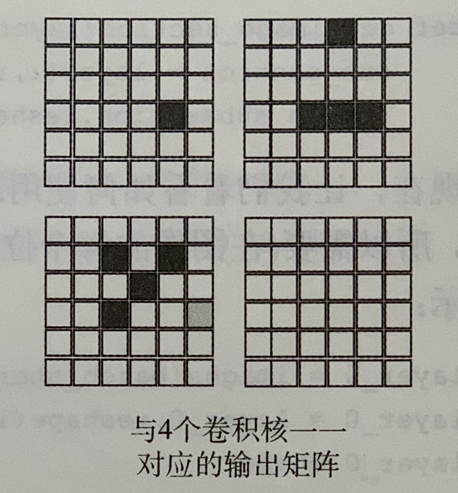

# 10.卷积神经网络概论：关于边与角的神经学习

- Principle：将许多小线性神经元层在各处重用。

- Rules

  - 卷积层有很多非常小的线性神经元层构成，
  - 每个线性层通常拥有少于25个输入和一个输出，
  - 每个小神经元层成为卷积核。

- **Implementation——Important!!!**

  1. 针对同一张图片8 * 8，使用四个卷积核。每个卷积核分别是3 * 3，也就是9个输入，1个输出。然后每次向右边移动一格像素，再次进行输入输出。到达最右边之后，回到最左边，然后向下移动一格像素，继续向右移动。

     

  2. 每个卷积核都遍历完整张图片之后，就得到6 * 6的输出矩阵。因为有四个卷积核，所以有四个输出矩阵。

     

  3. 根据第二步中的四个输出矩阵，池化成一个矩阵（汇总的矩阵每个格子都是取原四个矩阵对应的格子中的最大值）。作为信号向前传播到下一层。

     

  4. 补充：第三步的汇总方式叫：最大池化（四个矩阵对应格子取最大值），还有求和池化（四个矩阵对应格子求和），平均池化（求和之后求平均值）。这层叫池化层（pooling层）。

  

- Structure

  

  - 网络结构中有卷积层(convolution layer)，池化层(pooling layer)和全连接层(fully connected network)。
  - Implementation中分别使用了一次卷积层，一次池化层。

- **卷积计算方法——Important!!!**

  <!--image是原图片，filter为卷积核，feature map为卷积结果-->

  - Feature map中各个位置的计算方法

    

    - feature map左上角第一个数字的计算过程

      ```shell
      fm[0][0] = i[0][0]*f[0][0] + i[0][1]*f[0][1] + i[0][2]*f[0][2] + i[1][0]*f[1][0] + i[1][1]*f[1][1] + i[1][2]*f[1][2] + i[2][0]*f[2][0] + i[2][1]*f[2][1] + i[2][2]*f[2][2] = 1 + 0 + 1 + 0 + 1 + 0 + 0 + 0 + 1 = 4
      ```

      ```shell
      # Analyse
      因为步幅为1，所以每次只向右或者向下移动一格。Zero Padding为0，也就是在image周围没有加一圈0。
      ```

  - Feature map的大小计算方法

    ```
    W2 = (W1 - F + 2P) / S + 1
    H2 = (H1 - F + 2P) / S + 1
    ```

    ```shell
    # Analyse
    1.W2是卷积后Feature map的宽度；H2是卷积后Feature map的高度；
    2.W1是卷积前Image的宽度；H1是卷积前Image的高度；
    3.F是卷积核的宽度和高度；
    4.P是Zero Padding，也就是在Image周围补几圈0，常用于提取边缘部分的特征；
    5.S是步幅，也就是一次移动多少行或者多少列；
    ```

- Implementation

  ```python
  import sys, numpy as np
  from keras.datasets import mnist
  
  np.random.seed(1)
  
  # 1.使用Keras自带的mnist工具读取数据（第一次需要联网）
  (x_train, y_train), (x_test, y_test) = mnist.load_data()
  # 2.将读取到的数据保存到对应的对象中
  images, labels = (x_train[0:1000].reshape(1000, 28 * 28) / 255, y_train[0:1000])
  
  # 3.将保存的数据转换成能够进行神经网络计算的格式
  one_hot_labels = np.zeros((len(labels), 10))
  for i, l in enumerate(labels):
      one_hot_labels[i][l] = 1
  labels = one_hot_labels
  
  test_images = x_test.reshape(len(x_test), 28 * 28) / 255
  test_labels = np.zeros((len(y_test), 10))
  for i, l in enumerate(y_test):
      test_labels[i][l] = 1
  
  
  # 4.激活函数
  def tanh(x):
      return np.tanh(x)
  
  
  def tanh2deriv(output):
      return 1 - (output ** 2)
  
  
  def softmax(x):
      temp = np.exp(x)
      return temp / np.sum(temp, axis=1, keepdims=True)
  
  
  # 5.基本参数赋值
  alpha, iterations = (2, 300)
  pixels_per_image, num_labels = (784, 10)  # 每张图片的像素数量以及答案一共是10个
  batch_size = 128  # 一次训练所选取的样本数
  
  input_rows = 28  # 输入照片的行像素总量
  input_cols = 28  # 输入照片的列像素总量
  
  kernel_rows = 3  # 卷积核的行像素总量
  kernel_cols = 3  # 卷积核的列像素总量
  num_kernels = 16  # 卷积核的数量
  
  hidden_size = (input_rows - kernel_rows) * (input_cols - kernel_cols) * num_kernels  # fix:隐藏层的节点数量
  kernels = 0.02 * np.random.random((kernel_rows * kernel_cols, num_kernels)) - 0.01  # [9,16]
  
  weights_1_2 = 0.2 * np.random.random((hidden_size, num_labels)) - 0.1  # [625 * 16, 10] = [10000,10]
  
  
  # 6.获取卷积核对应的数据的函数
  def get_image_section(layer, row_from, row_to, col_from, col_to):
      section = layer[:, row_from:row_to, col_from:col_to]  # Important：这是三维数组 [128,3,3]
      return section.reshape(-1, 1, row_to - row_from, col_to - col_from)  # fix
      # ：为什么使用四维数组:用于计算Feature map的总数
  
  
  # 7.Training
  for j in range(iterations):
      correct_cnt = 0  # 统计正确率
      for i in range(int(len(images) / batch_size)):  # 批量梯度下降，因此分批循环
          batch_start, batch_end = ((i * batch_size), (i + 1) * batch_size)
          layer_0 = images[batch_start:batch_end]  # [128,784]
          layer_0 = layer_0.reshape(layer_0.shape[0], 28, 28)  # [128,28,28]三维数组
          layer_0.shape
  
          sects = list()  # 创建一个空列表
          for row_start in range(layer_0.shape[1] - kernel_rows):  # 卷积核行移动范围是是从0到图片行数减去卷积核行数
              for col_start in range(layer_0.shape[2] - kernel_cols):
                  sect = get_image_section(layer_0, row_start, row_start + kernel_rows, col_start,
                                           col_start + kernel_cols)  # [128, 1, 3, 3]
                  sects.append(sect)  # 将每一个卷积核范围内的矩阵加入列表
  
          expanded_input = np.concatenate(sects, axis=1)  # 合并数组 [128,625,3,3]
          es = expanded_input.shape
          flattened_input = expanded_input.reshape(es[0] * es[1], -1)  # -1代表自适应，因为原来是[128,625,3,
          # 3]，当前面相乘之后，-1只能是9了
  
          kernel_output = flattened_input.dot(kernels)  # [128*625,-1] * [9,16]
          layer_1 = tanh(kernel_output.reshape(es[0], -1))  # [128,-1]
          dropout_mask = np.random.randint(2, size=layer_1.shape)
          layer_1 *= dropout_mask
          layer_2 = softmax(np.dot(layer_1, weights_1_2))
  
          # 计算正确的量
          for k in range(batch_size):
              labelset = labels[batch_start + k: batch_start + k + 1]
              _inc = int(np.argmax(layer_2[k:k + 1]) == np.argmax(labelset))
              correct_cnt += _inc
  
          # 调整权重
          layer_2_delta = (labels[batch_start:batch_end] - layer_2) / (batch_size * layer_2.shape[0]) # fix
          layer_1_delta = layer_2_delta.dot(weights_1_2.T) * tanh2deriv(layer_1)
          layer_1_delta *= dropout_mask
          weights_1_2 += alpha * layer_1.T.dot(layer_2_delta)
          l1d_reshape = layer_1_delta.reshape(kernel_output.shape)
          k_update = flattened_input.T.dot(l1d_reshape)
          kernels -= alpha * k_update
      if (j % 1 == 0):
          print("Train_Acc:" + str(correct_cnt / float(len(images))))
  ```

  