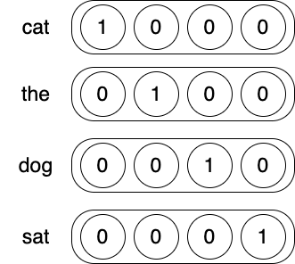

# 11.自然语言的神经网络

- NLP的任务
  - 标记文本区域。<!--比如词性标注、情感分类或命名实体识别-->
  - 链接两个以上的文本区域。<!--比如识别表示同一个实体的名词短语或代词，并归类-->
  - 填补基于上下文的信息空缺。<!--比如完形填空形式的补齐单词-->
- 主要算法
  - 词向量算法
  - 递归神经网络

## 11.3 监督NLP学习

- Purpose：神经网络旨在寻找输入和输出层之间的相关性。

### One-hot编码

- Rules

  - 行向量表示每一条语句。
  - 列向量表示语句中是否含有特定单词。
  - 如果一条语句中重复性出现单词，可以求和也可以只取一次结果。

- Example

  

  ```
  1.假设词汇表中有四个单词，分别是"cat","dog","the","sat"。
  2.如果有相应的单词，则将在特定位置的值为1，1的所在位置就是这个单词的索引。有多少个单词，就有多少列，因为每一个单词的1的所在位置不同。
  3.如果一条语句是"the cat sat"，则对应的语句向量就是"[1101]"。
  4.如果一条语句是"the cat sat cat",则对应的语句向量就是"[1101]"，或者求和就是"[2101]"。
  ```

- Implementation

  ```python
  import numpy as np
  onehots = {}
  # 创建词袋
  onehots['cat'] = np.array([1,0,0,0])
  onehots['the'] = np.array([0,1,0,0])
  onehots['dog'] = np.array([0,0,1,0])
  onehots['sat'] = np.array([0,0,0,1])
  
  # 创建语句
  sentence = ['the','cat','sat']
  x = onehots[sentence[0]] + onehots[sentence[1]] + onehots[sentence[2]]
  
  # 输出结果
  print('Sent Encoding:' + str(x))
  ```

  ```shell
  # output
  Sent Encoding:[1 1 0 1]
  ```

  ```shell
  # Analyse
  1.创建词袋，每个单词都用向量表示。
  2.创建语句，分割语句中每个词，被分割的词作为关键词在词袋中检索，找到向量。
  3.求向量和。
  ```

  

### 电影评论

- Purpose：电影评论和具体评分是一对输入和输出，如何根据电影评论预测评分？

- Idea
  1. 评分是数字，因此作为输出需要的处理比较简单，因为原范围是1-5之间，现在需要缩小到0-1之间，这样可以应用softMax激活函数；电影评论是文字，然而文字中每个字母分析不合理（因为无法表达情绪或倾向），通过单词分析合理（比如bad），能够表达情绪或倾向。
  2. 评论是语句，所以使用one-hot编码来表示一句评论。
  
- Implementation

  <!--读取评价和评分，制作词袋-->

  ```python
  import sys
  
  # 1.读取评价
  f = open("reviews.txt")
  raw_reviews = f.readlines()
  f.close()
  
  # 2.读取评分
  f = open("labels.txt")
  raw_labels = f.readlines()
  f.close()
  
  
  # 3.function:将评价语句截成单词
  # note:使用set的原因是去除重复的单词
  def separate(x):
      return set(x.split(" "))
  
  
  # 4.将评价语句截成单词，用于制作词袋
  # note:map的结构是第一个参数是函数方法，第二个参数会作为值传入函数方法；list目的是将分开后的结果变成基本数据格式，类似Java数组。
  tokens = list(map(separate, raw_reviews))  # 每句话截成了单词，但依旧在list中
  print("Tokens:" + str(tokens))
  print("Tokens[0]:" + str(tokens[0]))
  print("================================")
  
  vocab = set()  # 创建一个空的set，筛选出正确的单词形式
  for sent in tokens:  # 遍历list中的每个值
      for word in sent:  # 遍历每个值中的每个单词
          if len(word) > 0:  # 如何单词长度大于0，则加入空的set中
              vocab.add(word)
  vocab = list(vocab)  # 将set格式转换为list格式
  print("Vocab 所有非重复性词汇:" + str(vocab))
  print("================================")
  
  # 5.构建词袋
  # note:由于list中索引和单词对应，反过来就是one-hot编码形式的雏形
  word2index = {}
  for i,word in enumerate(vocab):
      word2index[word] = i
  print("Word2index 词袋:" + str(word2index))
  print("================================")
  
  
  # 6.创建评价语句的向量
  input_dataset = list()
  for sent in tokens:
      sent_indices = list()
      for word in sent:
          sent_indices.append(word2index[word])
      input_dataset.append(list(set(sent_indices)))
  print("Input_dataset 评价语句的向量:" + str(input_dataset))
  print("================================")
  
  # 7.创建保存评分的list，1代表positive
  target_dataset = list()
  for label in raw_labels:
      if label == 'positive\n':
          target_dataset.append(1)
      else:
          target_dataset.append(0)
  print("Target_dataset 所有评分:" + str(target_dataset))
  
  ```

  ```shell
  # output
  Tokens:[{'movie.\n', 'a', 'it', 'good', 'is'}, {'movies.\n', 'are', 'good', 'those'}]
  Tokens[0]:{'movie.\n', 'a', 'it', 'good', 'is'}
  ================================
  Vocab 所有非重复性词汇:['those', 'movies.\n', 'movie.\n', 'a', 'it', 'are', 'good', 'is']
  ================================
  Word2index 词袋:{'those': 0, 'movies.\n': 1, 'movie.\n': 2, 'a': 3, 'it': 4, 'are': 5, 'good': 6, 'is': 7}
  ================================
  Input_dataset 评价语句的向量:[[2, 3, 4, 6, 7], [0, 1, 5, 6]]
  ================================
  Target_dataset 所有评分:[1, 0]
  ```

  ```shell
  总步骤
  1.制作词袋的步骤
  	1.分割所有的语句，生成list1，每个语句都是list1中的一项。
  	2.合并list1中的所有语句，生成set1，里面是所有语句中的单词并去重。
  	3.使用key和value来遍历set1，保存key和value（key是单词，value是原数字在list中的索引），生成词袋。
  2.将原来的语句通过词袋来生成语句向量，也就是神经网络计算的格式。
  3.将评分转换成数字。
  ```

  