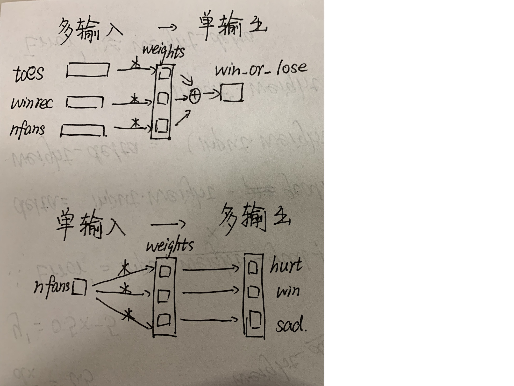
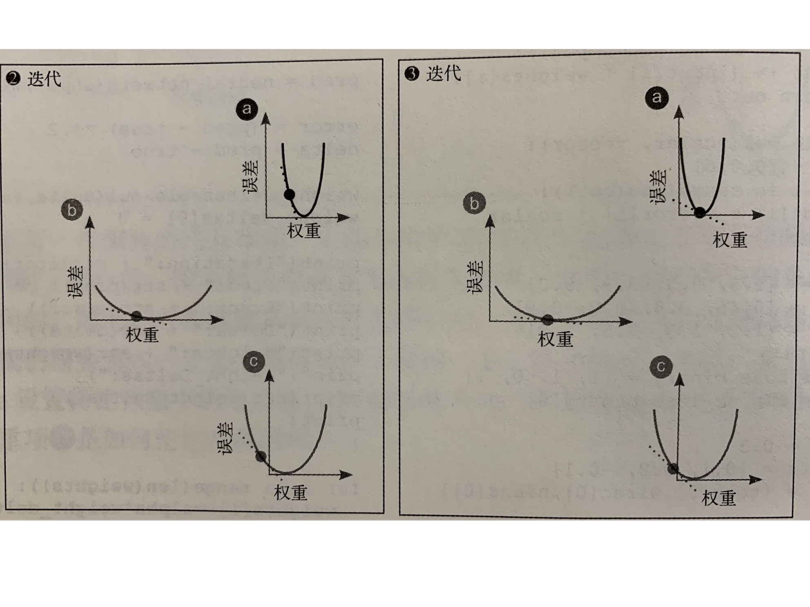

# 5.通用梯度下降：一次学习多个权重

- 多输入单输出和单输入多输出示意图，实现见下面内容

  多输入单输出相当于点积和，单输入多输出相当于向量和常量相乘

  

## 5.1 多输入梯度下降

- Implementation

  ```python
  import numpy as np
  
  # Training data
  toes = np.array([8.5, 9.5, 9.9, 9.0])
  wlrec = np.array([0.65, 0.8, 0.8, 0.9])
  nfans = np.array([1.2, 1.3, 0.5, 1.0])
  win_or_lose_binary = np.array([1, 1, 0, 1])
  
  weights = np.array([0.1, 0.2, -.1])
  
  
  # Function: Calculate prediction
  def w_sum(a, b):
      assert len(a) == len(b)
      output = 0
      for i in range(len(a)):
          output += a[i] * b[i]
      return output
  
  
  # Function: Get prediction - call function "Calculate prediction"
  def neural_network(input, weights):
      pred = w_sum(input, weights)
      return pred
  
  
  # Function: Get weights_delta
  def ele_mul(number, vector):
      output = [0,0,0]
      assert len(output) == len(vector)
      for i in range(len(vector)):
          output[i] = (vector[i] * number)
      return output
  
  
  # Test
  input = np.array([toes[0], wlrec[0], nfans[0]])
  true = win_or_lose_binary[0]
  
  pred = neural_network(input, weights)
  
  # Calculate error
  error = (pred - true) ** 2
  delta = pred - true
  
  weights_delta = ele_mul(delta, input)  # weight_delta = delta * input
  
  # Update weights
  alpha = 0.01
  for i in range(len(weights_delta)):
      weights_delta[i] = weights[i] - (alpha * weights_delta[i])
      print("Weight:" + str(weights))
      print("Weight_delta:" + str(weights_delta))
  ```

  ```shell
  # output
  Weight:[ 0.1  0.2 -0.1]
  Weight_delta:[0.1119, -0.09099999999999994, -0.16799999999999987]
  Weight:[ 0.1  0.2 -0.1]
  Weight_delta:[0.1119, 0.20091, -0.16799999999999987]
  Weight:[ 0.1  0.2 -0.1]
  Weight_delta:[0.1119, 0.20091, -0.09832]
  ```

  ```shell
  # Analyse
  1.思路
  	1.存储训练数据，包括feature，goal_prediction和weights
  	2.创建计算预测结果的函数
  	3.使用函数计算出预测结果
  	4.计算Error的值，以及delta（纯误差）的值
  	5.创建计算三个节点的weight_delta的函数，用于单个delta的值转换成三个节点的误差增量
  	6.用原始权重和误差增量来计算修正后的权重
  2.注意
  	1.由于斜率差距较大（原因是input中第一项较大），因此引入alpha来控制斜率，三个输入都通过alpha调节
  ```

## 5.4 单项权重冻结

- **Implementation——important!!!**

  <!--冻结了第一项权重-->

  ```python
  import numpy as np
  
  # Training data
  toes = np.array([8.5, 9.5, 9.9, 9.0])
  wlrec = np.array([0.65, 0.8, 0.8, 0.9])
  nfans = np.array([1.2, 1.3, 0.5, 1.0])
  win_or_lose_binary = np.array([1, 1, 0, 1])
  
  weights = np.array([0.1, 0.2, -.1])
  alpha = 0.3
  
  
  # Function: Calculate prediction
  def w_sum(a, b):
      assert len(a) == len(b)
      output = 0
      for i in range(len(a)):
          output += a[i] * b[i]
      return output
  
  
  # Function: Get prediction - call function "Calculate prediction"
  def neural_network(input, weights):
      pred = w_sum(input, weights)
      return pred
  
  
  # Function: Get weights_delta
  def ele_mul(number, vector):
      output = [0,0,0]
      assert len(output) == len(vector)
      for i in range(len(vector)):
          output[i] = (vector[i] * number)
      return output
  
  
  # Test
  input = np.array([toes[0], wlrec[0], nfans[0]])
  true = win_or_lose_binary[0]
  
  for iter in range(3):
      pred = neural_network(input, weights)
  
      # Calculate error
      error = (pred - true) ** 2
      delta = pred - true
      weights_delta = ele_mul(delta, input)  # weight_delta = delta * input
      weights_delta[0] = 0
  
      print("Iteration:" + str(iter+1))
      print("Pred:" + str(pred))
      print("Error:" + str(error))
      print("Delta:" + str(delta))
      print("Weight:" + str(weights))
      print("Weight_delta:" + str(weights_delta))
      print("  ")
  
      # Update weights
      for i in range(len(weights_delta)):
          weights[i] -= alpha * weights_delta[i]
  ```

  ```shell
  # output
  Iteration:1
  Pred:0.8600000000000001
  Error:0.01959999999999997
  Delta:-0.1399999999999999
  Weight:[ 0.1  0.2 -0.1]
  Weight_delta:[0, -0.09099999999999994, -0.16799999999999987]
    
  Iteration:2
  Pred:0.9382250000000001
  Error:0.003816150624999989
  Delta:-0.06177499999999991
  Weight:[ 0.1     0.2273 -0.0496]
  Weight_delta:[0, -0.040153749999999946, -0.07412999999999989]
    
  Iteration:3
  Pred:0.97274178125
  Error:0.000743010489422852
  Delta:-0.027258218750000007
  Weight:[ 0.1         0.23934612 -0.027361  ]
  Weight_delta:[0, -0.017717842187500006, -0.032709862500000006]
  ```

  ```shell
  # Analyse——Important!!!
  1.当一项权重到达底部时，所有权重都会达到U型曲线底部。原因是U型曲线是单独权重对全局误差的影响。
  2.如果有三项权重，冻结一项权重后其他两个权重收敛（误差为0），则无法再尝试训练被冻结的权重。原因是误差（error）已经为零的情况下，纯误差（delta）也为零，权重增量（weight_delta = delta * input）也为零，也就是权重已经无法修改。
  3.如下图，a中的黑点没有移动（因为权重被冻结了），但是位置是从2中位置到了3种的底部，原因是U型曲线移动了，因为这只是一张四维曲面的二维切面图。可以联系吴恩达machine learning中建立的图
  ```

  

## 5.5 多输出梯度下降

- Implementation

  ```python
  import numpy as np
  
  # Training data
  wlrec = [0.65, 0.8, 0.8, 0.9]
  hurt = [0.1, 0.0, 0.0, 0.1]
  win = [1, 1, 0, 1]
  sad = [0.1, 0.0, 0.1, 0.2]
  
  weights = [0.3, 0.2, 0.9]
  
  
  # Function: Calculate prediction
  def ele_mul(number, vector):
      output = [0,0,0]
      assert len(vector) == len(output)
      for i in range(len(vector)):
          output[i] = number * vector[i]
      return output
  
  
  # Function: Get prediction - call function "Calculate prediction"
  def neural_network(number, vector):
      pred = ele_mul(number, vector)
      return pred
  
  
  # Test
  input = wlrec[0]
  true = [hurt[0], win[0], sad[0]]
  
  pred = neural_network(input, weights)
  error = [0,0,0]
  delta = [0,0,0]
  
  # Calculate error and delta
  for i in range(len(pred)):
      error[i] = (pred[i] - true[i]) ** 2
      delta[i] = pred[i] - true[i]
  
  weights_delta = ele_mul(input, delta)
  alpha = 0.1
  # Update weights
  for i in range(len(weights_delta)):
      weights[i] -= (alpha * weights_delta[i])
  
  print("Weight:" + str(weights))
  print("Weight_delta:" + str(weights_delta))
  ```

  ```shell
  # output
  Weight:[0.293825, 0.25655, 0.868475]
  Weight_delta:[0.061750000000000006, -0.5655, 0.3152500000000001]
  ```

## 5.6 多输入多输出

- **Implementation——important!!!Analyse**

  ```python
  import numpy as np
  
  # Training data
            # toe  win  fans
  weights = [[0.1, 0.1, -0.3],  # hurt?
             [0.1, 0.2, 0.0],  # win?
             [0.0, 1.3, 0.1]]  # sad?
  # Feature
  toes = [8.5, 9.5, 9.9, 9.0]
  wlrec = [0.65, 0.8, 0.8, 0.9]
  nfans = [1.2, 1.3, 0.5, 1.0]
  # True
  hurt = [0.1, 0.0, 0.0, 0.1]
  win = [1, 1, 0, 1]
  sad = [0.1, 0.0, 0.1, 0.2]
  
  alpha = 0.01
  
  
  # Function: Calculate prediction
  def w_sum(a, b):
      assert len(a) == len(b)
      output = 0
      for i in range(len(a)):
          output += a[i] + b[i]
      return output
  
  
  # Function: Calculate prediction
  def vect_mat_mul(vect, matrix):
      assert len(vect) == len(matrix)
      output = [0, 0, 0]
      for i in range(len(vect)):
          output[i] = w_sum(vect, matrix[i])
      return output
  
  
  # Function: Get prediction from function "Calculate prediction"
  def neutal_network(input, weights):
      pred = vect_mat_mul(input, weights)
      return pred
  
  
  # Test
  input = [toes[0], wlrec[0], nfans[0]]
  true = [hurt[0], win[0], sad[0]]
  
  pred = neutal_network(input,weights)
  
  # Calculate error and delta
  error = [0,0,0]
  delta = [0,0,0]
  
  for i in range(len(error)):
      error[i] = (pred[i] - true[i]) ** 2
      delta[i] = pred[i] - true[i]
  
  # Function: Calculate weight_delta
  def outer_prod(vect_a,vect_b):
      out = np.zeros((len(vect_a),len(vect_b)))
      for i in range(len(vect_a)):
          for j in range(len(vect_b)):
              out[i][j] = vect_a[i] * vect_b[j]
      return out
  
  
  # Update weight
  weight_delta = outer_prod(input,delta)
  for i in range(len(weights)):
      for j in range(len(weights[0])):
          weights[i][j] -= alpha * weight_delta[i][j]
  ```

  ```shell
  # Analyse
  1.pred的结果为向量，通过计算点积和来生成三个输出。
  2.weight_delta计算，需要预先创建weight_delta矩阵，因为需要和weights各个权重值对应。
  3.由于创建向量的时候，无法区分是行向量还是列向量，所以是否是点积和，还是生成矩阵是直接在函数中自行定义。比如个人定义的方法“w_sum”就是计算两个向量的点积和。方法“outer_prod”就是计算两个向量并生成矩阵。
  ```

  


