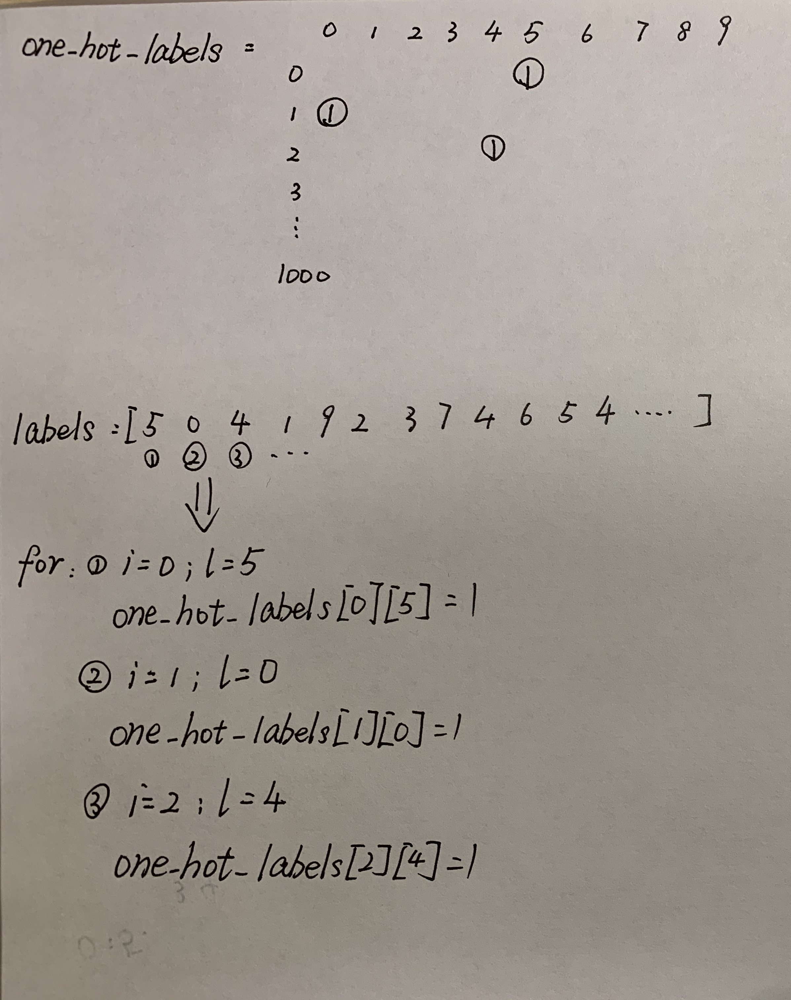

# 8.学习信号，忽略噪声：正则化和批处理介绍

## 8.4 过拟合

- 现象：过度训练神经网络，导致测试样例失效。

- 原因：神经网络学习到了数据集中的噪音，而不是仅基于真实的信号作出的决策。

  <!--比如，图片识别狗，如果根据狗的轮廓能分辨是是否为狗，则狗的轮廓是真实的信号，而填充狗的部分像素属于噪音-->

- 解决方法：正则化（包括提前停止，dropout等），更换梯度下降方法（批量梯度下降）。

## 8.6 正则化

- Definition：使模型泛化到新的数据点（而不仅是记忆训练数据）的方法的子领域。
- 方法
  1. 提前停止：训练集训练神经网络，再添加验证集来控制训练过程。
  2. Dropout

### Dropout

- Definition：在训练过程中随机关闭神经元。使得一张大的神经网络像小神经网络一样学习，而小神经网络不会发生过拟合。

  <!--比如，用沙子去拟合叉子，能够勾勒出每一个细节，导致过拟合。如果是硬币大小的粘土拟合叉子，一个硬币肯定不够，就会从单个硬币上尽可能的找重点，由多个硬币大小的粘土来拟合叉子防止过拟合。-->

- **Implementation(基本的MNIST实现)——important!!!**

  ```python
  import sys, numpy as np
  from keras.datasets import mnist
  # 1.使用Keras自带的mnist工具读取数据（第一次需要联网）
  (x_train, y_train), (x_test, y_test) = mnist.load_data()
  # 2.准备数据
  images, labels = (x_train[0:1000].reshape(1000, 28 * 28) / 255, y_train[0:1000])
  # 3.Class vector
  one_hot_labels = np.zeros((len(labels), 10))    # one_hot_labels:[1000,10]
  for i, l in enumerate(labels):
      one_hot_labels[i][l] = 1
  labels = one_hot_labels
  
  test_labels = np.zeros((len(y_test),10))
  for i,l in enumerate(y_test):
      test_labels[i][l] = 1
  
  # 基本参数
  np.random.seed(1)
  relu = lambda x: (x >= 0) * x
  relu2deriv = lambda x: x >= 0
  alpha, iterations, hidden_size, pixels_per_image, num_labels = (0.005, 350, 40, 784, 10)
  weights_0_1 = 0.2*np.random.random((pixels_per_image,hidden_size)) - 0.1    # [784,40]
  weights_1_2 = 0.2*np.random.random((hidden_size,num_labels)) - 0.1          # [40,10]
  
  for j in range(iterations):
      error, correct_cnt = (0.0, 0)
  
      for i in range(len(images)):
          layer_0 = images[i:i+1] # [1000,784]
          layer_1 = relu(np.dot(layer_0,weights_0_1)) # [1000,784] * [784,40] = [1000,40]
          layer_2 = np.dot(layer_1,weights_1_2)   # [1000,40] * [40,10] = [1000,10]
          error += np.sum((labels[i:i+1] - layer_2) ** 2)
          # 统计预测值和答案一样的数量
          correct_cnt += int(np.argmax(layer_2) == np.argmax(labels[i:i+1]))  
  
          layer_2_delta = (labels[i:i+1] - layer_2)
          layer_1_delta = layer_2_delta.dot(weights_1_2.T) * relu2deriv(layer_1)
  
          weights_1_2 += alpha * layer_1.T.dot(layer_2_delta)
          weights_0_1 += alpha * layer_0.T.dot(layer_1_delta)
      sys.stdout.write("\r"+
                       "I:" + str(j) +
                       "Error:" + str(error/float(len(images)))[0:5]+
                       "Correct:" + str(correct_cnt/float(len(images)))
      )
  ```

- 步骤解析(Implementation)

  1. 1.读取数据，数据的shape通过输出语句"print(x_train.shape,y_train.shape);print(x_test.shape,y_test.shape)"查看的结果是："(60000, 28, 28) (60000,);(10000, 28, 28) (10000,)"。也就是x_train有60000张照片，每张照片都是28*28像素，y_train表示60000张图片对应的实际数字。

  2. 准备数据阶段，其中"x_train[0:1000]"是取0到1000对应位置上的数据；"reshape(1000, 28 * 28)"是将这1000个数据，原来每个是28行28列的数据变成一行，也就是784；"255"是所有的色号数量，除了之后原来的整数就变成了小数更利于收敛，float类型。

  3. 将正确答案的向量转换为符合神经网络计算的矩阵。

     - "one_hot_labels"声明了一个大小是1000行乘以10列的零矩阵。
     - "for i, l in enumerate(labels)"，遍历labels向量，比如第一个5的索引是0。
     - "one_hot_labels【i】【l】 = 1"，刚好将labels中每一个数字的key和value对应到零矩阵的相应位置，来表示成对应的数字。比如第一个答案是5，那么矩阵的第0行，第5列是1，表示的就是5。比如labels中第三个value是4，key是2，那么对应到one_hot_labels中就是第2行，第4列的位置是1。

     

- Implementation（应用dropout）<u>见深度学习图解P138</u>

  ```python
  import sys, numpy as np
  from keras.datasets import mnist
  # 1.使用Keras自带的mnist工具读取数据（第一次需要联网）
  (x_train, y_train), (x_test, y_test) = mnist.load_data()
  # 2.准备数据
  images, labels = (x_train[0:1000].reshape(1000, 28 * 28) / 255, y_train[0:1000])
  # 3.Class vector
  one_hot_labels = np.zeros((len(labels), 10))    # one_hot_labels:[1000,10]
  for i, l in enumerate(labels):
      one_hot_labels[i][l] = 1
  labels = one_hot_labels
  
  test_labels = np.zeros((len(y_test),10))
  for i,l in enumerate(y_test):
      test_labels[i][l] = 1
  
  # 基本参数
  np.random.seed(1)
  relu = lambda x: (x >= 0) * x
  relu2deriv = lambda x: x >= 0
  alpha, iterations, hidden_size, pixels_per_image, num_labels = (0.005, 350, 40, 784, 10)
  weights_0_1 = 0.2*np.random.random((pixels_per_image,hidden_size)) - 0.1    # [784,40]
  weights_1_2 = 0.2*np.random.random((hidden_size,num_labels)) - 0.1          # [40,10]
  
  for j in range(iterations):
      error, correct_cnt = (0.0, 0)
  
      for i in range(len(images)):
          layer_0 = images[i:i+1] # [1000,784]
          layer_1 = relu(np.dot(layer_0,weights_0_1)) # [1000,784] * [784,40] = [1000,40]
          # 新增的代码1
          dropout_mask = np.random.randint(2,size=layer_1.shape)
          layer_1 *= dropout_mask * 2
  
          layer_2 = np.dot(layer_1,weights_1_2)   # [1000,40] * [40,10] = [1000,10]
          error += np.sum((labels[i:i+1] - layer_2) ** 2)
          # 统计预测值和答案一样的数量
          correct_cnt += int(np.argmax(layer_2) == np.argmax(labels[i:i+1]))
  
          layer_2_delta = (labels[i:i+1] - layer_2)
          layer_1_delta = layer_2_delta.dot(weights_1_2.T) * relu2deriv(layer_1)
          # 新增的代码2
          layer_1_delta *= dropout_mask
  
          weights_1_2 += alpha * layer_1.T.dot(layer_2_delta)
          weights_0_1 += alpha * layer_0.T.dot(layer_1_delta)
      sys.stdout.write("\r"+
                       "I:" + str(j) +
                       "Error:" + str(error/float(len(images)))[0:5]+
                       "Correct:" + str(correct_cnt/float(len(images)))
                       )
  ```

  ```shell
  # Analyse
  1.相比于基本实现，新增三行代码，分别位于"新增的代码1","新增的代码2"。
  2.思路：新建一个和layer_1一样的矩阵，但是其中一半是1，一半是0.来达到随机关闭一半节点的目的。
  ```

  