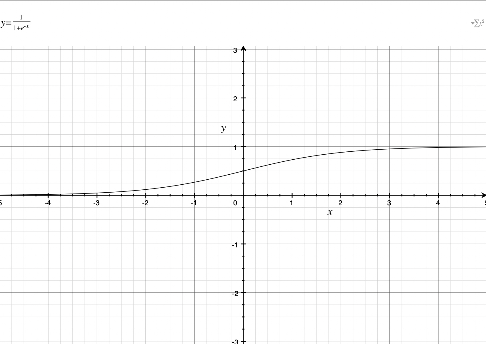
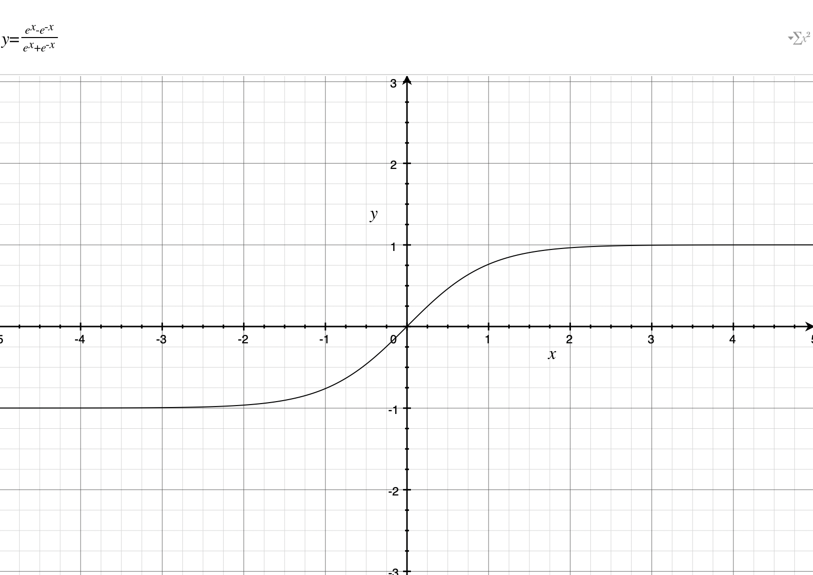
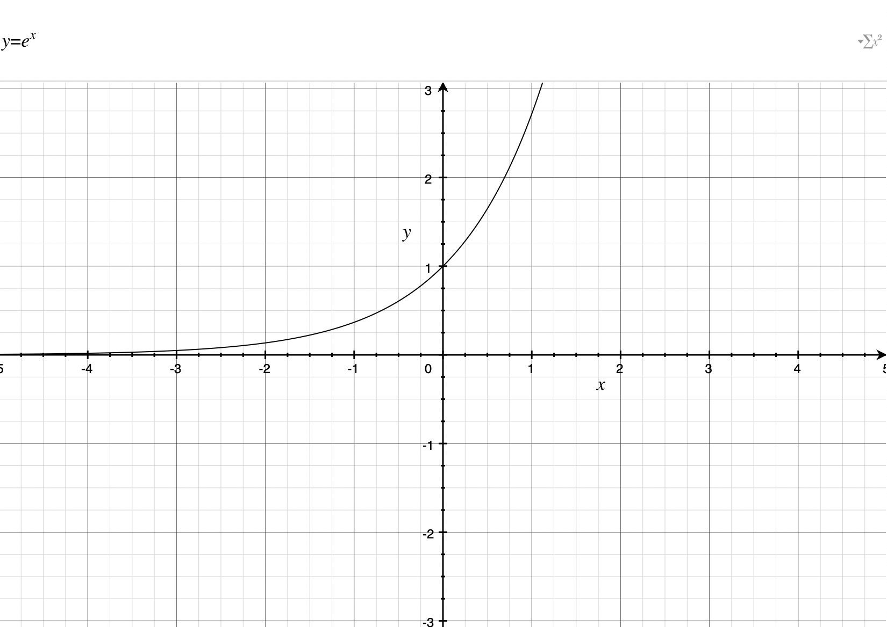

# 9.概率和非线性建模：激活函数

## 9.1 激活函数

- Definition：应用于一层神经元的函数。

  <!--任何可以接受一个数字并返回另一个数字的函数。比如relu()激活函数，输入值为负则输出值为0，其他返回原值-->

- Rules

  1. 函数必须连续并且定义域是无穷的。

     <!--如果不连续或者有范围限制，则存在部分输入值没有输出值，那神经元会出现没有正确赋值的情况-->

  2. 良好的激活函数是单调的，不会改变方向。但是不是必要条件。

     <!--如果不是单调的，会出现一个输出值对应多个输入值，则神经网络存在多个最优配置。多个最优配置是否更好存在争议-->

  3. 良好的激活函数是非线性的（扭曲或反转）：支持神经元选择性地与输入神经元相互关联。

     <!--比如relu()激活函数，能够选择性的将负相关的神经元关闭-->

  4. 合适的激活函数（及其导数）应该可以高效计算。

- Purpose：非线性激活函数的引入，有助于使偶尔出现的错误训练实例更难破坏已经多次得到强化的学习结果。

- 常用函数：Sigmoid，tanh

## 9.2 标准隐藏层激活函数

### Sigmoid函数

- Usage

  - 无论多大都能压缩到0和1之间。
  - 能够将输出理解成一个概率。

- Definition

  

### Tanh函数

- Usage

  - Tanh相比于Sigmoid，增加了负相关，更适合隐藏层。

- Definition

  

## 9.3 标准输出层激活函数

- Types

  <!--如何选择输出层激活函数，取决于你的预测目的-->

  - 预测原始数据值（没有激活函数）

    <!--比如，通过多日的气温预测特定日期的气温-->

  - 预测不相关的“是”或“否”的概率（Sigmoid函数）

    <!--比如，通过胜负记录、粉丝数量等预测胜负、受伤概率。同时具有多个输出值时，隐藏层可能会预测球队情绪有用-->

  - 预测“哪一个”的概率（softmax）

    <!--比如，MNIST数字分类器-->

### Softmax函数

- Definition：计算每个输入值的指数形式，然后除以该层的和。

  

- Implementation

  ```shell
  1.原始点积输出: layer = np.array[0.0,0.0,0.0,0.0,100.0]
  2.e^x: layer = np.array[1.0,1.0,1.0,1.0,e^100]
  3.softmax: layer = np.array[0.0,0.0,0.0,0.0,1.0]
  ```

  ```shell
  # Analyse
  1.第三步中，除以和之后，除最后一个值以外基本都为零。因为除数很大，是(e^100+4)。
  ```

- Advantage

  - 神经网络对一个值的预测越高，对所有其他值的预测就越低。

    <!--原因是指数。支持调节底数（e）来调整执行力度-->

## 9.6 使用说明

- Rules

  - 某一层的输入是指应用非线性函数之前的值。

  - 网络层添加激活函数，将改变该层增量delta的计算方式。

  - **计算layer_delta，需要将反向传播的delta乘以该层的斜率。**

    ```python
    # 计算layer_1_delta
    layer_1_delta = layer_2_delta.dot(weights_1_2.T) * relu2deriv(layer_1)
    ```

    ```shell
    # Analyse
    1.relu2deriv(layer_1)就是斜率。
    2.relu2deriv()就是relu()函数的导数。
    ```


