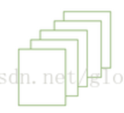

# NumPy

## numpy.T

- Usage

  - 转置矩阵（目前对于一维行向量没有作用）。

- Implementation

  ```python
  import numpy as np
  vect1 = np.array([[1],[2],[3]])
  vect2 = np.array([1,2,3])
  print("vect1")
  print(vect1)
  print("")
  print("vect1.T")
  print(vect1.T)
  print("")
  print("vect2")
  print(vect2)
  print("")
  print("vect2.T")
  print(vect2.T)
  print("")
  ```

  ```shell
  # output
  vect1
  [[1]
   [2]
   [3]]
  vect1.T
  [[1 2 3]]
  vect2
  [1 2 3]
  vect2.T
  [1 2 3]
  ```

## numpy.dot()

- Usage

  - 向量点积，不需要考虑行列对应。

  - 矩阵求积，需要考虑行列数量对应。

    <!--比如矩阵[2*3]*[3*2] = [2*2]-->

- Implementation

  ```python
  import numpy as np
  vect2 = np.array([1,2,3])
  a1 = np.array([
      [1,2,3],
      [4,5,6]
  ])
  a2 = np.array([
      [7,8,9],
      [10,11,12]
  ])
  
  print("vect2 * vect2")
  print(vect2.dot(vect2))
  print("")
  
  print("vect2 * vect2.T")
  print(vect2.dot(vect2))
  print("")
  
  print("a1")
  print(a1)
  print("")
  
  print("a2")
  print(a2)
  print("")
  
  print("a1.T * a2")
  print(a1.T.dot(a2))
  print("")
  
  print("a1 * a2.T")
  print(a1.dot(a2.T))
  print("")
  
  # Error:shapes (2,3) and (2,3) not aligned: 3 (dim 1) != 2 (dim 0)
  # print("a1 * a2")
  # print(a1.dot(a2))
  ```

  ```shell
  # output
  vect2 * vect2
  14
  
  vect2 * vect2.T
  14
  
  a1
  [[1 2 3]
   [4 5 6]]
   
  a2
  [[ 7  8  9]
   [10 11 12]]
   
  a1.T * a2
  [[47 52 57]
   [64 71 78]
   [81 90 99]]
   
  a1 * a2.T
  [[ 50  68]
   [122 167]]
  ```

## s:s+1

- Usage

  - 循环中的向量或者矩阵索引

- Implementation

  ```python
  s = 0
  print("s:" + str(s))
  s:s+1
  print("s:s+1:" + str(s))
  ```

  ```shell
  # output
  s:0
  s:s+1:0
  ```

## Boolean

- Usage
  - True与1等值，False与0等值

## 多维数组

- Structure

  

  - 类似于一张张的纸，每一张纸长宽就是一个二维数组，所有纸叠加起来就是三维。

- Implementation

  ```python
  layer_0 = layer_0.reshape(layer_0.shape[0],28,28)
  print(layer_0.shape)
  ```

  ```shell
  # output
  (128, 28, 28)
  ```

  ```shell
  # Analyse
  1.这是一个三维数组
  ```

- Rules

  - U[:,1,2]表示第一维全取，第二维取1，第三维取2。
  - reshape[2,3,-1]中的-1表示自适应，根据已经给定的维度大小来推断剩余维度的大小。

## Shape

- Rules
  - shape [2,3] 表示为数组的意思是第一维有两个元素，第二维有三个元素，如: [[1,2,3],[4,5,6]]

## concatenate

- Definition:根据axis轴组合数组

- Rules

  - "np.concatenate((a,b),axis = n)",n的值就是指定维度相加，比如n=0时，就是维度一相加。见Implementation中的"axis"

- Implementation

  ```python
  import sys, numpy as np
  
  # a，b数组都是二维数组
  a = np.array([
      [1, 2],
      [3, 4]
  ])
  b = np.array([[5, 6]])
  print("=====组合前=====")
  print("a.shape:" + str(a.shape))
  print("b.shape:" + str(b.shape))
  
  # 组合:axis = 0
  c = np.concatenate((a, b), axis=0)
  print("=====axis = 0 , 组合后=====")
  print(c)
  print("c.shape:" + str(c.shape))
  
  # 组合:axis = 1
  d = np.concatenate((a, b.T), axis=1)
  print("=====axis = 1 , 组合后=====")
  print(d)
  print("c.shape:" + str(d.shape))
  
  # axis
  q1 = np.array([[[5, 6]]])
  q2 = np.array([[[7, 8]]])
  print("=====axis = 0 , 组合后=====")
  q3 = np.concatenate((q1,q2),axis=0)
  print(q3)
  print("shape:" + str(q3.shape))
  print("=====axis = 1 , 组合后=====")
  q3 = np.concatenate((q1,q2),axis=1)
  print(q3)
  print("shape:" + str(q3.shape))
  print("=====axis = 2 , 组合后=====")
  q3 = np.concatenate((q1,q2),axis=2)
  print(q3)
  print("shape:" + str(q3.shape))
  ```

  ```shell
  # output
  =====组合前=====
  a.shape:(2, 2)
  b.shape:(1, 2)
  =====axis = 0 , 组合后=====
  [[1 2]
   [3 4]
   [5 6]]
  c.shape:(3, 2)
  =====axis = 1 , 组合后=====
  [[1 2 5]
   [3 4 6]]
  d.shape:(2, 3)
  
  =====axis = 0 , 组合后=====
  [[[5 6]]
   [[7 8]]]
  shape:(2, 1, 2)
  =====axis = 1 , 组合后=====
  [[[5 6]
    [7 8]]]
  shape:(1, 2, 2)
  =====axis = 2 , 组合后=====
  [[[5 6 7 8]]]
  shape:(1, 1, 4)
  ```

  