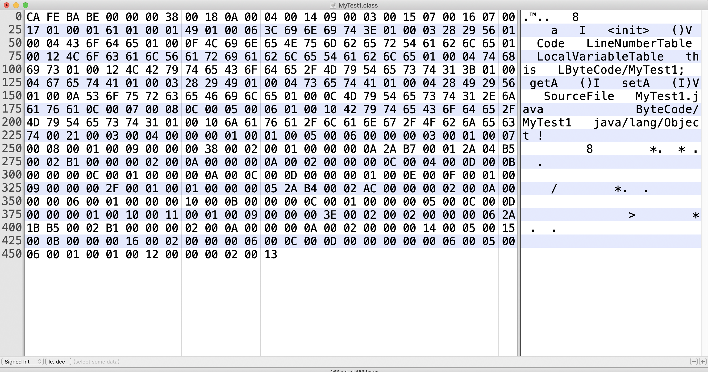
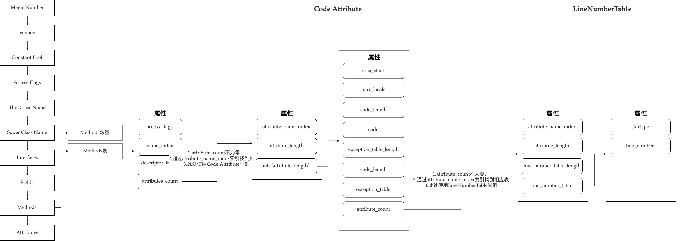

# 三.字节码

### 1.基本概念

- 方法

  - 使用terminal指令分析字节码文件

    ```shell
    javap -verbose .class文件名
    ```

- 基本结构

| 结构名称         | 字节长度（字节） | 注解                    |
| ---------------- | :--------------: | ----------------------- |
| Magic Number     |        4         | 魔数，值为0xCAFEBABE    |
| Version          |       2+2        | 次版本号+主版本号       |
| Constant Pool    |       2+n        | 常量池数量+常量池数组   |
| Access Flags     |        2         | 类的访问权限            |
| This Class Name  |        2         | 类名，索引              |
| Super Class Name |        2         | 父类名，索引            |
| Interfaces       |       2+n        | 接口数量+接口名         |
| Fields           |       2+n        | 域数量+域的表           |
| Methods          |       2+n        | 方法数量+方法表         |
| Attributes       |       2+n        | 附加属性数量+附加属性表 |

- 规则

  - 描述符描述字段/变量，描述字段的数据类型、方法的参数列表（包括数量、类型、顺序）与返回值，基本数据类型和void无返回值都用一个大写字母表示，L-对象类型

    <!--实现-->

    ```java
    // 基本数据类型
    B - byte
    C - char
    I - int
    F - float
    D - double
    J - long
    S - short
    Z - boolean
    V - void
    //对象类型
    Ljava/lang/String
    ```

  - 描述符描述数组类型，使用前置的"["加上数据类型表示，比如"int[]"则使用"[I"表示

  - 描述符描述方法，先参数列表后返回值的顺序

    <!--实现-->

    ```java
    // 原方法
    String getName(int id,String name)
    // 描述符描述方法
    (I,Ljava/lang/String)Ljava/lang/String;
    ```
    
  - 字节码有两种数据类型
  
    - 字节数据直接量：分为u1，u2，u4，u8，代表连续的字节数量，比如u4代表连续的4个字节数据
    - 表（数组）：由多个基本数据或其他表，按照既定的顺序组成的大的数据集合

## 3.1 魔数

- 规则
  - 所有.class文件的开头4个字节为魔数
  - 魔数固定为0xCAFEBABE

## 3.2 版本号

- 规则

  - 魔数后面四个字节为版本号

  - 前两个字节为次版本号，后两个字节为主版本号

  - 支持通过命令来验证

    ```shell
    java -version
    ```

## 3.3 常量池

- 定义 常量池：class文件的资源库

- 规则

  - 主版本号后面即为常量池的入口

- 作用

  - 存储字面量：字面量如文本字符串、Java中声明为final的变量
  - 存储符号引用：符号引用如类和接口的全局限定名，字段的名称和描述符，方法的名称和描述符

- 结构

  1. 常量池数量：跟在主版本号后面，2字节

  2. 常量池数组（常量表）：由元素构成。常量池数组中不同元素的类型和结构不同

     - 元素：元素的第一个字节为u1类型，为标志位，1字节

       常量池中元素的个数 = 常量池数量 - 1

       原因是：索引0是一个常量（保留常量），但是不在常量池中，因此常量池中索引从1开始

       <!--对照表-->

       

### 1.Practice

- 目的：分析常量池
- 实现

<!--代码-->

```java
public class MyTest1 {
    public int a = 1 ;

    public int getA() {
        return a;
    }

    public void setA(int a) {
        this.a = a;
    }
}
```

<!--编译后的常量池-->

```
Constant pool:
   #1 = Methodref          #4.#20         // java/lang/Object."<init>":()V
   #2 = Fieldref           #3.#21         // ByteCode/MyTest1.a:I
   #3 = Class              #22            // ByteCode/MyTest1
   #4 = Class              #23            // java/lang/Object
   #5 = Utf8               a
   #6 = Utf8               I
   #7 = Utf8               <init>
   #8 = Utf8               ()V
   #9 = Utf8               Code
  #10 = Utf8               LineNumberTable
  #11 = Utf8               LocalVariableTable
  #12 = Utf8               this
  #13 = Utf8               LByteCode/MyTest1;
  #14 = Utf8               getA
  #15 = Utf8               ()I
  #16 = Utf8               setA
  #17 = Utf8               (I)V
  #18 = Utf8               SourceFile
  #19 = Utf8               MyTest1.java
  #20 = NameAndType        #7:#8          // "<init>":()V
  #21 = NameAndType        #5:#6          // a:I
  #22 = Utf8               ByteCode/MyTest1
  #23 = Utf8               java/lang/Object

```

<!--字节码-->



<!--解析-->

详细解析可查看：https://www.bilibili.com/video/av47756459/?p=39

```java
// 魔数
CAFEBABE

// 次版本号
00 00
  
// 主版本号
00 38 // 3*16+8 = 56
  
// 常量池数量
00 18 // 即 16+8 = 24，编译后的常量池中常量数量为23
  
// 常量池数组
0A // 即 10，由于是标志位，u1，需查常量项结构总表，说明该常量类型为CONSTANT_Methodref_info
00 04 00 14 // 即 4 和 20，两个都属于index，u2，需查常量项结构总表，00 04指向声明方法的类描述符CONSTANT_class_info的索引项，而00 14指向名称及类的描述符CONSTANT_NameAndType的索引项，因此查看编译后的常量池中索引值为4和20，分别为java/lang/Object和<init>,()V，表示是属于Object类，init是构造方法，同时返回值为空（"()V"）
```

## 3.4 访问标志

- 规则
  - 跟着常量池
- 作用
  - 区分是类还是接口
  - 是否为public，abstract，final等
- 标志表

| **标志名**     | **标志值** | **标志含义**              | **针对的对像** |
| -------------- | ---------- | ------------------------- | -------------- |
| ACC_PUBLIC     | 0x0001     | public类型                | 所有类型       |
| ACC_FINAL      | 0x0010     | final类型                 | 类             |
| ACC_SUPER      | 0x0020     | 使用新的invokespecial语义 | 类和接口       |
| ACC_INTERFACE  | 0x0200     | 接口类型                  | 接口           |
| ACC_ABSTRACT   | 0x0400     | 抽象类型                  | 类和接口       |
| ACC_SYNTHETIC  | 0x1000     | 该类不由用户代码生成      | 所有类型       |
| ACC_ANNOTATION | 0x2000     | 注解类型                  | 注解           |
| ACC_ENUM       | 0x4000     | 枚举类型                  | 枚举           |

<!--如果值为0x0021，则表示ACC_PUBLIC和ACC_SUPER进行并集-->

### 1.Practice

<!--字节码-->


<!--解析-->

1.常量池结束的位置为225行的63 74字节，因此后面为访问标志

```java
// 访问标志
00 21 // 访问标志为u2类型，查看《标志表》，是ACC_PUBLIC和ACC_SUPER进行并集，因此是public类型同时可以调用父类方法
```

## 3.4 This Class Name，Super Class Name

- 作用
  - This Class Name：表示当前类名的索引，u2
  - Super Class Name：表示父类名的索引，u2
- 规则
  - 跟着访问标志

### 1.Practice——重点

<!--编译后的常量池-->

```
Constant pool:
   #1 = Methodref          #4.#20         // java/lang/Object."<init>":()V
   #2 = Fieldref           #3.#21         // ByteCode/MyTest1.a:I
   #3 = Class              #22            // ByteCode/MyTest1
   #4 = Class              #23            // java/lang/Object
   #5 = Utf8               a
   #6 = Utf8               I
   #7 = Utf8               <init>
   #8 = Utf8               ()V
   #9 = Utf8               Code
  #10 = Utf8               LineNumberTable
  #11 = Utf8               LocalVariableTable
  #12 = Utf8               this
  #13 = Utf8               LByteCode/MyTest1;
  #14 = Utf8               getA
  #15 = Utf8               ()I
  #16 = Utf8               setA
  #17 = Utf8               (I)V
  #18 = Utf8               SourceFile
  #19 = Utf8               MyTest1.java
  #20 = NameAndType        #7:#8          // "<init>":()V
  #21 = NameAndType        #5:#6          // a:I
  #22 = Utf8               ByteCode/MyTest1
  #23 = Utf8               java/lang/Object

```

<!--字节码-->


<!--解析-->

1.访问标志结束的位置为225行的00 21字节，因此后面为This Class Name，Super Class Name

```java
// This Class Name
00 03 // u2类型，查看《常量池》，是：ByteCode/MyTest1
// Super Class Name
00 04 // u2类型，查看《常量池》，是：java/lang/Object，父类是Object类
```

## 3.5 Interfaces

- 规则
  - 跟着Super Class Name
  - 接口数量+接口数组，如果接口数量为零，则无接口数组

## 3.6 Fields

- 作用：字段数量及集合，描述类和接口中的变量，类级别的变量以及实例变量，不包括方法内部的局部变量
- 规则
  - 跟着Interfaces
  - 字段数量+字段表，如果字段数量为零，则无字段表
- 字段表

| 类型           | 名称             | 数量             |
| -------------- | ---------------- | ---------------- |
| ｕ2            | access_flags     | 1                |
| ｕ2            | name_index       | 1                |
| ｕ2            | descriptor_index | 1                |
| ｕ2            | attributes_count | 1                |
| attribute_info | attributes       | attributes_count |

### 1.Practice

<!--编译后的常量池-->

```
Constant pool:
   #1 = Methodref          #4.#20         // java/lang/Object."<init>":()V
   #2 = Fieldref           #3.#21         // ByteCode/MyTest1.a:I
   #3 = Class              #22            // ByteCode/MyTest1
   #4 = Class              #23            // java/lang/Object
   #5 = Utf8               a
   #6 = Utf8               I
   #7 = Utf8               <init>
   #8 = Utf8               ()V
   #9 = Utf8               Code
  #10 = Utf8               LineNumberTable
  #11 = Utf8               LocalVariableTable
  #12 = Utf8               this
  #13 = Utf8               LByteCode/MyTest1;
  #14 = Utf8               getA
  #15 = Utf8               ()I
  #16 = Utf8               setA
  #17 = Utf8               (I)V
  #18 = Utf8               SourceFile
  #19 = Utf8               MyTest1.java
  #20 = NameAndType        #7:#8          // "<init>":()V
  #21 = NameAndType        #5:#6          // a:I
  #22 = Utf8               ByteCode/MyTest1
  #23 = Utf8               java/lang/Object

```

<!--字节码-->


<!--解析-->

1.Interfaces结束的位置为225行的00 03 00 04 00 00字节

```java
// 1.Fields数量
00 01 // u2类型，表示数量为1
// 2.字段表
  // access_flags，查看《字段表》，u2类型
  00 01 // 查看《标志表》，为public类型
  // name_index，查看《字段表》，u2类型的索引
  00 05 // 查看《常量池》，字段名称为a
  // descriptor_index，u2类型的索引
  00 06 // 查看《常量池》，类型为int
  // attributes_count，u2类型
  00 00 // 因为值为零，因此内容为空
  // 因此内容对应了代码中的内容为
  public int a = 1;
```

## 3.7 Methods

- 作用：描述方法数量和方法表
- 规则
  - 跟着Fields
  - 方法数量+方法表，如果方法数量为零，则无方法表
  - **通过attributes_count字段，来判断是否存在属性表。如果attributes_count不为零，后续字节为attribute_name_index，通过查询常量池确定属性表——重点**
- 方法表

| 类型           | 名称             | 数量             |
| -------------- | ---------------- | ---------------- |
| u2             | access_flags     | 1                |
| u2             | name_index       | 1                |
| u2             | descriptor_index | 1                |
| u2             | attributes_count | 1                |
| attribute_info | attributes       | attributes_count |

- 方法属性表（attribute_info的结构如下）

| 类型 | 名称                   | 数量 |
| ---- | ---------------------- | ---- |
| u2   | attribute_name_index   | 1    |
| u4   | attribute_length       | 1    |
| u1   | info[attribute_length] |      |

### 1.Practice——重点

<!--编译后的常量池-->

```
Constant pool:
   #1 = Methodref          #4.#20         // java/lang/Object."<init>":()V
   #2 = Fieldref           #3.#21         // ByteCode/MyTest1.a:I
   #3 = Class              #22            // ByteCode/MyTest1
   #4 = Class              #23            // java/lang/Object
   #5 = Utf8               a
   #6 = Utf8               I
   #7 = Utf8               <init>
   #8 = Utf8               ()V
   #9 = Utf8               Code
  #10 = Utf8               LineNumberTable
  #11 = Utf8               LocalVariableTable
  #12 = Utf8               this
  #13 = Utf8               LByteCode/MyTest1;
  #14 = Utf8               getA
  #15 = Utf8               ()I
  #16 = Utf8               setA
  #17 = Utf8               (I)V
  #18 = Utf8               SourceFile
  #19 = Utf8               MyTest1.java
  #20 = NameAndType        #7:#8          // "<init>":()V
  #21 = NameAndType        #5:#6          // a:I
  #22 = Utf8               ByteCode/MyTest1
  #23 = Utf8               java/lang/Object

```

<!--字节码-->


<!--解析-->

1.Fields结束的位置为225行的00 05 00 06 00 00字节，结合后续的Code Attribute表、LineNumberTable表、LocalVariableTable表

```java
// 1.Methods数量
00 03 // u2类型，表示数量为3  
  
// 2.Methods表
  // access_flags，查看《方法表》，u2类型
	00 01 // 查看《标志表》，为public类型
  // name_index，查看《方法表》，u2类型
  00 07 // 查看《常量池》，<init>方法名
  // descriptor_index，查看《方法表》，u2类型
  00 08 // 因此查看《常量池》，()V
  // attributes_count，查看《方法表》，u2类型
  00 01 // 方法存在属性，数量为1，后续查看《方法的属性结构表》
  
// 3.方法的属性结构表
  // attribute_name_index，查看《方法属性表》，u2类型
  00 09 // 查看《常量池》，显示为Code，则查看《Code Attribute表》
  // attribute_length，查看《方法属性表》，u4类型
  00 00 00 38 // 56个长度字节，作为Code值
  // info[attribute_length]，也就是info[56]，查看《方法属性表》
  
// 4.Code Attribute表（其中attribute_name_index和attribute_length已经完成解读，因此从00 00 00 38之后开始解读）
  // max_stack，查看《Code Attribute表》，u2类型
  00 02 // 该方法运行时能达到的操作数栈的最大深度为2
  // max_locals，查看《Code Attribute表》，u2类型
  00 01 // 方法执行期间创建的局部变量的数目为1，包含传入的参数的局部变量
  // code_length，查看《Code Attribute表》，u4类型
  00 00 00 0A // 字节数为10个
  
  // code，查看《Code Attribute表》，长度为code_length
  2A B7 00 01 2A 04 B5 00 02 B1 // 长度为10个字节，通过Oracle官方文档可查询相应助记符
  /*
  助记符分析（通过jclasslib查看助记符，Oracle官方文档查看https://docs.oracle.com/javase/specs/jvms/se8/html/jvms-6.html
  */
  // 2A对应助记符为aload_0
  // B7对应助记符为invokespecial，由于格式为invokespecial indexbyte1 indexbyte2，因此后面为索引，索引值为 00 01，查看常量池为java/lang/Object."<init>":()V
  // 04对应助记符为iconst_1
  // B5对应助记符为putfield，由于格式为putfield indexbyte1 indexbyte2，功能为Set field in object，因此索引为 00 02，查看常量池为ByteCode/MyTest1.a:I
  // B1对应助记符为return
  
  // exception_table_length，查看《Code Attribute表》，u2类型
  00 00 // 异常表长度为零，因此无异常表
  
  // attribute_count，查看《Code Attribute表》，u2类型
  00 02 // 有两个属性, 通过后面两个字节表示的attribute_name_index，能够看出是什么属性表
  
// 5.LineNumberTable表，第一个
  // attribute_name_index，查看《LineNumberTable表》，u2类型
  00 0A // 属性索引为10，查看常量池为LineNumberTable（行号表）
  // attribute_length，查看《LineNumberTable表》，u4类型
  00 00 00 0A // 长度为10
  // line_number_table_length，查看《LineNumberTable表》，u2类型
  00 02 // 长度为2
  // start_pc，查看《LineNumberTable表》，u2类型
  00 00 // 偏移量为零，说明代码是顶格写的
  // line_number，查看《LineNumberTable表》，u2类型
  00 0C // 行号为12，查看代码，第12行为：public class MyTest1
  
  // start_pc，查看《LineNumberTable表》，u2类型
  00 04 // 偏移量为4
  // line_number，查看《LineNumberTable表》，u2类型
  00 0D // 行号为13，查看代码，第12行为：public int a = 1
  
// 6.LocalVariableTable表,第二个
	00 0B // 表示索引，查看常量池为局部变量表
	// attribute_length，查看《LocalVariableTable表》，u4类型
	00 00 00 0C // 长度为10
	// local_variable_table_length，查看《LocalVariableTable表》，u2类型
	00 01 //长度为1
	// start_pc，查看《LocalVariableTable表》的local_variable_info结构，u2类型
	00 00 //偏移量为0
	// length，查看《LocalVariableTable表》的local_variable_info结构，u4类型
	00 00 00 0A // 长度为10
	// name_index，查看《LocalVariableTable表》的local_variable_info结构，u2类型
	00 0C // 索引为12，查看常量池为this
	// descriptor_index，查看《LocalVariableTable表》的local_variable_info结构，u2类型
	00 0D // 索引为13，查看常量池为LByteCode/MyTest1
	// index，查看《LocalVariableTable表》的local_variable_info结构，u2类型
	00 00 // 检查用，可以忽略
	
  //后续内容又是从当前的第二步（2.Methods表）开始循环进行
```

<!--结构图（部分）-->



## 3.8 Attributes

- 包含以下属性表
  - Code Attribute
  - LineNumberTable
  - LocalVariableTable等

### 1.Code Attribute

- 作用：作为Code第一种属性，保存该方法的结构
- 《Code Attribute表》

| 类型           | 名称                   | 数量                   | 注解                                                         |
| -------------- | ---------------------- | ---------------------- | ------------------------------------------------------------ |
| u2             | attribute_name_index   | 1                      |                                                              |
| u4             | attribute_length       | 1                      | 不包含attribute_name_index和attribute_length                 |
| u2             | max_stack              | 1                      | 该方法运行时能达到的操作数栈的最大深度                       |
| u2             | max_locals             | 1                      | 方法执行期间创建的局部变量的数目，包含传入的参数的局部变量   |
| u4             | code_length            | 1                      | 方法包含的字节码的字节数以及具体的指令码（虚拟机执行的字节码） |
| u1             | code                   | code_length            |                                                              |
| u2             | exception_table_length | 1                      |                                                              |
| exception_info | exception_table        | exception_table_length | 处理异常的信息                                               |
| u2             | attribute_count        | 1                      | 查看后续属性表                                               |

- 注意
  - 《Code Attribute表》的attribute_count看出后续的属性数量，如果不为零，则后续两个字节为attribute_name_index字段，能够通过查询常量池看出是什么属性表

### 2.LineNumberTable

- 作用：作为Code第二种属性，跟在Code Attribute后面，在堆栈抛异常的时候可以记录代码的行号或者调试程序时候记录代码行号，也称为行号表
- 《LineNumberTable表》

| 类型             | 名称                     | 数量 | 注解                       |
| ---------------- | ------------------------ | ---- | -------------------------- |
| u2               | attribute_name_index     | 1    | 属性名称索引               |
| u4               | attribute_length         | 1    | 属性长度                   |
| u2               | line_number_table_length | 1    | 长度                       |
| line_number_info | line_number_table        | 1    | line_number_info类型的数组 |

- line_number_info结构如下

| 类型 | 名称        | 数量 | 注解                         |
| ---- | ----------- | ---- | ---------------------------- |
| u2   | start_pc    | 1    | 偏移量，代码中前面的空格数量 |
| u2   | line_number | 1    | 代码中的第几行代码           |

- 注意
  - 《Code Attribute表》的attribute_count看出后续的属性数量，当前例子中，属性数量为2，第一个属性为LineNumberTable，结束后的两个字节为attribute_name_index字段，查询常量池看出是LocalVariableTable

### 3.LocalVariableTable

- 作用：作为Code第三种属性，跟在LineNumberTable后面，描述栈帧中局部变量表中的变量和源码中的变量之间的关系
- 《LocalVariableTable表》

| 类型                | 名称                        | 数量 | 注解                             |
| ------------------- | --------------------------- | ---- | -------------------------------- |
| u2                  | attribute_name_index        | 1    | 属性名索引地址                   |
| u4                  | attribute_length            | 1    | 整个LocalVariableTable属性的长度 |
| u2                  | local_variable_table_length | 1    | 长度                             |
| local_variable_info | local_variable_table        | 1    | local_variable_info类型的数组    |

- local_variable_info结构如下

| 类型 | 名称             | 数量 | 注解                                     |
| ---- | ---------------- | ---- | ---------------------------------------- |
| u2   | start_pc         | 1    | 局部变量的声明周期开始的字节码偏移量     |
| u4   | length           | 1    | 局部变量的作用范围覆盖的长度             |
| u2   | name_index       | 1    | 指向常量池的索引，即局部变量名称         |
| u2   | descriptor_index | 1    | 指向常量池的索引，即局部变量描述名称索引 |
| u2   | index            | 1    | 局部变量在栈帧局部变量表中的slot位置     |


