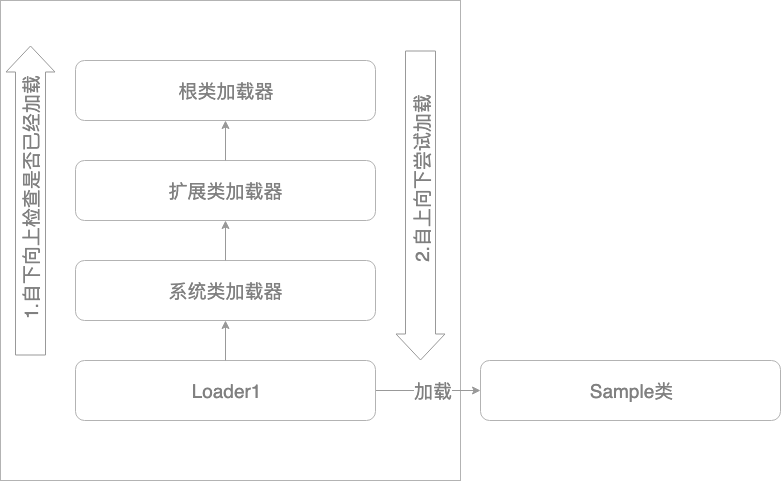
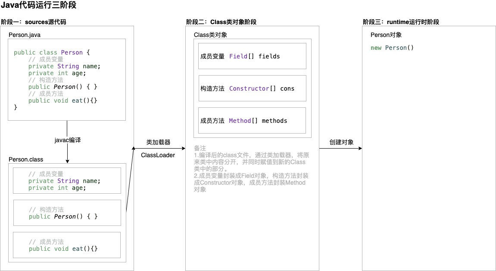

# 一.类加载

- 在Java代码中，类型（Class）的加载、连接与初始化都是在程序运行期间（runtime）完成的

  <!--加载：其中一种情况是将Class文件从磁盘加载到内存中-->

- 过程

  1. 加载：查找并加载类的二进制数据

  2. 连接

     - 验证：确保被加载类的正确性
     - 准备：为类变量分配内存，并将其初始化为默认值
     - 解析：把类中的符号引用转换为直接引用

  3. 初始化：为类的静态变量赋于正确的初始值

     <!--实现-->

     ```java
     public class Test{
       public static String s = "ABC";
     }
     /* conclusion
     1.连接-准备：将s变量分配内存，同时初始化为null
     2.连接-解析：s为符号引用，将s指向字符串"ABC"，即是符号引用转换为直接引用
     3.初始化：将s值赋值为"ABC"
     ```

  4. 使用

  5. 卸载
  
- Java虚拟机生命周期结束

  1. 执行System.exit( )方法
  2. 程序正常结束
  3. 程序在执行过程中遇到异常或错误而异常终止
  4. 操作系统错误而导致Java虚拟机终止

## 1.1 类加载器

#### 1.基本概念

- 作用：将类加载到Java虚拟机中 

- 分类
  
  - Java虚拟机自带的类加载器
    1. 根类加载器（Bootstrap）
    2. 扩展类加载器（Extension）
    3. 系统（应用）类加载器（System）
  - 用户自定义的类加载器
    1. java.lang.ClassLoader子类
    2. 用户定制类的加载方式
  
- 规则

  - JVM规范允许类加载器在预料某个类需要使用前就预先加载，在加载过程中遇到.class文件缺失，则需要等到程序主动使用类时才抛出异常 <!--如果一直没有主动使用，则不会抛出异常-->

- 获取方式

  - 获得当前类的ClassLoader：class.getClassLoader( )
  - 获得线程上下文的ClassLoader：Thread.currentThread().getContextClassLoader( )
  - 获得系统的ClassLoader：ClassLoader.getSystemClassLoader( )
  - 获得调用者的ClassLoader：DriverManager.getCallerClassLoader( ) <!--使用较少-->

- 实现：遍历输出Java虚拟机自带的类加载器

  ```java
  public class TestTraverseClassLoader {
      public static void main(String[] args) {
          ClassLoader classLoader = ClassLoader.getSystemClassLoader();
          System.out.println(classLoader);
          while (null != classLoader){
              classLoader = classLoader.getParent();
              System.out.println(classLoader);
          }
      }
  }
  /* output
  jdk.internal.loader.ClassLoaders$AppClassLoader@3d4eac69
  jdk.internal.loader.ClassLoaders$PlatformClassLoader@38af3868
  null
  */
  /* conclusion
  1.根类加载器输出结果为null
  */
  ```

#### 2.双亲委托机制——重点

- 原理图

  <!--加载器之间不是继承关系-->

  

  <!--解析-->

  1.流程

  1. Sample类加载时，首先检查用户自定义的类加载器Loader1，然后检查父加载器（系统加载器）是否已经加载，未加载则再向上检查，直到检查到根类加载器
  2. 然后根类加载器尝试加载，由于根目录文件中不存在类的class文件，因此无法加载，则交给扩展类加载器，扩展类加载器无法加载则交给系统类加载器，系统类加载器能够加载（是程序默认的加载器），因此加载完成

  2.定义类加载器 定义：真正加载类的加载器（图中的系统类加载器）

  3.初始化加载器 定义：所有能返回Class对象的加载器（包括定义类加载器）称为初始化加载器

  4.加载器之间层次关系，不是继承而是包含，因为类加载器中有另一个加载器作为成员变量 

  5.如果Sample类的class文件放置到根类加载器目录下，则将由根类加载器加载

- 作用：**防止内存中出现多份同样的字节码** 

  原因：使用加载过的加载器进行加载，因此相同的类仅会加载一次

- 注意

  1. 加载请求向上发送，如果未加载则继续向上检查，如果加载过，直接返回字节码

     <!--实现-->

     ```java
     public static void main(String[] args) throws Exception {
             // 创建加载器实例
             TestCreateClassLoader loader1 = new TestCreateClassLoader("loader1");
             loader1.setPath("/Users/space/Documents/Growth/Package/Note/UnderstandingTheJVM/Practice/createClass/");
             // 获取加载后的Class对象
             Class<?> clazz = loader1.loadClass("ClassLoader.TestClass1");
             System.out.println(clazz+";"+clazz.hashCode());
             Object object = clazz.getDeclaredConstructor().newInstance();  // 原newInstance方法已过时
             System.out.println(object);
     
             System.out.println("============");
             // 创建加载器实例
             TestCreateClassLoader loader2 = new TestCreateClassLoader("loader2");
             loader2.setPath("/Users/space/Documents/Growth/Package/Note/UnderstandingTheJVM/Practice/createClass/");
             // 获取加载后的Class对象
             Class<?> clazz2 = loader2.loadClass("ClassLoader.TestClass1");
             System.out.println(clazz2+";"+clazz2.hashCode());
             Object object2 = clazz2.getDeclaredConstructor().newInstance();  // 原newInstance方法已过时
             System.out.println(object2);
         }
     /* output
     class ClassLoader.TestClass1;2001049719
     ClassLoader.TestClass1@65ab7765
     ============
     class ClassLoader.TestClass1;2001049719
     ClassLoader.TestClass1@eed1f14
     */
     /* conclusion
     1.由于双亲机制，两个自定义加载器都没有生效，该类由系统加载器加载，所以返回的Class对象相同
     */
     ```

- 实现

  ```java
  public class TestLoader {
      public static void main(String[] args) throws Exception {
          // 由根加载器加载的类
          Class<?> class1 = Class.forName("java.lang.String");
          System.out.println(class1.getClassLoader());
  
          // 由系统类加载器加载的类
          Class<?> cClass = Class.forName("ClassLoader.C");
          System.out.println(cClass.getClassLoader());
      }
  }
  class C{ }
  
  /* output
  null
  jdk.internal.loader.ClassLoaders$AppClassLoader@3d4eac69
  */
  /* conclusion
  1.由于String类能够被根类加载器加载，因此输出结果为null
  */
  ```

#### 3.自定义加载器

- 加载流程

  1. 先判断类是否已经被加载

  2. 判断父加载器是否已经加载

  3. 使用由用户自定义加载器中重写的findClass方法

  4. 用户自定义加载器重写的findClass方法调用loadClassData方法

  5. loadClassDataa方法将本地的class文件读取到内存中，并返回class的字节码数组给findClass方法

  6. findClass方法获取到后，调用系统加载器中的defineClass方法

     <!--源码-->

     ```java
     /**
          * Loads the class with the specified <a href="#binary-name">binary name</a>.  The
          * default implementation of this method searches for classes in the
          * following order:
          *
          * <ol>
          *
          *   <li><p> Invoke {@link #findLoadedClass(String)} to check if the class
          *   has already been loaded.  </p></li>
          *
          *   <li><p> Invoke the {@link #loadClass(String) loadClass} method
          *   on the parent class loader.  If the parent is {@code null} the class
          *   loader built into the virtual machine is used, instead.  </p></li>
          *
          *   <li><p> Invoke the {@link #findClass(String)} method to find the
          *   class.  </p></li>
          *
          * </ol>
     **/
     ```

- 实现

  ```java
  import java.io.*;
  
  public class TestCreateClassLoader extends ClassLoader {
      /*
      Paraments
       */
      // 存储加载器名称
      private String classLoaderName;
      // 存储加载类文件的路径
      private String path;
      // 类文件扩展名
      private final String fileExtension = ".class";
  
      /*
      Constructor
       */
      // 构造方法一，调用默认的父加载器的构造方法
      public TestCreateClassLoader(String classLoaderName){
          super();
          this.classLoaderName = classLoaderName;
      }
      // 构造方法二，调用指定父加载器的构造方法
      public TestCreateClassLoader(ClassLoader parent,String classLoaderName){
          super(parent);
          this.classLoaderName = classLoaderName;
      }
  
      /*
      Methods
       */
      // 设置加载类文件的路径
      public void setPath(String path) {
          this.path = path;
      }
  
      // 读取字节流，并返回字节数组
      public byte[] loadClassData(String className) {
          // 获取文件输入流
          InputStream is = null;
          // 存储字节数组
          byte[] data = null;
          // 字节流缓冲区
          ByteArrayOutputStream baos = null;
          // 修改存储路径
          className = className.replace(".", "/");
  
          try {
              // 获取文件输入流
              is = new FileInputStream(new File(this.path+className+this.fileExtension));
              // 创建字节流缓冲区对象
              baos = new ByteArrayOutputStream();
  
              // 创建单个字节保存变量
              int ch;
              // 读取字节流并保存
              while (-1 != (ch = is.read())){
                  baos.write(ch);
              }
  
              // 将缓冲区中内容写入字节数组
              data = baos.toByteArray();
          } catch (Exception e) {
              e.printStackTrace();
          }finally  {
              // 关闭输入输出流
              try {
                  is.close();
                  baos.close();
              } catch (IOException e) {
                  e.printStackTrace();
              }
          }
          return data;
      }
  
      // 重写父类findClass方法，类加载器会自动调用
      @Override protected Class<?> findClass(String className) {
          System.out.println("className:" + className );
          System.out.println("classLoaderName:" + this.classLoaderName);
          byte[] data = this.loadClassData(className);
          return this.defineClass(className, data, 0, data.length);
      }
  
      /*
      Main
       */
      public static void main(String[] args) throws Exception {
          // 创建加载器实例
          TestCreateClassLoader loader1 = new TestCreateClassLoader("loader1");
          
        // class文件的新地址
        loader1.setPath("/Users/space/Documents/Growth/Package/Note/UnderstandingTheJVM/Practice/createClass/");
  
          // 获取加载后的Class对象
          Class<?> clazz = loader1.loadClass("ClassLoader.TestClass1");
          System.out.println(clazz);
          // 原newInstance方法已过时
          Object object = clazz.getDeclaredConstructor().newInstance();
          System.out.println(object);
      }
  }
  /* output
  className:ClassLoader.TestClass1
  classLoaderName:loader1
  class ClassLoader.TestClass1
  ClassLoader.TestClass1@682a0b20
  */
  ```

  <!--解析-->

  - **由于双亲机制的存在，如果不删除原路径下的被加载类的class文件，会导致使用系统加载器加载，因此需要复制被加载类的class文件到其他地址中，然后再调用自定义加载器加载**

  - 子加载器需要重写findClass方法，因为父加载器中的findClass方法仅仅实现抛出异常

    <!--源码-->

    ```java
    /**
         * Finds the class with the specified <a href="#binary-name">binary name</a>.
         * This method should be overridden by class loader implementations that
         * follow the delegation model for loading classes, and will be invoked by
         * the {@link #loadClass loadClass} method after checking the
         * parent class loader for the requested class.
         *
         * @implSpec The default implementation throws {@code ClassNotFoundException}.
         *
         * @param  name
         *         The <a href="#binary-name">binary name</a> of the class
         *
         * @return  The resulting {@code Class} object
         *
         * @throws  ClassNotFoundException
         *          If the class could not be found
         *
         * @since  1.2
         */
        protected Class<?> findClass(String name) throws ClassNotFoundException {
            throw new ClassNotFoundException(name);
        }
    ```

#### 4.命名空间——重点

- 命名空间 定义：每个类加载器都有自己的命名空间。命名空间是由该加载器以及该加载器的所有父加载器构成的。

- 规则
  
  > 同一个类只加载一次的前提是：在同一个命名空间中
  
  - **同一个命名空间中，不会出现类的完整名字相同的两个类**
  
  - **在不同的命名空间，可能会出现两个类名字相同的两个类**
  
  - **同一命名空间中，父加载器所加载的类无法找到子加载器所加载的类，子加载器所加载的类可以找到父加载器所加载的类**
  
    1. 父加载器无法找到子加载器所加载的类
  
       <!--实现-->
  
       ```java
       /*
       @Author: Toyz
       @Date: 2019/8/29
       @Time: 11:47
       @Purpose:测试类
       @Related:TestLoader2
       */
       
       public class Super2 {
           public Super2() {
               System.out.println("Super2的加载器:"+Super2.class.getClassLoader());
               new Sub2();
           }
       }
       ```
  
       ```java
       /*
       @Author: Toyz
       @Date: 2019/8/29
       @Time: 11:47
       @Purpose:测试类
       @Related:TestLoader2
       */
       
       public class Sub2 {
           public Sub2() {
               System.out.println("Sub2的加载器:"+Sub2.class.getClassLoader());
               System.out.println("From Super2:"+Super2.class);
           }
       }
       ```
  
       <!--测试类：系统加载器目录下无Super2的class类型文件，有Sub2的class类型文件；在自定义加载器目录下有Super2和Sub2的class类型文件-->
  
       ```java
       /*
       @Author: Toyz
       @Date: 2019/8/28
       @Time: 16:16
       @Purpose:测试如果在一个类中创建另一个类的实例，则在类的加载时，是否会加载被创建实例的类
       @Related:Super2,Sub2
       */
       
       public class TestLoader2 {
           public static void main(String[] args) throws Exception {
               TestCreateClassLoader loader = new TestCreateClassLoader("loader");
               loader.setPath("/Users/space/Documents/Growth/Package/Note/UnderstandingTheJVM/Practice/createClass/");
               Class<?> clazz = loader.loadClass("ClassLoader.Super2");
               Object object = clazz.newInstance();
           }
       }
       /* output
       className:ClassLoader.Super2
       classLoaderName:loader
       Super2的加载器:ClassLoader.TestCreateClassLoader@77459877
       Sub2的加载器:jdk.internal.loader.ClassLoaders$AppClassLoader@3d4eac69
       NoClassDefFoundError: ClassLoader/Super2
       */
       ```
  
       <!--解析-->
  
       1.抛出异常：执行到Sub2中的“System.out.println("From Super2:"+Super2.class);”时抛出异常
  
       2.异常原因分析
  
       - 基本情况
         - Super2由自定义加载器（子加载器）加载；Sub2由系统类加载器（父加载器）加载
         - Sub2中访问了由自定义加载器（子加载器）所加载出来的Super2类
         - 自定义加载器和系统类加载器处于同一个命名空间中
       - 规则
         - 父加载器所加载的类无法找到子加载器所加载的类
       - 结论
         - 由父加载器所加载的Sub2是无法访问由子加载器所加载的Super2类
  
    2. 子加载器可以找到父加载器所加载的类
  
       <!--实现-->
  
       ```java
       public class Super2 {
           public Super2() {
               System.out.println("Super2的加载器:"+Super2.class.getClassLoader());
               new Sub2();
               System.out.println("From Sub2:"+Sub2.class);
           }
       }
       ```
  
       ```java
       public class Sub2 {
           public Sub2() {
               System.out.println("Sub2的加载器:"+Sub2.class.getClassLoader());
           }
       }
       ```
  
       <!--测试类：测试类，系统加载器目录下无的class类型文件，有Sub2的class类型文件；在自定义加载器目录下有Super2和Sub2的class类型文件-->
  
       ```java
       public class TestLoader2 {
           public static void main(String[] args) throws Exception {
               TestCreateClassLoader loader = new TestCreateClassLoader("loader");
               loader.setPath("/Users/space/Documents/Growth/Package/Note/UnderstandingTheJVM/Practice/createClass/");
               Class<?> clazz = loader.loadClass("ClassLoader.Super2");
               Object object = clazz.newInstance();
           }
       }
       /* output
       className:ClassLoader.Super2
       classLoaderName:loader
       Super2的加载器:ClassLoader.TestCreateClassLoader@77459877
       Sub2的加载器:jdk.internal.loader.ClassLoaders$AppClassLoader@3d4eac69
       From Sub2:class ClassLoader.Sub2
       */
       ```
  
       <!--解析-->
  
       1.正常运行的原因
  
       - 基本情况
         - Super2由自定义加载器（子加载器）加载；Sub2由系统类加载器（父加载器）加载
         - Super2中访问了由系统类加载器（父加载器）所加载的Sub2类
         - 自定义加载器和系统类加载器处于同一个命名空间中
       - 规则
         - 子加载器所加载的类可以找到父加载器所加载的类
       - 结论
         - 子加载器能够访问由父加载器所加载的Sub2类

- 实现

  - 同个类在两个命名空间中分别被加载（需要删除类加载器文件夹中的class文件）

    <!--自定义加载器-->

    ```java
    import java.io.*;
    
    public class TestCreateClassLoader extends ClassLoader {
        /*
        Paraments
         */
        // 存储加载器名称
        private String classLoaderName;
        // 存储加载类文件的路径
        private String path;
        // 类文件扩展名
        private final String fileExtension = ".class";
    
        /*
        Constructor
         */
        // 构造方法一，调用默认的父加载器的构造方法
        private TestCreateClassLoader(String classLoaderName){
            super();
            this.classLoaderName = classLoaderName;
        }
        // 构造方法二，调用指定父加载器的构造方法
        public TestCreateClassLoader(ClassLoader parent,String classLoaderName){
            super(parent);
            this.classLoaderName = classLoaderName;
        }
    
        /*
        Methods
         */
        // 设置加载类文件的路径
        public void setPath(String path) {
            this.path = path;
        }
    
        // 读取字节流，并返回字节数组
        private byte[] loadClassData(String className) {
            // 获取文件输入流
            InputStream is = null;
            // 存储字节数组
            byte[] data = null;
            // 字节流缓冲区
            ByteArrayOutputStream baos = null;
            // 修改存储路径
            className = className.replace(".", "/");
    
            try {
                // 获取文件输入流
                is = new FileInputStream(new File(this.path+className+this.fileExtension));
                // 创建字节流缓冲区对象
                baos = new ByteArrayOutputStream();
    
                // 创建单个字节保存变量
                int ch;
                // 读取字节流并保存
                while (-1 != (ch = is.read())){
                    baos.write(ch);
                }
    
                // 将缓冲区中内容写入字节数组
                data = baos.toByteArray();
            } catch (Exception e) {
                e.printStackTrace();
            }finally  {
                // 关闭输入输出流
                try {
                    is.close();
                    baos.close();
                } catch (IOException e) {
                    e.printStackTrace();
                }
            }
            return data;
        }
    
        // 重写父类findClass方法，类加载器会自动调用
        @Override protected Class<?> findClass(String className) {
            System.out.println("className:" + className );
            System.out.println("classLoaderName:" + this.classLoaderName);
            byte[] data = this.loadClassData(className);
            return this.defineClass(className, data, 0, data.length);
        }
    }
    ```

    <!--测试类-->

    ```java
        public static void main(String[] args) throws Exception {
            // 创建加载器实例
            TestCreateClassLoader loader1 = new TestCreateClassLoader("loader1");
            loader1.setPath("/Users/space/Documents/Growth/Package/Note/UnderstandingTheJVM/Practice/createClass/");
            // 获取加载后的Class对象
            Class<?> clazz = loader1.loadClass("ClassLoader.TestClass1");
            System.out.println(clazz+";"+clazz.hashCode());
            Object object = clazz.getDeclaredConstructor().newInstance();  // 原newInstance方法已过时
            System.out.println(object);
    
            System.out.println("============");
            // 创建加载器实例
            TestCreateClassLoader loader2 = new TestCreateClassLoader("loader2");
            loader2.setPath("/Users/space/Documents/Growth/Package/Note/UnderstandingTheJVM/Practice/createClass/");
            // 获取加载后的Class对象
            Class<?> clazz2 = loader2.loadClass("ClassLoader.TestClass1");
            System.out.println(clazz2+";"+clazz2.hashCode());
            Object object2 = clazz2.getDeclaredConstructor().newInstance();  // 原newInstance方法已过时
            System.out.println(object2);
        }
    /* output
    className:ClassLoader.TestClass1
    classLoaderName:loader1
    class ClassLoader.TestClass1;1831932724
    ClassLoader.TestClass1@378bf509
    ============
    className:ClassLoader.TestClass1
    classLoaderName:loader2
    class ClassLoader.TestClass1;381259350
    ClassLoader.TestClass1@7ef20235
    */
    ```

  - 一个命名空间中存在自定义父加载器和子加载器，另一个命名空间中存在单独的加载器（需要删除类加载器文件夹中的class文件）

    <!--测试方法-->

    ```java
    /*
            不同命名空间以及父类加载器
             */
            System.out.println("============不同命名空间以及父类加载器");
            // 创建加载器实例
            TestCreateClassLoader loader3 = new TestCreateClassLoader("loader3");
            loader3.setPath("/Users/space/Documents/Growth/Package/Note/UnderstandingTheJVM/Practice/createClass/");
            // 获取加载后的Class对象
            Class<?> clazz3 = loader3.loadClass("ClassLoader.TestClass1");
            System.out.println(clazz3+";"+clazz3.hashCode());
            Object object3 = clazz3.getDeclaredConstructor().newInstance();  // 原newInstance方法已过时
            System.out.println(object3);
    
            System.out.println("============");
            // 创建加载器实例
            TestCreateClassLoader loader4 = new TestCreateClassLoader(loader3,"loader4");
            loader4.setPath("/Users/space/Documents/Growth/Package/Note/UnderstandingTheJVM/Practice/createClass/");
            // 获取加载后的Class对象
            Class<?> clazz4 = loader4.loadClass("ClassLoader.TestClass1");
            System.out.println(clazz4+";"+clazz4.hashCode());
            Object object4 = clazz4.getDeclaredConstructor().newInstance();  // 原newInstance方法已过时
            System.out.println(object4);
    
            System.out.println("============");
            // 创建加载器实例
            TestCreateClassLoader loader5 = new TestCreateClassLoader("loader4");
            loader5.setPath("/Users/space/Documents/Growth/Package/Note/UnderstandingTheJVM/Practice/createClass/");
            // 获取加载后的Class对象
            Class<?> clazz5 = loader5.loadClass("ClassLoader.TestClass1");
            System.out.println(clazz5+";"+clazz5.hashCode());
            Object object5 = clazz5.getDeclaredConstructor().newInstance();  // 原newInstance方法已过时
            System.out.println(object5);
    /* output
    ============不同命名空间以及父类加载器
    className:ClassLoader.TestClass1
    classLoaderName:loader3
    class ClassLoader.TestClass1;363771819
    ClassLoader.TestClass1@7b23ec81
    ============
    class ClassLoader.TestClass1;363771819
    ClassLoader.TestClass1@5f184fc6
    ============
    className:ClassLoader.TestClass1
    classLoaderName:loader4
    class ClassLoader.TestClass1;1867083167
    ClassLoader.TestClass1@723279cf
    */
    /* conclusion
    1.loader3是loader4的父加载器，因此属于同一命名空间。因此只会加载一次同一个类
    2.loader5有另一个命名空间，因此会加载该类
    */
    ```

## 1.2 类的加载

#### 1.基本概念

- 类的加载 定义：将类的.class文件中的二进制数据加载到内存中，将其放置在运行区的方法区中，并在内存中创建java.lang.Class对象来封装类在方法区中的数据结构 <!--可以联系反射的内容-->

  

- 方式

  - 从本地系统中直接加载
  - 通过网络下载.class文件
  - 通过jar包中加载
  - 从专有数据库中提取
  - **将Java源文件动态编译为.class文件** （动态代理时使用）

#### 2.接口

- 规则

  - **如果调用接口中的静态常量，接口根本不会加载；如果调用接口实现类中的静态常量，类和接口都不会加载**

    **原因：static和final共同修饰为静态常量，会直接纳入常量池。而接口中的变量默认有static和final修饰**

    <!--实现-->

    ```java
    public class TestInterface {
        public static void main(String[] args) {
            System.out.println(Sub.b);
        }
    }
    interface Super{
        int a = 5;
    }
    interface Sub extends Super{
        int b =6; // 接口中的变量默认为static和final
    }
    /* output
    [0.184s][info   ][class,load] ClassLoader.TestInterface 
    6
    */
    ```

  - **如果调用接口实现类中的静态变量，类和接口都会加载**

    <!--实现-->

    ```java
    public class TestInterface {
        public static void main(String[] args) {
            System.out.println(Sub.b);
        }
    }
    interface Super{
        int a = 5;
    }
    class Sub implements Super{
       static int b =6;
    }
    /* output
    [0.184s][info   ][class,load] ClassLoader.TestInterface 
    [0.186s][info   ][class,load] ClassLoader.Super
    [0.186s][info   ][class,load] ClassLoader.Sub
    [0.187s][info   ][class,load] ClassLoader.Super$1 
    6
    */
    
    ```

## 1.3 类的连接

### 1.3.1验证

- 作用：验证文件
  - 类文件的结构检查
  - 语义检查
  - 字节码验证
  - 二进制兼容性检查

### 1.3.2准备

- 作用：为变量分配空间，并赋值为默认值

- 实现

  ```java
  public class TestPreparation {
      public static void main(String[] args) {
          Singleton singleton = Singleton.getSingleton();
          System.out.println("counter1:"+Singleton.counter1);
          System.out.println("counter2:"+Singleton.counter2);
      }
  }
  class Singleton{
      static int counter1 = 1;
      private static Singleton singleton = new Singleton();
  
      private Singleton(){
          counter1++;
          counter2++;
      }
  
      static int counter2 = 0;
      static Singleton getSingleton(){
          return singleton;
      }
  }
  /* output
  counter1:2
  counter2:0
  */
  ```

  <!--解析-->

  1.流程解析

  1. 准备阶段，静态变量counter1赋值为0；静态变量singleton赋值为null；静态变量counter2赋值为0
  2. 初始化阶段，静态变量counter1赋值为1；静态变量singleton指向类Singleton的对象实例，导致调用类的构造方法，将counter1赋值为2，counter2赋值为1；静态变量counter2赋值重新为0
  3. 因此输出counter1为2；counter2为0

## 1.4 类的初始化

### 1.4.1 基本概念

> Java对类的使用方式分为主动使用和被动使用

- 初始化 条件：类或者接口只有在“**首次主动使用**”时才被初始化

  <!--1.初始化只有一次。2.必须要主动使用-->

- 初始化 规则

  1. 如果类未加载和连接，则先进行加载和连接

  2. 如果类存在父类且未初始化，则先将父类初始化

     <!--初始化类时，不会初始化它实现的接口；初始化接口时，不会初始化它的父接口-->

  3. 如果类中存在初始化语句，则依次执行初始化语句

- **主动使用 方式——重点**

  1. 创建类的实例对象

  2. 访问类或接口的静态变量或者给类或者接口的静态变量赋值

     <!--如果静态变量定义在父类中，通过子类访问父类中的静态变量，则只会初始化父类-->

     <!--实现-->

     ```java
     public class TestClassLoader {
         public static void main(String[] args) {
             System.out.println("-----Child.str1-----");
             System.out.println(Child.str1);
         }
     
     }
     
     class Parent{
         static String str1 = "hello world";
         static {
             System.out.println("Parent static block");
         }
     }
     
     class Child extends Parent{
         static String str2 = "welcome";
         static {
             System.out.println("Child static block");
         }
     }
     /* output
     -----Child.str1-----
     Parent static block
     hello world
     */
     /* conclusion
     1.对于静态变量，只有直接定义了该变量的类才会被初始化
     */
     ```

  3. 调用类的静态方法

     <!--如果静态方法定义在父类中，通过子类访问父类中的静态方法，则只会初始化父类-->

     <!--实现-->

     ```java
     class TestLauncher {
         static {
             System.out.println("TestLauncher static");
         }
     
         public static void main(String[] args) {
             TestSub.doSomething();
         }
     }
     
     class TestSuper{
         static int a = 3;
         static {
             System.out.println("Super static");
         }
         static void doSomething(){
             System.out.println("Super doSomething");
         }
     }
     
     class TestSub extends TestSuper{
         static int b = 4;
         static {
             System.out.println("Sub static");
         }
     }
     /* output
     TestLauncher static
     Super static
     Super doSomething
     */
     ```

  4. 反射

     <!--实现-->

     ```java
     class TestClass{
         static {
             System.out.println("TestClass Init");
         }
     }
     
     public class TestLoaderAndReflex {
         public static void main(String[] args) throws Exception {
             // 使用ClassLoader的loadClass方法加载类
             ClassLoader classLoader = ClassLoader.getSystemClassLoader();
             Class<?> class1 = classLoader.loadClass("ClassLoader.TestClass");
             System.out.println(class1);
             System.out.println("------------");
             Class<?> class2 = Class.forName("ClassLoader.TestClass");
             System.out.println(class2);
     
         }
     }
     /* output
     class ClassLoader.TestClass
     ------------
     TestClass Init
     class ClassLoader.TestClass
     */
     ```

  5. 初始化类的子类 <!--接口不适用-->

     <!--实现-->

     ```java
     public class TestClassLoader {
         public static void main(String[] args) {
             System.out.println("-----Child.str2-----");
             System.out.println(Child.str2);
         }
     }
     
     class Parent{
         static String str1 = "hello world";
         static {
             System.out.println("Parent static block");
         }
     }
     
     class Child extends Parent{
         static String str2 = "welcome";
         static {
             System.out.println("Child static block");
         }
     }
     /* output
     -----Child.str2-----
     Parent static block
     Child static block
     welcome
     */
     /* conclusion
     1.由于子类静态变量被访问，因此子类被初始化
     2.因为子类被初始化，因此超类也被初始化
     */
     ```

  6. Java虚拟机启动时被标记为启动类的类

     <!--举例-->

     ```java
     public class TestLauncher {
         static {
             System.out.println("TestLauncher static");
         }
     
         public static void main(String[] args) {
             System.out.println(TestSub.b);
         }
     }
     
     class TestSuper{
         static int a = 3;
         static {
             System.out.println("Super static");
         }
     }
     
     class TestSub extends TestSuper{
         static int b = 4;
         static {
             System.out.println("Sub static");
         }
     } 
     /* output
     TestLauncher static
     Super static
     Sub static
     4
     */
     ```

  7. REF_getStatic,REF_putStatic,REF_invokeStatic句柄对应的类如果未初始化则初始化

- 被动使用 方式：除主动使用之外的情况

### 1.4.2 不同类型

#### 1.常量

- 规则

  - 常量在编译阶段会存入到调用这个常量的方法所在类的常量池中。调用类并不会直接引用定义常量的类，因此不会触发定义常量的类的初始化

    <!--实现-->

    ```
    public class TestFinal {
        public static void main(String[] args) {
            System.out.println(TestBase.s);
        }
    }
    class TestBase{
        static final String s = "ABC";
    
        static {
            System.out.println("TestBase Build");
        }
    }
    /* output
    ABC
    */
    /* conclusion
    1.调用常量时，定义常量的TestBase类并没有被初始化，通过-XX:+TraceClassLoading发现TestBase类未加载
    2.因此在编辑阶段，s常量会存入调用这个常量的方法（main方法）所在类（TestFinal）的常量池中
    3.即使在编译后将TestBase的class文件删除，常量也能正常输出
    */
    ```

  - 如果常量在编译期无法确定，则将初始化定义常量所在的类

    <!--实现-->

    ```java
    public class TestFinal {
        public static void main(String[] args) {
            System.out.println(TestBase.sRandom);
        }
    }
    class TestBase{
        static final String sRandom = UUID.randomUUID().toString();
    
        static {
            System.out.println("TestBase Build");
        }
    }
    /* output
    TestBase Build
    fedb4d78-ff59-4810-ad80-60f468707e77
    */
    ```

#### 2.数组

- 规则

  - 对于数组实例，其类型是在JVM在运行期间动态生成的（不会触发类的初始化）。动态生成的类型，其父类型就是java.lang.Object

  - getClassLoader( )返回的数组类的类加载器与其元素类型的类加载器相同; 如果元素类型是原始类型，则数组类没有类加载器

    <!--实现-->

    ```java
    public class TestArray {
        public static void main(String[] args) {
            SubTest subTest = new SubTest();
            System.out.println("subTest.getClass():"+subTest.getClass());
            System.out.println("=============");
            SubTest[] subTests = new SubTest[1];
            System.out.println("subTests.getClass():"+subTests.getClass());
            System.out.println("subTests.getClass().getSuperclass():"+subTests.getClass().getSuperclass());
            System.out.println("=============");
            SubTest[][] subTestsMulti = new SubTest[1][1];
            System.out.println("subTestsMulti.getClass():"+subTestsMulti.getClass());
            System.out.println("subTestsMulti.getClass().getSuperclass():"+subTestsMulti.getClass().getSuperclass());
            System.out.println("=============");
            String[] strings = new String[2];
            System.out.println(strings.getClass().getClassLoader());
            System.out.println("=============");
            int[] ints = new int[2];
            System.out.println(ints.getClass().getClassLoader());
        }
    }
    class SubTest{
        static {
            System.o ut.println("SubTest Build");
        }
    }
    /* output
    SubTest Build
    subTest.getClass():class ClassLoader.SubTest
    =============
    subTests.getClass():class [LClassLoader.SubTest;
    subTests.getClass().getSuperclass():class java.lang.Object
    =============
    subTestsMulti.getClass():class [[LClassLoader.SubTest;
    subTestsMulti.getClass().getSuperclass():class java.lang.Object
    =============
    null //第一个null
    =============
    null //第二个null
    */
    ```

    <!--解析-->

    1.第一个null，代表根加载器。因为String类型是通过根加载器加载的

    2.第二个null，表示没有加载器。因为元素为基本类型的数组，没有加载器

#### 3.接口

- 规则——重点

  - 当接口初始化时，不要求父类接口初始化

    <!--实现：接口未初始化-->

    ```java
    public class TestInterface {
        public static void main(String[] args) {
            System.out.println(Sub.THREAD);
        }
    }
    interface Super{
        Thread THREAD = new Thread(){
            {
                System.out.println("Super 线程初始化");
            }
        };
    }
    interface Sub extends Super{
        Thread THREAD = new Thread(){
            {
                System.out.println("Sub 线程初始化");
            }
        };
    }
    /* output
    Sub 线程初始化
    Thread[Thread-0,5,main]
    */
    /* conclusion
    1.未输出“Super 线程初始化”，因此父类接口未初始化
    */
    ```

  - 当类初始化时，并不会要求实现的接口初始化

    <!--实现-->

    ```Java
    public class TestInterface {
        public static void main(String[] args) {
            System.out.println(Sub.b);
        }
    }
    interface Super{
        int a = 5;
        Thread THREAD = new Thread(){
            {
                System.out.println("线程初始化");
            }
        };
    }
    class Sub implements Super{
        static int b =6;
    }
    /* output
    6
    */
    /* conclusion
    1.未输出“线程初始化”，因此接口未初始化
    */
    ```

  - 只有使用到父类接口（如引用到父类接口中定义的变量），父类才会初始化

    注意：因为接口中变量默认为static和final修饰，如果是在编译期能够确认的变量，则父类不会初始化，而是纳入常量池

    <!--实现：父类接口初始化-->

    ```java
    public class TestInterface {
        public static void main(String[] args) {
            System.out.println(Sub.a);
        }
    }
    interface Super{
        String a = UUID.randomUUID().toString();
        Thread THREAD = new Thread(){
            {
                System.out.println("Super 线程初始化");
            }
        };
    }
    interface Sub extends Super{
        Thread THREAD = new Thread(){
            {
                System.out.println("Sub 线程初始化");
            }
        };
    }
    /* output
    Super 线程初始化
    381c544d-3640-4ef6-bac5-5a32cddcd11a
    */
    /* conclusion
    1.编译期时，String类型的s变量无法确认，因此父类接口将初始化
    */
    ```

    <!--实现：父类接口不初始化-->

    ```java
    public class TestInterface {
        public static void main(String[] args) {
            System.out.println(Sub.a);
        }
    }
    interface Super{
        String a = "ABC";
        Thread THREAD = new Thread(){
            {
                System.out.println("Super 线程初始化");
            }
        };
    }
    interface Sub extends Super{
        Thread THREAD = new Thread(){
            {
                System.out.println("Sub 线程初始化");
            }
        };
    }
    /* output
    ABC
    */
    /* conclusion
    1.编译期时，String类型的s变量确认，因此父类接口不会初始化
    */
    ```

## 1.5 流程总结

1. 加载：查找二进制文件并读取到Java虚拟机中

2. 连接

   1. 验证
   2. 准备：为类变量分配内存，同时赋予默认值
   3. 解析：将符号引用转换成直接引用

3. 初始化：为类变量赋于正确的初始值

4. 类实例化

   1. 为新的对象分配内存

   2. 为实例变量赋予默认值

   3. 为实例变量赋予正确的初始值

      <!--Java编译器为每一个类至少生成一个实例初始化方法，在java的class文件中，称为<init>。针对源代码中的每一个构造方法，都生成一个<init>-->

## 1.6 加载参数

- 格式
  - -XX:+<option>：开启option选项
  - -XX:-<option>：关闭option选项
  - -XX:<option>=<value>：将option值赋值为value

#### 1.-XX:+TraceClassLoading

- 作用：用于追踪类的加载信息并打印出来

# 二.类卸载

#### 1.基本概念

- 卸载：当类被加载、准备、初始化后，类的生命周期开始。当代表类的Class对象不被引用（即不可触及），Class对象的生命周期结束，类在方法区中的数据将被卸载，类的生命周期结束。

  <!--因此，类生命周期取决于对应的Class对象的生命周期-->

- 规则

  - 由Java虚拟机自带的类加载器加载的类，始终不会被卸载
  - 由用户自定义的类加载器是能够被卸载的

- 实现

  1. 创建被加载和卸载的类
  2. 创建自定义加载器
  3. 执行卸载

  ```java
  package ClassUnloading;
  
  /*
  @Author: Toyz
  @Date: 2019/8/27
  @Time: 15:30
  @Purpose:被卸载类
  @Related:TestUnloading
  */
  
  
  public class TestClass {
  }
  
  ```

  ```java
  package ClassUnloading;
  
  /*
  @Author: Toyz
  @Date: 2019/8/27
  @Time: 15:29
  @Purpose:模拟由用户自定义类加载加载的类被卸载
  @Related:TestClass.java
  */
  
  
  import java.io.*;
  
  public class TestUnloading extends ClassLoader{
      /*
      1.创建自定义类加载器
       */
      // 1.1 变量
      private String classLoaderName; //存储加载器名称
      private String path; //存储类文件路径
      private final String fileExtension = ".class"; //文件后缀名
  
      // 1.2 类加载器的构造方法
      private TestUnloading(String classLoaderName){
          super();
          this.classLoaderName = classLoaderName;
      }
  
      // 1.3 设置类文件路径方法
      public void setPath(String path) {
          this.path = path;
      }
  
      // 1.4 读取class文件数据并返回字节码数组的方法
      private byte[] loadClassData(String className){
          // 1.4.1 定义变量
          InputStream is = null; //文件输入流
          byte[] data = null; //返回的字节码数组
          ByteArrayOutputStream baos = null; //存储字节的缓冲区
  
          // 1.4.2 获取文件输入流并赋值
          className = className.replace(".", "/"); //将类名中的符号修改为路径
  
          try {
              is = new FileInputStream(new File(this.path+className+this.fileExtension)); //获取文件输入流
              int ch; //存储字节
              baos = new ByteArrayOutputStream(); //创建字节缓冲区对象
              while (-1 != (ch = is.read())){
                  baos.write(ch);
              }
              data = baos.toByteArray();
          } catch (Exception e) {
              e.printStackTrace();
          }finally {
              try {
                  is.close();
                  baos.close();
              } catch (IOException e) {
                  e.printStackTrace();
              }
          }
          return data;
      }
  
      // 1.5 重写父加载器的方法，用来查找class的方法
      @Override protected Class<?> findClass(String name) throws ClassNotFoundException {
          System.out.println("ClassLoader:"+this.classLoaderName);
          System.out.println("ClassName:"+name);
          byte[] data = this.loadClassData(name);
          return this.defineClass(name, data, 0, data.length);
      }
  
      /*
      2.测试自定义加载器并卸载类
       */
      public static void main(String[] args) throws Exception {
          // 2.1 创建加载器实例并加载类
          TestUnloading loader = new TestUnloading("customizeLoader");
          loader.setPath("/Users/space/Documents/Growth/Package/Note/UnderstandingTheJVM/Practice/createClass/");
          Class<?> clazz = loader.loadClass("ClassUnloading.TestClass");
          System.out.println(clazz);
          Object object = clazz.getDeclaredConstructor().newInstance();
          System.out.println(object);
  
          // 2.2 卸载类
          loader = null;  //将加载器引用置空
          clazz = null;   //将class引用置空
          object = null;  //将Object对象引用置空
          Thread.sleep(5000);
          System.out.println("=============调用垃圾回收");
          System.gc();    //调用垃圾回收器
          System.out.println("=============测试置空情况");
          // 2.3 测试置空情况
          System.out.println(loader);
          System.out.println(clazz);
          System.out.println(object);
      }
  }
  /* output
  [0.003s][warning][arguments] -XX:+TraceClassUnloading is deprecated. Will use -Xlog:class+unload=info instead.
  ClassLoader:customizeLoader
  ClassName:ClassUnloading.TestClass
  class ClassUnloading.TestClass
  ClassUnloading.TestClass@682a0b20
  =============调用回收
  [5.188s][info   ][class,unload] unloading class ClassUnloading.TestClass 0x000000080116a840
  =============测试置空情况
  null
  null
  null
  */
  ```

  


